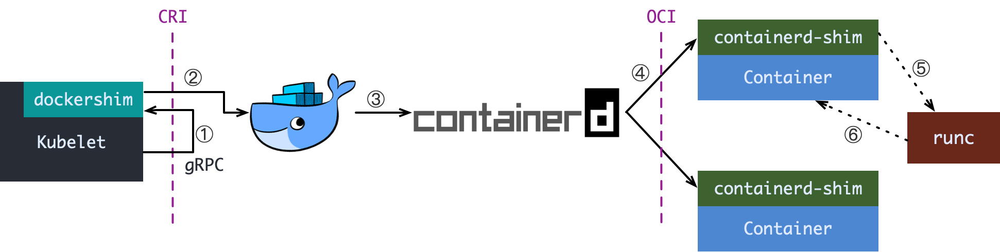

# 2.kubernetes

# 一 概述
Kubernetes单词起源于希腊语, 是“舵手”或者“领航员”的意思，是“管理者”和“控制论”的根源。 K8s是把用8代替8个字符“ubernete”而成的缩写。

首先有一个概念Orchestration(直译是管弦乐编曲，可以理解为协调器、编排、乐队指挥)，随着容器技术的发展，我们需要一个东西来管理、扩展和维护容器应用，这个东西就是Orchestration。常见的有Kubernetes和Docker Swarm。

## 1 简介
容器集群管理/容器调度/容器编排系统

特点：
1. 连续性——当应用程序由粒度组件组成时，通过单独更新和改进这些组件，应用程序就更容易按粒度演进。协调器可以根据各个更改对整体workloads的影响做出适当的调整。应用程序的特性改进不再需要在大规模的检修中实现——这通常会对其可用性产生负面影响。持续集成和持续交付的概念(CI/CD，“D”通常表示“部署”)可以通过一个平台更容易地实现自动化，这个平台从一开始就被设计成理解部署本身的更小、更易于管理的步骤。
2. 弹性——Kubernetes维护容器组的活动副本(称为replicasets)，目的是为了在任何容器或容器分组(Kubernetes称之为pod)失败时保持正常运行时间和响应能力。这意味着数据中心不必复制整个应用程序，并触发负载均衡器，以便在主应用程序失败时切换到辅助应用程序。实际上，复制集中的多个pod通常在任何时候都在运行，协调器的工作是在应用程序的整个生命周期中保持这种多元性。
3. 可伸缩性——对于使用Kubernetes协调分布式workloads的组织来说，最大的好处是，根据预先设置的策略，workloads 可以在系统中按需成倍增长，从而再次进行伸缩。为了减少混乱的可能性，Kubernetes把相关的容器组合成一个pod。可以将名为autoscaler的服务设置为自动将pods复制到不同节点，因为它确定分配给这些pods的资源没有得到尽可能多的利用。

## 优点
1. 应用的 zero downtime，扩容，发布
1. 可以使用 helm chart 应用商店
2. k8s 带界面, 可以使用 k8s-dashboard, rancher 或者云服务控制台的界面

## 劣势
1. 维护成本高, 门槛高
    1. 没有经验k8s不好调教，出错也容易一脸懵逼。运维成本可能高于带来的收益
2. 本身需要资源 

## 4 文档网址等
1. 中文文档：http://docs.kubernetes.org.cn/

## 6 相关项目
1. k3s：https://github.com/rancher/k3s

# 二 安装配置
## 1 mac
1. 参考：https://github.com/AliyunContainerService/k8s-for-docker-desktop
2. docker desktop for mac => preference => k8s
    1. Deploy Docker Stacks to Kubernetes by default:将Kubernetes设置为docker stack的默认协调器。
    2. Show system containers (advanced):默认情况下，Kubernetes容器对docker service ls之类的命令是隐藏的，因为Kubernetes容器不支持手动管理。 要使其可见，需要勾选上该选项。
3. 部署k8s的控制台
    1. 追加：`kubectl apply -f https://raw.githubusercontent.com/kubernetes/dashboard/v2.0.0-rc5/aio/deploy/recommended.yaml`或者构建:`kubectl create -f kubernetes-dashboard.yaml`二选一
    3. 开启api访问代理:`kubectl proxy`
    4. 本地浏览器访问`http://localhost:8001/api/v1/namespaces/kube-system/services/https:kubernetes-dashboard:/proxy/#!/overview?namespace=default`即可看到dashboard了
4. 配置控制台访问token：路径在`$HOME/.kube/config`

    ```bash
    TOKEN=$(kubectl -n kube-system describe secret default| awk '$1=="token:"{print $2}')
    kubectl config set-credentials docker-for-desktop --token="${TOKEN}"
    echo $TOKEN
    ```
5. 安装helm
    1. 参考：https://helm.sh/docs/intro/install/
    2. brew install helm
    3. helm repo add stable http://mirror.azure.cn/kubernetes/charts/
    4. helm repo update

# 三 基础
## 0 未整理
自动缩放功能，一旦服务需求减少，Kubernetes 就会自动减少每个服务的运行实例数量，而大多数容器只需要执行一个函数，当该函数执行完成之后就会停止。

## 0 架构
Chart 是 Kubernetes 的单元

### k8s
1. Pod资源
1. deployment.yaml
2. service.yaml
3. Ingress.yaml

典型的k8s runtime架构：


当 Kubelet 想要创建一个容器时, 有这么几步:
1. Kubelet 通过 CRI 接口(gRPC) 调用 dockershim, 请求创建一个容器. CRI 即容器运行时接口(Container Runtime Interface), 这一步中, Kubelet 可以视作一个简单的 CRI Client, 而 dockershim 就是接收请求的 Server. 目前 dockershim 的代码其实是内嵌在 Kubelet 中的, 所以接收调用的凑巧就是 Kubelet 进程;
2. dockershim 收到请求后, 转化成 Docker Daemon 能听懂的请求, 发到 Docker Daemon 上请求创建一个容器;
3. Docker Daemon 早在 1.12 版本中就已经将针对容器的操作移到另一个守护进程: containerd 中了, 因此 Docker Daemon 仍然不能帮我们创建容器, 而是要请求 containerd 创建一个容器;
4. containerd 收到请求后, 并不会自己直接去操作容器, 而是创建一个叫做 containerd-shim 的进程, 让 containerd-shim 去操作容器. 这是因为容器进程需要一个父进程来做诸如收集状态, 维持 stdin 以及 fd 打开等工作. 而假如这个父进程就是 containerd, 那每次 containerd 挂掉或升级, 整个宿主机上所有的容器都得退出了. 而引入了 containerd-shim 就规避了这个问题(containerd 和 shim 并不需要是父子进程关系, 当 containerd 退出或重启时, shim 会 re-parent 到 systemd 这样的 1 号进程上);
5. 我们知道创建容器需要做一些设置 namespaces 和 cgroups, 挂载 root filesystem 等等操作, 而这些事该怎么做已经有了公开的规范了, 那就是 OCI(Open Container Initiative, 开放容器标准). 它的一个参考实现叫做 runc. 于是, containerd-shim 在这一步需要调用 runc 这个命令行工具, 来启动容器;
6. runc 启动完容器后本身会直接退出, containerd-shim 则会成为容器进程的父进程, 负责收集容器进程的状态, 上报给 containerd, 并在容器中 pid 为 1 的进程退出后接管容器中的子进程进行清理, 确保不会出现僵尸进程;

这个过程乍一看像是在搞我们: Docker Daemon 和 dockershim 看上去就是两个不干活躺在中间划水的啊, Kubelet 为啥不直接调用 containerd 呢? 当然是可以的，不过因为历史原因(略)

#### Pod
在Kubernetes中创建一个Deployment部署就会在Node上创建一个Pod，Pod是Kubernetes中对于一组容器以及与容器相关的资源的集合。Pod中的容器会共享IP和端口资源。
1. PodSpec： 是一个描述 Pod 的 YAML 或 JSON 对象

#### Node(节点)
Pod总是运行在Node上，Node可以是物理机也可以是虚拟机。一个Node包含的组件有Kubelet、容器环境以及kube-proxy。

kubelet：是在每个 Node 节点上运行的主要 “节点代理”。它可以通过以下方式向 apiserver 进行注册：主机名（hostname）；覆盖主机名的参数；某云服务商的特定逻辑。真正启动 Pod 里定义的容器之前，kubelet 会先启动一个 infra 容器，并执行 /pause 让 infra 容器的主进程永远挂起。这个容器存在的目的就是维持住整个 Pod 的各种 namespace，真正的业务容器只要加入 infra 容器的 network 等 namespace 就能实现对应 namespace 的共享。而 infra 容器创造的这个共享环境则被抽象为 PodSandbox。每次 kubelet 在创建 Pod 时，就会先调用 CRI 的 RunPodSandbox 接口启动一个沙箱环境，再调用 CreateContainer 在沙箱中创建容器。

### Helm 
Helm是Kubernetes 的包管理器，主要用来管理 Charts。包管理器类似于我们在 Ubuntu 中使用的apt、Centos中使用的yum 或者Python中的 pip 一样，能快速查找、下载和安装软件包。Helm 由客户端组件 helm 和服务端组件 Tiller 组成, 能够将一组K8S资源打包统一管理, 是查找、共享和使用为Kubernetes构建的软件的最佳方式。

Helm 解决了什么痛点？
Helm 能够用来管理 k8s 上的复杂应用，它提供了比 k8s 更上一层（更粗粒度）的编排能力。它的编排目标是应用，而 k8s 的编排目标则是更小粒度的服务。在 Kubernetes中部署一个可以使用的应用，需要涉及到很多的 Kubernetes 资源的共同协作。比如你安装一个 WordPress 博客，用到了k8s的一些资源对象，包括 Deployment 用于部署应用、Service 提供服务发现、Secret 配置 WordPress 的用户名和密码，可能还需要 pv 和 pvc 来提供持久化服务。并且 WordPress 数据是存储在mariadb里面的，所以需要 mariadb 启动就绪后才能启动 WordPress。这些 k8s 资源过于分散，不方便进行管理，直接通过 kubectl 来管理一个应用，你会发现这十分蛋疼。
所以总结以上，我们在 k8s 中部署一个应用，通常面临以下几个问题：
1. 如何统一管理、配置和更新这些分散的 k8s 的应用资源文件
2. 如何分发和复用一套应用模板
3. 如何将应用的一系列资源当做一个软件包管理

而helm解决了这些问题,它消除了繁杂的配置和部署，把一系列复杂的有状态和无状态服务的部署封装起来(实际上就是对yaml文件的组织),然后你可以暴露出一些自定义参数信息供用户选择,这样部署就会变得简单很多。使用helm后CI/CD方便很多。

Helm技术实现：
Helm 客户端是使用 Go 语言编写的，它通过 gRPC 协议与 Tiller 服务器交互。Tiller 服务器也是使用 Go 语言编写的，它使用 Kubernetes 客户端类库（当前是那个 REST+JSON ）与 Kubernetes 进行通讯。Tiller 服务器通过 Kubernetes 的 ConfigMap 存储信息，因此本身没有用于存储数据库。

Helm相关组件说明：
1. helm： 是一个命令行工具，用于本地开发及管理chart，chart仓库管理等
2. Tiller：是 Helm 的服务端。Tiller 负责接收 Helm 的请求，与 k8s 的 apiserver 交互，根据chart 来生成一个 release 并管理 release
3. chart：Helm的软件包，采用TAR格式。所谓chart就是一系列文件, 它描述了一组相关的 k8s 集群资源（比如 deployment、service 等），包含某个应用所需的全部基础组件依赖。
    1. 比如 wordpress 应用，chart 包中包含了 PHP、MySQL 等相关基础组件依赖，这样就能通过 Helm 来一键安装了。
    2. 这里有一个相关理念的产品，RANCHER：https://www.rancher.cn/（待整理）
4. release：使用 helm install 命令在 Kubernetes 集群中部署的 Chart 称为 Release(这个Release和我们通常概念中的版本有所不同，这里的 Release 可以理解为 Helm 使用 Chart 包部署的一个应用实例。)。chart 和 release 的关系可以用代码和进程的关系来类比。release是chart的运行实例，包含特定的config
    1. 但是开发者需要维护release的状态
5. Repoistory：Helm chart 的仓库，Helm 客户端通过 HTTP 协议来访问存储库中 chart 的索引文件和压缩包

helm的基本使用:
1. repo：chart repo 库是容纳一个或多个封装的 chart 的 HTTP 服务器。虽然 helm 可用于管理本地 chart 目录，但在共享 chart 时，首选机制是 chart repo 库。任何可以提供 YAML 文件和 tar 文件并可以回答 GET 请求的 HTTP 服务器都可以用作 repo 库服务器。repo 库的主要特征是存在一个名为的特殊文件 index.yaml，它具有 repo 库提供的所有软件包的列表以及允许检索和验证这些软件包的元数据。在客户端，repo 库使用 helm repo 命令进行管理。但是，Helm 不提供将 chart 上传到远程存储服务器的工具。这是因为这样做会增加部署服务器的需求，从而增加配置 repo 库的难度。
    1. 增加repo源
        
        ```bash
        helm repo add ali https://kubernetes.oss-cn-hangzhou.aliyuncs.com/charts # 阿里云
        helm repo add emqx https://repos.emqx.io/charts
        helm repo add google https://kubernetes-charts.storage.googleapis.com # google
        helm repo add fabric8 https://fabric8.io/helm  # f8
        ```
        
    2. 查看repo：`helm repo list`
    3. 更新repo信息到本地`helm repo update`
    3. 删除repo`helm repo remove xxx`
    5. `helm serve`：Helm 附带看用于开发人员测试的内置服务器
2. chart和release
    1. 查看已通过helm部署到k8s的release及其对应的chart:`helm list`、`helm ls`
    2. 搜索
        1. 在repo中搜索`helm search repo xxx` 
        2. 在hub中搜索`helm search hub xxx` 
    3. 查看chart详情：`helm inspect chartA`
    4. 下载chart：默认下载到当前目录
        1. `helm fetch chartA`，下载完了可能还需要手动解压
            1. 比如`tar zxvf ./emqx-v4.1.2.tgz`，解压后的目录如下
                
                ```bash
                ├── Chart.yaml # 用于描述Chart的基本信息，如名称、版本等；
                ├── README.md
                ├── templates # 部署文件模板目录
                │   ├── StatefulSet.yaml
                │   ├── _helpers.tpl
                │   ├── configmap.yaml
                │   ├── configmap_for_acl.yaml
                │   ├── rbac.yaml
                │   └── service.yaml
                └── values.yaml # 默认配置文件
                ```
        2. `helm pull <chart repo>/<chart name>`
    5. 创建chart:`helm create chartA`，结构如下
        
        ```bash
        chartA
        ├── charts # 包含chartA所依赖的任何其他chart，用来表示依赖关系
        ├── Chart.yaml # 用于描述这个 Chart的相关信息，包括名字、描述信息以及版本等。仅仅是一些简单的文本描述
        ├── LICENSE # [可选] 协议
        ├── README.md # [可选] 自述文件，当前Chart的介绍
        ├── requirements.yaml # [可选] 用于存放当前Chart依赖的其它Chart的说明文件
        ├── templates # 目录下是 YAML 文件的模板，该模板文件遵循 Go template 语法。目录下 YAML 文件模板的值默认都是在 values.yaml 里定义的，比如在 deployment.yaml 中定义的容器镜像，image: "{{ .Values.image.repository }}:{{ .Values.image.tag }}"，其中的 .Values.image.repository 的值就是在 values.yaml 里定义的 nginx，.Values.image.tag 的值就是 stable。
        │   ├── deployment.yaml
        │   ├── _helpers.tpl # 定义命名模板
        │   ├── ingress.yaml
        │   ├── NOTES.txt # 用于介绍 Chart 部署后的一些信息，例如：如何使用这个 Chart、列出缺省的设置等。该文件被打印到标准输出 helm install 或 helm status，建议保持内容简短并把更多细节指向自述文件。
        │   ├── service.yaml
        │   └── tests
        │       └── test-connection.yaml
        ├── values.yaml # 用于存储 templates 目录中模板文件中用到变量的值
        └── .helmignore # 指定不想包含在helm chart中的文件
        
        # 可以在目录中创建一个requirements.yaml文件定义该chart的依赖，通过helm命令更新和下载cahrt的依赖
        # helm dep update ./chartA
        ```
        1. 细节
            1. 以`.`和`_`开头的文件会被忽略
            1. 最简化的chart包至少包含两项内容
                1. 软件包说明（Chart.yaml）
                2. 一个或多个模板，其中包含Kubernetes清单文件
        2. helm内置对象：可用于任何顶级模板，始终以大写字母开头
            1. Release：此对象描述发行版本身，从运行Release的元数据读取。它里面有几个对象：
                1. `Release.Name`：release 名称
                1. `Release.Namespace`：release 的 namespace（如果清单未覆盖）
                1. `Release.IsUpgrade`：如果当前操作是upgrade或rollback，则设置为 true
                1. `Release.IsInstall`：如果当前操作是install，则设置为 true
                1. `Release.Revision`：release的版本号。初始部署时为1，并且每次升级或回滚时加1
                1. `Release.Service`：release 服务的名称。在Helm上，始终是Helm
            2. Values
                1. 来源：从上到下，下面的可以覆盖上面的
                    1. 从 values.yaml 文件和用户提供的文件传入模板的值，默认情况下 Values 为空
                    2. 如果是子chart(父chart依赖的chart就是子chart)，则是父chart 中的 values.yaml 文件
                        1. 默认情况下子chart不能访问父chart的values，除非values被定义为`global`
                    3. helm install 或 helm upgrade 带的 -f 参数指定的yaml文件（如 helm install -f myvals.yaml ./mychart）
                    4. 通过 --set 参数传递的值（如 helm install --set foo=bar ./mychart）
            3. Chart：Chart.yaml 文件的内容。Chart.yaml 中的任何数据都可以在此处访问
            4. Files：提供对 chart 中所有非特殊文件的访问。不能使用它来访问模板，但是可以使用它来访问 chart 中的其他文件：
                1. 注意事项
                    1. 在chart中可以添加其他文件。但由于Kubernetes对象的存储限制，chart必须小于1M
                    2. 因为安全原因，某些文件无法通过该对象访问：
                        1. 无法访问 templates/ 中的文件
                        2. 无法访问使用 .helmignore 排除的文件
                        3. chart不保留 unix模式信息，因此文件级权限限制对 .Files 对象的文件可用性没有影响(?)
                2. 对象属性
                    1. `Files.Get`：是用于通过文件名称获取文件内容，比如`.Files.Get config.ini`
                    1. `Files.GetBytes`：是将文件内容作为字节数组而不是字符串获取的函数
                    1. `Files.Glob(pattern string)`：是一个函数，该函数返回名称与给定的Shell Glob模式匹配的文件列表。在文件很多时，可以灵活地提取某些文件
                    1. `Files.Lines`：逐行读取文件，对于遍历文件很有用
                    1. `Files.AsSecrets`：是将文件主体作为Base64编码的字符串返回的函数
                    1. `Files.AsConfig`：是一个将文件正文作为YAML映射返回的函数
                    
                        ```yaml
                        # 假设目录下有文件a、b、c，使用 range 函数来遍历它们，并将其内容注入到ConfigMap中
                        apiVersion: v1
                        kind: ConfigMap
                        metadata:
                        name: {{ .Release.Name }}-configmap
                        data:
                        {{- $files := .Files }}
                        {{- range tuple "a" "b" "c" }}
                        {{ . }}: |-
                            {{ $files.Get . }}
                        {{- end }}
                        ```
            5. Capabilities：提供了有关Kubernetes集群支持哪些功能的信息：
                1. `Capabilities.APIVersions`：是一组版本
                1. `Capabilities.APIVersions.Has $version`：指示版本（例如 batch/v1）或资源（例如 apps/v1/Deployment）在集群上是否可用
                1. `Capabilities.KubeVersion 和 Capabilities.KubeVersion.Version`：是Kubernetes版本
                1. `Capabilities.KubeVersion.Major`：是Kubernetes的主要版本
                1. `Capabilities.KubeVersion.Minor`：是Kubernetes的次要版本
            6. Template：包含有关正在执行的当前模板的信息：
                1. `Template.Name`：当前模板的命名空间文件路径（例如 mychart/templates/mytemplate.yaml）
                2. `Template.BasePath`：当前 chart 的模板目录的命名空间路径（例如 mychart/templates）
        2. 模板的值有两种提供方法：
            1. chart 开发人员可能会在 chart 内部提供一个 values.yaml 文件。该文件可以包含默认值。
            2. chart 用户可能会提供一个包含值的 YAML 文件。这可以通过命令行提供 helm install -f。
        3. 变量：遵循这个形式`$name`，变量使用特殊的赋值运算符`:=`，变量通常不是全局的，它们的作用域仅限于声明它们的块。`$`变量是全局变量，该变量始终指向根上下文。
        3. 模板函数：定义在任何地方的自定义模板函数可以被所有的chart使用
            1. 参考：https://helm.sh/docs/chart_template_guide/function_list/
            2. 常用函数
                1. `quote`是最常用的模板函数，它能把ABC转化为“ABC”。它带一个参数，`{{ quote .Values.favorite.drink }}`
                2. `default`：指定默认值,`drink: {{ .Values.favorite.drink | default “tea” | quote }}`如果在values中无法找到favorite.drink，则配置为“tea”。
                3. `indent`:对左空出空格,`{{ include "mychart_app" . | indent 2 }}`会使渲染后的取值于左边空出两个空格，以符合yaml语法。
        4. 管道`|`:类似linux下的管道。 比如`{{ quote .Values.favorite.drink }}`与`{{ .Values.favorite.drink | quote }}`效果一样。
        5. 模板流程控制
            1. if/else 条件控制
                1. 如果值为以下内容，pipeline 为false：   
                    1. 布尔值false
                    2. 数字0
                    3. 空字符串
                    4. nil（empty或null）
                    5. 空集合（map，slice，tuple，dict，array）
                
                ```yaml
                {{ if PIPELINE }}
                # Do something
                {{ else if OTHER PIPELINE }}
                # Do something else
                {{ else }}
                # Default case
                {{ end }}
                ```
            2. with：可以将当前范围`.`设置为特定对象(受可访问范围限制？)，使用`{{ end }}`重置
            3. range 循环控制
                
                ```yaml
                # 遍历对象
                favorite:
                    drink: coffee
                    food: pizza
                
                data:
                    myvalue: "Hello World"
                    {{- range $key, $val := .Values.favorite }}
                    {{ $key }}: {{ $val | quote }}
                    {{- end}}
                    
                # 渲染后变成
                data:
                    myvalue: "Hello World"
                    drink: "coffee"
                    food: "pizza"
                    
                # 遍历列表，获取到的是索引和值
                {{- range $index, $topping := .Values.pizzaToppings }}
                {{ $index }}: {{ $topping }}
                {{- end }}
                ```
        6. 命名模板(待整理)：
            1. `define`声明一个新的命名模板
            2. `template`、`include`导入命名模板，区别是`include`可以动态引用，而`template`仅接受字符串
            3. `block`声明一种特殊的可填充模板区域
        7. 父子chart
            1. 创建子chart：进入到`chartA/charts`目录，然后`helm create subChartA`
            2. 共享模板：父chart可以与子chart共享模板。任何chart中任何已定义的模板块都可以用于其它chart。
                
                ```yaml
                # 定义一个简单的模板
                {{- define "labels" }}from: mychart{{ end }}
                ```
    6. 使用官方提供的`--starter`参数，基于一个自定义的模板来生成chart(实测并不好用，目前比较鸡肋)
        1. 参考：https://helm.sh/docs/topics/charts/#chart-starter-packs
        2. 使用
            1. 先把模板chartA移动到`$XDG_DATA_HOME/helm/starters`(mac下是`~/Library/helm/starters`)
            2. 然后使用命令创建新的chartB`helm create chartB --starter chartA`
    6. 检查依赖和模板配置是否正确:`helm lint chartA`
    7. 打包:`helm package chartA`：编辑完 chart 后，helm 可以将其打包到 chart 压缩包中
    8. 部署前：可以使用`helm install --dry-run --debug <chart_dir> --name <release_name>`命令来验证 Chart 的配置。该输出中包含了模板的变量配置与最终渲染的 YAML 文件。
    8. 部署：
        1. chart install过程：将 templates 目录下的模板文件渲染成 Kubernetes 能够识别的 YAML 格式
            1. Helm 从指定的目录或者 TAR 文件中解析出 Chart 结构信息。
            2. Helm 将指定的 Chart 结构和 Values 信息通过 gRPC 传递给 Tiller。
            3. Tiller 根据 Chart 和 Values 生成一个 Release。
            4. Tiller 将 Release 发送给 Kubernetes 用于生成 Release。
        1. 通过指定chart来部署release:`helm install releaseA chartA`、`helm install --name releaseA chartA`
            1. 比如`helm install my-emqx emqx/emqx`，通过emqx/emqx这个chart来部署release，release名是my-emqx
        2. 通过指定配置来部署
            1. 比如`helm install my-emqx emqx/emqx --set service.type=NodePort`
        2. 通过指定目录来部署:`helm install releaseA dirA`
            1. 比如`helm install my-cus-emqx ./emqx`
        3. 通过指定目录和指定配置文件来部署:`helm install releaseA dirA --values fileA.yaml`
    2. 更新变量:`helm upgrade releaseA ./dirA --values ./dirB/fileC.yaml`，将releaseA的values.yaml修改为fileC.yaml
    11. 依赖管理
        1. 两种依赖管理方式
            1. requirements.yaml(最推荐，该文件可以共享给别人)
            2. 手动管理依赖，使用`helm fetch`将依赖的包下载到`chartA/charts`下
        2. 更新依赖`helm dependency update`:会使用你的依赖关系文件(`requirements.yaml`)将所有指定的 chart 下载到你的 charts/ 目录中
    3. 查看自定义了哪些变量:`helm get values releaseA`
    3. 卸载和删除release:`helm delete releaseA`、`helm del releaseA`
    4. 历史和回滚
        1. 查看历史:`helm history releaseA`
        2. 回滚到某个版本，比如回滚到版本1:`helm rollback releaseA 1`
    11. 弃用chart，步骤如下
        1. 更新 chart 的 Chart.yaml 以将 chart 标记为启用，并且更新版本
        2. 在 chart Repository 中发布新的 chart 版本
        3. 从源代码库中删除 chart（例如 git）

## 1 工具生态
### 1 rancher
使用：
1. 旧版主页：https://rancher-prod.in.yottacloud.cn:8443/g/clusters

## 2 k8s命令行
身份认证：在开启了 TLS 的集群中，每当与集群交互的时候少不了的是身份认证，使用 kubeconfig（即证书） 和 token 两种认证方式是最简单也最通用的认证方式。
1. kubeconfig: 只要为kubectl配置合适的kubeconfig，就可以在集群中的任意节点使用。kubectl默认会从$HOME/.kube目录下查找文件名为 config 的文件

集群和节点：
1. `kubectl cluster-info`：获取集群信息
2. `kubectl get nodes`:查看所有节点信息
3. `kubectl describe node nodeNameA`查看节点信息
    1. `InternalIP`:就是节点的IP
3. `kubectl delete node 192.168.2.152`  //删除节点

服务器操作:
1. `kubectl get svc`获取服务

pod操作：
1. `kubectl get pods`:获取所有的pod
2. 查看pod信息
    1. `kubectl get pod name --output yaml`
    2. 查看pod网络`kubectl get pod  -o wide`
    3. 查看log
        1. `kubectl logs <pod_name>`
            1. `-f`类似`tail -f`的方式查看实时日志
        2. 查看指定pod中指定容器的日志`kubectl logs <pod_name> -c <container_name>`
2. `kubectl create -f YAML_FILE.yaml`  // 使用yaml文件创建pod
3. `kubectl delete -f YAML_FILE.yaml`  //使用yaml文件删除pod

命名空间：
1. `kubectl get ns`：查看命名空间
1. `kubectl create ns xxx`：创建命名空间
1. `-n`、`--namespace=''`指定命令空间

# 五 经验
1. 数据库这类有状态的项目部署到k8s里难度更大，监控、容灾需要很大成本，这类最好还是使用云产品

# 六 问题
## 1 docker desktop for mac的k8s一直显示在starting
默认拉取的事谷歌的源，科学上网似乎也不太好使。

解决方案：
1. 方案一：关闭k8s的启动
    1. 参考：https://github.com/docker/for-mac/issues/3594
2. 方案二：使用阿里的大神提供的k8s-for-docker-desktop
    1. 参考：https://github.com/AliyunContainerService/k8s-for-docker-desktop
    
## 2 k8s context： docker-desktop and docker-for-desktop
see：https://github.com/docker/for-mac/issues/4089

## 3 Error from server (NotFound): the server could not find the requested resource (get services http:heapster:)
在部署了kubernetes集群后，还需要安装metrics-server或者heapster插件才能通过 kubectl top node/top查看到资源使用情况。

因为heapster不在维护，所以推荐安装metrics-server

## 4 configmaps "xxx-env" is forbidden: User "xxx" cannot update resource "configmaps" in API group "" in the namespace "xxx"
应该是这个user没有权限

## 5 Deployment does not have minimum availability.

# 七 待整理
1. 三小时攻克 Kubernetes！：http://baijiahao.baidu.com/s?id=1602795888204860650&wfr=spider&for=pc
2. cluster