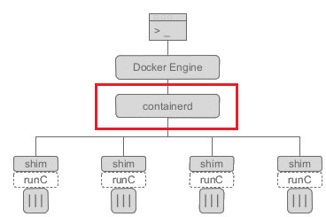
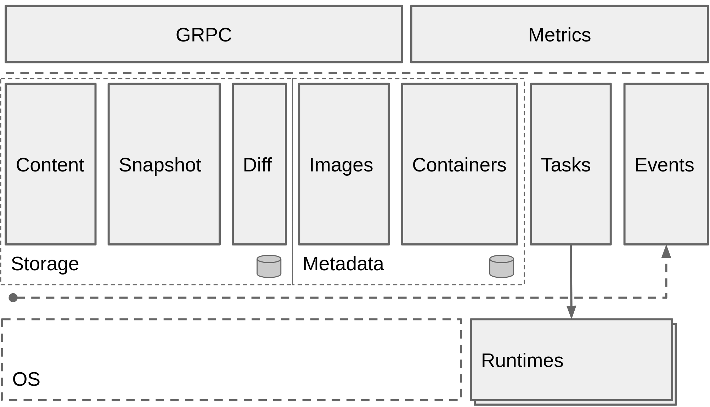

# 1.docker
[TOC]
# 一 概述
容器技术笔记

## 1 简介
容器引擎

容器化（containerization）：The use of Linux containers to deploy applications is called containerization.

images:A container is launched by running an image. An image is an executable package that includes everything needed to run an application--the code, a runtime, libraries, environment variables, and configuration files.

Docker是对Linux容器一种封装，利用 Linux 核心中的资源分脱机制，例如 cgroups，以及 Linux 核心名字空间（name space），来创建独立的软件容器（containers），属于操作系统层面的虚拟化技术。由于隔离的进程独立于宿主和其它的隔离的进程，因此也称其为容器。Docker 在容器的基础上进行了进一步的封装，从文件系统、网络互联到进程隔离等等，极大的简化了容器的创建和维护，使得其比虚拟机技术更为轻便、快捷。Docker 可以在单一 Linux 实体下运作，避免因为创建一个虚拟机而造成的额外负担。

Docker的思想来自于集装箱，集装箱解决了什么问题？在一艘大船上，可以把货物规整的摆放起来。并且各种各样的货物被集装箱标准化了，集装箱和集装箱之间不会互相影响。那么我就不需要专门运送水果的船和专门运送化学品的船了。只要这些货物在集装箱里封装的好好的，那我就可以用一艘大船把他们都运走。

docker就是类似的理念。现在都流行云计算了，云计算就好比大货轮。docker就是集装箱。总之docker就是集装箱原理。

先记住这句话：“Docker 是一个便携的应用容器”。你可以不知道 Docker 所说的的“便携式容器”到底是什么意思，但是你必须清楚 Docker 在日常中能带来非常大的效率提升。

### 1.1 为什么需要docker
首先应了解docker及docker之前一系列技术的产生是为了解决**环境配置**的问题，那么docker之前最早用来解决环境配置问题的技术是虚拟机。

虚拟机（virtual machine）就是带环境安装的一种解决方案。它可以在一种操作系统里面运行另一种操作系统，比如在 Windows 系统里面运行 Linux 系统。应用程序对此毫无感知，因为虚拟机看上去跟真实系统一模一样，而对于底层系统来说，虚拟机就是一个普通文件，不需要了就删掉，对其他部分毫无影响。所以虚拟机的缺点大概有:
1. 资源占用多:虚拟机会独占一部分内存和硬盘空间。它运行的时候，其他程序就不能使用这些资源了。哪怕虚拟机里面的应用程序，真正使用的内存只有 1MB，虚拟机依然需要几百 MB 的内存才能运行。
2. 冗余步骤多:虚拟机是完整的操作系统，一些系统级别的操作步骤，往往无法跳过，比如用户登录。
3. 启动慢:启动操作系统需要多久，启动虚拟机就需要多久。可能要等几分钟，应用程序才能真正运行。

由于虚拟机存在这些缺点，Linux 发展出了另一种虚拟化技术：Linux 容器（Linux Containers，缩写为 LXC）。Linux 容器不是模拟一个完整的操作系统，而是对进程进行隔离。或者说，在正常进程的外面套了一个保护层。对于容器里面的进程来说，它接触到的各种资源都是虚拟的，从而实现与底层系统的隔离。由于容器是进程级别的，相比虚拟机有很多优势(略)。

Docker 属于 Linux 容器的一种封装，提供简单易用的容器使用接口。它是目前最流行的 Linux 容器解决方案。Docker 将应用程序与该程序的依赖，打包在一个文件里面。运行这个文件，就会生成一个虚拟容器。程序在这个虚拟容器里运行，就好像在真实的物理机上运行一样。有了 Docker，就不用担心环境问题。总体来说，Docker 的接口相当简单，用户可以方便地创建和使用容器，把自己的应用放入容器。容器还可以进行版本管理、复制、分享、修改，就像管理普通的代码一样。

docker的主要用途,目前有三大类。
1. 提供一次性的环境。比如，本地测试他人的软件、持续集成的时候提供单元测试和构建的环境。
2. 提供弹性的云服务。因为 Docker 容器可以随开随关，很适合动态扩容和缩容。
3. 组建微服务架构。通过多个容器，一台机器可以跑多个服务，因此在本机就可以模拟出微服务架构。

docker个人用例：
1.  尝试新软件：如果你想快速在你的笔记本上运行一个 MySQL 数据库，或者一个 Redis 消息队列，那么使用 Docker 便可以非常容易地做到。例如 Docker 只需要一条命令便可以运行 MySQL 数据库：`docker run -d -p 3306:3306 tutum/mysql`。当用到最新的技术或者非常复杂的技术时，使用 Docker 便会是个非常好的选择
2.  进行演示
3.  避免"it works on my machine"(我机器上可以运行)
    1. 开发测试运维之间
    2. 培训别人时的环境搭建问题
4. 占用资源更少
5. 微服务
6.  在云服务提供商之间移植：大多数的云主机提供商已经全面支持 Docker。对于开发人员来说，这表示你可以很方便地切换云服务提供商，当然也可以很方便地将你本地的开发环境移动到云主机上，不需要本地上配置一次运行环境、在云主机上还配置一次运行环境。全面部署 Docker (Docker here and Docker there) 作为标准运行环境可以极大地减轻应用上线时的工作量和产生 BUG
7. a  端：json server

### 1.2 Docker 和虚拟机的区别与特点
对于虚拟机技术来说，传统的虚拟机需要模拟整台机器包括硬件，每台虚拟机都需要有自己的操作系统，虚拟机一旦被开启，预分配给他的资源将全部被占用。每一个虚拟机包括应用，必要的二进制和库，以及一个完整的用户操作系统。而操作系统通常需要数十GB。

容器技术和我们的宿主机共享硬件资源及操作系统，可以实现资源的动态分配。容器包含应用和其所有的依赖包，但是与其他容器共享内核。容器在宿主机操作系统中，在用户空间以分离的进程运行。容器内没有自己的内核，也没有进行硬件虚拟。

具体来说与虚拟机技术对比，Docker 容器存在以下几个特点：
1. 更快的启动速度：因为 Docker 直接运行于宿主内核，无需启动完整的操作系统，因此启动速度属于秒级别，而虚拟机通常需要几分钟去启动。
2. 更高效的资源利用率：由于容器不需要进行硬件虚拟以及运行完整操作系统等额外开销，Docker 对系统资源的利用率更高。
3. 更高的系统支持量：Docker 的架构可以共用一个内核与共享应用程序库，所占内存极小。同样的硬件环境，Docker 运行的镜像数远多于虚拟机数量，对系统的利用率非常高。
4. 持续交付与部署：对开发和运维人员来说，最希望的就是一次创建或配置，可以在任意地方正常运行。使用 Docker 可以通过定制应用镜像来实现持续集成、持续交付、部署。开发人员可以通过 Dockerfile 来进行镜像构建，并进行集成测试，而运维人员则可以直接在生产环境中快速部署该镜像，甚至进行自动部署。
5. 更轻松的迁移：由于 Docker 确保了执行环境的一致性，使得应用的迁移更加容易。Docker 可以在很多平台上运行，无论是物理机、虚拟机、公有云、私有云，甚至是笔记本，其运行结果是一致的。因此用户可以很轻易的将在一个平台上运行的应用，迁移到另一个平台上，而不用担心运行环境的变化导致应用无法正常运行的情况。
    1. 一次发布，随处运行：Docker 项目通过容器镜像，直接将一个应用运行所需的完整环境，即把整个操作系统的文件系统也打包了进去。这种思路，可算是解决了困扰 PaaS 用户已久的一致性问题。
6. 更轻松的维护与扩展：Docker 使用的分层存储以及镜像的技术，使得应用重复部分的复用更为容易，也使得应用的维护更新更加简单，基于基础镜像进一步扩展镜像也变得非常简单。此外，Docker 团队同各个开源项目团队一起维护了一大批高质量的 官方镜像，既可以直接在生产环境使用，又可以作为基础进一步定制，大大的降低了应用服务的镜像制作成本。
7. 更弱的隔离性：Docker 属于进程之间的隔离，虚拟机可实现系统级别隔离。
8. 更弱的安全性：Docker 的租户 root 和宿主机 root 等同，一旦容器内的用户从普通用户权限提升为 root 权限，它就直接具备了宿主机的 root 权限，进而可进行无限制的操作。虚拟机租户 root 权限和宿主机的 root 虚拟机权限是分离的，并且利用硬件隔离技术可以防止虚拟机突破和彼此交互，而容器至今还没有任何形式的硬件隔离，这使得容器容易受到攻击。

### 1.3 什么是docker
Docker 最初是 dotCloud 公司创始人 Solomon Hykes 在法国期间发起的一个公司内部项目，它是基于 dotCloud 公司多年云服务技术的一次革新，并于 2013 年 3 月以 Apache 2.0 授权协议开源，主要项目代码在 GitHub 上进行维护。Docker 项目后来还加入了 Linux 基金会，并成立推动 开放容器联盟（OCI）。

Docker 自开源后受到广泛的关注和讨论，至今其 GitHub 项目 已经超过 5 万 7 千个星标和一万多个 fork。甚至由于 Docker 项目的火爆，在 2013 年底，dotCloud 公司决定改名为 Docker。Docker 最初是在 Ubuntu 12.04 上开发实现的；Red Hat 则从 RHEL 6.5 开始对 Docker 进行支持；Google 也在其 PaaS 产品中广泛应用 Docker。

Docker 使用 Google 公司推出的 Go 语言 进行开发实现，基于 Linux 内核的 cgroup，namespace，以及 OverlayFS 类的 Union FS 等技术，对进程进行封装隔离，属于 操作系统层面的虚拟化技术。由于隔离的进程独立于宿主和其它的隔离的进程，因此也称其为容器。最初实现是基于 LXC，从 0.7 版本以后开始去除 LXC，转而使用自行开发的 libcontainer，从 1.11 版本开始，则进一步演进为使用 runC 和 containerd。

## 3 常识
### 3.1 OCI（Open Container Initiative）
OCI定义了容器运行时标准（工业界标准），runC是Docker按照开放容器格式标准（OCF, Open Container Format）制定的一种具体实现。

### 3.2 docker版本
分为两大版本：CE（社区版，免费）和EE（企业版，强调安全，付费）

### 3.4 镜像名
镜像名，是由斜杠分割的每一个name组成部分构成的，如library/java。用冒号分割name和tag，如library/java:8-jdk。我们还可以在镜像名前加一些前缀，表示镜像来源是其他注册中心或私有注册中心，如localregistry.example:6666/library/java:8-jdk

个人：感觉前面这段描述是错的，library/java是仓库名，`仓库名:tag`才是镜像名。(待研究)

对于仓库地址dl.dockerpool.com/centos来说，dl.dockerpool.com是注册服务器地址，centos是仓库名。

### 3.5 windows containers vs linux containers（待整理）

### 3.6 可以查看已有镜像的Dockerfile吗
不能，因为image还包含用户手动编辑的内容，这些不在Dockerfile范围内。不过我们可以通过`docker history imageA`查看创建历史，从历史中推导一部分Dockerfile的内容。具体见`docker history`

### 3.7 如何在控制台打印输出
输出有几种：
1. 每一层所执行的命令
2. `RUN cmd_name`中cmd_name执行的输出，默认在显示后会被刷新掉。比如`ls .`显示后会被后续的命令输出刷新掉，导致太快了看不清。可以加上参数来让输出不会刷新掉`docker build ... --progress=plain --no-cache`

## 4 文档等
1. 官网
    1. 官网安装设置教程（下载网络可能是个问题）：https://hub.docker.com/?overlay=onboarding
    2. https://docs.docker.com/get-started/
    3. docker build相关
        1. https://docs.docker.com/engine/reference/builder/
    4. windows containers and linux containers:windows container 是相当于 docker 在 linux 下的原生实现，linux container 是通过 Hyper-V 托管了一个小型虚拟机以实现 linux 环境?
        1. windows containers：https://docs.microsoft.com/en-us/virtualization/windowscontainers/deploy-containers/containerd
1. Docker — 从入门到实践：https://yeasy.gitbooks.io/docker_practice/content/
3. 网友整理的图片不错：https://blog.csdn.net/xhyxxx/article/details/75447962

# 二 安装配置
## 1 win
分两种情况，win10和其他windows版本
### 1.1 win10
参考：https://docs.docker.com/desktop/windows/

2. 安装
    1. 可以选择linux containers或者windows containers，在安装后也可以切换。两者的资料见笔记文档目录。
3. 配置
    1. 需要开启Hyper-V，本质是在Hyper-V的支持下，将Docker容器运行在Linux的虚拟机里。在Docker for Windows的工具中，可以设置这台虚拟机的CPU个数，以及内存的大小
    2. settings设置
        1. 勾选expose daemon on tcp://localhost:2375 without TLS
        2. 选择共享盘符
    3. 设置了上面的这些运行`docker info`发现只有client信息，没有server信息，提示daemon没有运行。需要让daemon运行起来
        1. 运行`docker-machine ls`发现为空，需要创建machine（待补充）

## 2 linux

## 3 mac
对于10.10.3以下的用户 推荐使用`Docker Toolbox`,对于10.10.3以上的用户 推荐使用`Docker for Mac`。
1. 如果是`brew install docker`，则安装的是Docker engine, which will require Docker-Machine (+ VirtualBox) to run on the Mac；
2. 如果是`brew cask install docker`，则安装的是newer Docker for Mac, which does not require virtualbox。启动之后会在`/usr/local/bin`创建docker, docker-compose, docker-credential-osxkeychain and docker-machine的symbolic links。要想用docker-machine创建virtual machines, 需要安装VirtualBox`brew cask install virtualbox`(由于Docker引擎是使用了特定于Linux内核的特性，所以需要安装一个轻量级的虚拟机（如VirtualBox）来在OSX上运行)。

### 3.1 Docker Toolbox
Docker Toolbox installs docker, docker-compose, and docker-machine in /usr/local/bin on your Mac, it also install VirtualBox

注册docker hub：https://hub.docker.com/，Share images, automate workflows

验证安装成功：`docker run hello-world`

### 3.2 docker for docker
1. 安装
2. 运行`docker version`和`docker info`来验证是否安装成功。
    1. 如果提示`Error response from daemon: Bad response from Docker engine`，需要先登录账号密码
3. 启动
    1. 可以点击GUI方式启动
    2. 也可以命令行启动，貌似不能单独启动docker daemon，较繁琐的样子：https://stackoverflow.com/questions/42637339/how-to-start-docker-for-mac-daemon-on-boot
4. 测试两个镜像
    1. hello-world：`docker run hello-world`
    2. nginx
    
## 4 配置
### 4.1 镜像加速
常见的有：docker官方提供的中国、七牛云、网易、阿里云的(https://cr.console.aliyun.com/cn-hangzhou/instances/mirrors)
```json5
// registry-mirrors 用于配置公开的镜像加速中心
// insecure-registries 用于配置私有的，格式是 host:port 
"registry-mirrors": ["https://registry.docker-cn.com"],
"insecure-registries":["192.168.1.235:5000"]
```

### 4.2 镜像保存位置
1. win默认是保存在`C:\ProgramData\DockerDesktop\vm-data`，加上hyper-v，占用空间挺大的。修改的方法是docker 运行后 => setting => Resources => Disk image location => 修改后重启docker

# 三 基础
## 0 架构
Docker有三个组件和三个基本元素，三个基本概念

三个组件分别是：
1. Docker Client 是用户界面，它支持用户与Docker Daemon进行通信。Docker使用socket进行客户端和服务端的连接。
2. Docker Daemon运行于主机后台的守护进程，处理服务请求，承载了Docker运行过程中的大部分工作。通过Docker Server模块接受Docker Client的请求，并在Engine中处理请求，然后根据请求类型，创建出指定的Job并运行，运行过程的作用有以下几种可能：向Docker Registry获取镜像，通过graphdriver执行容器镜像的本地化操作，通过networkdriver执行容器网络环境的配置，通过execdriver执行容器内部运行的执行工作等。
    1. 它由三个部分组成：Docker Server、Engine和Job
3. Docker Index是中央registry，支持拥有公有与私有访问权限的Docker容器镜像的备份。

三个基本要素分别是：
1. Docker Containers负责应用程序的运行，包括操作系统、用户添加的文件以及元数据。
2. Docker Images是一个只读模板，用来运行Docker容器。
3. DockerFile是文件指令集，用来说明如何自动创建Docker镜像。

三个基本概念分别是：理解了这三个概念，就理解了 Docker 的整个生命周期。
1. 镜像
2. 容器
3. 仓库



containerd：Containerd 是一个工业级标准的容器运行时，它强调简单性、健壮性和可移植性。Containerd 可以在宿主机中管理完整的容器生命周期：容器镜像的传输和存储、容器的执行和管理、存储和网络等。



Docker使用以下操作系统的功能来提高容器技术效率：
1. Namespaces 充当隔离的第一级。确保一个容器中运行一个进程而且不能看到或影响容器外的其它进程。
2. Control Groups是LXC的重要组成部分，具有资源核算与限制的关键功能。
3. UnionFS（文件系统）作为容器的构建块。为了支持Docker的轻量级以及速度快的特性，它创建了用户层。

### 名词

#### 上下文
使用 docker build 命令通过 Dockerfile 创建镜像时，会产生一个 build 上下文(context)。所谓的 build 上下文就是 docker build 命令的 PATH 或 URL 指定的路径中的文件的集合。在镜像 build时，上下文中的所有文件会被发送给docker引擎，build过程中可以引用上下文中的任何文件，比如使用COPY 和 ADD 命令，就可以引用上下文中的文件。`docker build`默认使用上下文中的Dockerfile文件。

```bash
docker build -t iamge_name . # 上下文是当前目录
docker build -t iamge_name /home/name # 上下文是 /home/name 目录
```

注意：
1. 上下文路径下不要放无用的文件，因为会一起打包发送给 docker 引擎，如果文件过多会造成过程缓慢

#### 镜像(Image)
Docker 镜像是一个特殊的文件系统，除了提供容器运行时所需的程序、库、资源、配置等文件外，还包含了一些为运行时准备的一些配置参数（如匿名卷、环境变量、用户等）。镜像不包含任何动态数据，其内容在构建之后也不会被改变。

分类：
1. 系统级镜像:如Ubuntu镜像。CentOS镜像以及Debian容器等；
2. 工具栈镜像:如Golang镜像。Flask镜像，Tomcat镜像等；
3. 服务级镜像:如MySQL镜像，MongoDB镜像。RabbitMQ镜像等；
4. 应用级镜像:如WordPress镜像，DockerRegistry镜像等。

联合文件系统:镜像的总大小＝每一层镜像的大小总和，但是不是单纯的相加。

#### 2 容器(Container)
容器的实质是进程，但与直接在宿主执行的进程不同，容器进程运行于属于自己的独立的命名空间，每个容器都是相互隔离的，容器可以被创建、启动、停止、删除和暂停等等，说到镜像与容器之间的关系，可以类比面向对象程序设计中的类和实例。

可以把容器看做是一个简易版的linux环境（包括root用户权限、进程空间、用户空间和网络空间等）和运行在其中的应用程序。

writable container layer：也称为"container layer"
1. 参考：https://docs.docker.com/storage/storagedriver/#images-and-layers

#### 3 仓库(Repository)
镜像构建完成后，可以很容易的在当前宿主机上运行，但是，如果需要在其它服务器上使用这个镜像，我们就需要一个集中的存储、分发镜像的服务，Docker Registry 就是这样的服务。一个 Docker Registry 中可以包含多个仓库；每个仓库可以包含多个标签；每个标签对应一个镜像，其中标签可以理解为镜像的版本号。


#### 4 注册中心（Registry）
1. 官方注册中心：hub.docker.com
    1. 搜索镜像
2. 国内的注册中心：daocloud、时速云、阿里云

#### 5 客户端(Client)
Docker 客户端(Client) Docker 客户端通过命令行或者其他工具使用 Docker API (https://docs.docker.com/reference/api/docker_remote_api) 与 Docker 的守护进程通信。


#### 6 主机（Host）
Docker 主机(Host) 一个物理或者虚拟的机器用于执行 Docker 守护进程和容器。

#### 7 Machine
Docker Machine是一个简化Docker安装的命令行工具，通过一个简单的命令行即可在相应的平台上安装Docker，比如VirtualBox、 Digital Ocean、Microsoft Azure。

#### CoW 
Copy On Write，写时复制

## 1 工具生态

### runc
runc 是一个 Linux 命令行工具，用于根据 OCI容器运行时规范 创建和运行容器。

### containerd 
containerd 是一个守护程序，它管理容器生命周期，提供了在一个节点上执行容器和管理镜像的最小功能集。

## 2 操作
1. 查看镜像、容器、数据卷所占用的空间`docker system df`
2. 查看容器的PID：
    1. `docker top container_id`
    2. `docker inspect -f  "{{.State.Pid}}" container_id`
3. 查看端口映射情况`docker port container_name/container_id`

### 登录
docker login需要docker deamon运行

1. `docker login` : 登陆到一个Docker镜像仓库，如果未指定镜像仓库地址，默认为官方仓库 Docker Hub
2. `docker logout` : 登出一个Docker镜像仓库，如果未指定镜像仓库地址，默认为官方仓库 Docker Hub

共同参数：
1. `-u`:登陆的用户名
2. `-p`:登陆的密码

问题：
1. 如何判断是否已经登录过：执行`docker login`,已成功登录的话会提示出来的
2. 如何查看登录信息：命令行里似乎没法，只能网页上看

### 镜像（image）操作
1. 创建image：创建镜像一般有三种方式：基于已有镜像的容器创建、基于本地模板导入、基于Dockerfile创建。
    1. 基于已有镜像的容器创建：参考`docker commit [OPTIONS] CONTAINER [REPOSITORY[:TAG]]`
        1. 比如`docker commit -a "xuxiaoke" -m "emqx:v4.1.1 with emqx_mod_delayed" 733c28 xuxiaoke/emqx:v4.1.1`
    2. 基于本地模板导入:(待补充)
    3. 基于Dockerfile创建
        1. 新建Dockerfile文件，写入一些需要的信息。如果文件名不是"Dockerfile"，可以用`-f`参数指定
        2. 在Dockerfile所在目录使用命令`docker build .`生成image
            1. 显示每个步骤的耗时：使用环境变量`DOCKER_BUILDKIT=true`，或者在docker daemon 加上如下config(重启后生效)
                    
                ```go
                {
                    "debug": true,
                    "experimental": true,
                    "features": {
                        "buildkit": true
                    }
                }
                ```
            2. `-t`：给image命名
                
                ```bash
                docker build . -t <your username>/node-web-app
                ```
2. 列出本地的image：`docker images`
    1. 参数`-f`:根据条件过滤，比如列出所有ubuntu18之前的镜像`docker images -f before=ubuntu:18`    
3. 从注册中心拉取image：`docker pull repository_name:tag`
    1. 参数`-a`：拉取一个镜像库中的所有镜像
4. 删除image`docker image rm image_inf`或者`docker rmi image_info`：其中`image_info`可以是镜像短ID、镜像长ID、镜像名或者镜像tag。如果是镜像tag时，实际上是删除该tag，只要该镜像还有其他tag，就不会删除该镜像。当后面的参数为镜像ID时，则会彻底删除整个镜像，连同所有标签一同删除
    1. 参数`-f`:强制删除，一般不建议使用，会导致某些问题
5. 查看本地image详细信息：`docker inspect`，默认返回的是json格式
    1. 参数`-f`：用go template格式化返回的信息
        1. 比如我只想查看镜像的Architecture
            1. 如果是windows terminal的话要写成这样`docker inspect -f '{{.Architecture}}' nginx`或者`docker inspect -f '{{".Architecture"}}' nginx`

                ```bash
                # inspect命令可以看到每一层image的加密哈希id
                docker image inspect --format "{{json .RootFS.Layers}}" acme/my-base-image:1.0
                [
                    "sha256:72e830a4dff5f0d5225cdc0a320e85ab1ce06ea5673acfe8d83a7645cbd0e9cf",
                    "sha256:07b4a9068b6af337e8b8f1f1dae3dd14185b2c0003a9a1f0a6fd2587495b204a"
                ]
                ```
            2. 其他情况这样`docker inspect -f {{".Architecture"}} nginx`，
6. 给镜像打一个新的标签：`docker tag`
7. 推送镜像或仓库:假设本地有`xuxiaoke/emqx:v4.1.1`，推送到远程的xuxiaoke/emqx仓库可以`docker push xuxiaoke/emqx`，推送镜像到远程可以`docker push xuxiaoke/emqx:v4.1.1`

#### 虚悬镜像（dangling image）
没有仓库名，也没有标签的镜像称为虚悬镜像，显示为
```
<none>      <none>     00285df0df87    5 days ago   342 MB 
```
有两种情况会导致虚悬镜像：
1. 这个镜像原本是有镜像名和标签的，原来为 mongo:3.2 ，随着官方镜像维护，发 布了新版本后，重新 docker pull mongo:3.2 时， mongo:3.2 这个镜像名被 转移到了新下载的镜像身上，而旧的镜像上的这个名称则被取消，从而成为了 。
2. docker build 也同样可 以导致这种现象。由于新旧镜像同名，旧镜像名称被取消，从而出现虚悬镜像。
3. 直接docker build也会产生(待整理)

1. 查看虚悬镜像`docker images -f dangling=true`
2. 删除虚悬镜像:一般来说，虚悬镜像已经失去了存在的价值，是可以随意删除的.
    1. `docker rmi $(docker images -q -f dangling=true)`
    2. `docker image prune`(待确认)

   
### 容器(container)操作
1. 启动容器。有三种方式：交互方式--基于镜像新建容器并启动、短暂方式--直接将一个已经终止的容器启动运行起来、daemon方式--守护态运行
    1. 交互方式，基于镜像新建容器并启动：`docker run image_name`。Docker会在隔离的容器中运行进程，如果本地不存在该镜像，Docker会从镜像仓库下载该镜像。当运行`docker run`命令时，Docker会启动一个进程，并为这个进程分配其独占的文件系统、网络资源和以此进程为根进程的进程组。在容器启动时，镜像可能已经定义了要运行的二进制文件、暴露的网络端口等，但是用户可以通过docker run命令重新定义（docker run可以控制一个容器运行时的行为，它可以覆盖docker build在构建镜像时的一些默认配置），这也是为什么run命令相比于其它命令有如此多的参数的原因。
        1. 使用docker run命令来启动容器，docker在后台运行的标准操作包括
            1. 检查本地是否存在指定的镜像，不存在则从公有仓库下载
            2. 使用镜像创建并启动容器
            3. 分配一个文件系统，并在只读的镜像层外面挂载一层可读可写层
            4. 从宿主主机配置的网桥接口中桥接一个虚拟接口道容器中去
            5. 从地址池分配一个ip地址给容器
            6. 执行用户指定的应用程序
            7. 执行完毕之后容器被终止
        1. 常用参数如下：
            1. `-i`: 以交互模式运行容器（即使没有附加也让容器的标准输入保持打开），通常与`-t`同时使用
            2. `-p host_port:container_port`: 端口映射，如`-p 80:80`，在启动容器的时候，如果不指定对应的参数，在容器外部是无法通过网络进行访问容器内的应用和服务的。
                1. 多次使用`-p`标记可以绑定多个端口，如`docker run -d -p 5000:5000 -p 8082:80 nginx bash`,
                2. 映射到指定地址的指定端口`-p host_ip:host_port:container_post`，如`docker run -d -p 127.0.0.1:5000:5000 nginx bash`
                3. 映射到指定地址的任意端口`-p host_ip::container_post`:宿主机会任意分配一个端口
            3. `-t`: 为容器重新分配一个伪输入终端，通常与`-i`同时使用；
                
                ```bash
                docker run -p 8081:8081 -it image_name sh
                ```
            4. `--rm`：容器运行完之后自动清除。和`-d`不能共用。默认情况下，每个容器在退出时，它的文件系统也会保存下来，这样一方面调试会方便些，因为你可以通过查看日志等方式来确定最终状态。另外一方面，你也可以保存容器所产生的数据。
            5. `-net xxx`(`--network`)
            6. `-v host_dir:container_dir`：挂载一个文件目录到指定容器，即容器的共享文件夹。要求本地目录的路径必须是绝对路径，如果host_dir不存在，Docker会自行创建。Docker挂载数据卷的默认权限是rw，用户也可以指定权限
                
                ```bash
                # 挂载当前目录到容器的/app目录
                docker run --rm -v $(pwd):/app golangci/golangci-lint golangci-lint run ./... -v
                ```
            7. `-w`(`--workdir`):Working directory inside the container(指定容器的工作目录，注意是container_dir而不是host_dir)。如果不存在则会创建
                
                ```bash
                docker run -w /path/to/dir/ -i -t  ubuntu pwd
                ```
            7. `--name`：给创建的容器命名
            8. 配置
                1. `-e`：配置信息（待补充）
                    1. 比如设置emqx的环境变量EMQX_LISTENER__TCP__EXTERNAL:`docker run -d --name emqx -e EMQX_LISTENER__TCP__EXTERNAL=1883 -p 18083:18083 -p 1883:1883 emqx/emqx:latest`
                2. `--env-file fileA`:fileA的格式是
                    
                    ```bash
                    VAR1=value1
                    VAR2=value2
                    USER=denis
                    
                    # 比如
                    USER=admin
                    PASSWORD=admin
                    ```
            9. `-d`：让容器在后台运行，即daemon方式运行，并且在成功启动容器后输出容器的完整ID
            7. `--security-opt`：
    2. 短暂方式，启动已经终止的容器`docker start container_id`，容器ID可以简写为前三位
    3. daemon方式，守护态运行`docker run -d ...`：后台运行，可以让软件作为长时间服务运行（即SaaS），启动成功后只会打印容器ID，日志不会打印在控制台。日志需要用`docker logs`查看。容器是否会长久运行，和-d参数有关，也和docker run指定的命令有关
2. 列出正在运行的容器：`docker ps`
    1. `-a`：已经停止运行的容器也会列出来
3. 查看启动的容器中的输出
    1. `docker logs $container_id`：在container外面查看它的输出
        1. `-f`: 跟踪日志输出（即有新的输出会显示出来）
        2. `--since`:显示某个开始时间的所有日志
        3. `-t`:显示时间戳
        4. `--tail`；仅列出最新N条容器日志
    1. `docker attach $CONTAINER_ID`：连接上容器实时查看
4. 创建容器:`docker create -it image_name`：该命令新建的容器处于停止状态，可以使用docker start命令来启动它
5. 终止容器`docker stop container_id`：首先向容器发送SIGTERM信号，等待一段超时时间（默认为10s）后，再发送SIGKILL信号来终止容器。docker kill命令会直接发送SIGKILL信号来强行终止容器
    1. 可以通过image name来终止吗？
6. 重启容器`docker restart`
7. 进入正在运行的容器：有三种方式
    1. (推荐)`docker exec -it containerA xxx`：比如`docker exec -it container_idA sh`
    2. `docker attach container_id`：使用attach命令有时候并不方便，当多个窗口同时使用attach命令链接到同一个容器的时候，所有attach窗口和容器最开始启动的那个窗口都会同步显示。当某个窗口因命令阻塞时，其他窗口也无法进行操作；当某个窗口退出时，这些窗口都会终止。
    3. nsenter工具：需要找到容器的PID，一般写成脚本
8. 删除container`docker rm`：默认只会删除处于终止或退出状态的容器，且不会删除挂载的数据卷。
    1. 参数`-f`：强制删除
    2. 参数`-l`：删除容器的链接，但保留容器（待补充）
    3. 参数`-v`：删除容器挂载的数据卷
    2. 删除所有终止的容器：`docker container prune`
9. 在host和container之间copy文件：`docker cp`
10. 保存容器状态为新的image：`docker commit [OPTIONS] CONTAINER [REPOSITORY[:TAG]]`，和版本控制工具的命令有点像。
    1. 参数`-a`:作者信息
    2. 参数`-m`：提交信息
    3. 参数`-p`：提交时暂停容器运行

11. 导入导出：有两种，一种是导入导出容器的快照，一种是导入导出完整镜像，这两种方式不能混用。
    1. 导入导出容器的快照：`export`和`import`导出的是一个容器的快照, 不是镜像本身, 也就是说没有 layer等信息，快照文件将丢弃所有的历史记录和元数据信息（即仅保存容器当时的快照状态）
        1. `docker export`：导出容器

            ```bash
            # 导出一个已经创建的容器到一个文件，不管此时这个容器是否处于运行状态
            docker export container_id > example.tar
            ```
        2. `docker import`：载入容器包，恢复为镜像。可以对镜像重命名。

            ```bash
            # 导入容器为镜像
            cat example.tar | docker import - image_name:tag
            ```
    2. 导入导出完整镜像文件
        1. `docker save`:导出镜像
            1. `-o`:输出到的文件

            ```bash
            docker save -o example.tar repositoryName:tagName
            ```

        2. `docker load`：载入镜像包，恢复为镜像。不能对载入的镜像重命名


### 仓库(repository)操作
查找:`search`
1. 查看image的tags：似乎不能用命令行来查看，只能去网页上查询，比如`arachnysdocker/athenapdf`，
    1. 可以去https://hub.docker.com/r/arachnysdocker/athenapdf/tags/
    2. 去https://hub.docker.com/u/library，搜索然后查看tags

拉取：`pull [选项] [registry地址[:端口号]]仓库名[:标签]`：默认情况下`docker pull`会从docker hub拉取镜像文件，也可以手动指定一个仓库地址拉取镜像，仓库地址类似一个URL，但是没有协议头`http://`，而且可以指定本地仓库。默认是https的方式通信。
1. 镜像保存位置：
    1. win是`C:\ProgramData\DockerDesktop\vm-data`
    
```bash
# 例子1 直接拉取
# docker pull 仓库:tag
docker pull ubuntu:16.04 # 会去官方的docker hub拉取library/ubuntu仓库中标签16.04的镜像
docker pull ubuntu:latest 

# 例子2 拉取本地registry myregistry.local:5000 里的仓库 testing/test-image 的 latest标签镜像
docker pull myregistry.local:5000/testing/test-image

# 例子3 名字输错了是不会拉取的，比如仓库里只有镜像emqx/emqx，
docker pull emqx #只输入emqx是无法拉取的
docker pull emqx/emqx #可以拉取
```

推送镜像到registry：`docker push image_name`


问题
1. 推送时tag相同的话，貌似不会更新远程已有的镜像？

## 3 Dockerfile
参考：
1. https://docs.docker.com/engine/reference/builder

Dockerfile是为了快速构建镜像。Dockerfile由一行行命令语句组成，并且支持以#开头的注释行。约定成俗，一般该文件的名字就叫`Dockerfile`。文件里每一行都会产生一个新层，image中原来的层都是只读的，在运行时最外面会多一个container layer层，我们后续操作就是从这层开始。因为不同的容器可能有相同的层，所以分层的好处是节约存储空间。 

一般而言，Dockerfile分为以下几个部分：
1. 基础镜像信息
2. 维护者信息
3. 定义环境变量
    1. **注意低层的环境变量会被带到高层**(?)，比如golang官方镜像的`GOPROXY=https://proxy.golang.org,direct`，但是我们一般设置为`GOPROXY=https://goproxy.cn,direct`，所以需要重新设置

        ```bash
        FROM golang:1.14-alpine AS builder
        # 重新设置环境变量
        ENV GOPROXY=https://goproxy.cn,direct
        ```
3. 镜像操作指令
4. 容器启动时执行指令

关于层：Dockerfile 的指令每执行一次都会在 docker 上新建一层。注意过多无意义的层，会造成镜像膨胀过大

```Dockerfile
# 比如这个是三层，可以优化一下变成一层
RUN yum install wget
RUN wget -O redis.tar.gz "http://download.redis.io/releases/redis-5.0.3.tar.gz"
RUN tar -xvf redis.tar.gz

# 优化后
RUN yum install wget \
    && wget -O redis.tar.gz "http://download.redis.io/releases/redis-5.0.3.tar.gz" \
    && tar -xvf redis.tar.gz
```

语法：
1. 多阶段构建和`FROM`:每个`FROM`都会生成一个新的阶段
    1. 参考:https://docs.docker.com/develop/develop-images/multistage-build/
    2. 基本使用
        1. `FROM image:tag [AS stage_name]`指定基础镜像：如果本地不存在，则默认会去Docker Hub下载指定镜像。任何Dockerfile中的第一条指令必须为FROM指令。并且在同一个Dockerfile中创建多个镜像时，可以使用多个FROM指令（每个镜像一次）
        
            ```bash
            # 拉取go的最新官方镜像
            FROM golang:latest AS builder # builder是对该基础镜像的命令，也就是对阶段的命令(每个FROM相当于一个阶段)，可以在后续的 FROM 和 COPY指令中使用
            ```
        2. `FROM stage_name1 AS stage_name2`
    3. 多阶段构建：对于包含多个`FROM`命令的Dockerfile中，最后生成的镜像是最后一个阶段(最后一个FROM)的结果。虽然之前的FROM会被抛弃,但是，能够将前置阶段中的文件拷贝到后边的阶段中，可以有效降低复杂度和最终镜像大小。
2. `MAINTAINER name`：指定维护者信息，该信息会写入生成镜像的Author属性域中
1. `LABEL`only modifies the image’s metadata, and does not produce a new layer.
    
    ```bash
    LABEL org.opencontainers.image.authors="org@example.com"
    ```
3. `WORKDIR path`:为后续的`RUN`，`CMD`，`COPY`,`ADD`,`ENTRYPOINT`等指令配置工作目录(工作目录是镜像内的目录)，如果目录不存在，则会创建。可以使用多个`WORKDIR`指令，后续命令如果参数是相对路径(比如`./dir`、`dir`、`.`等)，则会基于之前指定的工作目录
    
    ```bash
    FROM golang:latest
    RUN ["/bin/sh","-c","pwd"] # 因为go官方docker镜像的原因，这个时候自己所在的容器目录是 /go
    WORKDIR /build
    RUN ["/bin/sh","-c","pwd"] # 这个时候自己所在的容器目录是 /build
    ```
4. `ENV`：指定容器内的全局环境变量，可以被后续`RUN`指令使用
    
    ```bash
    # 指定容器内的全局环境变量
    ENV PATH /usr/local/mysql/bin:$PATH
    # 如果想为某个命令临时指定环境变量，可以这样
    RUN DEBIAN_FRONTEND=noninteractive apt-get install -y python3 # DEBIAN_FRONTEND就只临时生效，不会影响后续命令
    # 在基于alpine的某些镜像中使用 go env -w GOPROXY=https://goproxy.cn,direct 可能会出现警告 go env -w GOPROXY=... does not override conflicting OS environment variable，是因为镜像中已经配置GOPROXY的系统环境变量，go env -w无法覆盖系统级别的环境变量，此时就可以用ENV命令
    ENV GOPROXY=https://goproxy.cn,direct
    ```
4. `USER xxx`：指定运行容器时的用户名或UID，后续的RUN也会指定用户。当服务不需要管理员权限时，可以通过该指令指定运行的用户。并且可以在之前创建所需要的用户。如:

    ```bash
    RUN groupadd -r postgres && useradd -r -g postgres postgres。
    # 要临时获取管理员权限可以使用gosu，而不推荐sudo（待验证）
    ```
3. `RUN`执行命令：RUN指令将对镜像执行跟随的命令。每运行一条RUN指令，镜像添加新的一层，并提交。有两种写法:
    1. `RUN command`:默认将在shell终端运行命令，即`/bin/sh -c`，如`RUN yum install httpd`
    2. `RUN ["executable","param1","param2"]`:使用exec执行，不会启动shell环境，如`RUN ["/bin/bash","-c","echo hello"]`
4. `ADD`和`COPY`
    1. 共同点
        1. COPY 和 ADD 命令不能操作上下文之外的本地文件(但是`ADD`可以操作远程文件)：因为在执行 build 命令时，docker 客户端会把上下文中的所有文件发送给 docker daemon，且docker 客户端和 docker daemon 可能不在同一台机器上
        2. 如果src是文件夹，`COPY`和`ADD`只复制文件夹中的内容而不包含文件夹自身

            ```bash
            # 假如dirA中有文件fileA和fileB
            WORKDIR /app
            COPY dirA . # 执行之后，/app目录下有fileA和fileB

            COPY dirA ./dirA # 执行之后，/app/dirA目录下有fileA和fileB
            ```
        3. `dst`可以是镜像内的绝对路径，或者相对于工作目录`WORKDIR`的相对路径
    4. `ADD src dst`：将本地或远程的一个文件或目录拷贝或解压到容器的某个目录里。其中`src`为Dockerfile所在目录的相对路径，它也可以是一个URL；如果为tar文件，会自动解压到`dst`路径下。因为有`COPY`命令，所以实际上只有在解压压缩文件并把它们添加到镜像中时才需要 ADD 命令

        ```bash
        # 1 解压
        WORKDIR /app
        ADD nickdir.tar.gz .

        # 2 从URL中拷贝文件(不推荐这么使用，具体参考：https://docs.docker.com/develop/develop-images/dockerfile_best-practices/#add-or-copy)
        ADD http://example.com/big.tar.xz /usr/src/things/
        ```
    5. `COPY src/--from=nameA dst`：拷贝文件，复制宿主机的本地文件`src`或前面阶段的构建产物`--from=nameA`到容器中，`dst`路径不存在时，会自动创建。
        1. 宿主机的本地文件`src`
            1. 支持go风格的通配符
                1. `*`：匹配任意多个字符
                    
                    ```bash
                    COPY hom* /mydir/
                    ```
                2. `?`匹配单个字符
                    
                    ```bash
                    COPY hom?.txt /mydir/
                    ```
            2. 只能是当前目录及子目录的内容，不能是`../dir`
        2. 前面阶段的构建产物`--from=nameA`
            1. `nameA`可以是
                1. 阶段(stage)名称或镜像名称：即`FROM xxx AS nameA`中的`nameA`，优先被认为是阶段名称，其次是镜像名称
                    
                    ```bash
                    FROM golang:1.16-alpine AS builder 
                    COPY --from=builder /app/server /app/server # builder是阶段名称
                    COPY --from=nginx:latest /etc/nginx/nginx.conf /nginx.conf # nginx:latest 是镜像名称
                    ```
                2. 阶段(stage)数：比如`0`表示第一个阶段(每一个`FROM`表示一个阶段)。缺点是重新排序会受影响
        
                    ```bash
                    COPY --from=0 /app . # 把第一阶段构建产物中/app目录下的文件拷贝到了当前工作目录中
                    ```
6. `CMD`执行命令：指定容器启动时用到的命令。如果指定了多条命令，只有最后一条会被执行。如果用户启动容器时，指定了运行命令，则会覆盖掉CMD指定的命令。如`CMD ["/bin/bash", "/usr/local/nginx/sbin/nginx", "-c", "/usr/local/nginx/conf/nginx.conf"]`
7. `ENTRYPOINT`:指定镜像的默认入口命令，该入口命令在启动容器时作为根命令执行，所有传入值作为该命令的参数.不会被`docker run`提供的参数覆盖，而且会比CMD或者docker run指定的命令要靠前执行，每个Dockerfile中只能有一个ENTRYPOINT,当指定多个ENTRYPOINT时，只有最后一个生效。
7. `EXPOSE port...`：暴露端口，告诉Docker服务端容器暴露的端口号，供互联系统使用。在启动容器时需要通过-P，Docker主机会自动分配一个端口转发到指定端口；使用-p，则可以具体指定哪个本地端口映射过来。如`EXPOSE 22 80 443`
8. `VOLUME`：指定容器挂载的卷，创建一个可以从本地主机或其他容器挂载的挂载点，一般用于存放数据库和需要保持的数据等
12. `ARG`：指定一些镜像内使用的参数（例如版本号信息等），这些参数在执行docker build命令时，才会传入，比如
    
    ```bash
    --build-arg keyA=valueA
    ```
13. `ONBUILD`:配置当所创建的镜像作为其他镜像的基础镜像时，所执行的创建操作指令。
14. `STOPSIGNAL signal`：指定所创建镜像启动的容器接收退出的信号值。
15. `HEALTHCHECK`：配置所启动容器如何进行健康检查（如何判断健康与否），自docker 1.12开始支持
16. `SHELL`:指定其他命令使用shell时的默认shell类型

注意：
1. 当`RUN`命令过长时，可以使用` \`来换行。

查看指定镜像的创建历史`docker history imageA`(待整理)

例子：
```bash
#This dockerfile uses the centos image
#VERSION 1
#Author:docker_user
#Command format:Instruction [arguments / command] ..

#第一行必须制定基于的基础镜像
FROM centos
#维护者信息
MAINTAINER docker_user docker_user@email.com
#镜像的操作指令
RUN echo "hello world"
RUN yum update && yum install -y net-tools
RUN yum install -y nginx
#容器启动时执行指令
CMD /usr/sbin/nginx
```


## 4 持久化
参考：
1. https://docs.docker.com/storage/bind-mounts/
2. https://docs.docker.com/storage/volumes/
3. https://docs.docker.com/storage/storagedriver/

查看容器使用的硬盘空间：`docker ps -s`
1. 参数说明
    1. `size`:the amount of data (on disk) that is used for the writable layer of each container.
    2. `virtual size`

分类：
1. mount
    1. bind mount
    2. volume
    3. tmpfs mount：使用宿主机的内存作为存储，不会写到宿主机的文件系统中
2. Storage drivers

### 4.1 bind mount
直接将宿主机文件系统上的文件路径映射到容器中，两边双向同步。和volumes相比，bind mount功能有限，而且依赖于主机系统和机器，更推荐使用volumes。

### 4.2 数据卷（Data Volumes）和数据卷容器（Data Volumes Dontainers）
和bind mount依赖主机的目录结构不同，volumes完全由docker管理。

优缺点：
1. 优点
    1. Volume drivers let you store volumes on remote hosts or cloud providers, to encrypt the contents of volumes, or to add other functionality. 
    2. Volumes on Docker Desktop have much higher performance than bind mounts from Mac and Windows hosts.
    3. volumes can be shared among containers and do not increase the size of your container’s writable layer. 
4. 缺点
    1. 在宿主机上直接操作volume比较困难

适用场景：
1. 比如MySQL程序都是相同的，可以只在一个容器中运行，而不同的数据库内容可以使用 Volume 来注入

分类：
1. 一般volumes
2. tmpfs mounts：If your container generates non-persistent state data, consider using a tmpfs mount to avoid storing the data anywhere permanently, and to increase the container’s performance by avoiding writing into the container’s writable layer.

使用：
1. 管理volume
    2. create a volume`docker volume create volume_name`
        1. volume driver
    3. list volumes`docker volume ls`
    4. inspect a volume`docker volume inspect volume_name`
    5. remove a volume`docker volume rm volume_name`
2. 其他地方用到volume，使用参数`-v`或`--mount`
    1. 语法
        1. `--mount 'type=volume,src=<VOLUME-NAME>,dst=<CONTAINER-PATH>,volume-driver=local,volume-opt=type=nfs,volume-opt=device=<nfs-server>:<nfs-path>,"volume-opt=o=addr=<nfs-address>,vers=4,soft,timeo=180,bg,tcp,rw"'`
    2. 容器用到
        1. Start a container with a volume: if volume that does not yet exist, Docker creates the volume for you

            ```bash
            docker run -d \
            --name devtest \
            --mount source=myvol2,target=/app \
            nginx:latest
            ```
        2. 创建容器的时候，可以指定使用其他容器的volume，也就是共享其他容器的volume，使用`--volumes-from`参数

            ```bash
            # 比如在mysqlB中使用mysqlA的volume
            docker run --name mysqlB --volumes-from mysqlA -d mysql
            ```
    3. service用到


#### 数据卷（Data Volumes）
参考`docker run -v host_dir:container_dir`

#### 数据卷容器（Data Volumes Dontainers）
参考`docker run -v container_dir`

### 4.3 Storage drivers 存储驱动程序
Docker uses storage drivers to store image layers, and to store data in the writable layer of a container. The container’s writable layer does not persist after the container is deleted, but is suitable for storing ephemeral data that is generated at runtime. 

查看使用的存储驱动程序和文件系统:`docker info`的Storage Driver行:
```bash
# windows示例 
Storage Driver: overlay2
  Backing Filesystem: extfs
  Supports d_type: true
  Native Overlay Diff: true
```

## 6 多容器app（docker-compose）
docker-compose用于编排容器。在win/mac的安装包里是自带的，如果是linux，需要手动安装。具体参考docker-compose部分笔记

## 7 .dockerignore文件
从容器映像中排除文件。在执行`COPY`命令时，这些文件将不会被拷贝进入到Docker 镜像中

# 四 高级
## 1 网络设置
默认情况下，容器使用主机的DNS设置，网络设置为bridge模式。

`docker run -net xxx`:
1. `none`：关闭网络接口，此时将关闭所有网络数据的输入输出，这个容器内部只会有一个loopback接口，而且不存在任何可以访问外部网络的router。你只能通过STDIN、STDOUT或者files来完成I/O操作
2. `bridge`:通过veth接口来连接容器，默认配置。此时在主机上面将会存在一个docker0的网络接口，同时会针对容器创建一对veth接口。其中一个veth接口是在主机充当网卡桥接作用，另外一个veth接口存在于容器的命名空间中，并且指向容器的loopback。Docker会自动给这个容器分配一个IP，并且将容器内的数据通过桥接转发到外部。
3. `host`:允许容器使用host的网络堆栈信息。 注意：这种方式将允许容器访问host中类似D-BUS之类的系统服务，所以认为是不安全的。这个容器将完全共享host的网络堆栈。host所有的网络接口将完全对容器开放。容器的主机名也会存在于主机的hostname中。这时，容器所有对外暴露的端口和对其它容器的连接，将完全失效。
4. `container`:使用另外一个容器的网络堆栈信息。

### 1.1 容器和宿主机之间的网络访问
#### mac
如果是Docker Desktop for Mac:
1. 容器访问宿主机：因为没有docker0 bridge网卡(网上很多说的这个网卡其实只是linux下存在，mac上的docker没有)，需要使用特殊的 DNS 记录`host.docker.internal`访问宿主机，而且这个只是在 Docker Desktop for Mac 中作为开发时有效。 网关的 DNS 记录: gateway.docker.internal

## 2 Seccomp
限制一个容器可以执行的系统调用。
1. 从文件中读取`--security-opt seccomp:/home/smakam14/seccomp/profile.json`
2. 直接设置：`--security-opt seccomp:unconfined`，表示允许容器的全部系统调用

## 3 docker-compose
参考：https://docs.docker.com/compose/

默认会自动使用当前目录下的docker-compose.yml文件？

使用：
1. `docker-compose status`
2. 启动服务`docker-compose up`
    1. 它会收集所有容器的日志输出直到退出，收集日志这点等同于`docker-compose logs -f`
    2. 容器的配置或者镜像发生改变，则会停止并删除之前的容器重新创建，但是之前容器的数据卷依旧保留。
        1. 如果不想Compose扫描更改。和重新创建容器，使用 --no-recreate 标志 。
        2. 如果要强制Compose停止并重新创建所有容器，使用 --force-recreate标志。
1. 停止`docker-compose down`
    1. `--verbose`


### docker-compose.yml

# 五 经验
## 1 本地镜像仓库
有Harbor和Registry可以选择，但是Harbor作为更多企业的选择，是因为相比较于Regisrty来说，它具有很多的优势：
1. 提供分层传输机制，优化网络传输：Docker镜像是是分层的，而如果每次传输都使用全量文件(所以用FTP的方式并不适合)，显然不经济。必须提供识别分层传输的机制，以层的UUID为标识，确定传输的对象。
2. 提供WEB界面，优化用户体验：只用镜像的名字来进行上传下载显然很不方便，需要有一个用户界面可以支持登陆、搜索功能，包括区分公有、私有镜像。
3. 支持水平扩展集群：当有用户对镜像的上传下载操作集中在某服务器，需要对相应的访问压力作分解。
4. 良好的安全机制：企业中的开发团队有很多不同的职位，对于不同的职位人员，分配不同的权限，具有更好的安全性。
5. Harbor提供了基于角色的访问控制机制，并通过项目来对镜像进行组织和访问权限的控制。kubernetes中通过namespace来对资源进行隔离，在企业级应用场景中，通过将两者进行结合可以有效将kubernetes使用的镜像资源进行管理和访问控制，增强镜像使用的安全性。尤其是在多租户场景下，可以通过租户、namespace和项目相结合的方式来实现对多租户镜像资源的管理和访问控制。

## 2 加速镜像构建
1. 尽量使用缓存
    1. 把常变化和不常变化的文件放在不同层，这样经常变化的文件有变更也不会影响到不常变化的文件。

## 3 尽量小镜像
1. 使用小镜像
    1. 官方内置的保留空镜像scratch：可以调用host主机的Linux内核部分的功能，而不依赖容器内的操作环境功能。由于host主机的Linux内核部分对Docker容器是共享的，因此其scratch空镜像的大小可以认为近似为0
        1. 优点
            1. 真正意义上的最小镜像，镜像大小约等于执行文件大小
            2. 安全稳定，只需要关注维护程序本身和Linux内核安全更新即可
            3. 最高效的资源利用，容器内没有任何多余程序或服务占用资源
            4. 制作镜像方便快捷，由于scratch空镜像不需要load或pull就能使用，制作镜像更加方便快捷
        2. 缺点
            1. 没有sh或bash，所以mkdir、mv等shell命令无效，基本用不到`RUN`命令；也无法进入容器内进行交互式调试
            2. 没有C函数库

        ```Dockerfile
        # 以go语言为例，为了能在scratch中运行，需要在编译中用一些技巧：
        GOOS=linux GOARCH=amd64 
        CGO_ENABLED=0 # 由于scratch空镜像内没有C函数库，Go程序动态调用时会出错，所以以静态方式调用
        go build -ldflags '-w -s' hello.go
        ```
    2. alpine：Alpine Linux是一个面向安全的轻型的Linux发行版，采用了musl libc和 busybox以减小系统的体积和运行时资源消耗，在保持瘦身的同时，Alpine Linux还提供了自己的包管理工具apk
        1. 参考
            1. http://www.alpinelinux.org
            2. https://pkgs.alpinelinux.org/packages


        ```Dockerfile
        FROM alpine:latest
        
        # install nginx
        RUN apk --update add nginx
        ```

# 六 问题
## 1 已解决
### 1.1 Error response from daemon: open .\pipe\docker_engine_linux: The system cannot find the file specified.
```bash
# win10下执行
Net stop com.docker.service
Net start com.docker.service
```

### 1.2 windows下docker的路径问题
windows下shell如何获取当前路径:cmd使用`%cd%`，powershell使用`${PWD}`，不过有个坑是获取到的路径类似这样`C:\Users\xxx`，是带有冒号的，直接给docker用的话可能有问题，比如`docker run -v`接收的是绝对路径，但是它接收的是`/C/Users/xxx`，而不是`C:\Users\xxx`，也不是`C/Users/xxx`。

### 1.3 容器启动后能改变端口吗
简单搜索了下，貌似不能，只能重新生成一个基于新端口的容器

### 1.4 Cannot connect to the Docker daemon at unix:///var/run/docker.sock. Is the docker daemon running?
docker server未启动

### 1.5 failed to solve with frontend dockerfile.v0: failed to create LLB definition: circular dependency detected on stage: stage_name
当前stage还没结束

### 1.6 Error response from daemon系列错误
#### unauthorized: unauthorized to access repository: xxx/xxx, action: pull: unauthorized to access repository: iot/ylink, action: pull
认证没过，退出登录后重新登录 

# 七 未整理
1. https://github.com/moby/moby
1. 网友:利用 docker 实现跨平台编译, Mac 上开发好后直接用 docker 进行编译, 然后扔到服务器就好.
1. Kubernetes:容器编排工具
2. 下载的image是放在哪儿的
3. registry 注册中心
4. 全面部署 Docker (Docker here and Docker there) 作为标准运行环境可以极大地减轻应用上线时的工作量和产生 BUG
5. 教你分分钟搞定Docker私有仓库Registry：https://www.cnblogs.com/Javame/p/7389093.html
