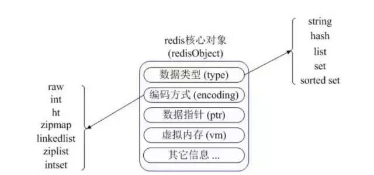

# 2.1.Redis

[TOC]
# 一 概述
## 1 简介
高性能键值对缓存数据库,单线程保证原子性操作，而且它的数据类型也比较多。由C语言编写。

应用场景：
1. 提供缓存服务，存储访问频率高的热数据防止穿透到数据库
2. 在分布式系统中可以作为实现分布式锁的一种实现方案
3. 其他
    1. 充当事件的触发器，注册操作后，订阅的消费机收到消费消息发送邮件给用户。一些电商平台需要发送邮件促销。
    2. 边缘流式计算，把耗费算力的任务分配到另外几台服务器上再指定回调
    3. 长连接
    4. 消息队列、task queue management
    5. session storage
    
### 1.1 特点
1. 效率高
    1. 它是纯内存数据库
2. 单进程单线程
    1. 线程安全
    2. 采用IO多路复用机制
3. 丰富的数据类型
4. 支持数据持久化：可以将内存中数据保存在磁盘中，重启时加载

## 3 常识

## 4 文档、网址
1. 首选官网,上面还有在线联系:[redis官网](https://redis.io/)
2. 阿里云redis开发规范

# 二 安装配置
## 1 win
## 2 linux
### 2.1 ubuntu
1. 安装
    安装之后redis.conf文件在`/etc/redis`
2. 启动服务端:`redis-server [可选的redis.conf绝对路径]`
3. 启动客户端:`redis-cli`

## 3 mac
1. 安装
    1. brew
2. 启动：To have launchd start redis now and restart at login:`brew services start redis`, Or, if you don't want/need a background service you can just run:`redis-server /usr/local/etc/redis.conf`

# 三 基础
## 1 架构
### 1.1 redis核心对象

Redis 内部使用一个 redisObject 对象来表示所有的 key 和 value。redisObject 最主要的信息如上图所示：type 表示一个 value 对象具体是何种数据类型，encoding 是不同数据类型在 Redis 内部的存储方式。比如，type=string 表示 value 存储的是一个普通字符串，那么 encoding 可以是 raw 或者 int。

## 2 运行
服务器启动：

服务器关闭：

客户端启动：

判断连通：

操作：
1. 存取键值
    1. set key value
    2. get key
2. 删除：del key
3. 查看所有key：keys *
4. 获取然后设置值：getset key value
5. 数值增减
    1. `incr key`:将key的value增加1，如果key不存在，则初始化其为0然后增加1；如果value不是integer类型，则返回错误。
        1. `incrby key num`
    2. `decr key`：类似上面...-1...
        1. `decr key num`
6. 字符串追加
    1. `append key string`：追加字符串，返回追加后字符串的长度，如果没有该key，则创建一个空字符串然后追加

## 3 数据类型
包含：字符串string，哈希hash、字符串列表list、无序字符串集合set、有序字符串集合sorted set

key定义注意点：
1. key不能太长，不能超过1024字节，也不要太短，保证可读性。最好有统一命名的规范

### 3.1 string
String 类型是二进制安全的，意思是 Redis 的 String 类型可以包含**任何数据**，比如 jpg 图片或者序列化的对象。String类型的value最大能存储512M的数据

### 3.2 hash哈希
哈希可以看成是string类型的key和stirng类型的value组成的map容器，底层结构是数组+链表的基础上，进行了一些rehash优化。特点是:
1. Reids的Hash采用链地址法来处理冲突，然后它没有使用红黑树优化。
2. 哈希表节点采用单链表结构。
3. rehash优化 （采用分而治之的思想，将庞大的迁移工作量划分到每一次CURD中，避免了服务繁忙）

适用场景:
1. 适合存储对象(结构体信息)，并且可以部分获取/部分更新这个对象而不用序列化对象的所有字段。

操作：
1. 存取：
    1. 设置单个key value：`hset myHashName key value`
    2. 设置多个key value：`hmset myHashName key1 value1`
    3. 获取单个key的value：`hget myHashName key`
    3. 获取多个key的value：`hget myHashName key1 key2`
    5. 获取hash的所有key value：`hgetall`
2. 删除
    1. 删除单个或多个，返回被删除的个数，如果不存在则返回0：hdel
    2. 删除整个hash：del
3. 增加减少
    1. hincrby
4. 判断指定key是否存在，存在则返回1，否则0：hexists myHashName key

### 3.3 list
它是按照插入顺序排序的链表。底层结构是一个双向链表，支持反向查找和遍历。

应用场景：List 应用场景非常多。
1. 比如 Twitter 的关注列表，粉丝列表都可以用 List 结构来实现。
2. 消息队列

操作：
1. `lrange`:获取列表片段

### 3.4 set
Set 是 String 类型的无序集合。集合是通过 hashtable 实现的。Set 中的元素是没有顺序的，而且是没有重复的.Set和List一样是一个列表，区别是Set是自动去重的，而且 Set 提供了判断某个成员是否在一个 Set 集合中。

使用场景：利用唯一性的场景。

### 3.5 Zset(sorted set)
Zset 和 Set 一样是 String 类型元素的集合，且不允许重复的元素。它通过用户额外提供的一个score(优先级，权重)参数来为成员排序，并且是插入有序的，即自动排序。

底层结构：使用HashMap和跳跃表（skipList）来保证数据的存储和有序，HashMap 里放的是成员到 Score 的映射。而跳跃表里存放的是所有的成员，排序依据是 HashMap 里存的 Score，使用跳跃表的结构可以获得比较高的查找效率，并且在实现上比较简单。

关于score参数：它是Double类型，Redis正是通过它来为集合中的成员进行从小到大的排序。

使用场景：当你需要一个有序的并且不重复的集合列表，那么可以选择 Sorted Set 结构。
1. 带权重的消息队列

## 4 缓存
### 4.1 缓存穿透

### 4.2 缓存击穿
频繁请求查询系统中不存在的数据导致

解决方法：
1. cache null策略，查询反馈结果为null仍然缓存这个null结果，设置不超过5分钟过期时间
2. 布隆过滤器，所有可能存在的数据映射到足够大的bitmap中 
    1. google布隆过滤器：基于内存，重启失效不支持大数据量，无法在分布式场景
    2. redis布隆过滤器：可扩展性，不存在重启失效问题，需要网络io，性能低于google

### 4.3 缓存雪崩
同一时刻大量缓存失效

解决办法:
1. 缓存数据增加过期标记
2. 设置不同的缓存失效时间
3. 双层缓存策略C1为短期，C2为长期
4. 定时更新策略

### 4.4 缓存淘汰策略
1. 先进先出算法（FIFO）
2. 最近使用最少Least Frequently Used（LFU）
3. 最长时间未被使用的Least Recently Used（LRU）：当存在热点数据时，LRU的效率很好，但偶发性的、周期性的批量操作会导致LRU命中率急剧下降，缓存污染情况比较严重

### 4.5 缓存一致性

## 5 redis过期key删除策略
1. 惰性删除，cpu友好，但是浪费cpu资源
2. 定时删除（不常用）
3. 定期删除，cpu友好，节省空间

# 四 高级
## 1 redis cron

# 五 经验
1. 如果设置了最大使用的内存，则数据已有记录数达到内存限值后不能继续插入新值。

# 六 问题
reids-server

redis-cli

redis-benchmark

redis-conf

1. http://blog.csdn.net/qq_30242609/article/details/52913145
