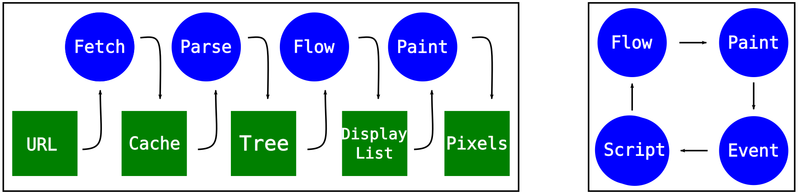

# 2.W3C规范

# 一 概述
主要记录W3C规范里面的内容,包括Web APIs等.

才开始写前端的时候基本都是学的语法,然后按照语法和逻辑写一些东西出来,但是背后的一些原理什么的自己却未必清楚,一直都有个想法想把底层的原理和规范弄明白,最后促成我做这个笔记的原因是百度路书动画的问题.于是想从W3C动画的规范开始入手,将用到的相关知识记录一下,想搞好前端,平时多逛逛W3C也是很有必要的.

## 1 简介

## 3 常识

## 5 网址
1. W3C中国:http://www.chinaw3c.org/

# 三 基础

## 1 浏览器内核
参考:
1. https://www.cnblogs.com/cangqinglang/p/8963557.html
2. http://imweb.io/topic/58e3bfa845e5c13468f567d5


简单来说浏览器内核是通过取得页面内容、整理信息（应用CSS）、计算和组合最终输出可视化的图像结果，通常也被称为渲染引擎。从上面我们可以知道，Chrome浏览器为每个tab页面单独启用进程，因此每个tab网页都有由其独立的渲染引擎实例。

GUI 渲染线程 与 JavaScript引擎线程互斥！


## 2 浏览器渲染流程




参考：[浏览器渲染和firefox新css引擎介绍](https://hacks.mozilla.org/2017/08/inside-a-super-fast-css-engine-quantum-css-aka-stylo)

主要流程：
1. Parse：Parse the files into objects the browser can understand, including the DOM. At this point, the DOM knows about the structure of the page. It knows about parent/child relationships between elements. It doesn’t know what those elements should look like, though.
2. Style：Figure out what the elements should look like. For each DOM node, the CSS engine figures out which CSS rules apply. Then it figures out values for each CSS property for that DOM node.
3. Layout：Figure out dimensions for each node and where it goes on the screen. Boxes are created for each thing that will show up on the screen. The boxes don’t just represent DOM nodes… you will also have boxes for things inside the DOM nodes, like lines of text.
4. Paint：Paint the different boxes. This can happen on multiple layers. I think of this like old-time hand drawn animation, with onionskin layers of paper. That makes it possible to just change one layer without having to repaint things on other layers.
5. COMPOSITE & RENDER:Take those different painted layers, apply any compositor-only properties like transforms, and turn them into one image. This is basically like taking a picture of the layers stacked together. This image will then be rendered on the screen.

细节：
1. If the CSS engine held on to a value for each property for each DOM node, it would soon run out of memory. Instead, engines usually do something called style struct sharing. They store data that usually goes together (like font properties) in a different object called a style struct. Then, instead of having all of the properties in the same object, the computed styles object just has pointers. For each category, there’s a pointer to the style struct that has the right values for this DOM node. This ends up saving both memory and time. Nodes that have similar properties (like siblings) can just point to the same structs for the properties they share. And because many properties are inherited, an ancestor can share a struct with any descendants that don’t specify their own overrides.

## 3 浏览器支持的协议
常见的如下

### 3.1 FTP(文件传输协议)
参考：
1. https://datatracker.ietf.org/doc/html/rfc959
1. http://www.nsftools.com/tips/RawFTP.htm#
3. https://en.wikipedia.org/wiki/List_of_FTP_commands

常见命令：
1. `LIST`和`NLST`
    1. 概述
        1. 因为ftp标准没有规定返回的目录格式，所以不同的FTP服务器对`LIST`和`NLST`的响应文件信息列表的内容和格式不一样，客户端在对返回的文件信息列表进行处理时，一般需要先判断格式。此不一致使`LIST`和`NLST`实用性大大降低
    2. 详细
        1. `LIST`：用于列出指定目录中的子目录和文件信息，如果没有指定目录的名字就默认列出当前目录下的所有子目录和文件信息并返回给客户端。
            1. 如果路径名指定的是一个目录名，大学多服务器会发送一份指定目录中的子目录和文件列表信息，而不是关于目录的信息
            2. 如果路径名指定的是一个文件，服务器会发送该文件的相关信息
        2. `NLST`：不同服务器对该命令响应不一样，一些FTP服务器在对NLST的响应中只列出实际的文件，不包括目录和符号链接
3. `PORT`
4. `PASV`
6. `RETR remote-filename`：从远程主机传输文件
    
    ```ftp
    RETR one/two/three/file.txt
    ```
    
7. `STOR remote-filename`：传输文件到远程主机

经验
1. 使用图像/二进制数据类型传输文件通常是最安全和最有效的.这不是默认设置,某些FTP命令(例如目录列表)需要将其设置为ASCII,因此请确保始终在传输之前进行设置.
2. 流模式最常用,但块模式支持恢复中断传输,压缩模式不太重要

### 3.2 HTTPS

### 3.3 File（本地文件传输协议）
基本的格式如下：file:///文件路径，比如要打开F盘flash文件夹中的1.swf文件，那么可以在资源管理器或IE地址栏中键入：file:///f:/flash/1.swf并回车

### 3.4 Mailto(电子邮件协议)

### 3.5 tel(电话协议)

## 4 动画

# 六 问题

# 七 未整理
2. 动画规范:https://www.w3.org/TR/web-animations-1/
2. 与setTimeout和setInterval不同，requestAnimationFrame
3. 自定义web component,有空再研究吧:https://developer.mozilla.org/zh-CN/docs/Web/Web_Components
    1. 自定义shadow DOM:https://developer.mozilla.org/zh-CN/docs/Web/Web_Components/Using_shadow_DOM