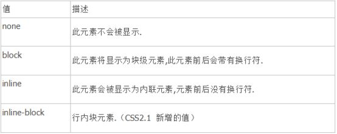
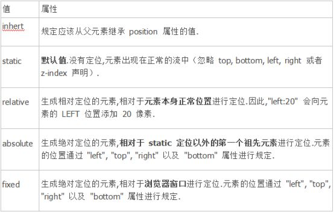

# 2.css
# 一 概述
## 1 简介
CSS(Cascading Style Sheets)即层叠样式表,主要作用是网页的布局和样式

一般来讲,CSS不算编程语言(手动微笑)

### 1.3 他人评价


## 2 历史
## 3 常识
### 3.1 CSS引入方式
有三种:内联,嵌入和外联.最佳实践是使用外联.

#### 内联CSS(也可称为行内CSS或者行级CSS或内联样式表)
简单使用如:`<div style="width: 65px;height: 20px;border: 1px solid;">测试元素</div>`,最佳实践是css和html在不同的文件中,所以该用法一般是测试时使用和临时使用

优点:简单方便

缺点:样式不能重用,不支持多级的写法

#### 嵌入(也成为页级CSS或内部样式表)
仅作用于本页面的元素,简单使用如,
```html
<head>
   <meta charset="utf-8" />
   <title>测试</title>
   <style type="text/css">
       div {
           width: 65px;
            ...
       }
   </style>
</head>
```

缺点:可维护性较差

#### 外联(也成为外部CSS或外部样式表)
是我们最常使用的方式.它只在页面中使用link或者@import引入即可，可维护性好；并且外联CSS是一个单独的文件，可以作用于多个页面.引入方式有两种:
- 使用link:`<link rel="stylesheet" type="text/css" href="*.css" />`,`href`是css文件的路径,link的作用主要用来引入CSS和网页图标，指示告知搜索引擎，网页之间的关系等
- 使用@import:`<style>@import url("*.css");</style>`　　　
    - @import语法格式务必写在style标签中，后直接加文件路径即可。
    - @import作用在CSS文件和页面中，可以在一个CSS文件中引入其他的CSS文件，例如在index.css文件中引入其他CSS文件的样式，整合在一起后，再在index.html中调用一次即可，在实际项目中经常使用，方便管理和维护

两者的加载区别:link是一边加载一边优化,视觉感受较好;而@import是先加载数据后加载样式,网速不好时可能导致数据出来了但样式一点点的出来.在项目中使用的时候，一般在页面中调用方式为link，并且放在head标签中；使用@import除了在CSS文件中，在页面调用时，一般加载第三方的样式会使用到，并且需要放置在页面的底部，不会影响自己的网站。

### 3.2 在js中操作css时css名字写法
按照[规定](https://developer.mozilla.org/en-US/docs/Web/CSS/CSS_Properties_Reference)要写成小驼峰的形式,比如`font-size`属性要写成`fontSize`

### 3.3 CSS in JS
就是JS来操作CSS.网友维护了一份完整的[CSS in JS 技术方案对比](https://github.com/MicheleBertoli/css-in-js).

各种方案目前比较常见的解决方案有:
- SASS,LESS,PostCSS(这三个是以前的解决方案,不属于CSS in JS)
- CSS Modules

    功能很单纯，只加入了局部作用域和模块依赖，这恰恰是网页组件最急需的功能.总结就是:易学，规则少，有用.教程见:[http://www.ruanyifeng.com/blog/2016/06/css_modules.html](http://www.ruanyifeng.com/blog/2016/06/css_modules.html)(待学习)


- Styled-Components

各种方案都有自己的优缺点,需要结合使用场景来选择,没有银弹.

### 3.4 简写属性(ShortHand Properties)
将同一主题的常见属性的定义集中在一起.比如 CSS 的 background 属性就是一个简写属性，它可以定义 background-color、background-image、background-repeat 和 background-position 的值.

具体和注意细节参考:[https://developer.mozilla.org/zh-CN/docs/Web/CSS/Shorthand_properties](https://developer.mozilla.org/zh-CN/docs/Web/CSS/Shorthand_properties).

## 4 文档
## 5 网站
1. 方便查询,示例生动:[http://www.css88.com/book/css/](http://www.css88.com/book/css/)
2. 慕课网张鑫旭:[http://www.imooc.com/u/197450](http://www.imooc.com/u/197450)
# 三 基础
## 1 常用属性
### 1.1 颜色和背景颜色使用color和background-color

### 1.2 字体
字体系列:字体要在用户计算机上存在才会生效,最常用的是Arial，Verdana和Times New Roman.可以指定多个字体，用逗号分隔,浏览器会依次查找,直到找到为止.如果一个字体的名字不只一个单词，则应该用引号括起来，比如font-family: "Times New Roman"

字体大小:`font-size`:优先级比`h`标签的默认size高

字体重量:`font-weight`,文字是否粗体,常用值是`bold`或`normal`

字体样式:`font-style`,文本是否是斜体。常用值`italic`或`normal`

文字修饰:`text-decoration`,文本是否存在一行或一行的位置(上中下),比如值`underline`就表示文字下面会有一行,也就是我们平时看到的超链接的一行

文本转换:`text-transform`将改变case of the text.值`capitalize`将每个单词的第一个字母变成大写,`uppercase`将所有内容都变成大写...

文字间距
- `letter-spacing`和`word-spacing`:设置字母或单词之间的间隔,值可以是一个长度或`normal`
- `line-height`:设置元素（如段落）中行的高度，而不调整字体的大小
- `text-align`:元素内的文本对齐方式左侧，右侧，中间或左右侧对齐。

### 1.3 边距和填充(Margins and Padding)
shorthand properties的顺序是上右下左,即从top开始沿顺时针方向,写法形如`margin: 1px 5px 10px 20px;`;如果只有两个值,则第一个值表示上下,第二个值表示左右,如`padding: 1em 10em;`

### 1.4 盒子模型(The Box Model)(重点)
分为标准W3C盒子模型和IE盒子模型,对于ie盒子模型简单了解就行了,重点是标准W3C盒子模型.

盒子模型可以作用于每一个元素
#### 标准W3C盒子模型
#### IE盒子模型

### 1.5 边框border
创建边框:`border-style`,似乎只要给该属性设置了特定值中的一个,就相当于给元素创建了边框.(待补充)

边框的宽度:`border-width`

边框颜色:`border-color`

### 1.6 span和div
相比html中有意义的标签,这两个标签是无意义的(meaningless),但是这两个标签和css的结合使用相当广泛.

最佳实践:优先使用有意义的标签.

### 1.7 display(重点)


### 1.1 transition
元素首次渲染的时候不会触发该效果,后面变化的时候才会触发.

### 1.2 animation
### 1.3 cursor
设置鼠标显示形状
1. 常用值
    1. `default`:默认,通常是箭头
    2. `auto`:跟随浏览器的设置
    3. `pointer`:指示链接的一只手
    4. `text`:指示文本
    5. `wait`:指示程序正忙（通常是一只表或沙漏）
    6. `not-allowed`:禁止

### 1.4 指针事件pointer-events(css3)
是一个与js有关的属性，`pointer-events`直译为指针事件.

常见的使用场景是:对网站上用canvas绘制的雨、雪花等悬浮物使用该属性,这样鼠标就可以点击穿透,防止它们遮挡住页面下真正需要被点击的按钮;或者在地图上的浮动层,不能挡住下面选择地图.

常用值:
- `none`:
    - 阻止用户的点击动作产生任何效果
    - 阻止缺省鼠标指针的显示
    - 阻止CSS里的hover和active状态的变化触发事件
    - 阻止JavaScript点击动作触发的事件

### 1.5 换行
实测对width属性对span标签没有效果,对p标签有效.
#### word-break
指定了怎样在单词内断行,适用于所有元素,注意浏览器会将所有连着的(比如`12345678456abdsafdsfafd12saf3d1f456`,`我是中国人啊的接口里苏菲我看了你看我欧式`等)都看成是一个单词.有几个主要值:
- `normal`:使用浏览器默认换行规则,本人在chrome下测试是:
    
    首先换行会被看作空格;对于英文,当前行如果一个单词都放不完,则该单词不会换行,当前行如果有多个单词,放不下的单词会移到下一行;对于中日韩文(CJK),显示不下的时候才换行;
- `break-all`:和normal的区别:(对于英文)当前行如果有多个单词,放不下的单词会被换行
- `break-word`:和normal的区别:(对于英文)当前行如果一个单词都放不完,则该单词会换行
- `keep-all`:和normal的区别:(对于CJK)当前行如果一个单词都放不完,则该单词不会换行
#### white-space
设置如何处理元素内的空白(这里的空白指的空格和回车).几个主要值:
- `normal`:待整理
- `nowrap`:文本不会换行，文本会在在同一行上继续，直到遇到`<br>`标签为止.优先级比`word-break`高(即和`word-break`冲突时,`word-break`会被忽略).
- `pre`;空白会被浏览器保留。其行为方式类似 HTML 中的`<pre>`标签(意思是回车就会被解析成换行符而不是空格了,多个空格就是多个空格等)。

## 2 网页布局
CSS有三种基本的定位机制:普通流,绝对定位和浮动.
### 2.1 普通流
1. 默认
2. 相对

### 2.2 绝对定位
1. 绝对定位的元素的位置是相对于距离他最近的非static祖先元素位置决定的,不会占据文档流,所以绝对定位的元素可以覆盖页面上的其他元素,可以通过z-index属性控制叠放顺序,z-index越高,元素位置越靠上.(`position : absolute`)
2. 固定定位

    是绝对定位的一种.固定定位的元素也不包含在普通文档流中,差异是该元素的包含块儿是视口(viewport).(`position : fixed`)

### 2.3 浮动
浮动的框可以左右移动（根据float属性值而定）,直到它的外边缘碰到包含框或者另一个浮动元素的框的边缘.浮动元素不在文档的普通流中,文档的普通流中的元素表现的就像浮动元素不存在一样.(`float: left / float: right`)

### 2.4 Flex布局(Flexible Box,弹性布局)
用于一维布局

参考链接,基础看这篇就够了:[Flex 布局教程：语法篇](http://www.ruanyifeng.com/blog/2015/07/flex-grammar.html)

布局的传统解决方案，基于盒状模型，依赖 display 属性 + position属性 + float属性。它对于那些特殊布局非常不方便，比如，垂直居中就不容易实现。

任何一个容器都可以指定为flex布局`display: flex`,行内元素使用`display: inline-flex`.设置为 Flex 布局以后，子元素的float、clear和vertical-align属性将失效。

#### 容器(flex container)
#### 项目(flex item)

### 2.5 Grid布局
用于二维布局


### 2.5 position

1. `none`和''一样吗?
2. `inline-block`

    该属性值是CSS2.1新加值,IE8以上及其他主流浏览器都已经支持,它可以使元素像行内元素那样水平一次排列,但是框的内容符合块级元素行为,能够显示设置宽,高,内外边距.很有意思.
3. 可以通过不同的赋值改变元素生成框的类型,也就是说,通过将display属性设置为block,可以使行内元素表现的像块级元素一样,反之亦然.

### 2.6 position元素定位


## 3 css选择器(重点)
有五种使用方法:Basic selectors,Attribute selectors,Pseudo-classes和Combinators

注意除了Basic selectors,其他可能有兼容性问题,需要测试了再用.
### 3.1 Basic selectors
包括四种:类型(type),class,ID和星号选择器
type:用元素的标签来选择,如`p {xxx}`

class:class用于选择一个或多个元素,以`.`开头,形如`.intro {xxx:xxx}`,需要元素设置了class属性,如`class="xxx"`;也可以写成`<元素名>.<class名>`,如`p.jam {xxx}`,对带有`class="jam"`的p生效.

ID:ID用于选择一个元素,以`#`开头,形如`#top {xxx:xxx}`,需要元素设置了id属性,如`id="xxx"`

*:表示对所有元素生效

### 3.2 Attribute selectors(属性选择器)
最简单的形如`[attribute]`,其他的具体参考css选择器资料.

### 3.3 Pseudo-classes(伪类选择器)
写法是`:xxx`,如`:hover {xxx}`,光标移进去生效

### 3.4 Pseudo-elements(伪元素)
写法是`::xxx`,如`::first-line`,对第一行文本生效.

### 3.5 Combinators(连接符)
有四种:Descendant,Child,Adjacent sibling和General sibling

Descendant:`selector selector`,如`div p {xxx}`,表示对div里的所有p生效

Child:`selector > selector`,如`.warning > p {xxx}`

Adjacent sibling:`selector + selector`,对紧挨着且拥有同一父级的元素生效,如`div + p`
```html
<p>Paragraph 0. Not in a div.</p>
<div>
  <p>Paragraph 1 in the div.</p>
  <p>Paragraph 2 in the div.</p>
</div>
<p>Paragraph 3. Not in a div.</p>
<p>Paragraph 4. Not in a div.</p>
```
则只对Paragraph 3.那段生效.

General sibling:`selector ~ selector`,同样是上面那个例子,如果有`div ~ p`则对para 3和4都生效.

注意:Descendant和Child的区别,引用stackoverflow的回答就是Child对儿子生效,但是Descendant对孙子也生效.

### 3.6 分组和嵌套(Grouping and Nesting)
分组:`selector1, selector2, ... {xxx}`,可以将相同的属性赋予多个选择器，而无需重复它们,以逗号隔开,形如`h2, .thisOtherClass, .yetAnotherClass {xxx}`

嵌套:如果CSS结构良好，则不需要使用许多类或ID选择器。这是因为你可以到指定选择属性内其他选择,如
```css
#top {
    background-color: #ccc;
    padding: 1em
}

#top h1 {
    color: #ff0;
}

#top p {
    color: red;
    font-weight: bold;
}
```

## 4 盒子模型

## 5 CSS伪元素(Pseudo-elements)
几乎每个div都带有一个pseudo的属性

# 四 高级
## 1 精灵图
图像精灵是放入一张单独的图片中的一系列图像,包含大量图像的网页需要更长时间来下载，同时会生成多个服务器请求。使用图像精灵将减少服务器请求数量并节约带宽。

### 1.1 精灵图和图标字体异同
同:能够缩小源文件的体积，减少http的请求，提高页面的性能

异:图标字体具有矢量效果，放大缩小不失真，而且可以使用CSS任意更改图标字体的颜色；而精灵图的大小固定，放大缩小会失真，更改图片颜色时需要重新修改精灵图。

## css/sass/less 文件中的 @import 语句(待整理)
    
# 五 经验
1. 网友:抄网站,确实是一个学习CSS,学习前端的好方法.

# 六 问题
## 1 已解决
### 1.1 background相关属性
之前一直分不清楚background-color,background-image和background等几个属性的区别和用法,最后才发现`background`是一个速记属性,依次为:

`background-color`:不解释,默认值是transparent

`background-image`:图像的位置,形如`url(http://www.htmldog.com/images/bg.gif)`

`background-repeat`:图像如何重复,值可以是：
- `repeat`:相当于"tile"效果,意思就是贴瓷砖一样一片片的重复
- `repeat-y`:在Y轴上方和下方重复，
- `repeat-x`:在x轴上并排重复
- `no-repeat`:仅显示图像的一个实例。

注意除了`no-repeat`,其他的值会导致背景图片重复到元素的边框.也就是到border才开始裁剪.css3可以用两个值代替一个值,第一个值代表水平,第二个值代表垂直.还新增了两个值:

- `space`:背景图在水平和垂直方向平铺且不裁剪.两端对齐，中间填补空白，背景图大小不变 (这里应该注意 不裁剪,两端对齐)
- `round`:将背景图在水平和垂直方向平铺且不裁剪.但是背景图片可能被拉伸或缩短 (注意 不裁剪, 可以伸缩,有可能拉伸).

以上两个遵循四舍五入的原则.

`background-attachment`:图像是否随页面滚动,主要有两个值:
- `fixed`:固定
- `scroll`:滚动

`background-position`:其可以是top，center，bottom，left，right，长度，百分比，或任何合理的组合，例如top right。css3中支持设置四个值:第一个值是水平位置,可以为`left`or`right`,第二个值就是长度or百分比,正数表示向内移动的距离,负数向外;同理可推第三四个值.意味着图片的定位更加方便了,同时负值能将图片定位到元素content区域外面.

css3还新增了三个属性:

`background-origin`:指定背景图片定位在哪个盒子中.注意默认情况下图片的位置是content-box的左上角.
- `content`
- `padding`:(默认值)
- `border`

`background-clip`:背景图片裁剪位置,默认是border

`background-size`:背景图片大小

css3支持的多背景图片:可以给上面的除了background-color外的其他属性设置多个值,多个值之间用逗号分隔,用于设置多个背景图片的值.图片一在第一层,图片二在第二层,第一层可以覆盖第二层,以此类推.background-color只能设置在最底层,最佳实践是单独声明.如
```css
.backgrounds{
    background-image:url(../image/border.png), url(../image/border.png), url(../image/border.png);
    background-position:-54px top, -54px -54px, -54px 133px;
    background-repeat:repeat-y, repeat-x, repeat-x;
    background-color:yellow;
}
```

该简写的初始值等详细信息参考网友的文章:http://www.zhangxinxu.com/wordpress/2011/05/%E7%BF%BB%E8%AF%91-css3-backgrounds%E7%9B%B8%E5%85%B3%E4%BB%8B%E7%BB%8D/

### 1.2 Specificity(特异性)
常见的有两种情况:选择器相同,更具体

选择器相同时:下面的生效,如果对相同属性设置了不同的值,则下面的会生效;如果是简写属性,下面的简写属性会覆盖上面的,而且注意下面的简写属性中未显式声明的默认值会覆盖上面已经显式声明的属性值.比如上面的`background`设置了背景图片的位置,但是下面的没有指明,则下面的会覆盖上面的,导致没有背景图片.

更具体:更具体的会生效.比如有
```css
div p { color: red }
p { color: blue }
```

则最后会变成红色,因为更具体.

对于更复杂的情况,css有一套计算标准,会根据特异性的值来计算冲突时的优先级,具体计算方法见:http://www.htmldog.com/guides/css/intermediate/specificity/


## 2 未解决
1. mdn的css入门教程:[https://developer.mozilla.org/zh-CN/docs/Web/Guide/CSS/Getting_Started](https://developer.mozilla.org/zh-CN/docs/Web/Guide/CSS/Getting_Started)
2. [https://www.zhihu.com/question/19749045/answer/30418091](https://www.zhihu.com/question/19749045/answer/30418091)
3. 相邻选择器及其他:[https://www.cnblogs.com/libin-1/p/5879477.html](https://www.cnblogs.com/libin-1/p/5879477.html)
4. css格式化
5. 文字包围图片
6. 如何将普通图片转成svg
7. 谷歌搜图查询来源
8. 现在做一个普通网站用什么比较好
9. sass,less,css in js,postcss
10. rem的计算:[http://blog.csdn.net/jyy_12/article/details/42557241](http://blog.csdn.net/jyy_12/article/details/42557241)
11. [http://www.cnblogs.com/dolphinX/archive/2012/10/13/2722501.html](http://www.cnblogs.com/dolphinX/archive/2012/10/13/2722501.html)
13. mdn盒子模型中说的什么是替换和非替换
14. button中有背景图片,有文字和无文字的样式差距很大?
15. 什么是内联样式
16. width和height受margin和padding影响
17. 有多少种color,使用方法和环境.
18. p等的换行
19. 父子元素设置同一个属性,子级的优先级更高?
20. 内联式,嵌入式,外部式
21. 父元素高度由子元素决定,怎么整
22. 熟悉各种元素的特性
    1. 比如table中td的高和ul中li的高变化时的区别
23. 自动换行可能能参考的网页:[http://www.blueidea.com/tech/web/2006/3469.asp](http://www.blueidea.com/tech/web/2006/3469.asp)

# 七 待整理
1. `line-height`:行高
2.     格式化css的程序
3. css预处理器? 
4. vw如何?
5. 待整理:https://www.cnblogs.com/PeunZhang/p/3289493.html

6. 修改button的时候字移到button外面了.