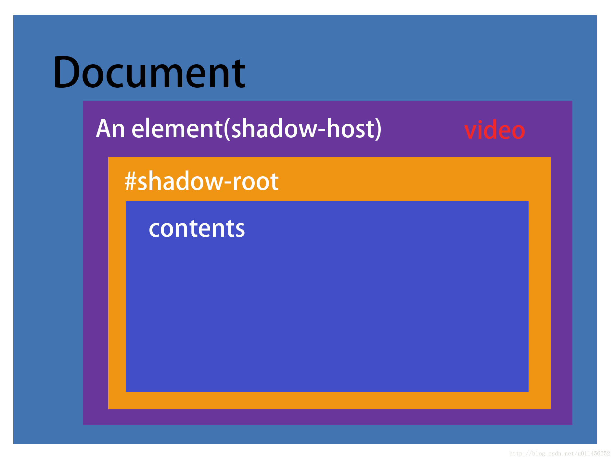

# 3.dom
## 一 概述
1. DOM是文档对象模型，**中立于语言和平台的接口**；HTML DOM 是针对 HTML 的文档对象模型(平时网页中用得最多的就是html dom了)；W3C 文档对象模型（DOM）是一个中立于语言和平台的接口，它允许程序和脚本动态地访问和更新文档的内容、结构以及样式；是W3C组织推荐的处理可扩展标志语言的标准编程接口
2. 目前，支持 DOM 已经成为浏览器开发商的首要目标

### 1 简介
#### 1.1 什么是dom
1. 什么是 document 节点？ Html 文件里没这个标签啊？整个 Html 文件就是 document 节点
2. DOM的设计是以对象管理组织（OMG）的规约为基础的，因此可以用于任何编程语言。即使不用 Javascript，也可以使用诸如 Java(比如jsoup)、VBScript等来操作DOM。
    1. jsoup参考:[http://blog.csdn.net/lmj623565791/article/details/23866427/](http://blog.csdn.net/lmj623565791/article/details/23866427/)
3. DOM 是一颗树，树枝和树叶都做了编号，你告诉一个脚本，一个函数去寻找哪一个枝干的哪一个叶子，对这个叶子做什么改变

### 2 历史
### 3 常识
#### 1.1 关于标记语言(Markup Language)的分类
在介绍dom之前，有必要先了解一下标记语言(也称置标语言、标记语言、标志语言、标识语言)
1. 标记语言
    1. 标识性置标语言（Presentational markup）
    2. 过程性置标语言 (Procedural markup)
    3. 描述性的标记,也称通用标识，所描述的是文件的内容或结构，而不是文件的显示外观或样式，制定SGML的基本思想就是把文档的内容与样式分开，XML、SGML都是典型的通用标识语言。
        1. 标准通用标记语言(Standard Generalized Markup language,SGML),强大但很复杂
            1. 超文本标记语言（标准通用标记语言下的一个应用、外语缩写：HTML）,是为网页创建和其它可在网页浏览器中看到的信息设计的一种标记语言。
            2. 可扩展标记语言（标准通用标记语言下的一个子集、外语缩写：XML），又称可扩展置标语言，是一种标记语言。置标指电脑所能理解的信息符号，通过此种标记，电脑之间可以处理包含各种信息的文章等，具备标准通用标记语言的核心特性，但简洁，他的内容甚至不到标准通用标记语言的十分之一.
                1. XHTML可延伸超文件标记语言（外语全称：Extensible HyperText Markup Language、外语缩写：XHTML），基于可扩展标记语言，表现方式与超文本标记语言类似，不过语法上更加严格。但有些浏览器不支持.
#### 1.2 html不属于可扩展标记语言，为什么有html-dom
由于HTML与XML的相似性及差异，W3C不仅实现了标准的DOM方法和属性，还实现了HTML/XHTML特有的DOM方法和属性，前者称为DOM Core，后者称为HTML-DOM。  

#### 1.3 关于dom的分类
1. 《简单易懂的JQuery魔法》:一般来说，DOM操作分为3个方面，即DOM Core（核心）、HTML-DOM和CSS-DOM(?)

#### 1.4 dom和bom的区别
DOM 是为了操作文档出现的 API，document 是其的一个对象；
BOM 是为了操作浏览器出现的 API，window 是其的一个对象

#### 1.5 关于dom的分级
1. DOM0级

    在dom的统一标准出现之前,人们把实验性质的初级dom称为dom0级,此时dom的常见术语是`images`和`forms`等,主要用于翻转图片和表单验证.

由于Netscape和微软在开发DHTML方面各抒己见,为了防止这两位老铁两强割据导致浏览器互不兼容,W3C开始着手规划DOM.
1. 在1998年10月,W3C发布了DOM一级(DOM Level 1)规范,由两个模块组成:
    - DOM 核心(DOM Core):规定的是如何映射基于 XML 的文档结构，以便 简化对文档中任意部分的访问和操作。
    - DOM HTML:在 DOM 核心的基础上加以扩展，添加了针 对 HTML 的对象和方法。
    这个规范允许访问和操作 HTML 页面中的每一个单独的元素。所有的浏览器都执行了这个标准
2. DOM2 级在 原来 DOM 的基础上又扩充了(DHTML 一直都支持的)鼠标和用户界面事件、范围、遍历(迭代 DOM 文档的方法)等细分模块，而且通过对象接口增加了对 CSS(Cascading Style Sheets，层叠样式表)的 支持。DOM1 级中的 DOM 核心模块也经过扩展开始支持 XML 命名空间。DOM2 级引入了下列新模块，也给出了众多新类型和新接口的定义。
    - DOM 视图(DOM Views):定义了跟踪不同文档(例如，应用 CSS 之前和之后的文档)视图的接口;
    - DOM 事件(DOM Events):定义了事件和事件处理的接口;
    - DOM 样式(DOM Style):定义了基于 CSS 为元素应用样式的接口;
    - DOM 遍历和范围(DOM Traversal and Range):定义了遍历和操作文档树的接口。
3. DOM3 级

    DOM3 级则进一步扩展了 DOM，引入了以统一方式加载和保存文档的方法——在 DOM 加载和保 存(DOM Load and Save)模块中定义;新增了验证文档的方法——在 DOM 验证(DOM Validation)模

## 二 安装配置
## 三 基础
### 1 dom常用对象
#### window
所有浏览器都支持 window对象。它表示浏览器窗口。
所有js全局对象、函数以及变量都是window对象的成员。甚至HTML DOM的document 也是window对象的属性之一
1. 关于Window和window

    官网的说法是windowh和self是对Window本身的引用,但知乎网友的回答应该准确:Window是接口，window是实例而且是单实例，全局变量是window的属性。
1. 关于window尺寸

    浏览器窗口的尺寸不包括工具栏和滚动条.有三种方法可以获取:
    1. 对于IE9和其他大部分browser:
        - window.innerHeight - 浏览器窗口的内部高度
        - window.innerWidth - 浏览器窗口的内部宽度
    2. 对于Internet Explorer 8、7、6、5：
        - document.documentElement.clientHeight
        - document.documentElement.clientWidth
    3. 其他:
        - document.body.clientHeight
        - document.body.clientWidth
    4. 所有最佳实践如下,
        ```javascript
        var w=window.innerWidth
        || document.documentElement.clientWidth
        || document.body.clientWidth;
        ```
3. 常用属性
    1. console

        用于向浏览器控制台输出,它的方法应该主要用于调试, 而不是显示给用户.打印单个对象时,直接输出对象的字符形式;打印多个对象时类似c的printf风格.也接受字符串拼接.google develop tools中可以打印样式甚至图片.常用方法如下,
        1. log()
        2. info()
        3. warn()
        4. error()
        5. time()和timeEnd():一般都是两个一起使用,前者启动计时器,后者以毫秒为单位输出计时器经过的时间.
        想为打印的输出增加样式,使用`console.log("%c需要输出的信息 ", "css 代码")`,如
        ```javascript
        console.log("%cMy stylish message", "color: red; font-style: italic");
        ```
2. 常用方法
    1. window.open() - 打开新窗口
    2. window.close() - 关闭当前窗口
    3. window.moveTo() - 移动当前窗口
    4. window.resizeTo() - 调整当前窗口的尺寸
    5. `setTimeout(code,millisec)`:指定时间后调用函数

        (event loop,待补充)
    6. `setInterval(code,millisec)`:周期调用函数,返回id,取消则用`clearTimeout(id)`

3. 关于window.location和window.open：前者可以当字符串使用，

### 2 常用属性
1. `className`:获取或设置`className`属性

### 3 常用方法
#### 访问元素
1. getElementById()
2. getElementsByTagName()
3. getElementsByClassName()

### 4 事件
#### click,touch和tap
1. click

    pc和mobile通用,但是在移动端会有300ms的延迟

### 5 ShadowDOM
#### 5.1 意义及用法
比如一个`video`标签,实际上由上面的播放器和下面工具条等组成的,但是在正常情况下我们只能看到该标签.实际上,开启shadow DOM之后就可以看见`video`标签周围还有很多的div等,这些都是浏览器封装过的,方便我们调用.

shadow DOM不受外界定义的 CSS类影响(但是好像受所在宿主类的伪类css影响?),因此我们可以利用 Shadow DOM 来封装我们自定义的 HTML 标签、CSS 样式和 JavaScript 代码.
想访问shadow DOM,可以类似这样`document.querySelector(‘#div’).shadowRoot.querySelector(‘#name’).innerHTML`

## 四 高级
### 1 BOM
#### 1.1 什么是bom
1. Browser Object Model，浏览器对象模型,是为了控制浏览器的行为而出现的接口。比如跳转到另一个页面、前进、后退等等，程序还可能需要获取屏幕的大小之类的参数。
2. 关于bom的标准：

    它作为 JavaScript 实现 的一部分但却没有相关的标准。每个浏览器都有其自己对BOM的实现方式。BOM有窗口对象(window)、导航对象(navigator)等一些实际上已经默认的标准，但对于这些对象和其它一些对象，每个浏览器都定义了自己的属性和方式(所以夸浏览器的时候不能轻易使用？),这个问题在 HTML5 中得到了解决，HTML5 致力于把很多 BOM 功能写 入正式规范。
2. 用法参见js的window

### 1.2 location
1. 比如我们要让浏览器跳转到另一个页面，只需要`location.href = "http://www.xxxx.com";`
### 1.3 window
1. window 也是 BOM 的一个对象，通过这个对象可以获取窗口位置、确定窗口大小、弹出对话框等等。例如我要关闭当前窗口：`window.close();`


## 六 问题
1. 一个浏览器窗口中可能有多个 document，例如，通过 iframe 加载的页面，每一个都是一个 document。（？）
2. 如何引入bom和dom，ts自动就引入了？还是dom自带有bom？
3. 关于dom的分级
4. dhtml

5. 关于点击穿透,touch等:[https://segmentfault.com/a/1190000003848737](https://segmentfault.com/a/1190000003848737)