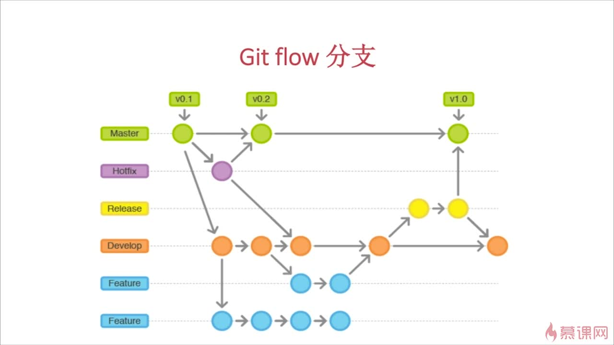

# git
[TOC]
# 一 概述
git开源免费的分布式版本控制系统。除了版本,最核心的操作应该都是围绕分支进行的.

## 1 简介
git是linus用c写的

## 2 历史
### 2.1 为什么需要版本控制
在实际工作中，我们脑子里怎么可能记得一个几千行的文件每次都改了什么内容

## 3 常识
### 3.1 commit id（版本号）
就是commit信息里的那一长串数字,SHA1计算出来的一个非常大的数字，用十六进制表示。所以经常看到的sha1 hash、sha1 id和commit id是一个东西。

### 3.2 三棵树
官方参考资料:[https://git-scm.com/book/zh/v2/Git-%E5%B7%A5%E5%85%B7-%E9%87%8D%E7%BD%AE%E6%8F%AD%E5%AF%86#_git_reset](https://git-scm.com/book/zh/v2/Git-%E5%B7%A5%E5%85%B7-%E9%87%8D%E7%BD%AE%E6%8F%AD%E5%AF%86#_git_reset)

从git的官方中文book来看,三棵树是:
- 工作目录/工作区(Working Directory或work space)
- 暂存区(Index文件或Stage)
- HEAD(当前分支所在的commit).

### 3.3 git支持多种协议:https,git和ssh
git允许我们用ssh url或者http url来管理代码,两种不同的协议.如果是https,则默认每次都要输入密码,但可以使用git提供的credential helper来存储密码

### 3.4 凭证助手credential helper(待测试)
用于存储git的凭证,Git现在默认包含如下几个helper:
- Cache
    
    将凭据在内存中进行短时间的缓存,默认15分钟
    1. 使用`git config --global credential.helper cache`
    2. 参数`cache –timeout=[num]`:设置时间,如`git config credential.helper cache –timeout=3600`
- Store(待测试)
    
    将凭据保存在磁盘上,明文存储,所以不安全.
    1. 指定凭证助手:`git config --global credential.helper store`    
    2. 指定明文密码保存位置
        可以为不同项目指定不同的文件从而达到使用多账号的目的.
        1. `git config --global credential.helper store --file=~/cred.txt`,但是该命令似乎并不生效,可以通过修改config文件达到目的,

            ```
            [credential]
            helper = store --file=D:/credential/cred1.txt
            ```
            
            再次push，便会将账户信息存至`D:/credential/cred1.txt`中.如果想清除账户，删除指定的文件即可。.

- mananger

    安装了GitGUI，自动会在system级别中设置credential.helper为manager
- wincred

取消设置凭证助手命令形如:`git config --<级别,如system> --unset credential.helper`


### 3.5 ssh-agent
安装了git之后就会有ssh-agent(windows是),ssh-agent 是用于管理SSH private keys的, 长时间持续运行的守护进程（daemon）. 唯一目的就是对解密的私钥进行高速缓存.

### 3.7 关于HEAD的指向(重点,易错点)
**HEAD表示当前版本,即最近的那个commit**,`HEAD~1`(或者`HEAD^`)是上个版本(前一个commit),是当前所在commit的前一个或父commit.以此类推,上上个版本是`HEAD~2`(或`HEAD^^`)...

### 3.8 git名字来源
作者是linus,他说过他是个自负的混蛋,所有项目都以他的名字命名,先有linux,现在是git.

### 3.9 git命令弹出的shell
似乎跟系统的shell有关,本人用vim的使用方式去使用暂时没发现什么问题(待补充).

### 3.10 stale git branch
过期的git分支,一般是删除了远程分支,但是本地分支还在的情况下看得到.

### 3.11 gitlab生成秘钥
待笔记:https://www.jianshu.com/p/46aaccc71ce8
1. 检查是否已经存在SSH Key:`ls -al ~/.ssh`
...


ssh -T 。。。的作用


生成公钥连邮箱都可以不用输？

ssh 秘钥公钥的原理

多个秘钥的情况

### 3.12 detached
### 3.13 分支状态：active（活动）、stale（过时的）、traced
Active branches（活动分支）：表示过去三个月内任何人提交的所有分支，按最近的提交最先显示的顺序排序分支。

Stale branches（过时的分支）：过去三个月内没有人提交的所有分支，按最早的提交最先显示的顺序排序分支。

### 3.13 Delta
在git中经常能看到delta这个词，比如克隆仓库或者拉取远程更新。它来自于Delta encoding(增量编码)。增量编码（delta coding）通过维护增量的方式，保存数据，这样能够达到更好的压缩比，对于保存连续的或者数据段在一个稳定范围内出现的场景，效果更好。

## 4 文档视频资料
1. git的官方中文book,应该大部分问题都能在上面找到答案,推荐阅读,但是有些内容并不生效(?):[https://git-scm.com/book/zh/v2](https://git-scm.com/book/zh/v2)
2. 网友翻译的linus关于git的演讲：https://v.youku.com/v_show/id_XMzg5MjIzODM3Mg==.html
3. 网友翻译整理的Git的奇技淫巧：https://github.com/521xueweihan/git-tips

# 二 安装配置
## 1 win
### 1.1 安装
1. 下载git for windows
2. 安装过程大同小异，注意设置git环境的时候选择第二项"use git from the windows command prompt"，如果选第一项就不能在cmd中使用git，要自己去配置path。自己配置的时候添git安装目录下的bin目录或者cmd目录都可以
3. 安装完之后记得配置global username和useremail，这两样就是提交时需要记录的名字和邮箱，这样才可以提交到本地仓库；然后就是推送，如果是需要登录的服务器(github等)推送的时候还需要输入账号密码

    ```bash
    #注意没配置的话会报错:unable to auto-detect email address
    #查看git的user.name和email
    git config user.name
    git config user.email
    #配置用户级的git user.name和email
    git config --global user.name "<用户名>"
    git config --global user.email "<邮箱>"
    ```
    为每个项目单独配置:(待补充)

### 1.2 配置ssh Key(可选)
主要用于ssh方式的秘密登录.    
1. 查看目录下是否有公钥
    
    SSH 公钥默认储存在账户的主目录下的 `~/.ssh` 目录,进入它的子目录查看是否有`xxx`和 `xxx.pub` 来命名的一对文件，这个 `xxx`通常就是`id_dsa`或`id_rsa`.有`.pub`后缀的文件就是公钥，另一个文件则是密钥。

2. 没有则交互式创建:`ssh-keygen -t rsa -b 4096 -C "your_email@example.com"`,会在`~/.ssh`下生成公钥和密钥.或者直接输入`ssh-keygen`也行,但是选项有点多.

    会要求输入密码,应该是用于ssh登录服务器命令行界面的(待确认),所以只是使用git的话可以不用输入.

3. 添加到ssh-agent(多账户时才用)

    比如上面新建了个人的key,如果我还需要再创建一个公司的key,可以:
    1. 创建ssh key:`ssh-keygen -t rsa -b 4096 -f $home/.ssh/company -C "wdwangtw@gmail.com"`
    2. 开启ssh-agent:`eval  "ssh-agent -s"`
    3. 添加私钥到ssh-agent:`ssh-add ~/.ssh/conpany/xxx`,如果报错"could not open a connection to your authentication agent",则输入`ssh-agent bash`,再输入`ssh-add ~/.ssh/conpany/xxx`
    4. 创建或修改ssh-agent的配置文件(默认是在`~/.ssh`目录下的`config`文件)

        ```
        Host myhost personal 
        User xushike
        HostName github.com
        IdentityFile ~/.ssh/id_rsa

        Host myhost company
        User wdwangtw
        HostName github.com
        IdentityFile ~/.ssh/company
        ```

        其格式为:

        ```
        Host myhost USER_HOST     ;USER_HOST为自定义host名字，如上面的personal和company
        User USER_NAME                 ;USER_NAME为自定义名称
        HostName SERVER_HOST   ;SERVER_HOST为实际服务器host，此时为GitHub
        IdentityFile PRIVATE_KEY      ;PRIVATE_KEY为本地key
        ```

        当再次clone一个新Repos时，如果其ssh地址为git@github.com:wdwangtw/xxx.git，使用git clone git@company:wdwangtw/TestUserwd.git即可clone到本地（注意github.com换成了自定义的company），并且push时也不用输入任何验证。
    5. 告诉ssh 允许 ssh-agent 转发(可选)

        加入我有a和b两个服务器的钥匙,此时在a服务器上想不输入密码的连到b服务器,就需要配置转发功能.添加`ForwardAgent yes`到`config`文件中.然后每个服务器都需要这样设置.
        
4. 将公钥添加到github或者gitlab等服务器的账户里
    
    Copies the contents of the id_rsa.pub file to your clipboard,然后粘贴到服务器需要你填入的地方.
    1. 如果换电脑,可以把本地的key拷过去,也可以重新生成key.

5. 如果之前用的https协议,此时需要remote origin,然后重新设置origin:`git remote add origin git@github.com:xushike/study.git`
6. 对于github,可以测试是否成功设置ssh key:`ssh -T git@github.com`

### 1.3 git自身的更新
reference from StackOverflow：https://stackoverflow.com/questions/13790592/how-to-upgrade-to-the-latest-version-of-git-on-windows-still-showing-older-vers

大意是：Since Git 2.16.1(2) you can use`git update-git-for-windows`,In versions between 2.14.2 and 2.16.1, the command was`git update`，更早的版本没有提供git update命令，只有去官网下载。

也可以直接github上下载：https://github.com/git-for-windows/git/releases
## 2 mac
### 2.1 方式一(最简单):用Xcode的Command Line Tools
### 2.2 方式二:Homebrew安装
### 2.3 方式三:在[https://git-scm.com/download/mac](https://git-scm.com/download/mac)下载安装

## 3 linux
### 3.1 未整理
1. linux下ssh-agent的全局配置文件是`/etc/ssh/ssh_config`?
2. linux下启动命令是:eval `ssh-agent`?

## 4 配置
### 4.1 Git仓库的配制文件
Git共有三个级别的config文件，分别是system、global和local:
1. .git/config：指定仓库配置（特定于某个仓库），获取或设置时使用`--local`参数（或者省去）。
2. ~/.gitconfig：用户级别仓库配置（适用用于特定用户下的所有仓库），获取或设置时使用`--global`参数。
    1. 当然该配置不是一定有的，比如公司的mac air上就没有改配置文件
3. /etc/gitconfig：系统级别仓库配置（适用于所有仓库），获取或设置时使用`--system`参数。

覆写关系为：自上到下，作用范围越大;小范围优先级高于大范围。

打开一个配置文件,大概长这个样子:
```
[user] 
name = John Smith
email = john@example.com
[alias]
st = status
co = checkout
br = branch
up = rebase
ci = commit
[core]
editor = vim
```

### 4.2 设置
不带级别的话默认是`--local`,比如`git config color.ui true`，默认是设置到当前git仓库的config文件中，如果没有该文件，会提示出来且不会自动创建该文件。如果在设置时加上了`--global`和`--system`，会在没有对应config文件的情况下自动创建对应的config文件。

常用设置：
1. 为命令设置别名:比如`git config --global alias.st status`，设置后就可以用`st`代替`status`。如果想使用非git命令，需要在前面加上叹号`!`，如`git config --global alias.visual '!gitk'`

### 4.3 配置自动补全
win是安装git就自带了的。

mac按以下步骤操作：
1. 下载git-completion.bash：https://github.com/git/git/blob/master/contrib/completion/git-completion.bash
2. 将git-completion.bash放到该目录下：`~/.git-completion.bash`
3. 修改.bashrc,在最后添加：`source "/Users/xxx/.git-completion.bash"`
4. 如果.bash_profile里加上了那句`source .bashrc`，那么对新开的bash已经生效了。

然后就可以使用git的自动补全了，比如输入`git co`，然后按两次tab键，就会出现提示`commit config`,输入`git checkout`按两次tab就会出现所有分支名等。

# 三 基础
## 1 开始
### 1.1 git init:初始化仓库
官网说的初始化命令默认会创建master分支,但实践发现,在第一次commit之前很多命令都报错(比如`git branch`,`git checkout`,远程仓库的命令等),所以最佳实践是第一次commit之后再去操作分支和远程仓库。

注意:如果在Windows系统，请确保目录名（包括父目录）不包含中文

### 1.2 git clone:克隆仓库
克隆仓库的所有内容,克隆后当前在默认分支(一般是master分支).

`git clone <远程仓库地址> [本地仓库名称]`:克隆,并将库放到`[本地仓库名称]`文件夹中.如`git clone https://github.com/xushike/study.git studyNote`

参数：
1. `--recursive`:对于含有submodules的仓库，其作用等同于`git clone`+`git submodule init`+`git submodule udpate`，参考git submodule部分的笔记

### 1.3 git remote:远程仓库相关
查看远程仓库:
- `git remote -v`:查看所有关联的远程仓库的名称和地址(拉取和推送)。在对远程仓库有修改后可以用该命令判断是否修改正确。
- `git remote show <远程仓库名>`:查看远程仓库详细信息,包括:
    * 哪些远程分支没有同步到本地
    * 哪些已同步到本地的远端分支在远端服务器上已被删除
    * 拉取和推送关联的分支

添加到新的远程仓库:`git remote add <远程仓库名> <远程仓库地址>`,多远程库的做法常用于种子库或核心库.

可以设置多个远程仓库,拉取的时候指定仓库和分支名就行了,如`git pull <远程仓库名> <分支名>`

修改远程仓库的url地址：`git remote set-url REMOTE_NAME NEW_REMOTE_URL`，如果设置错误，会出现`xxx does not to be a git repository`。例子如，
```
git remote set-url origin https://github.com/xushike/ProgrammingNotes
git remote set-url origin git@gitlab.abc.com:go/goods-stocks.git 
```

重命名远程仓库:
1. （不推荐，可能导致问题？待测试）`git remote rename <原名称> <新名称>`
2. （推荐？）先删除远程分支，再推送本地新分支

取消远程仓库:`git remote rm <远程仓库名>`,注意每次取消再重新关联远程仓库之后,都需要重新推送并关联分支.

## 2 查看
### 2.1 git status:检查更新和工作区状态

### 2.2 git log:查看提交日志
直接使用是查看当前分支的本地提交日志.

查看远程分支的提交日志：`git log [origin]/[master]`，本地很久没有更新过远程仓库的信息了，看到的日志可能就不是最新的，所以在查看之前需要先运行`git fetch `或者`git fetch origin`(待补充)

查看具体某个文件的提交日志:`git log -- <文件名>`

参数说明:
- `--oneline`:压缩模式，在每个提交的旁边显示经过精简的提交哈希码和提交信息，以一行显示
    1. 查看最近三次提交:`git log --oneline -3`
- `--graph`:图形模式，使用该选项会在输出的左边绘制一张基于文本格式的历史信息表示图。如果你查看的是单个分支的历史记录的话，该选项无效
- `--all`:显示所有分支的历史记录
- `--oneline --graph --decorate --all`:查看所有的提交
- `--pretty=oneline`:只看commit的`-m`信息
- 过滤
    - `--grep=<xxx>`或`--grep "<xxx>"`：按提交信息过滤，支持正则
    - `--author="<xxx>"`：按提交人过滤
    - `-- <file_path>`或`<file_path>`：按文件过滤
    - 按修改内容过滤

### 2.3 git config --list:查看配置文件
- 查看项目的配置文件`git config --local --list`
- 查看用户的配置文件`git config --global --list`
- 查看系统的配置文件`git config --system --list`

上面的三个命令似乎只能显示自己额外设置的配置,对于git本身的一些配置不会显示.要想显示用`git config --list`.它会显示包括上面三个配置在内的所有配置(如果有的话)

### 2.5 git diff 查看变更(主要用于查看冲突)
`git diff`顾名思义就是查看difference，显示的格式正是Unix通用的diff格式.后面可跟某个文件名或commit_id,不跟的话就默认列出当前工作区的所有更改.

`git diff HEAD`:对比workspace与最后一次commit。以此类推，`git diff HEAD~1`是比较最后一次commit_id和倒数第二次commit_id。

对比本地和远程分支间的差异：`git diff <branch_name> <origin_name>/<origin_branch_name>`。比如对比本地master和远程master的差异`git diff master origin/master`

参数:
1. `-p`:Generate patch (see section on generating patches). 默认参数.

### 2.6 git blame（查看文件的每个部分是谁修改的）
`git blame <filename>`

### 2.6 git show:查看提交的内容
直接使用是查看当前commit的内容

查看某次commit的内容:`git show <commit id>`

查看某次commit中某个文件的变化:`git show <commit id> <文件名>`

### 2.7 查看命令帮助信息
查看所有命令：`git --help`

查看某个具体命令的帮助：`git command_name -h`,比如`git fetch --help`

### 2.8 git reflog:查看关键命令(commit,pull,checkout)的记录
出现错误的时候很有用。

## 3 拉取
一图胜千言：

### 3.1 git fetch：拉取远端到本地仓库
是将远程主机的最新内容拉到本地仓库，用户在检查了以后决定是否合并到工作本机分支中。

拉取远程主机的**所有更新**到本地:`git fetch <远程主机名>`、`git fetch <远程主机名>`
拉取远程主机的指定分支的更新到本地`git fetch <远程主机名> <分支名>`，比如`git fetch origin master`

取回更新后，会返回一个FETCH_HEAD ，指的是某个branch在服务器上的最新状态，我们可以在本地通过它查看刚取回的更新信息:`git log -p FETCH_HEAD`，然后可以选择是否执行`git merge FETCH_HEAD`来合并到当前分支。

### 3.1 git pull = git fetch + git merge
默认是快速合并(fast-forward)，有冲突的话需要手动解决。

拉取远程主机所有更新,但只merge当前分支跟踪的远程到当前分支：`git pull`。个人猜测是`git fetch`所有远程更新，然后`git meget`当前分支跟踪的远程到当前分支。如果当前分支没有跟踪的远程分支，该命令不会生效，会出现警告。

拉取指定分支的更新:
1. `git pull <远程仓库名> <分支名>:<本地分支名>`。这样不会拉取远程主机的所有更新，也就是说如果有人新增了分支branchA并推送到远程，使用该命令不会拉取到新分支branchA的信息，用`git branch -r`也看不到新分支。
2. 对于上面的命令，如果远程分支是与当前分支合并，则冒号后面的部分可以省略，可以简写为`git pull <远程仓库名> <分支名>`

## 4 git add:暂存(stage)
工作目录的文件只有两种状态:已跟踪(tracked)和未跟踪(untracked),加入过暂存的都是已跟踪文件,初次clone后的所有文件都是已跟踪的.

所以暂存有两层意思:对于未跟踪的文件是将其跟踪,对于已跟踪的,是跟踪其最新变动.

`git add <被跟踪的文件名>`:用于把文件放入暂存区,放入过暂存区的文件会被跟踪(tracked),这个跟踪表示会被git管理,而且会被commit以及其他一些命令影响到.

如果文件暂存后又被修改了，需要再次暂存然后提交。

参数说明：
- `-u`:暂存所有已关联的文件(新建的文件不受影响)
- `-f`:如果想暂存的文件被ignore了，加上该命令可以强制暂存
- `-i`:逐个确认
- `-p`、`--patch`：只选文档中的部分变更进入stage，会进入Interactive Mode

取消暂存:`git reset HEAD <文件名>...`

删除文件并添加到暂存:`git rm <文件名>`,等价于:直接删除文件+添加到暂存(即`git add <文件名>`)

移动或重命名文件并添加到暂存:`git mv <文件名>`,等价于:移动或重命名文件+添加到暂存(即`git add <文件名>`)

`git rm --cached <file_path>`:删除暂存区或分支上的文件, 但本地又需要使用, 只是不希望这个文件被版本控制

## 5 git commit
作动词时表示做一个版本,作名词表示版本.

最佳实践:请确保在对项目 commit 更改时，使用短小的 commit。不要进行大量 commit，记录 10 多个文件和数百行代码的更改。最好频繁多次地进行小的 commit，只记录很少数量的文件和代码更改。

参数说明:
1. `--amend`:与上次commit合并提交,可修改commit信息,最终只会有一个提交.(很好用,但多人合作时慎用)
   1. 撤销`amend`的方法：参考：https://blog.csdn.net/qq_17034717/article/details/79536873。大概是使用`git reflog`找到前面操作的commit id，然后使用`git reset --hard <commit_id>`恢复过去
2. `-a`：将所有unstaged的文件变成staged（这里不包括untracked（新建的）文件），一般更推荐使用`git add`
3. `-m`：commit message

### 5.1 git rebase:压制/衍合/变基
将 commit结合在一起是一个称为压制(squash)的过程,我的理解就是将多个commit合成一个commit(会生成新的SHA,同时原来的多个就会消失掉),当然该命令是强大且危险的.
也可以在压制前新建一个分支备份下.
1. 比如压制最后的三个commit:`git rebase -i HEAD~3`,参数`-i`表示交互式,推荐加上
2. 交互式参数`p`(`pick`):使 commit 保持原样
3. 交互式参数`r`(`reword`):保留commit的内容，但修改 commit 说明
4. 交互式参数`s`(`squash`):将此 commit 的更改结合到之前的 commit 中（列表中位于其上面的 commit ）
5. 交互式参数`f`(`fixup`):将此 commit 的更改结合到前一个 commit 中，但删除提交说明
6. 交互式参数`x`(`exec`):运行 shell 命令
7. 交互式参数`d`(`drop`):删除 commit

注意,多人合作的情况下,压制**不应包含已push的commit**,因为其他人可能已经pull了你准备压制的commit,如果你再压制,其他人可能需要做非常麻烦的修改才能同步.

问题
1. 暂停commit等的意义是什么
2. 取消`git rebase`事务是用`git rebase –abort`?

## 6 git push:推送
默认是推送当前所在的分支.注意如果在推送的同一时刻有其他人也在推,那么自己的推送就会被驳回,需要先合并别人的更新再推送.

参数说明:
- `-f`:用于强制推送,比如本地进行过压制操作,可能导致远程服务器上有本地没有的commit此时普通的push会被拒绝,需要加上该参数.
    
推送到远程的某个分支(不关联):`git push <远程仓库名> <远程分支名>`,如果远程没有该分支会自动创建.

**关联**:关联了之后拉取和推送可以简化为`git pull`和`git push`,会自动拉取或推送到关联的分支,很方便.现在新分支第一次推送的时候必须手动关联一个远程分支.

- 分支关联:`git branch --track <本地分支名> <远程仓库名>/<远程分支名>` or `git branch --set-upstream-to=origin/<branch> feature/xushike_20180918_dont_checkout_qty`(待测试)
- 关联并推送:`git push -u/--track/--set-upstream-to <远程仓库名> <远程分支名>`.

## 7 撤销和回滚(难点)
### 7.1 git reset
分为已push和未push两种情况。

#### 未push
参数说明:
- `--mixed`(不带参数时的默认参数):
    - `git reset <commit id>`或`git reset <HEAD~n>`:会将HEAD从当前commit指向某个commit,**仅仅重置暂存区**,即丢弃当前暂存区,然后将当前commit到某个commit之间的所有修改移动到暂存区,工作区的内容保持不变
    <!-- 也意味着可以直接`git commit`重新提交对本地代码的修改. -->
    - 也可以作用于单个文件,取消暂存：`git reset file_name`
- `--soft`:保留暂存区和工作区,同时将当前commit到某个commit之间的所有修改移动到暂存区

- `--hard`:重置暂存区、工作区及版本库,也就是说工作区和暂存区以及某个commit之后的所有修改都会丢失,慎用!

`git reset`似乎可以作用于单个文件,如果是作用域单个文件,则HEAD不会移动,其他和上面一样.(待验证)

#### 已push
首先看下`git revert`和`git reset`的区别：
一般情况下，`git revert`是生成一个新的提交来撤销某次提交，此次提交之前的commit都会被保留，`revert`不是让指针移回去,而是新增一个表示撤销的commit; 而`git reset`是回到某次提交，某次提交及之前的commit都会被保留，但是某次之后的修改都会被退回到暂存区。推送到远程的话，`git revert`是追加commit(会保留所有原来的commit)，而`git reset`只能强制推送，会覆盖掉原来的commit。

对于已经push到远程的，使用`reset`命令可以本地回滚，但是push的时候会被拒绝，必需使用强制推送，如果是多人合作的话，强制推送可能导致别人的本地和远程不一致的问题。这种情况推荐用`git revert <HEAD~n>`，具体自己斟酌。

### 7.2 丢弃(discard)工作区的修改:git checkout -- <文件名>
（似乎只对已tracked的文件有效，待确认？）

实测不需要加`--`也可以：`git checkout <文件名>`

会将文件工作区的修改全部丢弃(不影响暂存区),慎用!

还有一种情况,就是误删了某个文件,可以用该命令恢复,但是会丢失该文件上所有未提交的修改.

丢弃所有工作区的内容：项目目录下执行`git checkout .`

## 8 git branch:分支管理
Git鼓励大量使用分支,分支可以说是git最核心的内容了.因为创建、合并和删除分支非常快，所以Git鼓励你使用分支完成某个任务，合并后再删掉分支，这和直接在master分支上工作效果是一样的，但过程更安全。

### 8.1 创建和查看分支
查看分支:`git branch`,列出本地的所有分支,在当前分支前面会有一个星号.注意才clone完之后只会显示默认分支,实际上其他分支还是存在的.

参数说明:
- 不带任何参数：列出所有本地分支
- `--list <pattern>`:不带`<pattern>`的话是列出所有本地分支。
    
    ```git
    git branch --list "*zhangsan*" 或者 git branch --list *zhangsan*
    ```
    
- `-r`:列出所有远程分支（包括已被删除但缓存还在的）
- `-a`:列出所有远程分支（包括已被删除但缓存还在的）和所有本地分支
- `-v`:查看所有分支最后一次commit信息;`-vv`:同时还能查看对应的远程分支
- `-m old_name new_name`：重命名分支

查看远程所有现在还存在的分支：`git ls-remote`

新建分支:
1. `git branch <分支名>`:通过复制当前分支的所有commit和暂存区来生成一个新分支,不会复制工作区的文件
2. 创建并切换分支:`git checkout -b <分支名>`,等于执行`git branch <分支名>`加`git checkout <分支名>`
3. 从指定的commit创建分支:`git checkout -b <分支名> <commit_id>`

更新所有分支:`git remote update [远程分支名]`,会更新远程仓库的所有分支,没用过,感觉可能会有问题,(待研究).

### 8.2 切换/签出分支（git checkout）
切换分支:`git checkout branch_name`,工作目录会恢复到该分支最后一次提交时的样子(暂存区和工作目录是干净的),如果Git不能干净利落地完成这个任务，它将禁止切换分支。

所以对于新增的文件,如果目标分支没有该文件,切换成功;有该文件,切换失败.

### 8.3 git stash 储藏修改
当某个分支改到一半需要切换到另一个分支时,有些文件只更改到一半,这个时候有两种解决方法:commit和stash,使用stash最好.注意新增的文件不受影响.

创建储藏:
1. 默认，`git stash`：会将上一个commit之后的**所有已跟踪的内容**储藏起来并生成一个hash版本值，此时该stash的说明信息默认是commit message。
    1. 没有在git 版本控制中的文件，是不能被git stash 存起来的。想要存起来有两种方法
        1. 可以先将这些文件`git add`，然后储藏
        2. `git stash -u`:也会储藏未跟踪文件
    2. 不储藏暂存区的内容，`git stash --keep-index`
2. 同时修改stash的说明信息
    2. (不推荐)`git stash save "save_remark"`：不支持带路径的写法，也就是会忽略掉后面的路径，将项目下的所有能储藏的都储藏起来，
    1. (推荐)`git stash push -m "save_remark"`:优点如下
        1. 支持路径，后面如果跟上路径，只会储藏该路径下所有能储藏的。如`git stash push subDir/subDir.txt`
        2. 支持多种参数。比如想储藏部分文件，同时修改说明信息，可以`git stash push -p -m "xxx"`
3. 只储藏为跟踪文件中的部分文件，`git stash -p`，进入交互式命令界面选择要储藏的文件

查看储藏:
1. 查看stash列表`git stash list`，可以查看储藏版本信息.
2. 查看具体stash里的内容：`git stash show xxx`，支持所有`git diff`的参数

恢复储藏:
1. `git stash apply <储藏的名字>`从指定版本中恢复,如`git stash apply stash@{3}`.注意储藏是不区别分支的,也就是可以恢复到任何分支上,所以分支很多时的最佳实践是储藏时带上当前分支的信息.(新版似乎自带分支信息)。
2. 恢复并删除最前面的储藏(`stash@{0}`)，`git stash pop`：如果恢复的时候产生了冲突，不会删除该储藏，需要自己手动去删除。

删除储藏:删除之后，其他储藏名字的号码会自动更新。
1. 按名字删除储藏:`git stash drop <储藏的名字>`,比如`git stash drop stash@{0}`
2. 删除所有储藏:`git stash clear`

### 8.3 删除分支
不能删除当前分支,所以要删除的时候需要先切换到其他分支.

删除本地分支:
1. `git branch -d <分支名>`，删除的时候可以先切换到其他分支，如果被删的分支没有合并到master会有警告，如“xxx is not fully merged”，没有推送到关联的远程分支则会有警告，这两种情况想继续删除可以先处理了该分支或者使用强制删除`git branch -D <分支名>`。

删除远程的分支:
1. `git push origin --delete <远程分支名>`,此时该远程分支(假设是dev1.0)的状态是stale,如果本地重新clone该项目则该分支将不存在;如果本地之前拉取过该分支,那么再次推送本地的dev1.0会导致远程的dev1.0再次变成tracked状态(相当于没有删除),所以此时需要执行`git remote prune <远程名>`,此时本地库上该远程分支就真正删除了.

删除本地库上失效的远程追踪分支:`git remote prune <远程仓库名>`，但如果已经先删除了远程的分支，该命令不会删除对应的本地分支，仍然需要手动删除。也不会删除未追踪的本地分支。
1. 参数`--dry-run`:打印执行信息,但并不真正执行 

### 8.4 合并分支
合并时正确做法是不要修改vi中默认的`Merge branch 'other_branch_name'`，只解决合并相关的冲突，等合并完之后再做其他修改。这样方便后续跟踪分析。

合并目标分支到当前分支:`git merge <目标分支名>`,默认是快进模式(Fast-forward)
撤销上次的分支合并：`git merge --abort`

合并远程的其他分支到当前分支：

#### cherry-pick
非常优雅的命令，只merge部分commit到当前分支上，`git cherry-pick commit_id...`。适用场景：比如两个并行开发的分支上有相同的bug，修改了其中一个之后可以合并到另一个分支上。比如分支2上有个commit的id是23d9422，想将该次提交合并到当前分支（分支1）上可以使用`git cherry-pick 23d9422`。没有冲突的话默认会自动提交。合并时的顺序和参数的顺序有关，和参数对应的commit_id的提交时间无关，比如`git cherry-pick A B C`，就算B的提交时间在A的前面，也是先合并A。如果A有冲突，会提示出来，需要`git cherry-pick --continue`来解决冲突，否则无法合并B，也可以`git cherry-pick --abort`来取消合并。

用法：
1. 合并多个commit：用空格分隔。如`git cherry-pick A B C D E F`
2. 范围merge：两个commit中间的所有内容用`..`代替。如`cherry-pick A..B`，则是合并`(A, B]`（左开右闭）的内容，如果想合并闭区间的内容，可以使用`cherry-pick A^..B`，即是合并`[A, B]`的内容。该命令可以和上面的命令混用。
3. 合并另外一个分支的最后一次提交到当前分支：`git cherry-pick branchName`
4. 合并另外一个分支的所有不同提交到当前分支：`git cherry-pick ..branchName`或者`git cherry-pick ^HEAD branchname`

参数：
1. `--continue`：参考解决冲突的步骤
1. `--abort`:取消这次cherry-pick,这种情况下当前分支恢复到cherry-pick前的状态，没有改变.
1. `--quit`:中断这次cherry-pick,这种情况下当前分支中未冲突的内容状态将为modified
1. `-n`（`--no-commit`）:不自动提交
2. `-e`(`--edit`):编辑提交信息

解决冲突的步骤：pick多个时如果有冲突，需要用显示冲突的文件，解决冲突之后(解决冲突后执行了`git commit`或`git add`)如果还有冲突，似乎需要再执行这个命令来解决下一个冲突。

经验：
1. 重复pick：pick过的commit_id,再次pick时，不会像Fast-forward那样做智能判断，依然是按顺序来判断是否有冲突。比如A和B对同一个文件有修改，B时间在后面，先执行一次`git cherry-pick A B`，然后在执行`git cherry-pick A`，那么需要再解决一次冲突。如果重复pick没有冲突的话，会提示空提交，可以使用`git reset`来跳过这个pick或者`git commit --allow-empty`强行提交这个空pick。
2. 非纯净pick：假如当前分支在branchA，合并branchB时如果有冲突并解决了冲突然后提交生成了commitA，那么branchC在pick commitA的时候，实际上会引入branchB里面冲突的那部分代码。

## 9 git标签 git tag
指向某个commit的指针，跟分支很像，不过分支可以移动，标签不能移动。标签是版本库的一个快照，它跟某个commit绑在一起。

既然有commitid为什么还要git tag：tag可以取有意义的的名字，比commitid更易记住。

使用两种主要类型的标签：轻量标签（lightweight）与附注标签（annotated）

基本用法：
1. 查看所有标签:`git tag`
2. 根据tag_name查看标签:`git show tag_name`
3. 创建标签：`git tag v1.0`，在某个commitid上打标签：`git tag tag_name commit_id`

参数：   
1. `-m`：指定标签的说明文字。

## 10 多人协作
1. 查看每位贡献者的commit统计`git shortlog`:会显示commit数量和信息,按作者排序
    1. 参数`--author="[user_name]"`:根据名字筛选
2. 根据commit来筛选:
    1. 形如`git show 5966b66`
    2. 形如`git log --grep=bug`:搜索的方式来查找,注意如果写成不含等号的,如`git log --grep "fort"`,则Git 将显示顺序包含字符 f、o、r、t 的 commit.
3. README

    最后，如果你添加的任何代码更改会使项目发生极大的变化，则应更新 README 文件以向其他人说明此更改。
4. pull request

### 10.1 规范
1. 多人协作时，不要各自在自己的 Git 分支开发，然后发文件合并。正确的方法应该是开一个远程分支，然后一起在远程分支里协作。不然，容易出现代码回溯（即别人的代码被覆盖的情况）

## 其他命令
### git fsck:文件系统检测
`git fsck --lost-found`:找回git add过但是已经不存在文件中的内容。可以通过运行 `git show commit_hash`查看提交之后的改变或者运行`git merge commit_hash`来恢复到之前的提交。git fsck 相对reflog是有优势的，比方说你删除一个远程的分支然后关闭仓库，用fsck 你可以搜索和恢复已删除的远程分支。

### git gc
git gc 将“重复的”松散的对象变成一个单独的包文件，除非以任何方式压缩文件都不会使生成的包文件有显著差异。 

### git bundle
参考：https://git-scm.com/book/zh/v2/Git-%E5%B7%A5%E5%85%B7-%E6%89%93%E5%8C%85

bundle 命令会将 git push 命令所传输的所有内容打包成一个二进制文件，你可以将这个文件通过邮件或者闪存传给其他人，然后解包到其他的仓库中。

# 四 高级
## 1 git submodules
参考：
1. http://www.ayqy.net/blog/%E7%90%86%E8%A7%A3git-submodules/

使用场景：待补充。

添加submodule到主模块：
`git submodule add path1.git path2`，`path1.git`是submodule的仓库地址，`path2`是当前项目中submodule的路径。可以添加多个submodule，添加完之后会在当前目录生成`.gitmodules`文件，记录了每个submodule的引用信息--在当前项目的位置以及仓库的所在，大概内容如下
```git
[submodule "libs/lib1"]
    path = libs/lib1
    url = /home/henryyan/submd/repos/lib1.git
```

然后推送`.gitmodules`和`path2`的改动就算添加完成。注意：
1. 不要在`.gitignore`文件中ignore 子模块目录，不然会跟踪不到子模块。
2. 需要同时提交`.gitmodules`文件和子模块的commit修改，不然会导致子模块添加不上。

clone带有submodule的仓库：普通clone下来的时候，里面的submodule只有表示坑位的空目录而没有内容。
1. `git submodule`：查看submodule的状态，如果显示hash码和文件目录，且文件目录前有减号，表示子模块还没检出.类似
    
    ```
    -c22aff85be91eca442734dcb07115ffe526b13a1 libs/lib1
    ```
2. `git submodule init`：初始化，会创建本地配置`.git/config`，记录仓库地址。在clone含有submodules的repo后，需要进行初始化。
    1. 实测会提示`子模 xxx 未对 路径 xxx 注册`，似乎可以不用管
3. `git submodule update`：更新子模块
    1. `--init`：`git submodule update --init`等同与`git submodule init`+`git submodule update`
    2. `--remote`：会拉取子模块对应分支的最新代码，如有更新，占位目录的git状态会发生变化。不加该参数，则拉取的是当前依赖的版本。每次执行`git submodule update --remote`后，子模块会处于detached状态。
        1. 官方解释是：It’s also important to realize that a submodule reference within the host repository is not a reference to a specific branch of that submodule’s project, it points directly to a specific commit (or SHA1 reference), it is not a symbolic reference such as a branch or tag. In technical terms, it’s a detached HEAD pointing directly to the latest commit as of the submodule add.大概翻译就是对子模块的引用是引用的特定的提交，而不是特定的分支。
    3. `--recursive`:递归更新，子模块所依赖的子模块也会更新。

改动子模块的代码：
1. 可以直接去子模块的项目地址修改，也可以去主模块中子模块的路径修改。如果是在主模块中，要切换到子模块所在路径，此时注意切换分支（通常是detached状态），改动后推送到子模块的远程。

更新主模块所依赖的子模块版本：例子如下
    
    ```bash
    # 在主模块里
    git add sub_module
    git commit 
    git push
    ```


删除子模块:`git submodule deinit`

更新子模块的URL：`git submodule sync [--sub_module]`，根据文档可知，我们需要先更新`.gitmodules`和`.git/config`中的URL配置，然后执行该命令。

当子模块很多时，可以加上`foreach`参数来对每个子模块执行相同的命令。如`git submodule foreach 'git checkout -b featureA'`

## 2 git flow
git flow是git的扩展，基于Vincent Driessen的https://nvie.com/posts/a-successful-git-branching-model，

### 2.1 分支命名参考
大概围绕以下几种来命名



- master:主分支
- hotfix:热修复
- release:发布分支
    - stable：稳定的发布分支
- develop:开发
- feature:功能分支

### 2.2 分支详解
master分支：master分支上存放的应该是随时可供在生产环境中部署的代码。 当开发产生了一份新的可供部署的代码时，master分支上的代码会被更新。同时，每一次更新，添加对应的版本号标签（TAG）。
1. master分支是保护分支，不可直接push到远程仓master分支
2. master分支代码只能被release分支或hotfix分支合并

develop分支：用作平时开发的主分支，并一直存在，永远是功能最新最全的分支。 feature，release分支都是基于develop分支建立的。feature，release，hotfix分支最终都要合并到该分支，保证该分支拥有最全的代码。
1. develop分支是保护分支，不可直接push到远程仓库develop分支。
2. develop分支不能与master分支直接交互。

feature分支：用于开发新功能。都是基于develop分支建立。如果该分支需要多人协作，那么需要将该分支push到远程，否则保留在本地即可。功能开发完成之后要合并到develop，并且将该分支进行删除，防止分支爆炸。
1. 每个feature颗粒要尽量小，因为它需要我们能尽早merge回develop分支，否则冲突解决起来就没完没了。

release分支：用于发布准备的专门分支。要发版本的时候建立该分支并且指定版本号。该分支将用来测试以及改bug。 release 分支上的代码要合并到master 分支和 develop 分支。合并到master分支要打tag。分别合并后，可以选择是否删掉release分支，如果不删，也不能再在此分支上进行后续开发。
1. release分支可以从develop分支上指定commit派生出
1. release分支一旦建立就将独立，不可再从其他分支pull代码

stable：个人理解是长期的release分支，比如软件同时存在多个版本就可以用stable分支。

hotfix分支：用于修复线上代码的bug。基于master 分支建立，完成之后打上 tag 合并到 master 和develop 分支。

## 4 git自带的图形界面工具
### 4.1 gitk(常用)
主要用于查看查看历史,该工具可能需要自己安装。实测在windows的powershell中运行gitk会直接退出，其他shell则没有问题。

如果出现中文乱码,可以修改设置`git config --global gui.encoding utf-8`

以图形化的界面显示文件修改记录:`gitk --follow <文件名>`

显示其它分支的修改记录：查阅文档后以为`gitk --branches`可以，结果试了下似乎不行，最后换成`gitk <branch_name>`来解决的，似乎会列出所有和该分支有关联的分支的记录。

注意:mac上和liunx需要自己安装,mac可用brew:`brew install gitk`

### 4.1 git gui
主要用于制作提交

### 4.3 git mergetool
主要用于解决冲突,似乎只有存在冲突文件时才会出现(待测试)

## 5 `.gitignore`文件
**该文件只能作用于 Untracked Files，也就是那些从来没有被 Git 记录过的文件（自添加以后，从未 add 及 commit 过的文件）**

规则:
- 以斜杠“/”开头表示目录；
- 以星号“*”通配多个字符；
- 以问号“?”通配单个字符
- 以方括号“[]”包含单个字符的匹配列表；
- 以叹号“!”表示不忽略(跟踪)匹配到的文件或目录；

此外，git 对于 .ignore 配置文件是按行从上到下进行规则匹配的，意味着如果前面的规则匹配的范围更大，则后面的规则将不会生效；

## 5 github pages
用来做网站的 

# 五 经验
## 1 已整理
1. Git上手并不难，深入学习还是建议多实践
2. 虽然做了这么多笔记,但是最佳实践还是使用工具,比输命令可靠
3. 记住，在 Git 中任何 已提交的 东西几乎总是可以恢复的。--git官方book
4. stackoverflow大牛说的多人合作注意事项:
    - 不要用强制推送
    - 不要破坏commit history和别人的pull
5. 只想获取远程仓库的所有变动信息，而不想合并任何分支：使用`git fetch`，而不是`git pull`，后者会做`git merge`。

## 2 推送的正确做法
1. 先commit
2. 然后pull(如果没有commit就pull，当pull和本地修改的文件冲突时会提示“和本地文件有冲突，需要先commit”，此时先commit然后pull),
3. 如果pull后文件冲突，需要解决冲突
4. 然后push

## 3 .gitkeep
它不是官方git的一部分,而是大家约定成俗的一种习惯.因为linus最开始把git的快照设计成只由文件组成,导致git不跟踪空文件夹(算是设计失误吧),然后想到反正我们能用假文件来占位,所以最后也没改它.

后来大家想跟踪空文件夹,就在空文件夹里面放一个`.gitkeep`空文件,会被解析成占位符.当然,放其他文件(`.nofile`,`.gitignore`等任意空文件都可以)也可以

# 六 问题
## 1 已解决
### 1.1 git pull 时`cannot lock ref ...`
1. 第一种可能:就是我经常遇到的,网络或者什么不太重要原因,会出现这个,再git pull一下就好了.

### 1.2 `git log`未按时间顺序排序?
默认是按时间顺序排序,但我实测pull下来的时候调用该命令发现并没有按时间顺序排，过了一段时间再去看发现又按时间排了(也可能是我几个提交的用户名密码不一样看错了，待补充)

### 1.3 You have not concluded your merge (MERGE_HEAD exists)
原因可能有多种.我当时大概是先push了一次,然后使用修改了一些文件然后使用`git commit --amend`并且修改了commit信息,然后push,然后pull下来有冲突,然后我合并并且解决了冲突,但这个时候就出问题了,我把解决完的那个文件加入暂存区,结果暂存区里没有那个文件,然后不管执行pull还是push都提示这个错误.重新试了一次还是这样,估计不是冲突的原因,而是`git commit --amend`相关操作出错了.

因为我本地的修改是最新的,可以舍弃远程的,所以先`git push -f`强制推送,然后`git pull`还是报错,于是再执行`git reset HEAD`,就不会再报错了.但是注意此时不能再用`git commit --amend`命令,如果想用的话必须另外push一个新的commit然后再用.

### 1.4 如果你在创建.gitignore文件之前就已经push项目了，那么即时你在.gitignore文件中写入新的规则，这些规则也不会起作用。
如果文件曾经被 Git 记录过，那么.gitignore 就对它们完全无效.

解决方法就是先把本地缓存删除（改变成未track状态），然后再提交,比如
```
git rm -r --cached <文件路径>
git add <文件路径>
git commit -m 'update .gitignore'
```
如果还是不行的话,在先将想要取消追踪的文件移到项目目录外)，并提交，然后提交后再将刚刚移出的文件再移入项目中即可

(该解决办法为测试,但感觉比较靠谱)

### 1.5 unable to get credential storage lock: File exists
我当时出现这个问题可能是因为我配置了凭证助手,但github的账号密码和gitlab的账号密码不一样,所以`git pull`后提示我输入gitlab的密码,我输入之后就出现这个错误.

最后我取消了凭证助手就好了.

### 1.6 Your configuration specifies to merge with the ref 'refs/heads/master' from the remote, but no such ref was fetched.
我当时出现这种情况是github上新建了一个空的项目,然后clone,然后pull就会报这个错

### 1.7 fatal: unable to access 'https://xxx': Empty reply from server
我当时是重装系统后没有配置user.name和user.email出现的这个问题

### 1.8 文件内容没变,但是git显示文件的被修改
因为文件的权限被修改了.可以设置忽略检查文件的权限:`git config core.filemode false`

### 1.9 Permission denied (publickey)...
git协议需要配置ssh key并且上传到服务器上

### 1.10 拉取很久没更新的项目，一直卡在“展开对象中”
可能原因：待补充

解决办法1：删除项目，重新clone

### 1.11 git stash pop出现：xxx already exists, no checkout    Could not restore untracked files from stash
可能原因1：做了一些骚操作，比如混合了新增、修改、拉取等，导致最后stash之后恢复不了了。

解决办法1：确保文件没问题的情况下，强制恢复`git checkout stash -- .`，参考：https://stackoverflow.com/questions/16606203/force-git-stash-to-overwrite-added-files

### 1.12 WARNING: POSSIBLE DNS SPOOFING DETECTED
```
The ECDSA host key for gitlab.hztl3.xyz has changed,
and the key for the corresponding IP address 124.239.245.251
is unknown. This could either mean that
DNS SPOOFING is happening or the IP address for the host
and its host key have changed at the same time.
```

服务器迁移了，这个域名对应的IP地址已经变了，需要去`~/.ssh/known_hosts`把原来的删除，然后重新操作git。

### 1.13 无法克隆 xxx 到子模组路径 xxx
`.gitmodules`子模块的路径用的ssh路径，但实际上是https路径，所以需要修改成https路径


### 1.14 fatal: early EOFs fatal: index-pack failed
原因可能是codebase太大，有以下几种解决方法：
1. 设置`core.compression`为默认值，`git config --add core.compression -1`或者`git config --global --add core.compression -1`，具体可以参考`git config --help`
    1. zlib压缩对变化显著的二进制文件似乎效果不好。
2. 不用https的方式，而直接使用ssh的方式。（实测可行）
3. shallow clone：`git clone --depth depth remote-url`
4. 网友提供的邪道方法（实测依然有问题）：
    1. 建立repo的本地存储目录 
    1. 用`git init`生成`.git`
    2. `git fetch remote-url`
    3. `git checkout FETCH_HEAD`
    4. 此时处于游离状态，需要设置`git remote add <远程分支名> <远程分支地址>`，然后`git fetch`
    
### 1.15 Unable to create 'XXXXXX/.git/index.lock': File exists.
解决方法：找到index.lock 删除即可

## 2 未解决
### 2.N 其他
2. git 可以只clone分支而不是master吗？
4. win7 64位旗舰版下使用git reset --hard HEAD^无法恢复到上个版本
网友的回答是:
    >你用的shell把^当做换行转义了, 类似于`\`;
    使用"包起来即可, 如:
    `git reset --hard "HEAD^"`
    也可以用~代替, 如:
    `git reset --hard HEAD~1`
5. unknown revision or path not in the working tree.
我是自己新建的仓库，然后直接add了一些文件，并没有commit，然后调用`git reset HEAD`命令出现的这个错。后面了解了git三棵树和该命令原理之后明白了：是因为初始化后没有commit,HEAD就是空的，所以无法移动HEAD指针。这种情况下，可以直接`git reset [path]`，因为这个命令可以跳过"移动HEAD指针"这一步，直接把HEAD复制到index
6. 关于HEAD和分支指针的那张图片，一目了然

7. LF will be replaced by CRLF
8. git是如何判断冲突和不冲突的，界限在哪儿？
9. 在maste分支上写了东西，然后想提交到develop分支上
11. git的feature
12. github的提交请求是怎么操作 
13.  --global              使用全局配置文件
    --system              使用系统级配置文件
    --local               使用仓库级配置文件

15. 可以绑定多个远程仓库吗？
16. Pull Request 的命令行管理:[http://www.ruanyifeng.com/blog/2017/07/pull_request.html](http://www.ruanyifeng.com/blog/2017/07/pull_request.html)

17. ip前的git和https有什么区别
19. git提交多了会导致变慢吗?
20. global和本地都配置了,则优先使用的哪个?
21. 网友的文章:[https://segmentfault.com/a/1190000011168654](https://segmentfault.com/a/1190000011168654)
22. git的分支合并等操作
23. 笔记
    1. [Pro Git（中文版）](https://git.oschina.net/progit/)

24. git hook
25. merge的时候,保存信息时不知道怎么操作,最后出现`Merge made by the 'recursive' strategy.`
26. vscode的git没有显示远程有多少个更新的pull是什么情况

# 七 待整理
1. 关于ssh的配置,可参考官方文档:[https://help.github.com/articles/connecting-to-github-with-ssh/](https://help.github.com/articles/connecting-to-github-with-ssh/)
2. 有时项目会对特性分支的命名有特定要求。例如，如果一个分支将要解决错误修复，那么许多项目会要求添加一个 bugfix- 前缀。回到我们处理登录表单错误的分支，它得被命名为 bugfix-login-form。

4. RawGit 作为一个缓存代理，提供的功能是缓存 GitHub 中 raw 文件并添加上正确的 Content-Type header，从而使文件能被浏览器正确渲染。

RawGit 对未开通 GitHub Pages 的项目中的任意 HTML/CSS/JS 文件以及 Gist 代码的渲染展示提供了方便。

使用方法：https://rawgit.com/ 或 https://raw.githack.com/

6. 如何查看其他人提交的更新
7. gitlab的clone需要权限吗
8. feature分支和普通分支的区别是啥?
10. 网友的一些总结,感觉写的不错:[http://classfoo.com/ccby/article/j4HZbSN](http://classfoo.com/ccby/article/j4HZbSN)
11. Git的奇技淫巧🙈：http://www.cnblogs.com/xueweihan/p/5703144.html
12. https://blog.csdn.net/mrleeapple/article/details/50488455
