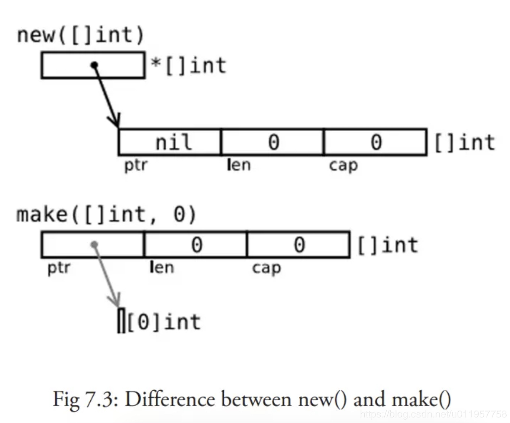

# golang

[TOC]

# 一 概述
## 1 简介
### 1.1 特点(按优秀程序从大到小排序)
1. 编译成无依赖二进制: 意味着
    1. 易于部署/分发: copy部署很方便,拷贝就能跑了.(这也是很多人选go的最大理由)
    2. 方便交叉编译：比如说你可以在运行 Linux 系统的计算机上开发运行下 Windows 下运行的应用程序。
        1. 网友：利用 docker 实现跨平台编译, Mac 上开发好后直接用 docker 进行编译, 然后扔到服务器就好.（待验证）
        2. Go 语言可以在 Intel 或 ARM 处理器上运行，因此它也可以在安卓系统下运行（待测试）
2. 超多的架构支持
2. 介于偏底层的系统语言（就像 C 或 C++ 语言）和基于运行时的语言（比如 Java 或 Python）之间，但更适用于系统编程领域。
3. 高性能高并发
    1. goroutine+channel
1. 工具:go提供了软件生命周期各个环节的工具(开发,测试,部署,维护等)，目前是够用但还不够强大。
1. Go语言的标准库强大（难以置信的强大）且完善，常被称为语言自带的电池（Batteries Included）
1. Go语言在语言层面解决软件工程问题的设计哲学（比如？）
6. 它是第一门完全支持 UTF-8 的编程语言.这不仅体现在它可以处理使用 UTF-8 编码的字符串，就连它的源码文件格式都是使用的 UTF-8 编码。Go 语言做到了真正的国际化。原生支持Unicode，它可以处理全世界任何语言的文本。
8. 有C基础，学Golang非常轻松
9. 内存排列：Go的任何变量在内存中都是紧密连续排列的，对于内存的访问速度来说，亲和度是很高的，而且CPU缓存也更加容易命中
10. 发布周期:有些规律但依然是一个黑匣子；核心团队之外没有人真正知道何时发布新版本，而且通常是通过一篇博客就宣布发布了。在 Gerrit/GitHub 上以 issue 形式存在的文档很多，不够完善和透明。

### 1.2 缺点
以下列出了go不支持的其他语言的一些特性和缺点,不过在未来的版本可能改善:
1. 不能用的变量写成`-`,不方便调试（问题不大）
1. go的包管理:感觉不如npm好用
1. 为了简化设计，不支持函数重载和操作符重载
2. 为了避免在 C/C++ 开发中的一些 Bug 和混乱，不支持隐式转换
3. 不支持动态加载代码
4. 不支持动态链接库
5. 不支持泛型

### 1.3 适用场景和不适用场景
适用场景:
1. 高性能分布式系统
2. 游戏服务端
3. 复杂事件处理（CEP,Complex event processing）

不适用场景:
1. 因为垃圾回收和自动内存分配的原因，Go 语言不适合用来开发对实时性要求很高的软件。

### 1.4 他人评价
深技术专栏作家 Matt Asay 在外媒上发文表示:究其原因，应该是经验的问题，在你拥有了老语言的使用经验后，使用新语言会变得更清晰明了。换句话说，如果你已经花了数年的时间去了解 Java ，那么应该会更容易理解 Go 有多优秀。

HackerRank 近日对约 4 万名开发者进行了调查，并发布了名为“2018 年开发者技能报告”:Go 虽然是一种很酷的语言，但它只占据了一个小小的位置，似乎并没有成为某种基础设施的最擅长的代码。也因此，它没有真正抓住年轻工程师的想象力。

Pike说:
1. 它至少在强度上比JavaScript高一级。Google自建Chrome浏览器，部分原因就是加速JavaScript和网页表现，而Google已经融合了本身的技术，如Native Client和Gears。
2. 我不认为我们能取代任何东西。我们只是创造出这个领域的另一个角色。

网友：
1. 更好的 c
2. go + java是不错的实践
3. Go语言标准库难以置信的强大，值得你花时间阅读它的代码，学习它实现的模式。
4. "更友好的C语言"
5. Go 可能是 Java 的更好继承者，因为它适合构建大型分布式系统。这也是你看到的像 Kubernetes 和 Docker 使用 Go 编写的原因。

云风博客:我发现我花了四年时间锤炼自己用 C 语言构建系统的能力，试图找到一个规范，可以更好的编写软件。结果发现只是对 Go 的模仿。缺乏语言层面的支持，只能是一个拙劣的模仿。

华尔街见闻技术团队:
1. 调试工具强大:自带一些pprof包可以profile当前程序的CPU消耗、内存占用、锁状态、channel阻塞等，非常便利我们定位问题。
2. 有一些优秀的微服务框架:我们选用go-micro

go的faq(https://golang.org/doc/faq):
1. Is Go an object-oriented language?
    > Yes and no. Although Go has types and methods and allows an object-oriented style of programming, there is no type hierarchy

## 2 历史
Go 语言本身是由C语言开发的，而不是 Go 语言.不过go从1.5开始就移除了"最后残余的C代码"实现了自举.

Go语言的每次版本更新，都会在标准库环节增加强大的功能、提升性能或是提高使用上的便利性。每次版本更新，标准库也是改动最大的部分。

### 2.1 吉祥物
以囊地鼠（Gopher）作为它的吉祥物,Rob Pike的妻子 Renee French绘制的。

参考：
1. https://blog.golang.org/gopher 
2. https://golang.org/doc/gopher/modelsheet.jpg

## 3 常识

### 3.1 go的哲学
1. 面向接口编程
2. 使用组合编程
3. 少即是多：“如果一个特性并不对解决任何问题有显著的价值，那么Go就不提供它”
4. 开放性，开源

### 3.2 go是用什么语言写的
参考[Golang本身是用什么语言写的？ - CNife的回答 - 知乎](https://www.zhihu.com/question/66944175/answer/248620046)
最开始是c和汇编,从1.5开始,go用语言实现了自己的编译器,即完成了自举,也就是全部都是用go实现的了.

### 3.3 语句后的分号
1. Go程序并不要求开发者在每个语句后面加上分号表示语句结束，这是与C和C++的一个明显不同之处。
2. Go语言不需要在语句或者声明的末尾添加分号，除非一行上有多条语句。实际上，编译器会主动把特定符号后的换行符转换为分号, 因此换行符添加的位置会影响Go代码的正确解析。举个例子, 函数的左括号{必须和func函数声明在同一行上, 且位于末尾，不能独占一行，而在表达式x + y中，可在+后换行，不能在+前换行。

### 3.4 语句后的逗号
为了防止编译器在行尾自动插入分号而导致的编译错误，可以在末尾的参数变量后面显式插入逗号,最后插入的逗号不会导致编译错误，这是Go编译器的一个特性.如,

```go
input := map[string]interface{}{
    "up_channel_id": ctx.Input.GetString("up_channel_id"),
    "page_index":    ctx.Input.GetString("page_index"),
    "page_size":     ctx.Input.GetString("page_size"),
}
//...
img.SetColorIndex(
    size+int(x*size+0.5), size+int(y*size+0.5),
    blackIndex, 
)
```

### 3.5 go相关人员
最开始的作者：
1. 罗伯特·格瑞史莫(Robert Griesemer)：曾协助实现 Java 的 HotSpot 编译器和 JavaScript V8 引擎。
2. 罗勃·派克(Rob Pike)：曾是贝尔实验室的 Unix 团队和 Plan9 操作系统成员，与Ken Thompson 一起创造了 UTF-8 字符编码。
    1. Length is not a virtue in a name; clarity of expression is. 《Notes on Programming in C》长度不是名字中的优点，表达的清晰度是。
3. 肯·汤普逊(Ken Thompson): 不用多说了，技术圣殿的人物，创造了 C 语言和 Unix，获得了 1983 年图灵奖和 1988 国家技术奖

后面加入的：
1. Ian Lance Taylor
2. Russ Cox

其他人员：
1. Dave Cheney:Go编程语言的开源贡献者和项目成员
2. William Kennedy (Bill)：《Go in Action》作者

### 3.6 空标识符（blank identifier）
即`_`（也就是下划线），它主要有两个作用：
1. 用于丢弃不需要使用的变量(任何类型都可以赋值给它，但任何赋给这个标识符的值都将被抛弃),被丢弃的值不能在后续的代码中使用，也不可以使用这个标识符作为变量对其它变量进行赋值或运算.
2. 导入包时，如果只想使用其中的`init()`而不希望把整个包导入，就可以用该符号

注意：`_`不可以单独和`:=`使用.

#### 3.6.1 点导入
如果导入包为一个点，那么可以不用加包名前缀来调用包中的方法。

### 3.7 简单语句（simple statement）
包括短变量声明、自增语句、赋值语句或函数调用

### 3.8 go语法定义里为什么把类型写在右边
参考[https://blog.golang.org/gos-declaration-syntax](https://blog.golang.org/gos-declaration-syntax),本人简单概括两点:（待验证）

1. c和java都是先写类型,是巧妙的语法思想，但更适合简单的类型。著名的混淆例子是声明一个函数指针：
    ```c
    int（* fp）（int a，int b）;
    //在这里，fp是一个指向函数的指针，因为如果你写表达式（* fp）（a，b）
    //你会调用一个返回int的函数。如果fp的论点之一本身就是一个函数呢？
    int（* fp）（int（* ff）（int x，int y），int b）
    //变得难以阅读
    ```
2. 类型和表达式语法的区别使得在Go中编写和调用闭包很容易：
    ```go
    sum：= func（a，b int）int {return a + b}（3,4）
    ```

### 3.9 go的unicode和uft8，rune、byte和string
#### unicode和uft8
unicode和uft8的关系可以参考：http://www.ruanyifeng.com/blog/2007/10/ascii_unicode_and_utf-8.html

#### rune、byte和string
在Go当中 string底层是用byte数组存的，并且是不可以改变的。例如 `s:="Go编程" fmt.Println(len(s)) `输出结果应该是8因为中文字符是用3个字节存的。`len(string(rune('编')))`的结果是3.如果想要获得我们想要的情况的话，需要先转换为rune切片再使用内置的len函数,`fmt.Println(len([]rune(s)))`,结果就是4了。所以用string存储unicode的话，如果有中文，按下标是访问不到的，因为你只能得到一个byte。 要想访问中文的话，还是要用rune切片，这样就能下标表访问。

rune能操作任何字符，包括中文，而byte不支持中文的操作。

`byte`:byte 类型是 uint8 的别名，只占用 1 个字节。
1. 用于字符串的时候，它可以表示一个ASCII字符。

`rune`:rune在golang中是int32的别名，在各个方面都与int32相同。rune是一个可以表示unicode编码的值int的值，称为码点（code point）--go把这个码点抽象为rune。
1. 用于字符串的时候，它可以表示一个UTF8字符。

`string`和`[]byte`的异同:从源码可知`string`主要是由`[]byte`构成。`string`不可变,每次值改变(重新分配内存空间),指针会指向新的字符串的内存地址,而`[]byte`值改变的时候指针不一定会移动(扩容时会移动，不扩容时不会移动),所以`[]byte`性能比string高.

使用比较:
 - string可以直接比较，而`[]byte`不可以，所以`[]byte`不可以当map的key值。
 - 因为无法修改string中的某个字符，需要粒度小到操作一个字符时，用[]byte。
 - string值不可为nil，所以如果你想要通过返回nil表达额外的含义，就用[]byte。
 - `[]byte`切片这么灵活，想要用切片的特性就用[]byte。
 - 需要大量字符串处理的时候用[]byte，性能好很多。

注意他们之间的比较用`bytes.Equal(s1, s2) == 0`而不是`bytes.Compare(s1, s2) == 0`

### 3.10 字符串、数组和切片
底层原始数据有相同的内存结构（？），在上层，因为语言的限制而有着不同的行为表现

### 3.11 2009-11-10 23:00:00 UTC
该日期是go的开源日期,可以看做是go的生日(?).

### 3.12 interface{}类型(待整理)
1. interface{}和其他类型比较的时候,是比较interface{}的实际类型.

### 3.13 程序退出的代码
程序正常退出的代码为 0 即 Program exited with code 0；如果程序因为异常而被终止，则会返回非零值

待补充

### 3.14 var、new()和make()的区别（难点）


`new()`和`make()`最大的区别：`new()`只分配(申请)内存而不初始化，`make()`不但分配(申请)内存还做初始化。比如:
```golang
p := new([]int) //p == nil; with len and cap 0
v := make([]int, 10) // v is initialed with len 10, cap 50
fmt.Println(*p)        //输出[] 
fmt.Println(v)        //输出[0 0 0 0 0 0 0 0 0 0 0]  
```

以下为详细区别：
- `var`:没加等号的话称为“零值初始化”，虽然带有“初始化”三个字，但对三个特殊的引用类型（slice、map、channel）并没有初始化，只是赋值为nil，对其他类型则是正常赋值为对对应的零值并初始化。
- `new(type)`：为变量分配内存，将内存置零（注意不是将变量置零，不要混淆了），但不初始化该内存，返回指针。对于值类型，它是零值初始化，和var一样；对于引用类型,此时变量等于nil（注意和其他语言不同，有点难理解）。
- `make(type,args...)`：为变量分配内存，将内存置零并初始化。只能用于slice、map和channel，因为这三者在go里必须初始化才能使用。还有个细节是`make()`是在运行时处理（特殊状态下会做编译器优化）(这就是go的数组不能make声明的原因之一?)。

```go
foo := new([]int)
bar := make([]int, 0)
fmt.Println(*foo == nil, bar == nil) // true false
fmt.Println(foo == nil, &bar == nil) // false false
```

```go
a1 := new([]int)
a2:= &[]int{}
a3:= make([]int,0)

fmt.Println(a1,a2,a3,a1==a1) // &[] &[] [] true
```

### 3.15 三个点...
有两种用法:
1. 作为语法糖
    1. 用于入参（不能用于出参），比如`func myfunc(arg ...int)`，变量arg就是一个int的slice，但是它比直接声明一个切片更加灵活，比如想接收0个或n个int参数，写成切片的话，0个时需要传空切片或者nil，如果用三个点的写法就什么都不用传。
    2. 用于传递时：slice可以被打散进行传递，比如`append()`处。
2. 作为命令行参数:一般放在目录后，表示递归，比如`golangci-lint run dir`，只会检查dir下面的文件，不会递归更下面一层，但是`golangci-lint run dir/...`会一直递归下去

### 3.16 go源码文件(待补充)
Go源码文件包括三种：
1. 命令源码文件：
    1. 独立程序的入口
    2. 属于main包，包含无参数和无结果的main函数
    3. main函数执行的结果意味着当前程序运行的结束
    4. 同一个代码包中不要放多个命令源码文件，同时命令源码文件和库源码文件也不要放在同一个代码包下。b站的的项目似乎就是这么做的。如果违反此条，`go run`和`go build`分别运行这些文件的时候不会报错，但是`go build`和`go install`运行整个包的时候会报错。
    5. 可以通过`go run`命令来执行，可接受命令参数
2. 库源码文件
3. 测试源码文件


### 3.17 平行赋值
`i, j = i+1, j-1`

### 3.18 环境变量
设置环境变量：
1. 命令设置环境变量，写法`env envNameA=xxx go run ...`，或者直接`envNameA=xxx go run xxx`。
2. 代码里设置环境变量(略)

环境变量明细：
1. GC相关
    1. `GOGC`：设置初始垃圾回收目标百分比，默认值是100，简单来讲就是值越低GC的频率越快。`GOGC=off`将会完全关闭垃圾回收
2. `GODEBUG`：GODEBUG的值是是以逗号分隔的多个name=value对，每个name都是个运行时调试工具。如`GODEBUG=gctrace=1,schedtrace=1000`
    1. 如果值包含`gocacheverify=1`将会导致 go 命令绕过任何的缓存数据，而真正地执行操作并重新生成所有结果，然后再去检查新的结果与现有的缓存数据是否一致。
3. GOOS 程序构建环境的目标操作系统
4. GOARCH 表示程序构建环境的目标计算架构
5. `GOCACHE`:`go build`命令现在(go1.10+)总是会把最近的构建结果缓存起来，以便在将来的构建中重用。我们可以通过运行`go env GOCACHE`命令来查看缓存目录的路径。缓存的数据总是能够正确地反映出当时的源码文件、构建环境和编译器选项等的真实情况。一旦有任何变动，缓存数据就会失效，`go build`命令就会再次真正地执行构建。因此，我们并不用担心缓存数据体现的不是实时的结果。实际上，这正是上述改进能够有效的主要原因。`go build`命令会定期地删除最近未使用的缓存数据，但如果你想手动删除所有的缓存数据，运行一下`go clean -cache`命令就好了。而且对于测试成功的结果，go 命令也是会缓存的。运行`go clean -testcache`命令将会删除掉所有的测试结果缓存。
    1. compiler决定是否重新编译包是content based的，而不是依照时间戳比对来决策。也就是说对文件的某一行，如果先删除，再恢复这行，是不会重新编译的。
    2. 缓存目录：Linux上，GOCACHE=`~/.cache/go-build`; 在Mac OS X上，GOCACHE=`~/Library/Caches/go-build`
### 3.19 文件名
以下划线`_`开头的文件不会被go编译，对golang而言类似于没有该文件

### 3.20 go的几种指针
有三种：
1. *类型：普通指针，用于传递对象地址，不能进行指针运算。
2. unsafe.Pointer：通用指针类型，用于转换不同类型的指针，在Go中可以把它理解成任何指针的父类型，不能进行指针运算。
3. uintptr：用于指针运算，GC 不把 uintptr 当指针，uintptr 无法持有对象。uintptr 类型的目标会被回收。字节长度和int一样，32位系统中是4字节，64位8字节

三种类型的转换：unsafe.Pointer 可以和 普通指针 进行相互转换，unsafe.Pointer 可以和 uintptr 进行相互转换，也就是说 unsafe.Pointer 是桥梁，可以让任意类型的`指针实现相互转换，也可以将任意类型的指针转换为 uintptr 进行指针运算。具体做法是将Pointer类型转换成uintptr类型，做完加减法后，转换成Pointer，通过*操作，取值，修改值...

### 3.21 go为什么不推荐使用me, this, self as receiver names
参考这个回答：https://stackoverflow.com/questions/23482068/in-go-is-naming-the-receiver-variable-self-misleading-or-good-practice

总结就是：
1. go里method receiver只是被认为method的第一个参数，不同于OOP里面的对象（虽然我们经常这么认为并且工作良好），所以用这些命名不太合适。
2. 还有人提到了law of demeter

### 3.22 Golang的相对路径是相对于执行命令时的目录

### 3.23 string()和strconv包
`string()`会直接把字节或者数字转换为字符的UTF-8表现形式，如果想将byte或者int类型的值转换为数字的字符串表现形式，使用`strconv`包里的方法，比如`strconv.Itoa()`

```golang
fmt.Println(string(120))    // x 
fmt.Println(strconv.Itoa(120))  // 120
```

### 3.24 查看汇编代码(待整理)
查看编译过程中的汇编代码：
1. `go build -gcflags -S xxx.go`：
2. `go tool compile`

### 3.25 赋值并不是原子操作
包括`i++`也不是原子操作。其他很多语言也是这样。

参考goroutine的数据竞争部分笔记。

### 3.26 关于golang的ID和id
参考：https://github.com/golang/go/wiki/CodeReviewComments#initialisms；大意就是说golint认为ID才是正确的并且暂时不会改变这个规则。有以下解决方法
1. （推荐）切换go lint tool，比如使用vscode的[golangci-lint](https://github.com/golangci/golangci-lint#editor-integration)
    1. 想忽略某个检查，可以用
        
        ```
        h := sha256.New()
        h.Write([]byte("hello world\n")) //nolint: errcheck
        ```
2. 自己维护一个golint版本来忽略该提示。


### 3.27 return、os.exit()、runtime.Goexit()和panic的区别
return结束当前函数,并返回指定值

`runtime.Goexit`:结束当前goroutine,其他的goroutine不受影响。runtime.Goexit在终止当前goroutine前会先执行此goroutine的还未执行的defer语句。注意不能在主线程(主协程)中调用它，会引发panic。

`os.Exit(code int)`:会立即结束掉当前整个程序。看注释可知，它会立即终止掉程序，不会执行`defer()`语句，并返回错误代码code(其他程序可根据这个code来报告发生的情况)，`code`为0表示正常退出，非0表示错误退出。所以该方法一般用在测试、脚本或者需要退出程序时。

`panic`的撤退比较有秩序，他会先处理完当前goroutine已经defer挂上去的任务，然后如果没被`recover()`捕获就继续打印调用栈，待defer函数执行完，将出错信息向其panic调用者传递panic相关信息，最终调用`exit(-2)`退出整个进程。panic仅保证当前goroutine下的defer都会被调到，但不保证其他协程的defer也会调到。

简单总结就是：`runtime.Goexit`退出当前协程，`panic`清理当前协程，然后退出整个进程，`os.Exit(code int)`退出整个进程。那么如何优雅的退出进程呢?

### 3.28 关于并发安全
Golang不保证任何单独的操作是原子性的，除非：
1. 使用 atomic 包里提供的原语
2. 加锁
3. golang实现了并发安全，比如`sync.Map`

所以常见的基本数据类型和复合数据类型都不是并发安全的

### 3.29 go有依赖注入吗
依赖注入跟语言可以说是没关系。

## 4 文档网址视频等
网址:
1. golang官方
    1. `golang.org`和`go.dev`:`go.dev`是`golang.org`的一个配套网站。
        1. Go 团队核心成员 RSC（Russ）的解释是：Golang.org是开源项目和发行版的所在地，是官方权威的，不想和其他第三方内容混在一起；而Go .dev是Go用户的中心，提供来自整个Go生态系统的集中和管理资源，包含更多社区内容
    1. 各种项目的文档
        1. [https://godoc.org](https://godoc.org)
        2. `pkg.go.dev`用于取代`godoc.org`
    1. 博客：https://blog.golang.org/
    2. playground：https://play.golang.org/
        1. studygoalng也做了一个国内版的:https://play.studygolang.com/
    3. https://golang.org/doc/effective_go.html
    4. go官方的FAQ，感觉这才是每个gopher必需阅读的，很多疑问都能在里面找到答案：https://golang.org/doc/faq
    5. github的wiki：https://github.com/golang/go/wiki
       1. 代码评审注释：https://github.com/golang/go/wiki/CodeReviewComments#receiver-names
    6. 专为中国开发者建立的（原因你懂的）
        1. https://golang.google.cn/
2. GOPROXY代理
    1. goproxy.cn:支持GOPROXY代理，且支持GOSUMDB的sum.golang.org的校验
        1. goproxy.cn/stats：统计数据，里面有一些开放接口
    2. mirrors.aliyun.com/goproxy:支持GOPROXY代理，但不支持GOSUMDB的sum.golang.org的校验
3. 其他
    1. 代码风格(style):
        1. https://github.com/uber-go/guide/blob/master/style.md#reduce-scope-of-variables
        2. 官方的style：https://github.com/golang/go/wiki/CodeReviewComments
文档:
1. 英文的免费电子书，DigitalOcean 发布的。Go 语言编程: https://www.digitalocean.com/community/books/how-to-code-in-go-ebook
1.  _Effective Go_(中文名《高效Go编程》)
2.  Go语言大神亲述:历七劫方可成为程序员!（看完我怎么感觉有点像是在扯淡）：http://developer.51cto.com/art/201710/553448.htm
4.  go命令教程，听说是干货：https://github.com/hyper0x/go_command_tutorial
5.  网友写的md，还没看过，待笔记：https://github.com/astaxie/build-web-application-with-golang/blob/master/zh/preface.md
6.  大神ASTA谢写的Go web编程gitbook，比较详细，应该很值得读：[build-web-application-with-golang](https://github.com/astaxie/build-web-application-with-golang/blob/master/zh/preface.md)
    1. https://astaxie.gitbooks.io/build-web-application-with-golang/zh/
7.  http://bmknav.com/go/
8.  go语言圣经中文网：[http://books.studygolang.com/gopl-zh/](http://books.studygolang.com/gopl-zh/)
10. go语言官方文档地址：https://golang.org/
    1. 比如想看runtime包，可以访问：https://golang.org/pkg/runtime/
11. GO入门指南：https://www.kancloud.cn/kancloud/the-way-to-go/72675
12. go设计模式：https://books.studygolang.com/go-patterns/
13. 大牛翻译的标准库中文文档：http://cngolib.com/
14. awesome-go：需要什么第三方库就从这里找
15. Go 语言实战: 编写可维护 Go 语言代码建议：https://mp.weixin.qq.com/s?__biz=MjM5OTcxMzE0MQ==&mid=2653371497&idx=1&sn=1dfc90bb65d61d710d7d1cf6783d4464&chksm=bce4dc738b9355651daeadd812e9a0d877d34e5fe6a1bf16235f58f4cd02833a81ffe5e8a6d0&mpshare=1&scene=23&srcid=0427tyKn9Fu1LyGyTXUonCZf#rd
    1.  个人对于其中关于命名的部分很赞同

## 6 相关项目
1. 基于web的postgresql数据库GUI工具：https://github.com/sosedoff/pgweb
2. swarm
    1. 2019年Swarm 的份额下降幅度很大
3. docker
4. k8s
5. gRPC
6. etcd
7. 高性能json库：https://github.com/json-iterator/go
8. gitea（https://gitea.io/zh-cn/）：开源社区驱动的轻量级代码托管解决方案，后端采用 Go 编写，采用 MIT 许可证

# 二 安装配置
go的环境变量说明:
1. `$GOROOT`:表示Go的安装目录。一般不需要设置GOROOT，默认情况下Go语言安装工具会将其设置为安装的目录路径,并且会自动将`$GOROOT/bin`加入系统PATH?。go自带的工具命令都在`$GOROOT/bin`里面,`fmt`等基础包也在GOROOT中，所以可以直接`import`.自带的标准库包的位于`GOROOT/src`下,比如存放fmt包的源代码对应目录为`$GOROOT/src/fmt`.目录说明如下(仅了解就行):
    1. `/bin`：包含可执行文件，如：编译器，Go 工具
    1. `/doc`：包含示例程序，代码工具，本地文档等
    1. `/lib`：包含文档模版
    1. `/misc`：包含与支持 Go 编辑器有关的配置文件以及 cgo 的示例
    1. `/os_arch`：包含标准库的包的对象文件（.a）
    1. `/src`：包含源代码构建脚本和标准库的包的完整源代码（Go 是一门开源语言）
    1. `/src/cmd`：包含 Go 和 C 的编译器和命令行脚本

2. `$GOPATH`:即工作区目录,安装后默认是`~/go`,必须包含三个子目录,bin,src和pkg。只需要有src目录，bin和pkg会自动生成（待测试）。项目一般都是放在src下.注意最好不要将`$GOROOT`和`$GOPATH`设置在同一目录下.当安装了gocode和gopkgs等工具时，还会算上安装工具的目录；但是如果`import`的目录不在这两者当中，那么就会报错找不到，所以要把自己go代码的目录加入到GOPATH中,设置了GOPATH之后，`import`时就会去GOROOT和GOPATH中找；添加多个目录的时候Windows是分号，Linux系统是冒号，当有多个GOPATH时，大部分情况下会是第一个路径优先，比如：查找包、go get的内容默认放在第一个目录下.
    1. `bin`:可执行文件的存放路径，包含golang编译可执行文件、编译器、Go 工具等
    2. `src`:源码文件。go run，go install等命令后跟的路径默认基于当前工作路径
    3. `pkg`:包文件路径，包含golang将可执行文件所依赖的各种package编译后的.a(or ?)中间文件

3. `$GOARCH`:表示目标机器的处理器架构，它的值可以是 386、amd64 或 arm。
4. `$GOBIN`:表示编译器和链接器的安装位置（执行`go install`安装的路径），默认是空字符串，为空时则遵循“约定优于配置”原则，可执行文件会放在各自GOPATH目录的bin文件夹--`$GOPATH/bin`。

除了设置上面的几个环境变量，还需要将`$GOPATH/bin`路径添加到系统PATH里，这样在任意目录都可以直接执行路径里的可执行文件。

go环境变量的设置：参考https://github.com/golang/go/wiki/SettingGOPATH

## 1 windows
1. 下载安装

3. 配置GOROOT(C:\Go)并将%GOROOT%\bin)加入PATH中，不过现在go语言安装工具会自动帮我们加入进去.这样就可以在任意地方运行go开头的命令了

4. 配置GOPATH.默认是`~/go`,想修改的话在系统变量新增一个GOPATH就行.

5. 配置gobin(需不需要看情况)

多版本管理使用gvm:https://github.com/moovweb/gvm(似乎没有win版本，待整理)

## 2 mac
### 2.1 二进制发行版安装
1. 下载安装
2. 在~/.bash_profile中设置GOPATH等,然后`source ~/.bash_profile`.

    这里我遇到一个问题,就是上面的设置在新开shell中没有生效.因为zsh加载的是 ~/.zshrc文件，而 ‘.zshrc’ 文件中并没有定义任务环境变量,所以需要在~/.zshrc文件最后，增加一行:source ~/.bash_profile
3. 如果是vscode中开发go,可能还需要设置go.gopath,形如`"go.gopath": "/Users/xushike/work"`

### 2.2 homebrew（最推荐）

#### 利用brew实现多版本切换
分两种情况：IDE中和命令行中。在IDE中，一般可以直接修改GOROOT的来切换版本。

在命令行中：同时下载多个版本，比如`1.10.4`和`1.12.9`，其中`1.10.4`可能单独形成目录`/usr/local/Cellar/go@1.10/1.10.4/...`以及在`/usr/local/opt`中形成单独的链接，需要将连接删除，将目录移动到`/usr/local/Cellar/go`下，最终形成这样的目录
```
usr/local/Cellar/go
├── 1.10.4
└── 1.12.9
```

然后执行`brew switch go 1.12.9`就可以切换版本了。

注意不要轻易执行`brew upgrade`，会把所有旧版本删除。

## 3 linux
### 3.1 安装包（二进制发行版）安装(**推荐**)
1. 下载xxx.tar.gz，安装到`/usr/local`下:
```bash
# 查看压缩文件内容
tar -ztvf xxx.tar.gz

# 解压到目录下
sudo tar -zxvf xxx.tar.gz -C /usr/local 
```

2. 环境变量设置
    - 设置GOROOT:
        1. go的安装目录，如`export GOROOT=/usr/local/go`
        2. 把`$GOROOT/bin`加入PATH：`export PATH=$PATH:$GOROOT/bin`
        
    - 设置GOPATH：这个目录用来存放Go源码(src)，Go的可运行文件(bin)，以及相应的编译之后的包文件(pkg)
        >在go1.1到1.7，该变量必须设置，且不能和go安装目录一样;从1.8开始有默认值，在Unix上默认为`$HOME/go`,在Windows上默认为`%USERPROFILE%/go`

        1. 设置GOPATH(**最好不要和go安装目录相同**)，比如`export GOPATH=$HOME/go`
    - 设置GOBIN，`$GOBIN`是golang编译出来的可执行文件的存放路径。比如`export GOBIN=$GOPATH/bin`
        1. 将`$GOBIN`加入PATH中，比如`export PATH=$PATH:$GOBIN`

### 3.2 源码安装
### 3.3 第三方工具安装（apt、wget等）

# 三 基础
## 0 Go程序的执行（程序启动）顺序
编译时按顺序依次导入所有被 main 包引用的其它包，如果其他包中的某个包又导入了另外的包，那么会先将另外的包导入进来，这样一直递归下去，然后对最后的包的变量和常量进行初始化，然后执行`init()`，然后返回上层执行初始化，以此类推。等所有被导入的包都加载完毕了，就会开始对main包中的包级常量和变量进行初始化，然后执行main包中的init函数（如果存在的话），最后执行main函数。但是每个包只会被导入一次。

## 1 程序结构

### 1.2 声明
Go主要有四种类型的声明语句：var、const、type和func，分别对应变量、常量、类型和函数实体对象的声明。

### 1.3 变量
#### 1.3.1 变量声明
其中“类型”或“= 表达式”两个部分可以省略其中的一个。如果省略的是类型信息，那么将根据初始化表达式来推导变量的类型信息。如果初始化表达式被省略，那么将用零值初始化该变量。
```go
//声明变量的方式1:一般是变量类型和初值类型不同时才使用
var 变量名字 类型 = 表达式
```

```go
//声明变量的方式2：零值初始化,也可用于多个变量是同一类型的情况，此时只写最后一个类型
var i int
var i, j, k int                 // int, int, int
//声明变量的方式3:一般用于同时声明多个变量，可省略类型，会自动判断
var b, f, s = true, 2.3, "four" // bool, float64, string
```

初始化表达式可以是字面量或任意的表达式。在包级别声明的变量会在main入口函数执行前完成初始化，局部变量将在声明语句被执行到的时候完成初始化。例子如下：

```go
var f, err = os.Open(name) // os.Open returns a file and an error
```

在**函数内部**，有一种称为**简短变量声明**语句的形式可用于声明和初始化局部变量,可以简单理解为`:=`是声明且赋值,例子如下：

```go
//声明变量的方式4:简短变量声明(只能在函数内使用)
anim := gif.GIF{LoopCount: nframes}
freq := rand.Float64() * 3.0
t := 0.0
//这种同时声明多个变量的方式应该限制只在可以提高代码可读性的地方使用比如for语句的循环的初始化语句部分
i, j := 0, 1
```

注意：
1. 简短变量声明语句中必须至少要声明一个新的变量,对于其他已经声明过的变量，则只有赋值操作
2. 简短变量声明语句只有对已经在同级词法域（同block？）声明过的变量才和赋值操作语句等价，如果变量是在外部词法域声明的，那么简短变量声明语句将会在当前词法域重新声明一个新的变量。

#### 1.3.2 变量的初始值
零值初始化机制可以确保每个声明的变量总是有一个良好定义的值，因此在Go语言中不存在未初始化的变量。这个特性可以简化很多代码，而且可以在没有增加额外工作的前提下确保边界条件下的合理行为。
1. 数值类型变量对应的零值是0，
2. 布尔类型变量对应的零值是false，
3. 字符串类型对应的零值是空字符串

    注意:检查空字符串用`s == ""`而不是`len(s) == 0`
    
4. 指针,接口和引用类型（包括slice、map、chan和函数）变量对应的零值是nil。

    注意:检查slice,map或者channel的空值用`len(s) > 0`而不是`s != nil && len(s) > 0`，不过还要注意并发的问题，比如channel，在执行到`len(s) > 0`的时候可能里面是空的，但是执行到下一行代码的时候有可能又有值了。
5. 数组或结构体等聚合类型对应的零值是每个元素或字段都是对应该类型的零值。
6. 当要声明一个变量或者结构体为零值时,go习惯使用var,这样更明确

#### 1.3.3 赋值
1. 更有效的赋值写法,比如
    ```go
    count[x] = count[x] * scale // 数组、slice或map的元素赋值
    //下面的写法更有效，可以省去对变量表达式的重复计算
    count[x] *= scale
    ```

2. 元祖赋值：指同时更新多个变量的值,先计算右边再统一更新左边。好处是:
    - 对同时出现在两边的变量很有帮助
    - 可以使一系列琐碎赋值更加紧凑(特别是在for循环的初始化部分)

    但如果表达式太复杂的话，应该尽量避免过度使用元组赋值

3. 可赋值性：
    1. nil可以赋值给任何指针或引用类型的变量。常量则有更灵活的赋值规则，因为这样可以避免不必要的显式的类型转换
    2. 对于两个值是否可以用==或!=进行相等比较的能力也和可赋值能力有关系：对于任何类型的值的相等比较，第二个值必须是对第一个值类型对应的变量是可赋值的，反之亦然。
    3. 隐式的赋值行为：函数调用会隐式地将调用参数的值赋值给函数的参数变量，一个返回语句将隐式地将返回操作的值赋值给结果变量.
    
4. 匿名变量(没有名称的变量、类型或方法).可以避免定义一堆没用的变量,使代码看起来更加优雅清晰,写法形式如下,
        
    ```go
    func GetName() (firstName, lastName, nickName string) { 
        return "May", "Chan", "Chibi Maruko" 
    } 
    ```             

#### 1.3.4 变量的生命周期
对于在包一级声明的变量来说，它们的生命周期和整个程序的运行周期是一致的。而相比之下，在局部变量的声明周期则是动态的：从每次创建一个新变量的声明语句开始，直到该变量不再被引用为止，然后变量的存储空间可能被回收。函数的参数变量和返回值变量都是局部变量。它们在函数每次被调用的时候创建。

因为一个**变量的有效周期只取决于是否可达**，因此一个循环迭代内部的局部变量的生命周期可能超出其局部作用域。同时，局部变量可能在函数返回之后依然存在。

#### 1.3.5 变量的存储位置
编译器会自动选择在栈上还是在堆上分配局部变量的存储空间，但可能令人惊讶的是，这个选择并不是由用var还是new声明变量的方式决定的。圣经中的例子如下,
```go
var global *int

func f() {
    var x int
    x = 1
    global = &x
}

func g() {
    y := new(int)
    *y = 1
}
```
分析:f函数里的x变量必须在堆上分配，因为它在函数退出后依然可以通过包一级的global变量找到，虽然它是在函数内部定义的；用Go语言的术语说，这个x局部变量从函数f中逃逸了。相反，当g函数返回时，变量`*y`将是不可达的，也就是说可以马上被回收的。因此，`*y`并没有从函数g中逃逸，编译器可以选择在栈上分配`*y`的存储空间（也可以选择在堆上分配，然后由Go语言的GC回收这个变量的内存空间），虽然这里用的是new方式。不过一般情况下编程不需要想这么多.

### 1.4 常量
使用`const`声明,只可以是字符串、布尔或数字类型的值,不能用`:=`定义.语法形如`const xxx [type] = xxx`,如
```go
const Pi = 3.14159
const beef, two, c = "eat", 2, "veg"
// 常量还可以用作枚举
const (
	Unknown = 0
	Female = 1
	Male = 2
)
```

优雅的常量iota：iota是无类型的int(untyped int)，不是int也不是uint；iota只能在常量表达式中使用，所以`fmt.Println(iota)`会报错。一般情况下，iota可以看成const块中的行索引，记录行数。

常量命名的最佳实践:一般声明为MaxLength,而不是以下划线分隔MAX_LENGTH或者MAXLENGTH。(why)

### 1.5 指针
指针是可见的内存地址.有些语言中(比如C)指针操作是完全不受约束的;而有些语言中(比如java)指针一般被处理为“引用”，除了到处传递这些指针之外,并不能做其他操作.Go平衡了两者,可以操作指针,但不能对指针进行运算，也就是不能像c语言里可以对指针进行加或减操作。`&`操作符可以返回一个变量的内存地址，`*`操作符可以获取指针指向的变量内容,`*type`表示指针的类型.

并不是每一个值都会有一个内存地址，但是对于每一个变量必然有对应的内存地址。(?)

指针是实现标准库中flag包的关键技术.

指针最重要的应用在于:在于我们可以不用名字而访问一个变量，但是这是一把双刃剑：要找到一个变量的所有访问者并不容易，我们必须知道变量全部的别名（译注：这是Go语言的垃圾回收器所做的工作）

使用方法:如果用“var x int”声明语句声明一个x变量，那么`&x`表达式（取x变量的内存地址）将产生一个指向该整数变量的指针，指针对应的数据类型是`*int`，指针被称之为“指向int类型的指针”,同时`*p`表达式对应p指针指向的变量的值.操作`*p`只是增加p指向的变量的值，并不改变p指针.

还可以使用`new`(注意`new`在go中目前只是预定义函数,而不是关键字)来声明变量,作用和普通声明一样,如`p := new(int)`.但是new用得比较少,因为字面量的方式创建指针更方便.每次调用new函数都是返回一个新的变量的地址，因此下面两个地址是不同的：

```go
p := new(int)
q := new(int)
fmt.Println(p == q) // "false"
```

指针的比较:指针之间也是可以进行相等测试的，只有当它们指向同一个变量或全部是nil时才相等。

关于go和C/C++语言返回函数中局部变量的指针:
1. 在C/C++中,局部变量分配在栈里,函数返回后，局部变量是被系统自动回收的(其他好几种语言也是这样).返回局部变量的指针是不安全的,但返回局部变量的值是安全的,因为返回的是值的副本
2. 在go中,局部变量可能分配到栈or堆中,而且两者都可以返回.具体参考垃圾回收的堆栈分配笔记

### 1.6 类型
新声明的类型提供了一个方法(我还不知道什么方法,底层的一些东西?)，用来分隔不同概念的类型，这样即使它们底层类型相同也是不兼容的,例子如下,

```go
type Celsius float64    // 摄氏温度
type Fahrenheit float64 // 华氏温度
//Celsius和Fahrenheit是不同的类型,即使他们的底层类型都是float64
```

底层数据类型决定了内部结构和表达方式，也决定是否可以像底层类型一样对内置运算符的支持。这意味着，Celsius和Fahrenheit类型的算术运算行为和底层的float64类型是一样的.
比较运算符==和<也可以用来比较一个命名类型的变量和另一个有相同类型的变量，或有着相同底层类型的未命名类型的值之间做比较。但是如果两个值有着不同的类型，则不能直接进行比较：
```go
var c Celsius
var f Fahrenheit
fmt.Println(c == 0)          // "true"
fmt.Println(f >= 0)          // "true"
fmt.Println(c == f)          // compile error: type mismatch
fmt.Println(c == Celsius(f)) // "true"!
//最后一个测试为真的原因是因为c和g都是零值,Celsius(f)是类型转换操作，它并不会改变值，仅仅是改变值的类型而已。
```

1. 命名的类型的优点
    - 可以提供书写方便,如果是复杂的类型将会简洁很多，比如结构体类型
    - 为该类型的值定义新的行为

### 1.9 包
一个包即是编译时的一个单元，因此根据惯例，每个目录都只包含一个包.

1. 目录结构
    1. 参考：
        1. https://github.com/golang-standards/project-layout
        2. 如何写出优雅的 Go 语言代码(非常值得阅读)：https://draveness.me/golang-101/
            1. How To Use Go Interfaces(不完全赞同)：https://blog.chewxy.com/2018/03/18/golang-interfaces/

2. 包路径

    如果包名以`./`开头,则是相对路径;以`/`开头,则在绝对路径中查找;不是以`.`或`/`开头.则在全局文件中查找.go推荐使用相对于$GOPATH/src的路径来导入包;也可以用相对当前位置的路径来import，这种方式不依赖GOPATH，但是不推荐.

3. 包导入

    go并不要求包名是唯一的,但是按照惯例，一个包的名字和包的导入路径的最后一个字段相同.比如导入包`import gopl.io/ch2/tempconv`,则包名是`tempconv`.
    1. 导入包的重命名:如果两个包的名字一样,就需要用到包的重命名,如

        ```go
        import (
            "crypto/rand"
            mrand "math/rand" // alternative name mrand avoids conflict
        )
        ```

    2. 导入包的分组:通过添加空行来分组,好处是更容易区分,同时go的工具会对每个分组单独排序.如

        ```go
        import (
            "fmt"
            "html/template"
            "os"

            "golang.org/x/net/html"
            "golang.org/x/net/ipv4"
        )
        ```

    3. 包的匿名导入

        有时候我们只是想利用导入包而产生的副作用：它会计算包级变量的初始化表达式和执行导入包的`init()`初始化函数,此时可以使用空白标识符,如`import _ "image/png"`

    4. 包的初始化

        导入包的时候一级变量和`init()`会被初始化,所以可以把初始化的东西写在`init()`方法中.

    5. 目录下同级的go文件package必须和包名一样,比如,

        ```bash
        -- config
        -- file.go    #假设config目录下有config.go文件
        ```
        file.go中的package名称~~必须~~最好是`config`，而文件名可以随便。

        1. 最外层的go文件的package必须是main,最外层的go文件有多个,但方法名为main只能有一个.
        2. 实测，`*test.go`文件的包名可以和同目录下的非测试文件的包名不一致。(why)

    6. GOPATH和GOPATH下的src目录不应该添加到源代码管理中

3. 包依赖:Go 中的包模型采用了显式依赖关系的机制来达到快速编译的目的，编译器会从后缀名为`.o`的对象文件（需要且只需要这个文件）中提取传递依赖类型的信息。例子如,

```go
A.go 依赖 B.go，而 B.go 又依赖 C.go：
编译 C.go, B.go, 然后是 A.go.
为了编译 A.go, 编译器读取的是 B.o 而不是 C.o.
这种机制对于编译大型的项目时可以显著地提升编译速度。
```

4. 关于包的初始化
    1. 每个包在解决依赖的前提下，以导入声明的顺序初始化，每个包只会被初始化一次。因此，如果一个p包导入了q包，那么在p包初始化的时候可以认为q包必然已经初始化过了。初始化工作是自下而上进行的，main包最后被初始化。以这种方式，可以确保在main函数执行之前，所有依赖的包都已经完成初始化工作了
    2. 可以用一个特殊的init初始化函数来简化初始化工作。每个文件都可以包含多个init初始化函数

5. 可见性规则

    当标识符（包括常量、变量、类型、函数名、结构字段等等）以一个大写字母开头，如：Group1，那么使用这种形式的标识符的对象就可以被外部包的代码所使用（客户端程序需要先导入这个包），这被称为导出（像面向对象语言中的 public）；标识符如果以小写字母开头，则对包外是不可见的，但是他们在整个包的内部是可见并且可用的（像面向对象语言中的 private ）。

### 1.10 作用域
go的作用域和生命周期是不同的概念
1. go的三个流程控制语句紧跟的初始化块声明的变量,其作用域和声明在语句`{}`中变量一样.
2. 在包级别，声明的顺序并不会影响作用域范围，因此一个先声明的可以引用它自身或者是引用后面的一个声明，这可以让我们定义一些相互嵌套或递归的类型或函数。

## 2 数据类型
Go语言将数据类型分为四类：
1. 基础类型：包括数字、字符串和布尔型。
2. 复合类型(聚合)：通过组合简单类型，来表达更加复杂的数据结构，包括数组和结构体
3. 引用类型：包括指针、切片、字典、函数、通道，虽然数据种类很多，但它们都是对程序中一个变量或状态的间接引用
4. 接口类型：就是接口

不过有的地方将其分为三类,还可以有自定义类型,而且函数也可以是一个确定的类型.总之有空再整理吧.

类型转换(难点)(待补充)：**Go作为一个强类型语言，不同类型之前必须要显示的转换（而且必须是基础类型相同）。 这样可以回避很多类似C语言中因为隐式类型转换引入的bug。但是，Go中interface是一个例外：type到interface和interface之间可能是隐式转换的。**
1. 语法形如`var a typeA = typeA(b)`,这种方式适合以下几种情况

    1. 一个取值范围较小的类型转换到一个取值范围较大的类型，一定会成功；一个取值范围较大的类型转换到范围较小的类型，没有溢出的话才会成功。
        1. int和int64之间的相互转换
        1. int=>float64:`var f float64 = float64(i)`或者`f := float64(i)`
        2. string=>[]byte:`data := []byte(str)`
        3. []byte=>string:`str := string(bytes)`

    2. 具有相同字段名称，相同字段类型的结构体（tag可不一样）
    
2. 具有相同底层类型的变量之间可以相互转换.如,

    ```go
    type IZ int
    var a IZ = 5
    c := int(a)
    d := IZ(c)
    ```

3. 数值和字符串
    1. 整形到字符串`s = strconv.Itoa(i)` 或者 
        
        ```go
        s = strconv.FormatInt(int64(i), 10) // 转成十进制数对应的字符串
        s = strconv.FormatInt(int64(i), 16) // 转成十六进制数对应的字符串
        ```
    2. 字符串到整形
        
        ```go
        i, err = strconv.Atoi(s) 
        i, err = strconv.ParseInt(s, 10, 64) // 将字符串类型的64位的十进制数转成整形
        i, err = strconv.ParseInt(s, 16, 64) // 将字符串类型的64位的十六进制数转成整形
        ```
    3. 字符串到float32/64：
    
        ```go
        float32, err = strconv.ParseFloat(string, 32)
        float64,err = strconv.ParseFloat(string,64)
        ```

### 2.1 基础数据类型
包含int、float、bool、string

#### 2.1.1 整数
大概可以分为以下几种类型：
有基于架构的类型，例如：int、uint 和 uintptr.这些类型的长度都是根据运行程序所在的操作系统类型所决定的：int 和 uint 在 32 位操作系统上，它们均使用 32 位（4 个字节），在 64 位操作系统上，它们均使用 64 位（8 个字节）。uintptr 的长度被设定为足够存放一个指针即可。
1. 查看int类型的位数`strconv.IntSize`，在64位机器上会返回64。也可以根据操作系统架构来判断，比如`runtime.GOARCH`

与操作系统架构无关的类型都有固定的大小，并在类型的名称中就可以看出来：
整数：
int8（-128 -> 127）
int16（-32768 -> 32767）
int32（-2,147,483,648 -> 2,147,483,647）
int64（-9,223,372,036,854,775,808 -> 9,223,372,036,854,775,807）

无符号整数：
uint8（0 -> 255）
uint16（0 -> 65,535）
uint32（0 -> 4,294,967,295）
uint64（0 -> 18,446,744,073,709,551,615）

字符类型byte:严格来说，字符并不是 Go 语言的一个类型，字符只是整数的特殊用例。byte 类型是 uint8 的别名，只占用 1 个字节的传统 ASCII 编码.字符使用单引号括起来。几种声明方法如下:

```go
// 下面三种声明方法是等价的
var ch byte = 'A'
var ch byte = 65
var ch byte = '\x41'
```

关于byte的有趣例子：
```golang
var i byte
go func() {
    for i = 0; i <= 255; i++ {
        // 该条件永远成立，因为byte的值是255后会溢出，又从0开始
    }
}()
```

#### 2.1.2 浮点数
你应该尽可能地使用 float64，因为 math 包中所有有关数学运算的函数都会要求接收这个类型。

#### 2.1.3 字符串
golang中字符串是以 UTF-8 为格式进行存储。语法分为普通字符串和raw字符串:raw字符串和js6中的模板字符串有点像，用反引号包裹。**raw字符串中都是原样输出，不能转义。**正则表达式中使用raw字符串更简洁。golang的字符串是不可变的，源码定义在src/runtime/string.go

```go
// src/runtime/string.go
// 可以看出string其实是个结构体，golang无法保证原子性的给他赋值(比如刚修改完指针但是没改len，这时候其他协程读取了该字符串就会得到不正确的结果)，所以golang的string不是并发安全的
type stringStruct struct {
    str unsafe.Pointer
    len int
}

// reflect.StringHeader
type StringHeader struct {
	Data uintptr
	Len  int
}
```

```go
// go字符串内容的三种写法
// 1. 字面值
var s = "中国人"
// 2. 码点表示法
var s1 = "\u4e2d\u56fd\u4eba"
var s2 = "\U00004e2d\U000056fd\U00004eba"
// 3. 字节序列表示法（二进制表示法）
var s3 = "\xe4\xb8\xad\xe5\x9b\xbd\xe4\xba\xba"
```

操作：
1. 字符串截取:可以用类似切片的方式来截取,形如`str[indexA:indexB]`,取出来左闭右开的子字符串.比如

    ```golang
    str := "123456"
    str[0:3] // "123"
    str[3:] // "456"
    str3 := str[6:] // 特别的，如果indexA是字符串的长度，此时str3 == ""为true
    ```
2. 字符串的修改：字符串默认是只读的，无法直接通过下标来修改。如果想实现修改，可以先转成[]byte，修改后再转成string
3. 拼接的几种方式及比较
   1. `+`，量大时效率较低，因为每次都会产生一个新字符串
   2. `fmt.Sprintf()`:内部使用 []byte 实现
   3. `strings.Join()`：效率比`+`高
   4. `buffer.WriteString()`：不需要复制，只需要将添加的字符串放在缓存末尾即可，所以性能理论上最好，不过和java的StringBuilder一样是线程不安全的
   5. go1.10开始新增了Builder类型，也是并发不安全的
4. 遍历字符串
   1. 按字节遍历 
        
        ```golang
        var s = "嘻哈china"
        for i:=0;i<len(s);i++ {
            fmt.Printf("%x ", s[i]) // e5 98 bb e5 93 88 63 68 69 6e 61
        }
        ```
    2. 按字符 rune 遍历:每次迭代出两个变量 codepoint 和 runeValue。codepoint 表示字节起始位置，runeValue 表示对应的 unicode 编码（类型是 rune）。如果字符串中有非法utf8字节序列，那么runeValue将返回0xFFFD这个特殊值(很多其他程序似乎会将这个值显示为特殊的问号)，并且在接下来一轮循环中，runeValue将仅前进一个字节。
        
        ```golang
        var s = "嘻哈china"
        for codepoint, runeValue := range s {
            fmt.Printf("%d %d ", codepoint, runeValue) // 0 22075 3 21704 6 99 7 104 8 105 9 110 10 97 
        }
        fmt.Println()
        for codepoint, runeValue := range s {
            fmt.Printf("%d %s ", codepoint, string(runeValue)) // 0 嘻 3 哈 6 c 7 h 8 i 9 n 10 a
        }
        
        // 非法字节的列子
        // TODO
        ```
5. 字符串的比较
    ```go
    // 有三种方法：==、strings.Compare()、strings.EqualFold
    // 1. ==
    // 2. Compare()比较,区分大小写,返回int 0时相同，1时不同，效率高于==
    // 3. EqualFold ()比较，比较utf-8编码小写的条件下是否相等，不区分大小写
    ```
    
go有字符串常量池吗：没有。

#### 2.1.4 布尔bool
对于布尔值的好的命名能够很好地提升代码的可读性，例如以 is 或者 Is 开头的 isSorted、isFinished、isVisible，使用这样的命名能够在阅读代码的获得阅读正常语句一样的良好体验，例如标准库中的`unicode.IsDigit(ch)`

### 2.2 复合(结构化)数据类型
包含array、slice、map、struct、channel(我们通常把array和struct称为值类型，把slice、map、channel称为引用类型，来帮助我们理解go语言的这几个类型。虽然这个称法并不准确，而且官方也没有这样说过)

#### 2.2.1 数组
特点：
1. 元素占用内存相同且连续，所以访问元素速度很快。
2. go数组的元素必须是同一个类型,没有指定值的元素默认是零值初始化。
3. 注意**go的数组是值类型**，不同于C语言或者其他语言的数组，C语言的数组变量是指向数组第一个元素的指针，而Go语言的数组是一个值。虽然数组的元素可以被修改，但是数组本身的赋值、函数传参都是以整体复制的方式处理的（**值传递**），也就是说修改dst不会影响src。（这点和不少编程语言不一样，比如js/C/C++中是指向首元素的指针）
4. An array's size is fixed; its length is part of its type ([4]int and [5]int are distinct, incompatible types).
    
    ```go
    a := [...]string{"USA", "China", "India", "Germany", "France"}
    b := a // a copy of a is assigned to b
    b[0] = "Singapore"
    fmt.Println("a is ", a) // [USA China India Germany France]  
    fmt.Println("b is ", b) // [Singapore China India Germany France]
    ```

数组的创建/声明:
1. 使用字面量:`arr := [5]int{1,2,,5,5,6}`
    1. 声明空数组（零值初始化）：形如`var arr [5]int`或者`arr := [3]int{}`,声明了一个长度为5的int类型的空数组,所有元素被初始化为0
2. 自动计算长度，注意三个点必须要有，否则就是切片了:如`arr := [...]int{1,3,5}`，或者`arr := [...]int{2:5,3:6}`
3. 指定特定元素的值:`arr := [5]int{2:5,3:6}`，或者`arr := [...]int{2:5,3:6}`
4. 使用`new()`：如`arr := new([5]int)`，注意此时arr的类型是`*[5]int`
5. 从切片生成数组:(待整理)

数组的操作：
1. 数组的读写/存取:
    1. 对数组中元素的访问和赋值：形如`array[num]`。
    2. 对整个数组赋值：只有类型和大小一样的数组才能相互赋值。
2. 数组的长度和容量：数组的长度和容量是相等的，使用`cap()`和 `len()`函数
3. 数组的合并（待补充）
4. 在函数间传递数组:可以传递值也可以传递指针，后者只需要在栈上开辟8字节的内存，性能更好，但是对指针的改动会影响共享内存。
5. 遍历数组:普通for循环和`for range`
6. 数组的比较

#### 2.2.2 切片
参考：
1. https://blog.golang.org/go-slices-usage-and-internals
2. 源码在标准库runtime/slice.go

切片从设计上可看作go对数组抽象后的类似动态数组的集合，但**切片本身并不是动态数据或者数组指针**。它是对数组一个连续片段的引用（该数组我们称之为相关数组，通常是匿名的，**这个数组的长度就是切片的容量cap()**），所以切片是引用类型（因此更类似于 C/C++ 中的数组类型，或者 Python 中的 list 类型）.多个切片如果表示同一个数组的片段，它们可以共享数据,因此一个切片和相关数组的其他切片是共享存储的，如果修改该数组，所以关联该数组的切片都会受影响。但切片的容量发生变化时，会重新分配地址，此时切片和原底级数组的关联就会断开。例子如下：

```golang
a := [...]int{1, 2, 3, 4, 5}
s1 := a[:]
s2 := a[:]
s1[0] = 10
fmt.Println(a[:]) // [10,2,3,4,5]  修改切片会影响到底级数组，反之亦然
s2[0] = 20
fmt.Println(s1) // [20,2,3,4,5]  修改切片会影响到基于同一底级数组的切片

s1 = append(s1, []int{6, 7}...) // append 时容量不够时会导致重新分配内存，与原底级数组关系断开
s1[0] = 100
fmt.Println(s1)   // [100,2,3,4,5,6,7]
fmt.Println(a[:]) //[20,2,3,4,5]
fmt.Println(s2)   //[20,2,3,4,5]
```

切片的数据结构如下:
```go
type slice struct {  
    array unsafe.Pointer // 指向底层数组的指针
    len   int
    cap   int
}
```


切片的存储能力（capacity）：可以理解为最大容纳元素个数，与数组不同，切片的存储能力是可以大于它的长度的，最大容纳元素个数减去当前容纳元素个数剩下的空间是隐藏的，不能直接使用。如果要往隐藏空间中新增元素，使用`append()`函数。

切片的声明:
```go
//1.使用内置make函数
slice := make([]string,5)
//如果只指定长度，那么容量和长度相等,也可以分开指定，但必须容量>长度
slice := make([]int,4,8)

//2.使用切片字面量来声明切片,此时长度和容量也是相等的
slice := []string{"a","b","c"}//长度和容量都是3

//3.使用索引声明切片
slice := []stirng{99:"hello"}//长度和容量是100

// 4. 使用切片创建切片 slice[start:end]，有几个地方需要注意：选择范围不能超过oldSlice的容量，否则报错；newSlice的容量大小是oldSlice的容量大小减去复制时的起始角标，和终止角标无关，比如下面这个newSlice的容量就是5-1=4
oldSlice := []int{10,20,30,40,50}
newSlice := oldSlice[1:3]// newlice的长度为2，容量为4，且和slice同一截数组。这种通过下标截取生成切片的方式称为Slicing，也称为re-slice，即切片重组。

// 5. 使用三个索引创建切片 slice[start:end:cap]，第三个参数表示容量，是可选的，其值不能比新len小，不能比旧的cap大，不写则大小跟新len一样。
slice := []string{"a","b","c","d","e"}
newSlice := slice[1:3:4] // newSlice的长度2，容量为3
newSlice2 := slice[5:] // 特别的，如果start是slice的长度，那么newSlice2是长度为0的非nil切片

// 6.基于数组创建切片。貌似不能指定容量
array := [...]int{1,2,3}
newSlice := array[m:n]

//其他：声明空切片,可用于表示空集合
slice := make([]string,0)
slice := []stirng{}
```
注意:
1. 使用切片字面量的时候，只要`[]`里有值，就不是切片而是数组了
2. 声明nil slice应该使用`var t []string`而不是`t := []string{}`,前者声明了一个nil slice而后者是一个长度为0的非nil的slice。空切片的数组指针指向的地址不是nil，指向的是一个内存地址，即底层元素包含0个元素，而nil slice的数组指针是nil，没有指向任何内存地址。
    ```go
    // nil slice的内部是:arr指针 = nil, len = 0, cap = 0
    var s []int
    fmt.Println(s == nil) // true

    // 空 slice的内部是:arr指针 = 0x..., len = 0, cap = 0
    slice := make([]string,0)
    slice := []stirng{}
    ```

切片的操作：
1. 拼接：
    1. 往切片末尾追加元素或切片，使用内置的`append()`，该函数会自动处理存储空间不足的问题。追加元素使用内置的`append(slice,ele1,ele2,...,eleN)`函数，追加切片要写成`append(slice1,slice2...)`，这三个点的意思是把slice2所有元素打散后传递给`append()`，这是由于`append()`从第二个参数起的所有参数都必须是待附加的单个元素。:
        1. 当每次容量不够的时候，`append()`就会分配一个新的数组，所以可以通过设置长度和容量一样的切片来保证第一次`append()`分配的是新数组
        2. 扩容策略(src/runtime/slice.go growslice)
            1. 当需要的容量超过原切片容量的两倍时，会使用需要的容量作为新容量。
            2. 容量<1024时，每次扩容是容量翻倍；超过1024，则每次增加25%，即每次扩容四分之一。扩容会涉及数组拷贝，产生额外性能开销。
    2. 切片中元素的插入、删除和替换，go没有提供直接在切片中间插入/删除元素的方法，所以只有使用子切片的方法来实现，而且切片这种数据结构本身也不适合频繁的插入和删除：
        1. 删除元素：可以使用：`s2=append(s1[:index],s1[index+1:]...)`，注意有坑。
        2. 插入元素：创建临时切片保存后面的部分，然后类似上面那样。。。
        3. 替换元素：`slice[num]`用于单个元素，`append()`用于单个或多个元素，例子如下

            ```golang
            append(slice1[:index], ele)
            // 当index<slice1的容量时，原index位置的元素被替换成ele；当index>=slice1时，返回的是一个新的切片，对slice1没有影响。
            ```
3. 切片的迭代。迭代的是`len()`而不是`cap()`:
    1.  使用关键字`range`,第一个返回值是索引，第二个返回值是值的副本（注意是值而不是引用）

        ```go
        for index,value := range slice{
            ...
        }
        ```
    2. 也可用普通的for循环,如

        ```go
        for i:=0; i < len(slice); i++｛
            //...
        }
        ```
4. 切片的复制:
    1. 如果想要deep copy，使用內建的`copy()`是最佳实践，形如`copy(dst, src)`，它会将src中的元素复制到dst中，复制的元素个数取决于两个切片的长度(`len()`)中最小的那个。例子如下：

    ```golang
    // 例子1
    arraySlice1 := []int{1, 2, 3, 4, 5}
	arraySlice2 := []int{5, 4, 3}
	copy(arraySlice2, arraySlice1) // 只会复制arraySlice1的前3个元素到arraySlice2中
	fmt.Println(arraySlice1) // [1 2 3 4 5]
    fmt.Println(arraySlice2) // [1 2 3]

	arraySlice3 := []int{1, 2, 3, 4, 5}
	arraySlice4 := []int{5, 4, 3}
	copy(arraySlice3, arraySlice4) // 只会复制arraySlice4的3个元素到arraySlice3的前3个位置
	fmt.Println(arraySlice3) // [5 4 3 4 5]
    fmt.Println(arraySlice4) // [5 4 3]
    
    // 例子2
    src := []string{`a`, `b`, `c`}
	dst := make([]string, 0, 1)
	count := copy(dst, src)
    fmt.Println(count) // 打印0，因为dst的len()为0，所以不会发生拷贝
    
    // 例子3
    src := []string{`a`, `b`, `c`}
	dst := make([]string, 1, 1)
	count := copy(dst, src)
	fmt.Println(count) // 1
    fmt.Printf("%+v\n", dst) // [a]
    
    // 例子4
    src := []string{`a`, `b`, `c`}
	dst := make([]string, 1, 1)
	copy(dst, src)
	dst[0] = "d"
    fmt.Println(src) // [a b c]，内置函数copy()是deep copy，所以src不会因为dst的改变而改变
    
    // 例子5
    a, b, c := "a", "b", "c"
	src := []*string{&a, &b, &c}
	dst := make([]*string, 1, 1)
	copy(dst, src)
	d := "d"
	dst[0] = &d
	for _, s := range src {
		fmt.Println(&s, s, *s) 
    }
    // 0xc42000c028 0xc42000e250 a
    // 0xc42000c028 0xc42000e260 b
    // 0xc42000c028 0xc42000e270 c
    // 因为内置的copy()是deep copy，对指针类型的元素也是一样的

    ```
5. 在函数间传递切片(难点):
    1. 如果入参类型是`s []int`，传递的就是切片本身(可以看作是引用，64位上24字节)，对传入的s整个赋值不会影响原切片，但是对s里的元素进行修改的话，实际是修改的原切片，规则和js里的数组类似。
    2. 如果入参类型是`s *[]int`，传递的就是切片本身的引用（可以看作是引用的指针），对传入的s整个赋值不会影响原切片，但是对s里的元素进行修改的话，实际是修改的原切片，规则和js里的数组类似。但是对`*s`（待补充）
    3. 若函数需改变slice的长度，则仍需要取地址传递指针，也就是传`*[]int`

6. 切片的长度和容量:`len()`:返回切片的长度，`cap()`:返回切片的容量

#### 2.2.3 映射/字典map
map是存储无序键值对的集合,map强大的地方在于可以根据键快速检索到值(对集合元素，提供常数时间的存、取或测试操作).go里面map的键可以是任意能用`==`比较的类型;值则可以是任意类型.从功能和实现上说，Go的map类似于Java语言中的HashMap，Python语言中的dict，Lua语言中的table，他们通常使用hash实现。go的普通map是线程不安全的（在很多语言里map也是不安全的），sync包下提供了并发安全的map。因为slice、map和channel必须初始化才能使用，所以对于多层map，每层都必须初始化才能使用那一层，比如：
```golang
m := make(map[string]map[int]interface{})
//此时只是第一层被初始化了，要想使用第二层，必须初始化第二层
m1 := make(map[int]interface{})
m["m1"] = m1
```

map的键的特性:
1. map的键可以是任意能用`==`比较的类型，也就是说除了slice、map、函数和闭包外的其他类型都可以。
    1. slice：可用数组，不能用切片。
    2. map
    3. 函数、闭包不能作为 map 的键，否则报错:runtime error: hash of unhashable type func()
    4. 其他类型
        1. 数组
        2. 指针
        3. 结构体(见结构体部分)
2. 利用map键的hash特性可以实现多键索引。例子见studyGo

声明方法:
1. "零值初始化"声明:`var map1 map[key_type]value_type`,这种声明方式声明后不能直接赋值，因为没有初始化
2. 初始化为零值的声明`var map1 map[key_type]value_type{}`：似乎等价于`map1 := make(map[key_type]value_type)`
2. 指定容量的声明:`map2 := make(map[string]float32, 100)`，第二个参数是容量，是可选的。和slice不一样，map只能指定容量而不能指定大小，而且只能用`len()`获取大小，不能用`cap()`获取容量。当map达到最大容量的时候，继续添加则每次大小增加1
    ```golang
    // 声明值为func() int类型的map
    mf := map[int]func() int{
        1: func() int { return 10 },
        2: func() int { return 20 },
        5: func() int { return 50 },
    }
    fmt.Println(mf)
    ```

常用操作:
1. 判断某个key是否存在:`_, ok := map1[key1]` // 如果key1存在则ok == true，否则ok为false
2. 从 map中删除key:`delete(map1, key1)`,如果 key1 不存在，该操作不会产生错误，所以我们无法只通过`delete`函数来判断是否真的删除了某个key。
3. 清空map:没有内置的清空方法，清空 map 的唯一办法就是重新 make 一个新的 map，不用担心垃圾回收的效率，Go语言中的并行垃圾回收效率比写一个清空函数要高效的多。
3. 从map中获取key的值，有两种方式，但应该只使用逗号ok这种：
    1. 最佳实践是使用逗号ok模式：`_,ok := map1[key1]`，ok表示是否存在这个key1，ok为true，再取值
    2. 直接取值`map1[key1]`：如果值存在则返回该值，不存在则返回对应数据类型的零值。
4. 遍历map：是无序的。而且go没有提供类似java的直接获取set（将key和value放在一个变量里）的方法，go里只能分别获取key和value。详细参考[Go maps in action ](https://blog.golang.org/maps):
    > When iterating over a map with a range loop, the iteration order is not specified and is not guaranteed to be the same from one iteration to the next. Since the release of Go 1.0, the runtime has randomized map iteration order.
    
    ```golang
    for k:= range m {
        fmt.Println(k) // 获取的是key
    }
    ```
    
    有人给官方提过有序map的实现，不过被拒绝了[ 7930: encoding/json: Optionally preserve the key order of JSON objects ](https://go-review.googlesource.com/c/go/+/7930)
5. 打印map：go1.12之前`fmt`打印map是无序的，go1.12开始`fmt`打印map是有序的。但是`range`依然是无序的。参考:https://golang.org/doc/go1.12

注意：
1. 如果map是带名字地声明在函数返回值中，还是不能直接使用，还是需要make一下才能用

#### 2.2.4 结构体
为什么需要结构体：当需要定义一个类型，它由一系列属性组成，每个属性都有自己的类型和值的时候，就应该使用结构体，它把数据聚集在一起。然后可以访问这些数据，就好像它是一个独立实体的一部分。结构体是复合类型（composite types）也是值类型，因此可以通过 `new()` 函数来创建.组成结构体类型的数据称为 字段（fields），每个字段都有一个类型（可以是任意类型，甚至是结构体类型）和一个名字；在一个结构体中，字段名字必须是唯一的。使用`var`和`new()`零值初始化结构体时，结构体内各字段会被初始化为对应类型的零值。。结构体是自定义类型里比较特殊的类型。

带接收者的函数：go的结构体跟面向对象的编程语言中一个无方法的轻量级类一样，它在go里有着重要的地位，但Go中没有类的概念，要实现类的方法的功能需要使用带接收者的函数。

Struct embedding：包含这个匿名字段的struct能调用匿名字段的函数和字段。灵活使用可以模拟面向对象里继承的一部分功能，但不要强行用java的方式去使用go。

重载：假如Student和Human都有phone字段，go的规则是最外层的优先访问。所以`student.phone`访问的是Student中的phone,访问student中Human的phone用`student.human.phone`,对于函数也是一样。

注：
1. 数组也可以看作是一种结构体类型，不过它使用下标而不是具名的字段。
2. 在 C 家族的编程语言中名字也是 struct

结构体声明方法：
```golang
// 方法1：普通定义
type Human struct {
    name string
    age int
    weight int
    phone string
}

// 方法2：匿名字段/嵌入字段：只写类型，而不写字段名，此时新的结构体隐式引入了该类型的所有字段和函数(如果有的话)，这里的类型包括所有自定义类型和内置类型
type Student struct {
    Human  // 匿名字段，那么默认Student就包含了Human的所有字段和函数
    speciality string
    phone string
}

// 方法3：匿名结构体（注意几种写法的不同）:只创建结构体变量而没有定义新的结构体类型，因为没有类型，所以对它的赋值似乎只能使用选择器的方法
emp3 := struct {
    firstName, lastName string
    age, salary         int
}{
    firstName: "Andreah",
    lastName:  "Nikola",
    age:       31,
    salary:    5000,
}

var emp4 struct {
    irstName, lastName string
    age, salary        int
}

emp5 := []struct {
    Name string
    Age int64
}{}

fmt.Println("Employee 3", emp3)// 输出:Employee 3 {Andreah Nikola 31 5000}

// 方法4：使用其他结构体来声明新的结构体
type SortJson struct {
	Name  string `json:"name"`
	Count int    `json:"count"`
}
type SortJsonSlice []SortJson

dj := SortJsonSlice{
		{Name: "a", Count: 1},
		{Name: "c", Count: 3},
		{Name: "b", Count: 2},
		{Name: "f", Count: 6},
		{Name: "e", Count: 4},
        {Name: "g", Count: 7}}

func (s SortJsonSlice) Len() int {
   return len(s)
}

func (s SortJsonSlice) Swap(i, j int) {
   s[i], s[j] = s[j], s[i]
}

func (s SortJsonSlice) Less(i, j int) bool {
   return s[i].Count > s[j].Count
}
```

实现继承的例子：以上面的方法4为例
```golang
// 上面的方法4是倒序，如果我想按其他规则排序呢，比如根据count正序
// 将 Less 绑定到 新的结构体OrderCount 上  
type OrderCount struct{  
   SortJsonSlice
}  
func (s OrderCount) Less(i, j int) bool {  
   return s.SortJsonSlice[i].Count < s.SortJsonSlice[j].Count  
}

// 如果要添加一个排序方式 根据 Name 排序:
type OrderName struct{  
   SortJsonSlice
}  
func (s OrderCount) Less(i, j int) bool {  Z
   return s.SortJsonSlice[i].Name < s.SortJsonSlice[j].Name
}
// 这样只要给每种排序方式重写一个 Less 方法，而不用写全部的代码，实现了类似java继承的功能
```

赋值的几种方法:
```golang
// 方法1：选择器
var s T 
s.a = 5
s.b = 8

// 方法2：基于new()实现
a := new(struct1)
ms := &struct1{10, 15.5, "Chris"} //底层仍然是调用 new ()实现的

// 方法3：混合字面量语法
a := struct1{}
ms := struct1{10, 15.5, "Chris"}
human := Human{name:"tom"}
```

导出和非导出字段(fields)：小写开头的字段是非导出字段，只能在当前包访问，并且不会参与json的生成。要想其他包也能访问非导出字段可以声明导出的方法来访问，如，
```golang
func GetXXX(){
    return struct1.xxx
}
```

选择器（selector）：无论变量是一个结构体类型还是一个结构体类型指针，都使用同样的选择器符（selector-notation） 来引用结构体的字段。语法形如`structname.fieldname = value`。好处是不用像 C++ 中那样需要使用 -> 操作符，因为Go 会自动做了这样的转换。

结构体的内存布局：Go 语言中，结构体和它所包含的数据在内存中是以连续块的形式存在的，即使结构体中嵌套有其他的结构体，这在性能上带来了很大的优势。不像 Java 中的引用类型，一个对象和它里面包含的对象可能会在不同的内存空间中，这点和 Go 语言中的指针很像。
```golang
```

递归结构体：（待补充）比如二叉树

结构体转换：Go 中的类型转换遵循严格的规则。当为结构体定义了一个 alias 类型时，此结构体类型和它的 alias 类型都有相同的底层类型，它们可以互相转换，同时需要注意其中非法赋值或转换引起的编译错误。（待补充）


##### 结构体的比较
分为几种情况：
1. 相同struct类型的两个实例
    1. 包含不可比较的成员变量（map，slice，func等）：==操作符可以比较指针，不能直接比较实例。此时struct不能作为map的key
    2. 不包含不可比较的成员变量：==操作符可以比较指针和实例。此时struct可以作为map的key
    3. `reflect.DeepEqual()`:指针和实例均可以比较（无论有没有包含不可比较的成员变量）
2. 不同结构体类型，但是结构体类型间可以类型转换：类型转换前不能比较，转换后的比较规律和相同结构体类型一样
3. 不同结构体类型，且结构体类型间不可以类型转换(待整理)

##### 带接收者的函数
参考：https://golang.org/doc/faq#methods_on_values_or_pointers

方法/函数接收者(Receiver)：Receiver 的名称应该缩写，一般使用一个或者两个字符作为Receiver的名称，如`func (f foo) method() {...}`;如果方法中没有使用receiver,还可以省略receiver name,这样更清晰的表明方法中没有使用它:`func (foo) method() {...}`。如果函数的接收者不一样，name方法就不一样。

函数接收者的类型：函数接收者可以是值类型（此时称为value receiver）也可以是指针类型（此时称为pointer receiver），可以把函数接收者看作函数的第一个参数，所以值类型时操作的是副本，指针类型操作的是实例对象。用Rob Pike的话来说就是："A method is a function with an implicit first argument, called a receiver."。其中值类型是concurrency safe，而指针类型是concurrency unsafe。

什么时候用带接收者的函数：
1. 理论上讲，只要一个func需要传递参数，就可以写成带receiver的形式。不过最好是有意义，比如有一个三角形结构体（对象），需要对它计算面积，这个计算方法肯定跟形状相关，这种就比较适合写成带接收者的函数。

什么时候使用pointer receiver：
1. MODIFY THE RECEIVER：不能用value receiver，因为它是一份拷贝
2. OPTIMIZATION：如果struct特别大的话用value receiver的cost很expensive。
3. 如果该receiver的类型上已经有pointer receiver了，为了consistency，所有地方都应该用pointer receiver。

什么时候使用value receiver：
1. 除开上面两种情况就可以

一些合法的写法，参考官方文档：https://golang.org/ref/spec#Method_expressions，如
```go

type T struct {
	a int
}
func (tv  T) Mv(a int) int         { return 0 }  // value receiver
func (tp *T) Mp(f float32) float32 { return 1 }  // pointer receiver
var t T


t.Mv(7)
T.Mv(t, 7) // 可以像简单方法一样调用
(T).Mv(t, 7)
f1 := T.Mv; f1(t, 7) // 注意不是 t.f(7)
f2 := (T).Mv; f2(t, 7)
```


### 2.3 用户自定义类型
自定义类型：使用`type`关键字基于已有的类型来声明新的类型，实际上只是定义了一个别名，如`type doration int64`,此时int64是doration的基础类型，但是go并不认为doration和int64是同一个类型。struct是自定义类型的一个特殊类型。

声明：比如
```golang
type ages int

type money float32

type months map[string]int
```

## 3 流程控制/控制流程(control flow)
go的三个流程控制语句后都可以紧跟一个简短的变量声明，一个自增表达式、赋值语句，或者一个函数调用.比如紧跟一个简短变量声明,好处是:
- 让代码更加简单
- 这个变量的作用域只在流程控制里(易忘点)

go的三个流程控制语句后的条件都不需要加`()`

### 3.1 for(go中唯一的循环)
go的for循环主要有两种：普通for循环和for range。

普通for循环：用法如下,其中initalization可选,如果有,则必须为简单语句;condition也是可选的,是一个布尔表达式，其值在每次循环迭代开始时计算,如果为true则执行循环体语句;post语句也是可选的,在循环体执行结束后执行,之后再次对conditon求值,condition值为false时，循环结束.

```go
for initialization; condition; post {
    // zero or more statements
}
```

for range：主要是遍历数组,切片,字符串等，注意其中的ele是xxx里元素的副本，如下

```go
for index,ele := range xxx {
    //...
}
```

注意：
1. for后面的三个语句(initialization; condition; post)都可以省略，此时可以看做go的`while`
2. 和其它语言中的`break`以及`continue`一样，`break`会中断当前的循环，并开始执行循环之后的内容，而`continue`会中跳过当前循环，并开始执行下一次循环。
3. 实测，对于本身就是引用类型的变量，比如slice、map等，这是的xxx不能是这些变量的指针，比如&slice、&map。
4. for range中，index后面的ele是元素的副本而不是指针，元素很大的话开销会比较大，有两种优化思路。
    1. 声明成这样`xxx := make([]*ele,0)`，这样的话传递的虽然还是值，但是是指针的值了，开销更小。
    2. 直接用下标更新：`xxx[index]`
5. for range中，**xxx是原变量的一个副本**，例子如下
    
    ```go
    //  例子1 xxx是数组
    var arr = [5]int{1, 2, 3, 4, 5}
	var r [5]int
	fmt.Println(arr, r) // [1 2 3 4 5] [0 0 0 0 0]
	for i, v := range arr {
		if i == 0 {
			arr[1], arr[2] = 10, 20
		}
		r[i] = v
    }
    // 如果for range的arr不是副本，那么下面应该输出[1 10 20 4 5] [10 20 3 4 5]，但并没有这样输出
    fmt.Println(arr, r) // [1 10 20 4 5] [1 2 3 4 5]
    
    // 例子2 xxx是切片，循环时改变元素的值
    // 获取到的是新的值，因为切片的副本指向的还是
    s := []int64{1, 2, 3, 4, 5}
    for _, v := range s {
        if v == 2 {
            s[3] = 30
        }
        fmt.Printf("%d", v) // 123305
    }
    fmt.Println()
    fmt.Println(s) // [1 2 3 30 5]
    
    // 例子3 xxx是切片，循环时改变切片的内容
    s := []int64{1, 2, 3, 4, 5}
    for i, v := range s {
        if i == 1 {
            s = append(s[:i], s[i+1:]...)
            // 此时s1的长度变成了4，容量还是5
        }
        // s[4]会index out of range
        fmt.Printf("i:%d, v:%d, len:%d, cap:%d\n", i, v, len(s), cap(s))
    }
    fmt.Println(s)
    // i:0, v:1, len:5, cap:5
    // i:1, v:2, len:4, cap:5
    // i:2, v:4, len:4, cap:5
    // i:3, v:5, len:4, cap:5
    // i:4, v:5, len:4, cap:5
    // [1 3 4 5]
    ```

### 3.2 if else

### 3.3 switch
简单总结就是：显式fallthrough，隐式break，case支持逗号语法。（其他语言一般是隐式fallthrough，显式break）

语法
1. 从上到下匹配，成功时停止;不需要显式写上`break`,因为匹配某个`case`并执行完成后会自动退出`switch`;
2. 没有条件的switch等于`switch true`，这种形式叫做无tag switch(tagless switch),可以更清晰的用来编写长的 if-then-else 链：

        ```go
        t := time.Now()
        switch {
        case t.Hour() < 12:
            fmt.Println("Good morning!")
        case t.Hour() < 17:
            fmt.Println("Good afternoon.")
        default:
            fmt.Println("Good evening.")
        }
        ```

3. `fallthrough`

    该关键字很少用.如果在`case`执行语句末尾加上该关键字,该`case`执行完成后不会退出,而是直接执行下一个`case`(跳过下一个`case`的判断)里的语句,如,

    ```go
    switch {
    case false:
            fmt.Println("The integer was <= 4")
            fallthrough
    case true:
            fmt.Println("The integer was <= 5")
            fallthrough
    case false:
            fmt.Println("The integer was <= 6")
            fallthrough
    case true:
            fmt.Println("The integer was <= 7")
    case false:
            fmt.Println("The integer was <= 8")
            fallthrough
    default:
            fmt.Println("default case")
    }
    ```
4. `switch`中的`continue`,`break`

### 3.4 goto

## 4 function
基本语法:
1. 所有go函数以`func`开头，函数外的每个语句都必须以关键字开始(也就意味着简短声明表达式不能在函数外使用)
2. 支持多返回值，返回值名称可作为文档使用，且可以像变量一样直接使用

函数的命名:返回某个对象的函数或方法的名称一般都是使用名词，没有`Get...`之类的字符（当然也可以加上），如果是用于修改某个对象，则使用`SetName`。

go函数的大概结构:Go中大部分函数的代码结构几乎相同，首先是一系列的初始检查，防止错误发生，之后是函数的实际逻辑。

### 4.1 函数声明
1. 函数的类型被称为函数的标识符
1. 如果函数在声明时，包含返回值列表，则函数必须以return语句结尾，除非函数明显无法运行到结尾处。例如函数在结尾时调用了panic异常或函数中存在无限循环.
2. 函数实参通过值的方式传递，即形参是实参的拷贝，对形参修改不会影响实参。但是，如果实参包括引用类型，如指针，slice(切片)、map、function、channel等类型，实参可能会由于函数的间接引用被修改。
4. 可能会偶尔遇到没有函数体的函数声明，这表示该函数不是以Go实现的。这样的声明定义了函数标识符，如:
    ```g
    func Sin(x float64) float //implemented in assembly language
    ```

### 4.2 参数传递
值传递：go的参数传递都是按值传递(passed by value)，不过对于不同数据类型具体有所不同：
1. 对于引用类型(slice，map，channel和interface)，这个值指的标头值。每个引用类型创建的标头值是包含一个指向底层数据结构的指针的结构体。标头值里包含一个指针，所以传递标头值，本质上就是在共享底层数据结构。除了原理不一样，在表现上它和其他语言的"共享传递"是一样的--可以进行modify操作，但是add操作不生效。也可以称为"引用传递"
    
    ```go
    // 可以进行modify操作，但是add操作不生效
    // 以切片为例，意思就是修改切片里元素是生效的，但是对切片参数整个赋值并不会影响原切片(表现得和其他语言一样，但是原理和其他语言可能不一样：对切片参数整个赋值的时候，是把当前切片参数的底层数组重新指向了新的数组，而原切片的底层数组还是没变)
    fn := func(s []int) {
		s[0] = 10 // 修改切片里元素是生效的
		s = []int{1, 2, 3} // 对切片参数整个赋值的时候，是把当前切片参数的底层数组重新指向了新的数组，而原切片的底层数组还是没变
	}
	foo := []int{4, 5, 6}
	fn(foo)
	fmt.Println(foo) // [10 5 6]
    ```
2. 对于指针，传递的是指针的地址，对指针参数进行add操作是生效的。也可以称为"址传递"。要想使add操作生效，必须使用“址传递”，`json.Unmarshal(data []byte, v interface{}) error`里参数v必须是非nil指针，就是因为要进行add操作。
3. 其他类型传递的就是值的拷贝，也可以称为"值传递"

```go
// 代码参考studyGo项目
...
// 证明了切片传递的不是指针地址，因为变量前后地址不同。
// 也证明了切片的参数传递的是传值的形式，具体是传标头值的拷贝，因为指向元素的指针地址相同。
```

### 4.3 递归
1. 大部分编程语言使用固定大小的函数调用栈，常见的大小从64KB到2MB不等。固定大小栈会限制递归的深度，当你用递归处理大量数据时，需要避免栈溢出；除此之外，还会导致安全性问题。与相反,Go语言使用可变栈，栈的大小按需增加(初始时很小)。这使得我们使用递归时不必考虑溢出和安全问题

### 4.4 多返回值
函数可以拥有多返回值，返回类型之间需要使用逗号分割，并使用小括号()将它们括起来，如：

```go
func FunctionName (a typea, b typeb) (t1 type1, t2 type2){
    ...
    return var1, var2
}
```

函数返回值的命名：准确的变量名可以传达函数返回值的含义(比如长、宽、高等)，不过按照惯例，函数的最后一个bool类型的返回值表示函数是否运行成功，error类型的返回值代表函数的错误信息，对于这些类似的惯例，我们不必思考合适的命名，它们都无需解释

关于debug：调用接受多参数的函数时，可以将一个返回多参数的函数作为该函数的参数。虽然这很少出现在实际生产代码中，但这个特性在debug时很方便，我们只需要一条语句就可以输出所有的返回值，如下，

```go
log.Println(findLinks(url))
links, err := findLinks(url)
log.Println(links, err)
```

关于bare return(裸返回)：如果一个函数将所有的返回值都显示的变量名，那么该函数的return语句可以省略操作数。这称之为bare return。
>当一个函数有多处return语句以及许多返回值时，bare return 可以减少代码的重复，但是使得代码难以被理解。

### 4.5 函数作为值、类型
第一类值(first-class values)和第二类值:有些语言中function跟int, double的地位是一样的。这种语言就为函数是第一类值；而有些语言是不能存储函数，不能动态创建函数，不能动态销毁函数。(这里函数是已经是广义的了，用来表示代码code)。只能存储一个指向函数的指针，这种语言称为函数是第二类值。

函数类型的零值是nil。函数值之间是不可比较的，但函数值可以与nil比较。调用值为nil的函数值会引起panic错误。在Go中函数也是一种变量，我们可以通过type来定义它，它的类型就是所有拥有相同的参数，相同的返回值的一种类型

### 4.6 匿名函数(anonymous function)
定义：函数字面量(function literal)的语法和函数声明相似，区别在于func关键字后没有函数名。函数值字面量是一种表达式，它的值称为匿名函数（anonymous function）.

匿名函数的优点:
1. 拥有函数名的函数只能在包级语法块中被声明，通过函数字面量（function literal），我们可绕过这一限制，在任何表达式中表示一个函数值，而且不必担心函数名冲突
2. 最重要的是:通过这种方式定义的函数可以访问完整的词法环境（lexical environment），这意味着在函数中定义的内部函数可以引用该函数的变量.并且go会自动识别被引用的变量,将其分配到堆中.

基本用法,例子1如下:
```go
// squares返回一个匿名函数。
// 该匿名函数每次被调用时都会返回下一个数的平方。
func squares() func() int {
    var x int
    return func() int {
        x++
        return x * x
    }
}
func main() {
    f := squares()
    fmt.Println(f()) // "1"
    fmt.Println(f()) // "4"
    fmt.Println(f()) // "9"
    fmt.Println(f()) // "16"
}
```

和js闭包的对比:个人觉得,两者在功能上是差不多的,只是写法上有一点儿不同.可能因为go要声明返回值,所以被返回的函数只能以匿名函数的方式声明,但是js用js的函数声明(function declaration)来定义被返回的函数.

## 5 method
什么类型可以作为method receiver：Go语言支持的除Interface类型外的任何其它数据类型都可以定义其method。

关于方法的接收者选择：
1. 要由接收者类型的本质来决定,感觉有点复杂,简单说就是看使用情况:对于内置类型,基本都是值接收者(?),对于结构类型就要看情况了
2. 例外是需要让类型值符合某个接口的时候


Method Type、Method Set、Method Expression、Method Value是什么：见下面这个例子
```go
var t T
// 下面这两种function形式被称为Method Type，也可以称为Method的signature
func (t T) Get() int {...} // 这个Get方法就属于T的Method Set
func (t *T) Set(a int) {...} // 这个Set方法就属于*T的Method Set
t.Get() // Method Value
t.Set(1) // Method Value
// 不过我们也可以像普通方法那样去用它
// 下面两种直接以类型名T调用它Method Set中的方法的的表达方法称为Method Expression
T.Get(t)
(*T).Set(&t, 1)
// 另外Method Expression自身的类型是一个普通的function，所以可以赋值给一个函数类型的变量
fn1 := T.Get // 函数类型是: func (t T) int
fn2 := (*T).Set

// 如果一个实例对象foo具有静态类型Foo，M是Foo的Method Set的方法，那么foo.M就是Method Value
// Method Value绑定了Foo类型的实例foo，Method Value的函数原型中并不包含Method Expression函数原型中的第一个参数
fn3 := t.Get // 函数类型是： func () int
```
所以Method Type、Method Set、Method Expression、Method Value本质上都是在说同一个东西，只是表现形式不一样而已。


```golang
// 回调的简单例子，感觉像是提供一个接口让外部去实现(TODO)：
package main 
import "fmt" 
type Callback func (x, y int) int 
func main() { 
 x, y := 1, 2 
 fmt.Println(test(x, y, add)) 
} 
func test(x, y int, callback Callback) int { 
 return callback(x, y) 
} 
func add(x, y int) int { 
 return x + y 
}
```

method receiver alias的使用例子参考：https://stackoverflow.com/questions/28251283/golang-function-alias-on-method-receiver

## 6 interface{}和接口
interface{}有两种用法，一种是只作为类型，另一种是作为接口（写法也是）

### 6.1 interface{}类型
根据`interface{}`是否包含有 method，底层实现上用两种 struct 来表示：iface 和 eface。eface表示不含 method 的 interface 结构，或者叫 empty interface。对于 Golang 中的大部分数据类型都可以抽象出来 _type 结构，同时针对不同的类型还会有一些其他信息。概括起来，接口对象由接口表 (interface table) 指针和数据指针组成，或者说由动态类型和动态值组成，当`interface{}`的动态类型和动态值都为nil的时候，`interface{}`才等于nil。所以不能直接通过与nil比较来判断`interface{}`里的动态值是否为空，可以通过反射的`reflect.Ptr.IsNil()`来判断
```golang


```

`interface{}`类型的变量包含两种类型信息：interface type和concrete type。

concrete type（具体类型），比如如下例子
```golang
// 其中i的concrete type就是string
var i interface{} = "hello"
s,ok := i.(string)

// 其中i的concrete type就是[]string
var i interface{} = []string{"hi"}
s, ok := i.([]string)

```

空`interface{}`和`interface{}`类型的slice：空interface对于描述起不到任何的作用(因为它不包含任何的method），但是空interface在我们需要存储任意类型的数值的时候相当有用，因为它可以存储任意类型的数值。类似于C语言的void*类型。但golang不会自动把一般的slice转换成interface{} 类型的 slice，具体参考:https://github.com/golang/go/wiki/InterfaceSlice。例子如下：
```go 
var _ []interface{} = []string{`tom`} // 编译不过
var _ interface{} = []string{`tom`}
```
接口类型的变量总是有着相同的静态类型。

参考：https://my.oschina.net/chai2010/blog/117923

### 6.2 接口
作为接口时interface是一种具有一组方法的类型，这些方法定义了 interface 的行为。如果一个类型实现了一个 interface 中所有方法，我们说类型实现了该interface（即`Structural Typing`，有的人称为静态的`Duck Typing`），编译器在**编译时**就判断是否实现了某个接口。go 允许不带任何方法的 interface ，这种类型的 interface 叫 empty interface。go 没有显式的关键字用来实现 interface，只需要实现 interface 包含的方法即可。

go的接口是非侵入式的（C++、java的接口就是侵入式的），只要实现了接口里要求的全部方法，就实现了接口，所以任意的类型都实现了空interface（包含0个method的interface）。非侵入式接口的优点是：
1. 不用纠结接口需要拆的多细，简化了接口的设计
3. 不用为了实现一个接口而专门导入一个包

为什么要使用接口，有如下几个理由：
1. writing generic algorithm （泛型编程）
2. hiding implementation detail （隐藏具体实现）
3. providing interception points（待补充）

接口的写法
```golang
type Men interface{
    Say(a int) (b string, c bool)
}
```

只要实现了接口里的所有方法，就可以作为接口的值，即Go通过interface实现了duck-typing（看起来像鸭子，那么就认为它是鸭子）。比如Student结构体实现了Say()方法，那么可以
```golang
var i Men
tom := Student{...}
i = tom
```

#### 接口赋值
go的接口赋值有两种：
1. 将对象实例赋值给接口 
2. 将一个接口赋值给另外一个接口

#### 接口查询
接口查询就是判断接口指向的对象是否是某个类型。是否成功，这个要在**运行期**才能够确定。如

```go
type Canidae interface{
    Howl()
}

type Dog struct {    
}

func(d Dog) Howl() {
    ...    
}
var c Canidae
c = Dog{}
// 接口查询
if dog,ok := c.(Dog);ok{
    ....
}
```

接口的嵌套：类似结构体的嵌套

## 7 单元测试、go test、Benchmark、Example
参考：
1. https://golang.org/pkg/testing/
2. `go help testflag`

轻量级的单元测试框架。golang需要测试文件一律用”_test.go”结尾，测试的函数都用Test或Example开头。go test命令默认是以包为单位进行测试的（运行包下所有的"_test.go"结尾的文件），默认不会打印辅助信息。因为go test命令中包含了编译动作，所以它可以接受可用于go build命令的所有参数。go test 命令使用的正则来匹配后面的名字。

对文件夹里面的所有测试用例进行测试：`go test -v xxx/...`，默认是用多线程进行测试的，想单线程的话加上后缀`go test -v xxx/... -p 1`。

对多个包进行测试(package tests)：以空格分割多个包的包名。直接写`pkg_name`只会对包里面的内容进行测试，不会递归测试更下层的内容，如果写成`pkg_name/...`则会递归执行更下层的测试内容。

注意上面两种测试默认都是按包来并发执行的，好处是缩短了执行时间，缺点是公共资源可能被同时修改导致结果不对，解决办法是加上`-p 1`

```bash
# 例子1：对某个包及里面所有的测试用例进行测试
GOENV=dev go test -v -gcflags=-l -count=1 -p 1 pgk_name/...
# 例子2：对目录下除pkg1和pkg2外的所有其他包进行测试
GOENV=dev go test -v -gcflags=-l -count 1 -p 1 $(go list ./pkg/... | grep -v './pkg/pkg1\|./pkg/pkg2')
```

对单个或多个文件进行测试（file tests）：形如`go test -v a_test.go b_test.go ...`，命令程序会为指定的源码文件生成一个虚拟代码包“command-line-arguments”，此时如果源码文件调用了其他包中的函数而没有声明的话，而需要加入对应的源码文件。比如a_test.go中调用了a.go中的Foo()方法，则会出现`undefined：Foo`错误，此时应该把a.go也加入进去`o test -v a_test.go a.go`

对单个或多个函数进行测试：加上`-test.run methodName`，形如`go test -v -test.run TestBar bar_test.go`，和上面一样会被指定虚拟包,但是不需要加入对应的源码文件。

cached：go1.10开始在go test中引入了cached，规则参考：http://ju.outofmemory.cn/entry/344575，想关闭可以加上`-count=1`参数

命令行参数:
1. `-args`：传递命令行参数，该标志会将`-args`之后的参数作为命令行参数传递，最好作为最后一个标志。如`go test -args -p=true`
4. 设置并发执行的测试数量`-parallel n`
5. 竞争探测`-race`：用于data race
    
    ```golang
    go run -race xxx.go > fileA
    ```
6. `-cpu`
1. `-cover`：是否开启覆盖率统计。`-covermode`、`-coverpkg`、`-coverprofile`这些参数默认会打开这个选项
2. `-covermode mode`：可选值有 set、count、atomic，其中 set （默认值）仅统计语法块是否覆盖，count 会统计语法块覆盖了多少次，atomic 用于多线程测试中统计语法块覆盖了多少次。
3. `-coverpkg pattern1，pattern2，pattern3`：覆盖率统计 packages 的范围，若不设置默认只统计有执行了测试的 packages。
4. `-coverprofile cover.out`：覆盖率 profile 文件输出地址
5. `-timeout t`：单个测试用例的超时时间，默认值 10 分钟
6. `-i`：安装与测试相关的包，不运行测试。
1. 打印辅助信息`-v`:RUN、PASS、FATAL、SKIP等，如，

    ```bash
    === RUN   Testxxx
    ...
    --- PASS: Testxxx (0.20s)
    ```

注意:
1. go test 命令还会忽略`testdata`目录，该目录用来保存测试需要用到的辅助数据。

### 7.1 test
`t *testing.T`的接口:
1. 打印信息：`Log()`和`Logf()`：内部其实还是使用类似的logs的方法，都是对基本的并行的操作进行了封装之后再处理的，加上了mutex操作，因此在单元测试中不推荐直接使用`fmt.printf`相关的几个的方法。
2. 失败：
    1. `Fail()`:将当前测试标识为失败， 但是仍继续执行该测试
    2. `FailNow()`:将当前测试标识为失败并停止执行该Test函数， 在此之后， 测试过程将在下一个Test函数或者下一个基准测试中继续。FailNow 必须在运行测试函数或者基准测试函数的 goroutine 中调用， 而不能在测试期间创建的 goroutine 中调用。 调用 FailNow 不会导致其他 goroutine 停止。
3. 跳过
    1. `SkipNow()`跳过当前Test函数
    2. `Skip()`：相当于调用`Log()`之后调用`SkipNow()`
    3. `Skiped` 检测是否跳过
4. 综合接口
    1. `Error(args)`：报告出错并继续。相当于在调用 `Log()` 之后调用 `Fail()` 
    2. `Fatal(err)`：报告出错并终止。相当于在调用`Log`之后调用`FailNow`
5. `Run(name string,sub func(*testing.T))`:执行带名字的sub测试函数


`m *testing.M`:在所有测试之前执行，类似于preTest这样的功能
```go
func TestMain(m *testing.M){
	fmt.Println("清理数据库")
	m.Run()
}

// 运行Test时，会先运行TestMain
func Test(t *testing.T){
	fmt.Println("进入测试方法")
	t.Run("进入sub测试:", testSub)
}

func testSub(t *testing.T) {
	t.Log("sub测试完成")
}
```

注意：
1. `go test`后面指定函数或文件名的话，使用的是正则来匹配名字，假如你有"TestHello"、"TestHello1"、"TestHello2"三个方法，那么运行`go test -v -test.run TestHello`时三个都会跑，此时可以使用`go test -v -test.run TestHello$`来避免。

### 7.2 Example
这种写法更加简洁方便，不需要参数。隐式规则似乎是输出标志只能写到末尾，后面不能再插入代码，后面的验证内容不能空行，会以当前测试方法里所有标准输出的内容拿来和验证内容对比（所以要打印错误与信息推荐用log，看官网的例子也是这样做的）。每个function的末尾都可以带输出标志，但是只有当前执行的function末尾的验证内容会拿来作为验证。如果写得不对，测试用例不会被go test识别。

输出标志有两种：`Output:`和`Unordered output:`，后者表示无序,只要能全部匹配上就行，不管顺序。两种写法的字母的大小写无所谓，实测写成`output`、`outPut`等也是可以的。
```golang
func ExamplePrint() {
	a := []int64{1, 2, 3}
	for _, s := range a {
		fmt.Println(s)
	}
    // Unordered output: 
    // 2
	// 1
	// 3
}
```

命令约定（naming convention）:遵照上面的写法，在最后的go doc中会生成对应的Example。
1. 对整个包测试可以写成`ExamplePkgName`，如`ExampleSort`
2. 对function或者type进行测试写成`ExampleFunctionName`or`ExampleTypeName`，如`ExampleFoo`，如果有多个例子，可以加上用下划线加上小写开头的后缀（是否小驼峰待确定），如`ExampleReverse_suffix`、`ExampleBar_Qux_suffix`
3. 对type的method进行测试`ExampleTypeName_MethodName`，如`ExampleBar_Qux`

### 7.3 压力测试Benchmark
要求：文件依然必须以`_test.go`结尾，函数必须以`Benchmark`开头，如`func BenchmarkXxx(b *testing.B)`

如何运行基准测试:还是使用`go test ...`，且必须要带上`-bench`参数，因为`go test`默认会运行单元测试方法，所以`go test -bench`会同时运行基准测试和单元测试，如果只想运行基准测试，可以使用`-run pattern`匹配一个从来没有的单元测试方法，比如使用`none`，因为我们基本上不会创建这个名字的单元测试方法，形如`go test -bench=. -run-none`

使用：
1. for循环外放准备工作代码，被测试的代码则放在for循环里，循环体内需要使用`testing.B.N`，默认情况下会自动计算合理的次数。
2. 运行后显示形如

    ```bash
    BenchmarkXxx-4  10           4145280 ns/op           77179 B/op       748 allocs/op
    ...
    PASS
    ok      flysnow.org/hello       5.628s
    # -4 表示运行时对应的GOMAXPROCS的值
    # 10 表示for循环的次数
    # 4145280 ns/op 表示每次循环 耗时 4145280纳秒
    # 77179 B/op 表示每次循环 需要开辟77179 字节内存
    # 748 allocs/op 表示每次操作需要分配 748次内存
    # 5.628s 表示总耗时
    ```
3. go1.7开始支持[subtest](https://github.com/golang/proposal/blob/master/design/12166-subtests.md)

命令相关参数：
1. `-bench regexp`：指定运行哪些性能测试。比如运行当前目录下所有性能测试`go test -bench .`
2. `-test.bench`：语法:`-test.bench="test_name_regex"`，`.*`表示测试全部压力测试函数
3. `-count=num`：指定执行多少次，默认是一次
4. `-benchmem`：显示内存分配情况。比如输出结果中的`144 B/op    2 allocs/op`，表示每次操作需要进行2次内存分配，分配114字节的内存
5. `-benchtime=time`：性能测试运行的时间，默认是1s。有两种写法：
    1. 时间，比如
    
        ```bash
        -benchtime=10
        -benchtime=1h20s
        ```
    2. 次数，后缀必须是`x`，比如
        
        ```bash
        -benchtime=10x
        ```
6. `-timeout t`:超时时间，如果测试时间如果超过t则panic,默认10分钟
7. `-v`:显示测试的详细信息，也会把Log、Logf方法的日志显示出来

`b *testing.B`拥有`testing.T`的全部接口，除此之外还有：
1. `SetBytes( i uint64)` 统计内存消耗， 如果你需要的话
2. `SetParallelism(p int)` 制定并行数目
3. `StartTimer / StopTimer / ResertTimer` 操作计时器
    1. `ResetTimer()`:重置计时器为0，这样可以避免之前的代码干扰计时
        
        ```go
        func BenchmarkDeviceCountDaoImpl_BatchUpsertDeviceCountHour(b *testing.B) {
            // 一大堆初始化代码
            {...}
            // 使用b.ResetTimer()避免上面的代码干扰计时
            b.ResetTimer()
            for i := 0; i < b.N; i++ {
                // 被测试的代码要放在for循环里
                err = deviceCountDao.BatchUpsertDeviceCountHour(deviceCounts, start)
                assert.NoError(b, err)
            }
        }
        ```

`*testing.PB`接口：

1. `Next()`：判断是否继续循环

## 8 反射和reflect包
参考：https://juejin.im/post/5a75a4fb5188257a82110544

### 8.1 golang的类型（待完善）
见过`static type`（静态类型）、`concrete type`（具体类型）、`specific king of type`（原始类型、底层类型）、`dynamic type`（动态类型）,这些怎么区分呢？
1. `reflect.Typeof()`获取的是concrete type，`King()`方法获取的是specfic kind of type。比如下面的例子1，对于i来讲`myInt`是concrete type，也是static type,`int`是specfic kind of type
2. 在例子2中，`io.Reader`是static type，`*bytes.Buffer`是concrete type，也是dynamic type，而`ptr`就是specific king of type
3. 断言里的类型是`concrete type`

`static type`（静态类型）：Go 是静态类型的。每一个变量有一个静态的类型，也就是说，有一个已知类型并且在**编译**时就确定下来了。比如例子1里：i的static type是`myInt`，j的static type是`int`，虽然两者的底层类型相同，但静态类型不同，只有做类型转换后才能相互赋值。

### 8.2 反射和reflect包
反射的定义：通过采用某种机制来实现对自己行为的描述（self-representation）和监测（examination），并能根据自身行为的状态和结果，调整或修改应用所描述行为的状态和相关的语义。每种语言的反射模型都不同，并且有些不支持反射。Golang的反射机制就是在运行时动态的调用对象的方法和属性。

反射的原理：在Golang的实现中，每个interface变量都有一个对应的pair，pair中记录了实际变量的值和类型，即(value, type)。在基本的层面上，反射只是一个检查存储在interface变量中的value和type的算法，value和type用类型`reflect.Value`和`reflect.Type`描述。尽管从`reflect.Value`也很容易得到`reflect.Type`（`reflect.Value.Type()`），但为了让value和type在概念上进行分离，我们更习惯用pair进行表达。一般可以通过reflect.ValueOf函数获取value，通过reflect.TypeOf函数获取type。

反射回来的类型大概有：待补充

<!-- 使用反射之前需要了解（感觉不够准确，后面再补充吧）：go的变量包括type和value两部分（所以nil!=nil？），type 包括 static type和concrete type. 简单来说 static type是你在编码是看见的类型(如int、[]string)，concrete type是runtime系统看见的类型；类型断言能否成功，取决于变量的concrete type，而不是static type. 因此，一个 reader变量如果它的concrete type也实现了write方法的话，它也可以被类型断言为writer。反射主要与Golang的interface类型相关（它的type是concrete type），只有interface类型才有反射一说，它的value是实际变量值，type是实际变量的类型，该pair对在连续赋值的过程中是不变的，所以反射就是用来检测存储在接口变量内部(值value，类型concrete type) pair对的一种机制。 -->

reflect包:reflect包里的有两个重要结构`Type`和`Value`，`Type` 是一个接口，定义了所有类型相关的 api，reflect 里的`*rtype`实现了这个接口，通过 `reflect.TypeOf()` 函数可以获取任何传入值的`*rtype`。`Value` 是一个 `struct`，通过 `reflect.ValueOf()` 函数获取，它在*rtype的基础上又封装了传入值的 unsafe.Pointer 类型的地址以及这个值的元数据。 在 Type 和 Value 之上还有一个Kind，它代表传入值的原始类型。例子如下：
```go
// 例子1
type myInt *int
var i myInt
var j int
t1 := reflect.TypeOf(i)
t2 := reflect.TypeOf(j)
fmt.Println(t1) // myInt
fmt.Println(t1.Kind() == reflect.Ptr, t1.Elem().Kind() == reflect.Int) // true true
fmt.Println(t2) // int
fmt.Println(t2.Kind() == reflect.Int) // true

// 例子2
var r io.Reader
r = new(bytes.Buffer)
rt := reflect.TypeOf(r) // rt是 *bytes.Buffer
rk := rt.Kind() // rk是ptr
```

可寻址：对于结构体字段，如果value不是从结构体指针来的，则不可寻址；对于常量，也是不可寻址的。

使用反射一般分为三步：
1. 要去反射是一个类型的值(这些值都实现了空interface)，首先需要把它转化成reflect对象(reflect.Type或者reflect.Value，根据不同的情况调用不同的函数)
    
    ```golang
    t := reflect.TypeOf(i)    //得到类型的元数据,通过t我们能获取类型定义里面的所有元素
    v := reflect.ValueOf(i)   //得到实际的值，通过v我们获取存储在里面的值，还可以去改变值
    ```
2. 转化为reflect对象之后我们就可以进行一些操作了，也就是将reflect对象转化成相应的值，例如

    ```golang
    tag := t.Elem().Field(0).Tag  //获取定义在struct里面的标签
    name := v.Elem().Field(0).String()  //获取存储在第一个字段里面的值
    ```

3. 获取反射值能返回相应的类型和数值

    ```golang
    var x float64 = 3.4
    v := reflect.ValueOf(x)
    fmt.Println("type:", v.Type())
    fmt.Println("kind is float64:", v.Kind() == reflect.Float64)
    fmt.Println("value:", v.Float())
    ```

修改值：
```golang
var x float64 = 3.4
p := reflect.ValueOf(&x)
v := p.Elem()
v.SetFloat(7.1)
```

常用函数：
1. 两种类型
    1. `Typeof()`和`Value.Type()`：api里说的是dynamic representation type，字面意思是表现类型，我理解为dynamic type,似乎也是concrete type。
    2. `Kind()`：返回specific kind of type，可以理解为原始类型，这些类型是有限的，比如int、struct、map、对于空接口返回的Invalid等
        
        ```go
        // 判断interface是否为指针
        reflect.ValueOf(i).Type().Kind() != reflect.Ptr
        ```
2. `ValueOf()`
3. `Value.Elem()`：获取反射对象指针指向的值，如果指针的地址是可修改的（`CanSet()`方法为true），那么获取后就可以对它进行修改。非指针则panic
4. `Value.Canset()`：判断值是否能修改，要求值可寻址且是导出的字段时才可修改。
    
    ```go
    var m = new(int)
	v := reflect.ValueOf(m)
	if v.Elem().CanSet() {
		v.Elem().SetInt(10)
		fmt.Println(*m) // 10
    }
    
    var n *int
	v := reflect.ValueOf(n)
	if v.Elem().CanSet() { // false, 因为n是nil，不可寻址
		v.Elem().SetInt(10)
		fmt.Println(*n)
	}
    ```
5. `Value.Interface().(xxx)`：将“反射类型对象”转变回“接口类型变量”，即还原接口值。该方法只能用于导出字段（expected field），失败则panic
    
    ```go
    // Value 转 原始类型
    if u1, ok := v.Interface().(User); ok {
        fmt.Println("after:", u1.Name, u1.Age)
    }
    ```
6. 转换成基本类型,失败则panic
    1. `Value.Bool() bool`
    2. `Value.Bytes() []byte`
    3. `Value.Int() int`
    4. ...

6. `DeepEqual()`


获取结构体的字段和方法：
```go
type User struct {
	Id   int
	Name string
	Age  int
}

func (u User) ReflectCallFunc() {
	fmt.Println("Allen.Wu ReflectCallFunc")
}

user := User{1, "Allen.Wu", 25}

// 获取方法字段
// 1. 先获取interface的reflect.Type，如果不是带指针的类型，直接通过NumField进行遍历；如果带指针，则调用Elem()方法后再通过NumField进行遍历
// 2. 再通过reflect.Type的Field获取其Field
// 3. 最后通过Field的Interface()得到对应的value
getType := reflect.TypeOf(user)
for i := 0; i < getType.NumField(); i++ {
    field := getType.Field(i)
    value := getValue.Field(i).Interface()
    fmt.Printf("%s: %v = %v\n", field.Name, field.Type, value)
}

// 获取方法：先获取interface的reflect.Type，然后通过.NumMethod进行遍历
for i := 0; i < getType.NumMethod(); i++ {
    m := getType.Method(i)
    fmt.Printf("%s: %v\n", m.Name, m.Type)
}

// output:
// Id: int = 1
// Name: string = Allen.Wu
// Age: int = 25
// ReflectCallFunc: func(main.User)
```
StructField相关：
1. `Tag`
2. `Anonymous`
3. `PkgPath`：如果字段是导出则为空

反射对象的方法相关：

## 9 socket（待完善）
go socket的设计理念：Go的设计者似乎认为I/O多路复用的这种通过回调机制割裂控制流 的方式依旧复杂，且有悖于“一般逻辑”设计，为此Go语言将该“复杂性”隐藏在Runtime中了：Go开发者无需关注socket是否是 non-block的，也无需亲自注册文件描述符的回调，只需在每个连接对应的goroutine中以“block I/O”的方式对待socket处理即可，这可以说大大降低了开发人员的心智负担。

使用TCP/IP协议的应用程序通常采用应用编程接口：UNIX BSD的套接字（socket）和UNIX System V的TLI（已经被淘汰）来实现网络进程之间的通信。

常用的Socket类型有两种：流式Socket（SOCK_STREAM）和数据报式Socket（SOCK_DGRAM）。
1. 流式Socket（TCP Socket）是一种面向连接的Socket，针对于面向连接的TCP服务应用；
2. 数据报式Socket（UDP Socket）是一种无连接的Socket，对应于无连接的UDP服务应用。

go的`TCPConn`类型可以用来作为客户端和服务器端交互的通道，他有两个主要的函数:`Write()`、`Read()`,可以用在客户端和服务器端来读写数据。我们还需要`TCPAddr`类型，他表示一个TCP的地址信息,通过`ResolveTCPAddr()`解析。通过`DialTCP()`来建立TCP连接，返回一个TCPConn类型的对象，当连接建立时服务器端也创建一个同类型的对象，此时客户端和服务器段通过各自拥有的TCPConn对象来进行数据交换，只有当任一端关闭了连接之后才失效，不然这连接可以一直使用（默认没有过期时间？）。

socket是全双工的，所以两边的读写都有缓冲区，没有指定缓冲区大小的时候，默认是使用的系统内核宏所设置的socke缓冲区大小（似乎接收缓冲区默认是1M，最大值是8M，发送默认是512Kb，最大是16M，具体参考`SO_SNDBUF`、`SO_RCVBUF`等）。

## 10 Context
参考：
1. blog.golang.org/context

在go1.7之前还是非编制的，然后golang团队发现context这个东西挺好用，1.7开始进入标准库。

goroutine的上下文，用来跟踪一系列的goroutine。它就像一个控制器一样，按下开关后，所有基于这个Context或者衍生的子Context（不管多少层）都会收到通知，这时就可以进行清理操作了，最终释放goroutine，这就优雅的解决了goroutine启动后不可控的问题。比如在go服务器程序中，请求超时或者被取消后，所有的goroutine都应该马上退出并且释放相关的资源，Context包就是专门用来解决这个问题。Context是线程安全的，可以放心的在多个goroutine中传递。

为什么需要Context：
1. 一个请求对应多个goroutine之间的数据交互
2. 超时控制。
    1. 不仅仅 是超时，你还需要有能力去结束那些不再需要操作的行为
    2. 每一个 RPC 调用都应该有超时退出的能力，这是比较合理的 API 设计
    3. 任何函数可能被阻塞，或者需要很长时间来完成的，都应该有个 context.Context
3. 上下文控制
4. context.Context 是 Go 标准的解决方案（雾）

Context接口只定义了如下四个方法：3个方法（`Done()`、`Err()`、`Deadline()`）用于限定什么时候你的子节点退出，1个方法(`Value()`)用于设置请求范畴的变量。
```go
type Context interface {
	Deadline() (deadline time.Time, ok bool)
	Done() <-chan struct{}
	Err() error
	Value(key interface{}) interface{}
}
```

1. `ctx.Done()`方法返回一个关闭的只读chan，类型为struct{}，我们在goroutine中，如果该方法返回的chan可以读取，则意味着parent context已经发起了取消请求，我们通过Done方法收到这个信号(signal)后，就应该做清理操作，然后退出goroutine，释放资源。这个channel有点像广播通知，告诉给context相关的函数要停止当前工作然后返回。
2. `ctx.Err()`：当Done方法关闭以后，Err方法返回取消的错误原因（因为什么Context被取消）--非nil的错误值。目前该方法之定义了两个返回值：Canceled和DeadlineExceeded
3. `ctx.Deadline()`方法是获取设置的截止时间的意思，第一个返回式是截止时间，到了这个时间点，Context会自动发起取消请求；第二个返回值ok==false时表示没有设置截止时间，如果需要取消的话，需要调用取消函数进行取消。
4. `ctx.Value()`方法获取该Context上绑定的值，是一个键值对，所以要通过一个Key才可以获取对应的值，这个值一般是线程安全的。

以上四个方法中常用的是`ctx.Done()`，如果Context取消的时候，我们就可以得到一个关闭的只读chan，**关闭的chan是可以读取的**，所以只要可以读取的时候，就意味着收到Context取消的信号了。

go已经帮我们实现了两个Context：background和todo，这两个都是emptyCtx结构体类型，且不可取消（删除）、没有设置截止时间、没有携带任何值的Context。

1. `Background()`：返回一个空的Context，这个空的Context一般用于整个Context树的根节点。使用场景包括main函数、初始化以及测试代码。然后我们使用`context.WithCancel(parent)`函数，创建一个可取消的子Context，然后当作参数传给goroutine使用，这样就可以使用这个子Context跟踪这个goroutine。
2. `TODO()`:如果你没有 context，却需要调用一个 context 的函数的话，就用这个。
3. `cancel()`:

```go
ctx, cancel := context.WithCancel(context.Background())
go func(ctx context.Context) {
    for {
        select {
        case <-ctx.Done():
            fmt.Println("监控退出，停止了...")
            return
        default:
            fmt.Println("goroutine监控中...")
            time.Sleep(2 * time.Second)
        }
    }
}(ctx)

time.Sleep(10 * time.Second)
fmt.Println("可以了，通知监控停止")
cancel()
//为了检测监控过是否停止，如果没有监控输出，就表示停止了
time.Sleep(5 * time.Second)
```

```go
// context的创建方法和场景
// 1. 一般每个请求基于单独的context.Background()创建，而不是所有请求基于一个context.Background()，所有的Context是树的结构，Background是树的根
// 2. 如果你没有 context，却需要调用一个 context 的函数的话，用 context.TODO()
// 3. 如果某步操作需要自己的超时之类的设置，给它一个独立的 sub-context
```

```go
ctx, cancel := context.WithTimeout(parentCtx, time.Second * 2)
defer cancel() // 养成关闭 Context 的习惯
```

Context的细节：
1. 是不可变的(immutable)树节点(有什么用？)
2. Cancel 一个节点，会连带 Cancel 其所有子节点 （从上到下）
3. Context values 是一个节点
4. Value 查找是回溯树的方式 （从下到上）

Context使用原则(context很容易被滥用)：
1. 不要把Context放在结构体中，要以参数的方式传递，放在第一个参数。
2. 给一个函数方法传递Context的时候，不要传递nil，如果不知道传递什么，就使用context.TODO。

### Derived Context
Context提供了派生（继承、衍生？）机制，也就是我们可以从一个context再派生出子context，这些context组成一个树。一个context删除后，所有派生自它的context也会被删除。所以我们一般在请求处理结束后，就应该马上删除该请求的context。

go使用三个`With`前缀的函数来派生子context。
1. `func WithCancel(parent Context) (ctx Context, cancel CancelFunc)`,传入父Context，返回子Context，以及一个取消函数用来取消Context。
2. `WithDeadline()`：传递截止时间，到了该时间点自动取消Context，也可以主动提前取消。
3. `WithTimeout()`：和上面类似，传入时间，超过这个时间自动取消。使用 Timeout 会导致内部使用 time.AfterFunc，从而会导致 context 在计时器到时之前都不会被垃圾回收。所以在建立之后，立即 defer cancel() 是一个好习惯
4. `WithValue(parent Context, key, val interface{}) Context`：生成一个绑定了一个键值对数据的Context，虽然key的类型是interface{}，但是key必需具有可比性(comparable)，value必需是线程安全的。通过`ctx.Value(key)`可以获取对应的value。一般value用来传必需的数据，而不是什么都传。

## 12 底层编程
主要指C语言相关

## 13 错误/异常处理
Golang 没有传统的异常机制:
1. 对于非致命的错误，Golang 使用返回值来接受。golang的这种异常处理方式属于典型的可维护性驱动(maintenance-driven)，他不建议使用其他语言抛出异常外层捕获处理的方式来进行异常情况的恢复和处理(比如java的可靠性驱动)，而是通过返回参数判断。因为异常堆栈中的大量信息通常并不是使用者所关心的，而对于错误的恢复也并不会起到什么作用。
2. 对于致命的错误，Golang 直接选择panic掉(当然也有恢复机制), 不过按照 Golang 的哲学，既然是致命错误，就应当挂掉。

golang 中的错误处理的哲学和 C 语言一样，函数通过返回错误类型(error)或者 bool 类型(不需要区分多种错误状态时)表明函数的执行结果，调用检查返回的错误类型值是否是 nil 来判断调用结果。 错误值一般作为返回值列表的最后一个，其他返回值是成功执行时需要返回的信息。

go错误处理的最佳实践：
1. 在发生错误时立即返回：避免错误处理时过深的代码缩进
2. 预定义错误值：方便对错误值进行等值判断。通常会把自定义的Error放在package级别中，统一进行维护,并且变量以Err开头,如:`var (ErrCacheMiss = errors.New("memcache: cache miss")...)`
    1. 自定义错误类型：比如加上Code的错误类型，标准库中也有一个这样的例子 `os.PathError`


为了避免错误处理时过深的代码缩进，推荐在发生错误时立即返回：
```go
// 写法1
if err != nil {
    // error handling
} else {
    // normal code
}

// 写法2（更推荐）
if err != nil {
    // error handling
    return // or continue, etc.
}
// normal code
```

还有`defer`关键字，用于将一个语句“绑定”到函数退出时执行，无论是通过各种途径退出，这可是 C/C++ 里面的大问题。
1. 任何进行I/O操作的函数都会面临出现错误的可能，只有没有经验的程序员才会相信读写操作不会失败，即使是简单的读写。
2. 关于内置的error：内置的error是接口类型(定义在builtin包)，可能是nil或者non-nil。nil意味着函数运行成功，non-nil表示失败。可以通过调用error的Error函数或者输出函数获得字符串类型的错误信息，如

    ```go
    fmt.Println(err)
    fmt.Printf("%v", err)
    ```

注意:
1. 为了编写强壮的代码，不用使用`_`忽略错误，而是要处理每一个错误，尽管代码写起来可能有些繁琐。
2. 尽量不要使用panic。

### 13.1 错误处理策略
通常有以下几种错误处理策略：
1. 继续传递错误（最常用的方式）：可以直接返回，直接返回时最简单的处理方式；也可以追加信息后返回。由于错误信息经常是以链式组合在一起的，所以错误信息中应避免大写(因为可能有多层嵌套)和换行符(更好地定位报错信息)。最终的错误信息可能很长，我们可以通过类似grep的工具处理错误信息。
    1. 直接返回
        
         ```golang
        // 例子1 直接返回
        datas, err := http.Get(url)
        if err != nil {
                return nil, err
        }
        ```
    2. 追加信息后返回
    
        ```go
        // go1.13之前，有两种方式实现：fmt.Errof() 或者定义新的结构体
        // 例子1 fmt.Errof() :缺点是丢失了原来的err，变成了一个新的error类型了
        datas, err := http.Get(url)
        if err != nil {
            return nil, fmt.Errorf("parsing %s error: %v", url, err)
        }
        // 例子2 定义新的结构体：缺点是可能需要定义很多新的结构体
        type MyError struct {
            err error
            msg string
        }

        func (e *MyError) Error() string {
            return e.err.Error() + e.msg
        }

        
        
        // go1.13及之后:fmt.Errof() 中使用%w可以使err变成warp err
        // 例子3 fmt.Errof() 
        datas, err := http.Get(url)
        if err != nil {
            return nil, fmt.Errorf("parsing %s error: %w", url, err) // fmt.Errof的%w可以将err变成warp err，具体参考errors包
        }
        ```
2. 重试:如果错误的发生是偶然性的，或由不可预知的问题导致的。一个明智的选择是重新尝试失败的操作。在重试时，我们需要限制重试的时间间隔或重试的次数，防止无限制的重试。
3. 输出错误信息并结束程序:用于错误发生后，程序无法继续运行。这种策略只应在main中执行。对库函数而言，应仅向上传播错误，除非遇到了bug，才能在库函数中结束程序
    1. 关于错误信息的时间：log.Fatalf可以更简洁的代码达到与上文相同的效果。log中的所有函数，都默认会在错误信息之前输出时间信息。

        ```go
        if err := WaitForServer(url); err != nil {
            log.Fatalf("Site is down: %v\n", err)
        }
        ```
4. 只输出错误信息，同时继续执行:对于非关键异常，仅记录异常发生，不做任何处理有时是正确的处理方式。典型的例子是文件读取，我们必须检测 error 参数，判断是否读取到了文件的末尾，从而判断是否需要中止继续进行读写

    ```go
    //log包(log包中的所有函数会为没有换行符的字符串增加换行符)提供函数:log.Printf
    //或者标准错误流输出错误信息:fmt.Fprintf
    
    if err := Ping(); err != nil {
        fmt.Fprintf(os.Stderr, "ping failed: %v", err)
    }
    
    // 例子2 文件读取
    in := bufio.NewReader(os.Stdin)
    for {
            r, _, err := in.ReadRune()
            if err == io.EOF {
                    break
            }
            if err != nil {
                    return fmt.Errorf("read file failed: %v", err)
            }
    }
    ```
5. 忽略掉错误：通常不建议这样
    
    ```golang
    resposne, _ := http.Get(url)
    ```


注意go的错误处理的写法：检查某个子函数是否失败后，我们通常将处理失败的逻辑代码放在处理成功的代码之前。如果某个错误会导致函数返回，那么成功时的逻辑代码不应放在else语句块中，而应直接放在函数体中。

### 13.4 关于panic,refer和recover

```go
func main() {
    defer func() {
        fmt.Println("1")
    }()
    defer func() {
        if err := recover(); err != nil {
            fmt.Println(err)
        }
    }()
    panic("fault")
    fmt.Println("2")
    //运行后输出
    //fault
    //1
}
```

#### panic
`panic(string)`，恐慌，也称宕机。

什么情况会panic：
1. 数组下标越界或类型断言失败等运行错误，会触发运行时panic，伴随着程序的崩溃（会停掉当前进程，包括协程）向stderr抛出一个`runtime.Error`接口类型的值。这个错误值有个`RuntimeError()`方法用于区别普通错误。panic的崩溃与`os.Exit(-1)`这种直愣愣的退出不同，panic的撤退比较有秩序，他会先处理完当前goroutine已经defer挂上去的任务，然后如果没被`recover()`捕获就继续打印调用栈，最终调用`exit(-2)`退出整个进程。panic仅保证当前goroutine下的defer都会被调到，但不保证其他协程的defer也会调到。
    1. 实例包括
        1. 数组下标越界
        2. 类型断言失败
        3. 使用不能用`==`比较的值作为map的key，比如
            
            ```golang
            fn := func() {}
            _ = map[interface{}]int{
                fn: 1,
            }
            // panic: runtime error: hash of unhashable type func()
            ```
2. 也可以手动触发panic：`panic("xxx")`

什么场景适合使用panic（除开这些情况，其他错误错误最好都用error）：
1. 发生严重错误，必须让进程退出。这种情况使用 panic 让进程直接退出将问题暴露反而是更可取的做法：
    1. 断言错误：设置断言是一个好的习惯，但这同时会增加一定的维护成本，且在发生时可能造成程序的异常退出，所以还是应该谨慎地考虑
    2. 程序启动时依赖不存在：比如数据库不存在、依赖的配置无法读取
2. 想快速对顶层的错误进行处理：有时候函数调用栈很深，逐层返回错误可能需要写很多冗余代码，这个时候可以使用 panic 让程序的控制流直接跳到顶层的 recover 处来处理错误。(待研究)

宕机的恢复：内置函数`recover()`会终止当前的宕机状态并返回宕机的值，将`recover()`函数的调用放到 goroutine 的延迟函数中，就可以实现宕机的恢复机制。参考`recover()`

```go
// panic的数据结构
type _panic struct {
    argp      unsafe.Pointer // 指向 defer 延迟调用的参数的指针
    arg       interface{} // panic 的原因，也就是调用 panic 时传入的参数
    link      *_panic // 指向上一个调用的 _panic
    recovered bool // panic 是否已经被处理，也就是是否被 recover
    aborted   bool // panic 是否被中止
}
// 通过link可以看出它是一个链表数据结构
```

#### defer
`defer func(){...}()`

deger的定义：Defer is used to ensure that a function call is performed later in a program’s execution, usually for purposes of cleanup. defer is often used where e.g. ensure and finally would be used in other languages.

defer的执行时机：首先要明白`return xxx`这条语句并不是一条原子指令！函数返回的过程是这样的：先给返回值赋值，然后调用defer表达式，最后才是返回到调用函数中。 也就是说defer表达式可能会在设置函数返回值之后，在返回到调用函数之前，修改返回值，使最终的函数返回值与你想象的不一致。defer在以下三个时机会被调用：
1. 包裹 defer 的函数返回时
2. 包裹 defer 的函数执行到末尾时
3. 所在的 goroutine 发生 panic 时

但调用`os.Exit()`方法将不会触发 defer 函数的执行

```golang
func f1() (r int) {
    defer func() {
        r++
    }()
    return 0
}
func main() {
    fmt.Println(f1())
}
// 打印的是1而不是0
```

为什么需要defer：一句话总结，defer一般用来做扫尾。defer的存在，让我们有更多的选择，比如在defer中通过recover截取panic，从而达到`try..catch`的效果。defer的特点就是LIFO，即后进先出，所以如果在同一个函数下多个defer的话，会逆序执行。注意defer要在panic之前声明才能捕获panic,最好写到最前面。比如以下几种典型使用场景：
1. 释放资源：解锁、释放数据库连接、文件资源释放等

    ```golang
    // 1. 保证解锁
    func demo3() {
        var mutex sync.Mutex
        var count = 0

        func increment() {
            mutex.Lock()
            defer mutex.Unlock()
            count++
        }
    }  
    
    // 2. 释放文件资源
    func CopyFile(dstName, srcName string) (written int64, err error) {
        src, err := os.Open(srcName)
        if err != nil {
            return
        }
        defer src.Close()
        dst, err := os.Create(dstName)
        if err != nil {
            return
        }
        defer dst.Close()
        return io.Copy(dst, src)
    }
    
    // 3. 输出日志 等收尾工作
    func demo3() {
        t1 := time.Now()
        defer func() {
            fmt.Printf("耗时: %f s", time.Now().Sub(t1).Seconds())
        }()

        // todo
        // ...

        return
        //defer执行时机
    }
    ```
2. 执行recover

    ```golang
    func main() {
        defer func() {
            if ok := recover(); ok != nil {
                fmt.Println("recover")
            }
        }()
        panic("error")
    }
    ```
注意：
1. 不要滥用defer：defer是有开销的，用在热代码中的话需要谨慎。
2. defer调用的函数的参数值在defer定义时就被确定了，而 defer 函数内部所使用的变量的值需要在这个函数运行时才确定。如

    ```golang
    i := 1
    defer fmt.Println("Deferred print:", i)
    i++
    fmt.Println("Normal print:", i)
    // Normal print: 2
    // Deferred print: 1
    ```

#### recover
`recover()`

为什么需要`recover()`：触发panic时，进程会中止，所有goroutine也会中止。而写在defer里的`recover()`可以**用来捕捉panic**,捕捉后panic就不继续传递，程序就不会因为panic中止了，不过`recover()`之后，程序并不会返回到触发panic那个点继续执行以后的动作,而是执行完所有defer之后退出.可以看出`recover()`只在defer的函数中有效，如果不是在defer上下文中调用，recover会直接返回nil。
```golang
func test() {
    defer func() {
        if e := recover(); e != nil {
            fmt.Printf("Panicing %s\n", e)
        }
    }()
    panic("bad end")
    
    // Panicing bad end
}
```

`panic()`与`recover()`两个内置函数搭配，看上去就可以实现其他语言中的异常处理机制了，但宕机机制在 GoLang 中并非用于异常情况的报告与恢复，其设计理念在于不可恢复问题或不可能发生情况的报告与程序的中止运行，并不是常见问题的发现与处理，通常情况下，仍然建议通过返回 error 实例来进行执行中问题的返回与处理

### 13.5 error
golang 中内置的错误类型 error 是一个接口类型，自定义的错误类型也必须实现为 error 接口，这样调用总是可以通过 Error() 获取到具体的错误信息而不用关心错误的具体类型。标准库的 `fmt.Errorf` 和 `errors.New` 可以方便的创建 error 类型的变量

## 14 垃圾回收
Go的垃圾回收机制会回收不被使用的内存，但是这不包括操作系统层面的资源，比如打开的文件、网络连接。因此我们必须显式的释放这些资源。(java等也是？)

Go 最初采用的是标记清扫算法，到了 1.5 开始引入三色标记和写屏障，垃圾回收的性能才有了好转。这套机制最终的目标就是在用户业务无感知的情况下实现垃圾回收，希望未来的版本这部分有更优秀的表现。

### 14.1 变量的生命周期
**go中一个变量的有效周期只取决于是否可达**，因此一个循环迭代内部的局部变量的生命周期可能超出其局部作用域。同时，局部变量可能在函数返回之后依然存在

### 14.2 堆栈分配
局部变量分配到堆或者栈上并不是由用var还是new声明变量的方式决定的,编译器会做逃逸分析(escape analysis),当发现变量的作用域没有跑出函数范围，就可以在栈上，反之则必须分配在堆上.比如某个局部变量x在函数退出后依然可以通过包一级的global变量找到，那么x必须在堆上分配内存，用Go语言的术语说，这个x局部变量从函数f中逃逸了.所以不用担心会不会导致内存泄漏(memory leak),go语言声称这样可以释放程序员关于内存的使用限制，更多的让程序员关注于程序功能逻辑本身。

## 15 注释
go的注释写法只有两种：`//`和`/**/`，但是用法有好几种：
1. 普通注释
2. 文档注释
2. 编译标签(build tag)

### 15.1 普通注释
普通注释有两种形式：
1. 行注释：以`//`开始，至行尾结束。一条行注释视为一个换行符（待补充）。行注释比块注释更加通用。
    1. 下一行会在转化时，会作为同一个段落，如果要分段落，插入以`//`开头的空行
    2. 如果需要预格式化（比如示例代码）的部分，只要使用缩进即可。比如下面的time包的注释，代码部分前面是tab缩进，说明部分是空格缩进，
    
        ```go
        // For example, this code always computes a positive elapsed time of
        // approximately 20 milliseconds, even if the wall clock is changed during
        // the operation being timed:
        //
        //	start := time.Now()
        //	... operation that takes 20 milliseconds ...
        //	t := time.Now()
        //	elapsed := t.Sub(start)
        // ...
        ```
    3. 生成的结果呈现时可能不是等宽字体，所以不需要空格对齐（待补充）
2. 块注释：以`/*`开始，至`*/`结束。 块注释在包含多行时视为一个换行符，否则视为一个空格。块注释主要用于针对包的详细说明或者屏蔽大块的代码。如下摘自go官方包的注释片段，
    
    ```go
    // TODO(dsnet): Re-enable this test when adding sparse support.
    // See https://golang.org/issue/22735
    /*
        }, {
            file: "testdata/gnu-nil-sparse-data.tar",
            tests: []testFnc{
                testHeader{Header{
                    Typeflag:    TypeGNUSparse,
                    Name:        "sparse.db",
                    Size:        1000,
                    SparseHoles: []sparseEntry{{Offset: 1000, Length: 0}},
                }, nil},
                testWrite{strings.Repeat("0123456789", 100), 1000, nil},
                testClose{},
            },
        ...
    /*
    ```

注释的最佳实践:
1. `//`之后应该加一个空格.(其他语言也应该这样))
2. 每个包都应有一个包注解，即 package 前的块注解。对多个文件的包，包注解只需出现在一个文件中，随便哪个。包注解应该介绍此包，并作为一个整体提供此包的对应信息。它首先出现在 godoc 页面，来安排好后续的详细文档。 
    1. 比如time包的包注释只出现在time.go文件中，但是版权注释则每个文件都有

go注释的规则：
1. 注释不可嵌套
2. 版权注释和 Package前面加一个空行，否则版权注释会作为Package的注释。如`time`包的注释，
    
    ```go
    // Copyright 2009 The Go Authors. All rights reserved.
    // Use of this source code is governed by a BSD-style
    // license that can be found in the LICENSE file.

    // Package time provides functionality for measuring and displaying time.
    //
    // ...
    ```
4. 标识方法被废弃：`// Deprecated`，在支持的开发工具里会看到删除线，比如`github.com/go-gomail/gomail`的`NewPlainDialer()`在goland里会看到删除线。
    
    ```golang
    // NewPlainDialer returns a new SMTP Dialer. The given parameters are used to
    // connect to the SMTP server.
    //
    // Deprecated: Use NewDialer instead.
    func NewPlainDialer(host string, port int, username, password string) *Dialer {
        return NewDialer(host, port, username, password)
    }
    ```

其他：感觉官方包注释的规则并不统一，也出现了下面这种注释，可能官方包也是不同的人写的吧...
```go
/*
 * Normal distribution
 *
 * See "The Ziggurat Method for Generating Random Variables"
 * (Marsaglia & Tsang, 2000)
 * http://www.jstatsoft.org/v05/i08/paper [pdf]
 */
```

### 15.2 文档注释
几乎所有全局作用域的类型、常量、变量、函数和被导出的对象都应该有一个合理的注释。如果这种注释（称为文档注释）出现在函数前面，例如函数 Abcd，则要以 "Abcd..." 作为开头，且首句应该是一句话的总结。如,

```go
// enterOrbit causes Superman to fly into low Earth orbit, a position
// that presents several possibilities for planet salvation.
func enterOrbit() error {
   ...
}
```

### 15.3 编译标签( build tag)
条件编译

1. 标识不被编译：`// +build generate`

## 16 和其他语言的交互
了解就行

# 四 高级
## 1 go自带的工具链（go tool套件、go Toolchain）
参考赫林的go命令教程：https://github.com/hyper0x/go_command_tutorial

Go语言提供的工具都通过`go xxx`或`go tool xxx`命令调用，`go xxx`是对`go tool xxx`的简单封装，调用后只有在错误的时候才会输出，这点跟unix的哲学一样。工具的目录是`$GOROOT/pkg/tool/$GOOS_$GOARCH`,比如我的mac上该位置是`$GOROOT/pkg/tool/darwin_amd64`。

查看帮助：`go help xxx`，比如`go help generate`

写法：参数和值之间可以用等号，也可以用可空格。多个参数用单或双引号包裹，比如`-gcflags "-N -l"`、`-gcflags='-N -l'`

### 1.1 go run
`go run ...`：创建临时目录，然后编译源码将可以执行文件放进去，再运行可执行文件。后面可跟一个命令源码文件以及若干个库源码文件（必须同属于main包）作为文件参数。比如main.go中引用了a.go，那么运行时应该写成（待补充）：
```golang
go run main.go a.go
// 或者
go run *.go
```

参数：
1. `-a`：强制编译，不管编译结果是不是最新的
2. `-n`：打印编译过程中所需运行的命令，但不真正执行
2. `-x`：打印编译过程中所需运行的命令，且真正执行
3. `-v`：列出被编译的代码包的名称。从go1.4开始，不会列出标准库的包
4. `-work`:显示编译时临时工作目录的路径，并且不删除它

### 1.2 go build
主要用于编译源码文件或代码包。编译非命令源码文件不会产生任何结果文件，编译命令源码文件会在执行该命令的目录中生成一个可执行文件。在包的编译过程中，若有必要，会同时编译与之相关联的包。有如下几种编译情况：
1. 执行`go build`且不加任何参数时，默认会把当前目录作为代码包并编译。
2. 执行`go build`且后面跟若干源码文件时，只有这些源码文件会被编译。
3. 执行`go build`且后面跟代码包路径时，代码包及其依赖会被编译。

结果文件的路径
1. 未指定的话默认是当前路径
2. 也可以指定结果文件的路径，使用`-o`

参数:
1. `-a`：所有涉及到的代码包都会被重新编译，不加该参数则只编译归档文件不是最新的代码包。
2. `-v`：见`go run`
1. `-o`：指定生成的可执行文件的名字，可以包含路径。
    1. 比如`go build -o $GOBIN/cmd main.go`，最终会在`$GOBIN`下面生成cmd可执行文件。(待确认)
2. `-ldflags`：传递给链接器（tool link）的参数。更多参数`go tool link -h`
    1. . `-ldflags -X importpath.name=value`，官方解释是：Set the value of the string variable in importpath named name to value. Note that before Go 1.5 this option took two separate arguments. Now it takes one argument split on the first = sign.其实就是可以在编译的时候给程序中的变量赋值，比如main文件中有`VERSION, BUILD_TIME, GO_VERSION`三个变量，执行

        ```bash
        go build -ldflags "-X main.VERSION=1.0.0 -X 'main.BUILD_TIME=`date`' -X 'main.GO_VERSION=`go version`'"
        ```
        会给这三个变量设置对应的值。

        注意从go1.5开始，如果要赋值的变量包含空格，需要用引号将 -X 后面的变量和值都扩起来。

    2. `-w`去掉调试信息（无法使用gdb调试）
    3. `-s` 禁用符号表
3. `-gcflags`: 传递给编译器（tool compile）的参数。更多参数`go tool compile -h`
    1. `-N` 禁用优化
    2. `-l` disable inlinin，禁用函数内联
    3. `-u` 禁用unsafe代码
    4. `-m` 输出优化信息：查看内联调用、查看堆栈位置/逃逸分析。比如
        
        ```bash
        go build -gcflags -m concurrent_demo/cmd/main.go
        
        # command-line-arguments
        concurrent_demo/cmd/main.go:5:6: can inline main 
        concurrent_demo/cmd/main.go:7:21: inlining call to goroutine_demo.Init # 表示内联调用了
        ```
    5. `-S` 输出汇编代码
4. `-mod`
    1. `vendor`:忽略mod/cache里的包，只使用vendor目录里的依赖进行编译，在开启模块支持的情况下，用这个可以退回到使用 vendor 的时代
    2. `readonly`:防止隐式修改 go.mod，如果遇到有隐式修改的情况会报错，可以用来测试 go.mod 中的依赖是否整洁
    3. `mod`

### 1.3 go install
用于编译并安装代码包或源码文件。
1. 安装代码包或者库，会在`$GOPATH/pkg`生成目标库文件(`.a`文件)
2. 安装命令源码文件会在`$GOBIN`目录生成可执行文件。

有如下几种执行情况：
1. 执行`go install`且不加任何参数时，默认会把当前目录作为代码包并安装。
2. 执行`go install`且后面跟命令源码文件及相关库源码文件时，只有这些文件会被编译并安装。实测这种方式执行必需设置`GOBIN`，否则会报错：`go install: no install location for .go files listed on command line (GOBIN not set)`，但是其他执行方式似乎不需要设置`GOBIN`
3. 执行`go install`且后面跟代码包路径时，代码包及其依赖会被安装。

参数:注意它不支持`-o`参数

静态库的编译和使用例子如下：（待补充）
1. 假设代码目录如下
    
    ```
    studyGo/go_cloud
    ├── cmd
    │   └── main.go
    └── lovego_demo
        ├── err.go
        └── init.go
    ```

2. 进入studyGo目录
    1. 执行`go install ./go_cloud/lovego_demo`，会在`$GOROOT/pkg/$GOOS_$GOARCH`目录下生成`studyGo/go_cloud/lovego_demo.a`静态库文件
    2. 执行`go tool compile -I $GOPATH/pkg/darwin_amd64 go_cloud/cmd/main.go`，会在当前目录生`main.o`文件。根据stack overflow的回答，`tool compile`默认是去`$GOROOT`下寻找，而不会去`$GOPATH`下寻找所以这里要带上`$GOPATH`路径。而且这里我是go1.13，开始用的`$GOPATH/pkg/$GOOS_$GOARCH`，结果提示我`can't find import`，然后我打印这三个环境变量，只有`$GOPATH`有值，于是把命令改成这样就执行成功了。
3. TODO

### 1.4 go get(待整理)
通过源码控制工具(比如git)递归获取代码包及其依赖,下载到`$GOPATH`中第一个工作区的`src`目录中，并进行编译和安装,已存在则默认不会再去获取。也就是说该命令做三件事：获取，编译，安装。所以该命令接受所有可用于`go build`命令和`go install`命令的标记。`go get`可以下载一个单一的包或者整个子目录里面的每个包

注意在Go modules 启用和未启用两种状态下的 go get 的行为是不同的，可用`go help module-get`和`go help gopath-get`分别查看对应的行为。

如何判断当前Go modules是否启用:
1. 根据环境变量和当前的路径
2. 一个更简单的方法，使用`go get -f`，根据错误信息来判断。`-f`参数在go modules未启用才有效，且要和`-u`一起使用；而在go modules启用时，没有`-f`这个参数。

#### Go modules未启用
简单使用:比如git的地址是`https://github.com/xushike/studyGo.git`,使用git获取代码是`git clone https://github.com/xushike/studyGo.git`,如果用go get命令就是`go get github.com/xushike/studyGo`,然后代码目录就是`GOPATH/src/github.com/studyGO`

具体实现代码参考：`$GOROOT/src/cmd/go/internal/get/get.go`，会将包下载到`$GOPATH/src`，且会对其repo下的submodule进行循环拉取

参数说明:
- `-u`:强制更新已有的代码包及其依赖,更新到`latest`版本
- `-v`:打印出所有被构建的代码包的名字。建议加上该命令，可以大概了解进度。
- `-insecure`：允许命令程序使用非安全的scheme（如HTTP）去下载指定的代码包同时Go不会去对下载的依赖包做安全校验。如果你用的代码仓库（如公司内部的Gitlab）没有HTTPS支持，可以添加此标记。使用它可能存在安全隐患，所以请在确定安全的情况下使用它。
- `...`：在后面加上三个点表示。。。
- `-d`：只下载，不执行安装动作。
- `-fix`：下载后执行修正动作再执行安装动作。

注意:
1. 导入路径含有的网站域名和本地Git仓库对应远程服务地址并不相同,是Go语言工具的一个特性，可以让包用一个自定义的导入路径，但是真实的代码却是由更通用的服务提供。（是不是意味着可以有重定向一样的功能？）

如果不能编译和安装，还会获取吗？

#### Go modules 启用
具体实现代码参考：`$GOROOT/src/cmd/go/internal/modget/get.go`,会将包下载到`$GOPATH/pkg/mod`，不会对其repo下的submodule进行循环拉取

`go get`会自动下载并安装package，然后更新到go.mod中，不指定版本时默认查找规则参考:[https://golang.org/cmd/go/#hdr-Add_dependencies_to_current_module_and_install_them]()，除此之外有以下几种用法：
1. `go get xxx@latest`：拉取最新的tag
    1. 如果没有tag，可能会拉取失败or按分支表现不同(todo)
2. `go get xxx@v1.2.3`：拉取tag为v1.2.3的commit
3. `go get xxx@123e45`：拉取hash为123e45的commit，最终会被转换为某个tag，比如v1.2.3

版本选择:最小版本选择算法”(The minimal version selection algorithm: https://github.com/golang/go/wiki/Modules#version-selection ),算法名字叫“最小版本选择算法”，然而内容却是“最高版本选择算法”。
1. 如果有v1.9和v1.9.1，那么当你指定v1.9时（`go get github.com/jinzhu/gorm@v1.9`）会自动选取小版本号最高的版本，除非除了v1.9之外没有其他的v1.9.z的tag存在，在这里就是v1.9.1   
2. 如果您的模块依赖于具有require D v1.0.0的模块A，并且您的模块还依赖于具有require D v1.1.1的模块B，则最小版本选择将会选择D的v1.1.1版本用以构建（使用最高版本）  

可以在version前使用`>，>=，<，<=`，表示选取的版本不得超过/低于version，在这个范围内的符合latest条件的版本，比如`go get foo@'<v1.6.2'`

参数：
1. `-u=patch`将只更新小版本，例如从v1.2.4到v1.2.5   
2. `go get -u`：更新次级或补丁版本号，忽略单元测试
2. `go get -u ./...`：递归更新所有子目录的所有模块，忽略单元测试
2. `go get -u -t`：更新主要模块，包括单元测试
2. `go get -u -t ./...`：递归更新所有子目录的所有模块，包括单元测试
6. `go get -u all`：更新所有模块（推荐）

除了`v0`和`v1`外主版本号必须显式地出现在模块路径的尾部，`go get -u`不会更新主版本号

```bash
# 为什么 “拉取 hash 为 342b231 的 commit，最终会被转换为 v0.3.2” 呢。这是因为虽然我们设置了拉取 @342b2e commit，但是因为 Go modules 会与 tag 进行对比，若发现对应的 commit 与 tag 有关联，则进行转换。

# 在GO111MODULE=on的情况下想按非go mod的方式拉取包怎么办呢
GO111MODULE=off go get xxx -v
```

### 1.5 go clean
清理go编译生成的文件，如`.go`、`.out`、`.a`等

参数:
1. 

### 1.6 go generate
在执行go generate时将会加入些信息到环境变量，可在命令程序中使用。$GOARCH 架构 (arm, amd64, etc.)、$GOOS OS (linux, windows, etc.)、$GOFILE 当前处理中的文件名$GOLINE 当前命令在文件中的行号、$GOPACKAGE 当前处理文件的包名、$DOLLAR 一个美元符号（？），同时该命令是在所处理文件的目录下执行，故利用上述信息和当前目录，边可获得丰富的DIY功能。

参数：
`-run` 正则表达式匹配命令行，仅执行匹配的命令
`-v` 打印已被检索处理的文件。
`-n` 打印出将被执行的命令，此时将不真实执行命令
`-x` 打印已执行的命令

本人感觉该命令很像hook，即使不用它你也可以直接用shell命令等来完成你想做的事情，但是适用情况不一样：
1. 熟悉go并不一定熟悉shell，学习成本不同
2. 提供了方便的环境变量

（待研究）There are already a number of tools available that are designed to be run by the go:generate directive, such as `stringer`, `jsonenums`, and `schematyper`.


### 1.7 go vet
作用是检查Go语言源代码并且报告可疑的代码编写问题,可以捕获一些常见的错误，如格式化字符串等。

### 1.8 go fmt、gofmt和goimports
代码格式化.开发工具中一般都集成了保存的时候自动格式化.以法令方式规定标准的代码格式可以避免无尽的无意义的琐碎争执,更重要的是，这样可以做多种自动源码转换，如果放任Go语言代码格式，这些转换就不大可能了。

#### gofmt
参考:
1. https://golang.org/cmd/gofmt/

#### go fmt
它是对`gofmt`的简单封装，直接运行等同于`gofmt -l -w`。指定包名时,`fmt`会格式化包中所有`.go`文件,否则格式化当前目录

参数说明:
1. `-n`:仅打印出内部要执行的go fmt的命令，但不执行
2. `-x`：既打印出go fmt命令又执行它

#### goimports
https://pkg.go.dev/golang.org/x/tools/cmd/goimports

In addition to fixing imports, goimports also formats your code in the same style as gofmt so it can be used as a replacement for your editor's gofmt-on-save hook.( goimports = gofmt + 依赖包管理)

未包含在标准库中，需要自己安装。

1. help:`goimports -h`

### 1.9 go doc和godoc
两个命令能做的事大部分相同，go doc属于老版本（1.2）的命令，默认不区分大小写；而godoc是新版命令，默认区分大小写，后者可以启动本地文档服务器。感觉前者用起来更方便。。。

#### go doc
查看文档，可以查看项目里的第三方包(需要在项目下运行该命令)

使用：
1. 查看包的说明：`go doc pkg_name`,如`go doc http`可以直接看到整个包的概述和所有导出方法
    
    ```bash
    # 查看第三方包
    go doc github.com/Shopify/sarama
    # or
    go doc sarama
    ```
2. 查看具体方法/变量等的说明：`go doc pkg_name.xxx`,比如`go doc http.ListenAndServe`可以看到该函数的说明,`go doc builtin.make`查看内建函数的说明.
    
    ```bash
    go doc github.com/Shopify/sarama Validate # 查看方法
    go doc github.com/Shopify/sarama Config # 查看结构体
    ...
    ```

<!-- #### godoc
使用：
1. 查看包说明：和`go doc`一样
2. 查看具体方法/变量等的说明：`godoc pkg_name xxx...`，和`go doc`略有不同,比如`godoc http ListenAndServe`可以看到该函数的说明,`godoc builtin make`查看内建函数的说明.
3. 启动本地文档服务器`godoc -http=:6060`：默认只扫描`$GOPATH`和`GOROOT`下所有的包(https://github.com/golang/go/issues/26827)，然后通过`localhost:6060`就可以访问本地go的文档了
    1. 如果想扫描其他目录下的包
        1. 可以建立软链接放入这两个目录下(mac下实测不行！)
4. 在命令行中打印源代码`-src`
5. 查看文档和示例代码`-ex`
6. 显示更多信息`-v`：包括扫描进度等
7. 开启playground`-play`:可以运行Example代码等 -->

### 1.10 go fix
用于将你的 Go 代码从旧的发行版迁移到最新的发行版

### 1.11 go env
go env是查看和设置go环境变量。go1.13开始，建议所有go相关的环境变量都交给`go env -w`来管理，修改过的变量会被追加到`os.UserConfigDir`目录下的`go/env`文件里，比如mac的os.UserConfigDir是是`$HOME/Library/Application Support`，所以在`$HOME/Library/Application Support/go/env`中，注意该命令不会覆盖系统环境变量。

操作:
1. 查看go环境变量，可以带上格式化参数
    1. `go env`：查看所有go环境变量
    2. `go env var_name`:查看指定的环境变量，比如`go env -json GOROOT`
1. 设置go环境变量
    1. `-w`：go1.13增加了该参数，用于设置全局go环境变量，比如`go env -w GOBIN=$HOME/bin`
2. `-u`:和`-w`作用相反，会将其变量设置为默认值，如`go env -u GOPROXY`

环境变量说明:

|变量|说明|
|---|:---|
| GCCGO	    | 构建时时候所用编译器      |
| GOARCH	    |计算机处理器的架构（比如：amd64,386,arm 等）      |
| GOBIN	    |go install 安装可执行文件所在的目录      |
| GOCACHE	    |存储编译后信息的缓存目录（比如C:\Users\my\AppData\Local\go-build）      |
| GOFLAGS	    |go 命令能够识别的标记（可以是多个，中间用空格隔开）      |
| GOOS	    |编译代码的操作系统名称（比如：linux,windows,darwin 等）      |
| GOPATH	    |工作区所在的绝对目录      |
| GOPROXY	    |go module 目录所在的地址（URL）      |
| GORACE	    |用于数据竞争的数据选项（可选）      |
| GOROOT	    |go 语言安装时所在的目录绝对路径      |
| GOTOOLDIR	|go 语言工具所在的目录绝对路径       |

### 1.12 go list
List lists the named packages, one per line.列出指定的package，如果未指定任何参数，默认列出的是根module名。

参数：
1. `all`：列出所有依赖的packages
1. `-m`：list modules instead of packages
2. `-f`:格式化，比如`-f={{.Dir}}`:查看主模块的根目录
4. `-versions packageA`:显示包的版本历史
5. `-u`:显示包的可用latest版本

使用：
```bash
# 不带任何参数，显示根module名，比如当前项目的module叫projectA
# go list 
projectA

# go list all
archive/tar
archive/zip
bufio
bytes
compress/bzip2
compress/flate
...

# go list -m all
cloud.google.com/go v0.57.0
cloud.google.com/go/bigquery v1.5.0
cloud.google.com/go/datastore v1.1.0
cloud.google.com/go/firestore v1.1.0
...

# 查看包的版本历史
# go list -m -versions github.com/Azure/go-autorest/autorest 
github.com/Azure/go-autorest/autorest v0.1.0 v0.2.0 v0.3.0 v0.4.0 v0.5.0 v0.6.0 v0.7.0 v0.8.0 v0.9.0 v0.9.1 v0.9.2 v0.9.3 v0.9.4 v0.9.5 v0.9.6 v0.9.7 v0.9.8 v0.10.0 v0.10.1 v0.10.2 v0.11.0 v0.11.1 v0.11.2 v0.11.3 v0.11.4

# 查看包的可用latest版本
# go list -u -m all
cloud.google.com/go v0.57.0 [v0.65.0]
cloud.google.com/go/bigquery v1.5.0 [v1.10.0]
...
```

### 1.3 pprof
参考：
1. Go官方
    1. 详细，含样例：https://blog.golang.org/pprof
    2. https://golang.org/pkg/net/http/pprof/

用于可视化和性能分析的工具。
> Profiling 一般翻译为 画像

工具的两个版本：
1. 如果低于1.11版本，可以从git安装`go get -u github.com/google/pprof`，然后使用`pprof -http=":8081" [binary][profile]`。这个版本比官方的pprof精致一些，可以显示火焰图(Flame Graph)，并且是动态的。
2. 从 Go 1.11 开始, 火焰图被集成进入 Go 官方的 pprof 库，直接使用`go tool pprof -http=":8081" [binary] [profile]`
    
    ```bash
    # 先收集pprof信息，比如
    go tool pprof http://localhost:10001/debug/pprof/goroutine\?debug\=1
    # Fetching profile over HTTP from http://localhost:10001/debug/pprof/goroutine?debug=1
    # Saved profile in ~/pprof/pprof.goroutine.016.pb.gz
    
    # 在由收集的信息生成图形界面
    go tool pprof -http=":8201" ~/pprof/pprof.goroutine.016.pb.gz
    ```

pprof性能优化主要有以下几个方面:
- CPU profile：报告程序的 CPU 使用情况，按照一定频率去采集应用程序在 CPU 和寄存器上面的数据
- Memory Profile（Heap Profile）：报告程序的内存使用情况
- Block Profiling：报告 goroutines 不在运行状态的情况，可以用来分析和查找死锁等性能瓶颈
- Goroutine Profiling：报告 goroutines 的使用情况，有哪些 goroutine，它们的调用关系是怎样的

使用(go.11+)：
1. 原理：pprof开启后，每隔一段时间（10ms）就会收集下当前的堆栈信息，获取格格函数占用的CPU以及内存资源；最后通过对这些采样数据进行分析，形成一个性能分析报告。所以只应该在性能测试的时候才在代码中引入pprof，否则会降低应用的性能。
2. 如何引入pprof: 有两种使用方式，一种是针对应用，在代码中引入pprof相关标准库包；另外一种是针对测试
    1. 标准库：内置了获取程序的运行数据的工具，包括以下两个标准库：
        1. `runtime/pprof`：采集工具型应用运行数据进行分析，也就是对非http服务应用(工具型应用)进行数据分析
            1. 它用来产生 dump 文件，再使用 Go Tool PProf 来分析这运行日志。
        
                ```go
                import "runtime/pprof"

                // 比如要想进行 CPU Profiling，可以调用 pprof.StartCPUProfile() 方法，它会对当前应用程序进行 CPU profiling，并写入到提供的参数中（w io.Writer），要停止调用 pprof.StopCPUProfile() 即可。
                f, err := os.Create("xxx")
                if err != nil {
                    log.Fatal(err)
                }
                defer f.Close()
                pprof.StartCPUProfile(f)  // 开启CPU性能分析
                pprof.StopCPUProfile()  // 停止CPU性能分析
                // 想要获得内存的数据，直接使用 WriteHeapProfile 就行，不用 start 和 stop 这两个步骤了
                pprof.WriteHeapProfile(w io.Writer)

                ```
        2. `net/http/pprof`：采集服务型应用运行时数据进行分析，也就是对http服务进行数据分析
            1. 引入
    
                ```go
                // 引入pprof的话，它可以使用http服务不同的端口，也可以使用相同的端口
                // 方式一：默认
                // pprof的Handler使用nil的话，表示使用的默认的 http.DefaultServeMux，使用初始化导入的方式使用这个包就行了
                import _ "net/http/pprof"
                
                r := gin.New()
                httpAddr := ":8001"
                pprofAddr := ":10001"
                
                
                http.ListenAndServe(addr, r) // http服务监听端口
                http.ListenAndServe(addr, nil) // pprof监听端口
                
                // 方式二：自定义handler
                // 如果应用使用了自定义的 Mux，则需要手动注册一些路由规则：
                r.HandleFunc("/debug/pprof/", pprof.Index)
                r.HandleFunc("/debug/pprof/cmdline", pprof.Cmdline)
                ...
                // 服务起来之后，就会多多一条路由，如http://127.0.0.1:8000/debug/pprof，有以下输出
                /debug/pprof/
                
                profiles:
                0    block
                62    goroutine
                444    heap
                30    threadcreate
                
                full goroutine stack dump
                ```
                
            2. pprof自带的路由
                
                | 路由后缀 | 简介 | 说明 |
                | --- | --- | --- |
                | profile   |	CPU占用情况的采样信息，  |  访问这个链接会自动进行 CPU profiling，持续 30s，并生成一个文件供下载，浏览器打开会下载文件 |
                | heap   |	堆内存使用情况的采样信息  | 	访问这个链接会得到一个内存 Profiling 结果的文件。可以用浏览器打开，但可读性不高 |
                | blocks   |	阻塞操作情况的采样信息  | 	可以用浏览器打开，但可读性不高 |
                | goroutine   |	当前所有协程的堆栈信息  | 	运行的 goroutines 列表，以及调用关系。可以用浏览器打开，但可读性不高 |
                | allocs   |	内存分配情况的采样信息  | 	可以用浏览器打开，但可读性不高 |
                | cmdline   |	显示程序启动命令及参数  | 	可以用浏览器打开 |
                | mutex   |	锁争用情况的采样信息  | 	可以用浏览器打开，但可读性不高 |
                | threadcreate   |	系统线程创建情况的采样信息  | 	可以用浏览器打开，但可读性不高 |
                | trace   |	程序运行跟踪信息  | 	浏览器打开会下载文件 |
    2. 针对测试：Profiling 一般和性能测试一起使用，只有应用在负载高的情况下 Profiling 才有意义
        1. 参数说明：
            1. `cpuprofile`：cpu profiling 数据要保存的文件地址
            2. `memprofile`：memory profiling 数据要报文的文件地址
        2. 例子
        
            ```go
            // 对普通测试使用
            go test -cpuprofile profile.out
            // 和性能测试相结合
            go test -bench=. -benchmem -cpuprofile profile.out
            // 同时看内存
            go test -bench=. -benchmem -memprofile memprofile.out -cpuprofile profile.out
            ```
3. 收集和展示性能分析数据：
    1. 收集：收集使用`go tool pprof [binary] [source]`命令，binary 是应用的二进制文件，用来解析各种符号，source 表示 profile 数据的来源，可以是本地的文件，也可以是 http 地址。因为Profiling 数据是动态的，要想获得有效的数据，请保证应用处于较大的负载（比如正在生成中运行的服务，或者通过其他工具模拟访问压力）。如果应用处于空闲状态，得到的结果可能没有任何意义。收集完后会自动进入命令行界面
        
        ```bash
        # 收集20s的CPU中goroutine的运行情况
        go tool pprof --seconds 20 http://localhost:8080/debug/pprof/goroutine
        # or
        go tool pprof http://localhost:8080/debug/pprof/goroutine?second=20
        ```
        
        1. 收集完后命令行的操作
            1. `top`:`top` 默认查看程序中占用CPU前10位的函数,`top3` 可以查看程序中占用CPU前3位的函数
                1. `flat`：当前函数占用CPU的耗时
                1. `flat%`：当前函数占用CPU的耗时百分比
                1. `sum%`：函数占用CPU的耗时累计百分比
                1. `cum`：当前函数加上调用当前函数的函数占用CPU的总耗时
                1. `cum%`：当前函数加上调用当前函数的函数占用CPU的总耗时百分比
            2. `web`:会自动打开本地浏览器并访问页面(仅限图形化界面系统)
            3. 精确定位代码块`list FuncA`:list 命令后面跟着一个正则表达式，就能查看匹配函数的代码以及每行代码的耗时，如果函数名不明确，会进行模糊匹配，比如`list main`会列出`main.main`和`runtime.main`
                1. 如果想要了解对应的汇编代码，可以使用 `disadm <regex>`命令。这两个命令虽然强大，但是在命令行中查看代码并不是很方面，所以你可以使用 `weblist` 命令，用法和两者一样，但它会在浏览器打开一个页面，能够同时显示源代码和汇编代码
            4. `pdf`:在当前目录下生成可视化pdf格式文件
            5. `traces`:打印所有调用栈，以及调用栈的指标信息
    1. 展示：启动 pprof 可视化界面

        ```go
        // 每个方框代表一个函数，方框越大代表执行的时间越久（包括它调用的子函数执行时间，但并不是正比的关系），箭头代表调用关系，箭头上的时间代表被调用函数的执行时间
        // 如果报错 failed to execute dot. Is Graphviz installed? Error: exec: "dot": executable file not found in $PATH
        // 需要安装 graphviz
        // 1. 使用官方的pprof启动
        go tool pprof profile.out // 使用命令行界面查看
        go tool pprof -http=:8080 cpu.prof // 使用web界面查看
        go tool pprof -http=":8201" ~/pprof/pprof.goroutine.016.pb.gz
        // 2. 使用git版本的pprof启动
        pprof -http=:8080 cpu.prof
        
        // 可视化界面支持多种显示模式:top、graph、peek、source、火焰图(Flame Graph)等
        ```
        
火焰图：火焰图（Flame Graph）是 Bredan Gregg 创建的一种性能分析图表，因为它的样子近似火焰而得名。火焰图 svg 文件可以通过浏览器打开，它对于调用图的最优点是它是动态的：可以通过点击每个方块来 zoom in 分析它上面的内容。火焰图的调用顺序从下到上，每个方块代表一个函数，它上面一层表示这个函数会调用哪些函数，方块的大小代表了占用 CPU时间的长短。火焰图的配色并没有特殊的意义，默认的红、黄配色是为了更像火焰而已。调用顺序由上到下，每一块代表一个函数，越大代表占用 CPU 的时间更长。同时它也支持点击块深入进行分析.
1. flat、flat% 表示函数在 CPU 上运行的时间以及百分比
2. sum% 表示当前函数累加使用 CPU 的比例
3. cum、cum%表示该函数以及子函数运行所占用的时间和比例，应该大于等于前两列的值

golang代码中引入pprof包的两种方式：
1. runtime/pprof：采集程序（非 Server）的运行数据进行分析。
    
2. net/http/pprof：采集 HTTP Server 的运行时数据进行分析。
    

## 2 其他与go有关的工具
### 2.1 Cgo
编译(静态编译?)一个或多个以.go结尾的源文件，链接库文件，并运行最终生成的可执行文件

### 2.2 gb
社区开发的依赖管理工具，而且也推荐用依赖管理工具来管理依赖

### 2.3 GVM
go的版本管理工具，项目地址：https://github.com/moovweb/gvm

配置：该工具是用shell写的，默认的源应该都是`https://go.googlesource.com/go`，但国内访问不了，所以应该修改相应命令里的源地址。比如`gvm install`命令，地址是`vim ~/.gvm/scripts/install`，修改`GO_SOURCE_URL=https://github.com/golang/go`，然后再执行就可以了。

## 3 go runtime运行时
尽管 Go 编译器产生的是本地可执行代码，这些代码仍旧运行在 Go 的 runtime（这部分的代码可以在 runtime 包中找到）当中。这个 runtime 类似 Java 和 .NET 语言所用到的虚拟机，它负责管理包括内存分配、垃圾回收、栈处理、goroutine、channel、切片（slice）、map 和反射（reflection）等等。

## 3 源码分析
### 3.1 待整理
编译器源码目录下，src/cmd/compile/internal

## 4 json处理（待重新整理）
最常用的是下面两个方法，其中的`v interface{}`可以是struct、map、slice。

例子1:
```golang
// 结构体
type Product struct {
	Name      string `json:"name"`
	ProductId int64 `json:"productId,string"`
	Number    int
	Price     float64
	IsOnSale  bool
	VehBrand  string `sql:"varchar(100) default ''" json:"vehBrand" comment:"车辆品牌"`
}

// 设置值
p := &Product{}
p.Name = "Xiao mi 6"
p.IsOnSale = true
p.Number = 10000
p.Price = 2499.00
p.ProductId = 1
p.VehBrand = "大众"
```

Go类型和JSON类型的对应关系如下：
- bool 代表 JSON booleans,
- float64 代表 JSON numbers（如果json的number转go类型的话，以go类型为准，比如写的int就是int，写的int64就是int64，没写的话go不会去区分，而是默认用float64）
- string 代表 JSON strings,
- nil 代表 JSON null.
- 日期会序列化为ISO 8601标准的格式。
- interface{} 按照内部的实际类型进行转换

标签tag（也称为字段的元数据）：就是上面的结构体每个字段后面反引号包裹的内容，可以是任意的字符串，但是通常是用空格分割的key:value键值对序列，因为Tag中包含了双引号字符串，因此一般用原生字符串形式书写。key是json的会在json的转换时用到，key是xml会在xml转换时用到，以此类推，还可以自定义，比如第三方包用到的validate。注意这里有个坑：有多个tags时，golang解析`json:"xxx"`是按照空白符分隔的（参考`lookup()`方法），如果把`json:"xxx"`在第二行，因为前面是换行符，就识别不到。

1. 如果tag设置为`json:"-"`，从结构体生成json的时候该字段不会输出到JSON，但是从json解析到结构体的时候会初始化为零值
2. tag中带有自定义名称，那么这个自定义名称会出现在JSON的字段名中，例如上面的vehBrand
3. `omitempty`：用于序列化，如果数据中该字段（非结构体类型）为空或者字段的值为对应的零值，则序列化时该字段不会输出到json中。写法是前面一定要有逗号，`json:"xxxName,omitempty"`or`json:",omitempty"`。比如有如下类型1，当变量person为`Person{Age:0}`或者`Person{}`时，序列化后json中都不会有age字段。零值算是一个坑，因为有可能age就是要取0，解决方案是使用指针如类型2，不需要输出该字段的时候就传入nil，需要的时候就传入具体的值，不过写法上就会啰嗦一些，golang支持`&age`和`&(age)`但不支持`&(getAge())`这种写法，有需要用一个临时变量接收非指针的int64然后转成指针类型。
        
    ```golang
    // 类型1
    type Person struct{
        Age int64 `json:"age,omitempty"`
    }
    
    // 类型2 
    type Person2 struct{
        Age int64 `json:"age,omitempty"`
    }
    
    func getAge() int64 {
        return 20
    }
    var age = getAge()
    var person = Person2{Age:&age}
    ```
               
4. `,string`：这个字段在输出到JSON的时候会把该字段对应的值转换成JSON字符串，只有当字段类型是string, floating point, integer, or boolean的情况下才会转换。

    ```go
    type Account struct {
        Money    float64 `json:"money,string"`
    }

    var data string = `{
        "money" : "100.5" 
    }`
    // 上面的data不能没有双引号，否则会报错
    ```

通过字符串直接生成[]byte类型的json：
```golang
jsonStr:=`{"Username":"Tom","Password":"123456","FriendName":["Li","Fei"]}`
b := []byte(jsonStr)
```

go的序列化/反序列化应该是有顺序的（待验证）

### 4.1 解析JSON func Unmarshal(data []byte, v interface{}) error
文档说的：If v is nil or not a pointer, Unmarshal returns an InvalidUnmarshalError. 为什么一定要是指针呢，参考go的三种参数的传递方式。
```go
// i是非nil的指针，所以没问题
var i = new(int)
err := json.Unmarshal([]byte(`1`), i)
if err != nil {
    log.Fatal(err)
}
fmt.Println(*i)

// j是nil指针，所以报错
var j *int
err = json.Unmarshal([]byte(`1`), j)
if err != nil {
    log.Fatal(err)
}
fmt.Println(*j)
```

可以解析到以下三种数据类型里。如果go类型是`interface{}`，而json类型是数字，解析之后默认会变成科学计数法：
1. （最推荐）解析到结构体(已知被解析的JSON数据结构)，可以直接使用
    1. 例如JSON的key是Foo，那么怎么找对应的字段呢？
        1. 首先查找tag含有Foo的可导出的struct字段(首字母大写)
        2. 其次查找字段名是Foo的导出字段
        3. 最后查找类似FOO或者FoO这样的除了首字母之外其他大小写不敏感的导出字段
    2. 能够被赋值的字段必须是可导出字段(即首字母大写）。同时JSON解析的时候只会解析能找得到的字段，找不到的字段会被忽略，这样的一个好处是：当你接收到一个很大的JSON数据结构而你却只想获取其中的部分数据的时候，你只需将你想要的数据对应的字段名大写，即可轻松解决这个问题。
2. （次推荐）解析到`map[string]interface{}`，这样使用的时候就不需要断言，个人感觉比较适合在框架里使用
3. （最不推荐）解析到`interface{}`，使用的时候还需要断言：
    ```golang
    b := []byte(`{"Name":"Wednesday","Age":6,"Parents":["Gomez","Morticia"]}`)
    var f interface{}
    err := json.Unmarshal(b, &f)
    // 这个时候f里面存储了一个map类型，他们的key是string，值存储在空的interface{}里.我们可以通过断言的方式来访问这些数据
    m := f.(map[string]interface{})

    f = map[string]interface{}{
        "Name": "Wednesday",
        "Age":  6,
        "Parents": []interface{}{
            "Gomez",
            "Morticia",
        },
    }
    ```

延迟解析：
1. 可以把结构体字段的类型定义为`json.RawMessage`，解析后会以`[]byte`存在，用的时候再解析成对应的类型。
2. 对于数值类型，golang未明确指明类型的时候，默认解析成float64，可能导致不准确。可以用`json.Number`（本质是string类型）去接收，待需要的时候再解析成对应的类型，比如

    ```go
    m := user.(map[string]interface{})
    fansCount := m["fansCount"]
    v, err := fansCount.(json.Number).Int64()
    if err != nil {
        ...
    }
    ```

### 4.2 生成JSON`func Marshal(v interface{}) ([]byte, error)`：
1. 默认输出字段名的首字母都是大写的，如果你想用小写的首字母怎么办呢？首先想到的是把结构体的字段名改成首字母小写的，但是JSON输出的时候，只有导出的字段才会被输出，如果如果修改字段名首字母小写，那么就会发现什么都不会输出，所以必须通过struct tag定义来实现。

生成json需要注意的：
1. JSON对象只支持string作为key，所以要编码一个map，那么必须是map[string]T这种类型(T是Go语言中任意的类型)
2. Channel, complex和function是不能被编码成JSON的，会返回UnsupportedTypeError
3. 嵌套的数据是不能编码的，不然会让JSON编码进入死循环
4. 指针在编码的时候会输出指针指向的内容，而空指针会输出null(待补充)
5. 多个相同名字的字段：假设结构体a里嵌套有b、c两个结构体，然后b和c有相同的字段Name，如果两个Name都没有tag或者两个Name的tag所声明的json名称一样，那么生成json的时候两个Name都不会被编码；如果b和c中有Name字段，a里有Name字段（不在b或c中），那么以a中的Name字段会覆盖掉（不是替换）b和c中的。这些特性可实现以下技巧：
    1. 临时忽略某些字段：
6. golang json反序列化的时候，只会反序列化不存在的字段，存在的不会管。这个特性可以实现默认值的设置：

    ```golang
    type Info struct {
        A int `json:"a"`
        B int `json:"b"`
        C int `json:"c"`
    }

    i1 := `{"a":11,"b":22}`
    i2 := `{"a":11,"b":22,"c":33}`
    info := Info{
        C:100
    }
    
    json.Unmarshal([]byte(i1),&info)    // info.C 为 100
    json.Unmarshal([]byte(i2),&info)    // info.C 为 33
    ```
7. 反序列化的时候是大小写无关的，不管写没写tag

其他常用函数：
1. `MarshalIndent()`：`Marshal()`函数返回的JSON字符串是没有空白字符和缩进，这种紧凑的表示形式是传输时最常用的，但是肉眼看起来就不方便，而`MarshalIndent()`可以生成便于阅读的格式，第二个参数表示前缀，第三个参数表示缩进排版。
2. `NewDecoder().Decode()`：作用等于`Unmarshal`，但数据来源不同--它是从流中获取数据，然后将整个json缓存到内存中，然后再转成对应的go结构。

`MarshalIndent`和`Decode`的选择：
1. 如果数据来自io.Reader流，或者需要从数据流中解码多个值，请使用json.Decoder。
2. 如果已经在内存中有JSON数据，请使用json.Unmarshal

## 6 正则表达式（regular expression）和regexp包
参考：
1. https://github.com/google/re2/wiki/Syntax
2. https://cloud.tencent.com/developer/article/1683447

一般来讲，正则匹配的效率比文本匹配低，但更灵活。go的正则表达式规则遵守的是re2标准[https://github.com/google/re2](https://github.com/google/re2)：re2保证匹配时间和字符串长度是线性相关的、限制内存的最大占用、避免堆栈溢出，性能不稳定但总体表现良好等。目前支持贪婪模式，不支持独占模式（？）

然后我看了下，支持`\014`这种（utf8?），但是还不支持直接通过unicode码来匹配unicode字符。

一些重要概念：
1. 贪婪模式（greedy）：趋向于匹配最长的，反之则是懒惰，即非贪婪模式。
    1. 回溯：假如有*Regexp为`ab{1,3}c`，对于字符串`abbbc`，一次就匹配成功，不会发生回溯；而对于字符串`abc`，匹配完前两个字符之后，此时b只匹配到了一个，根据贪婪特性，还会将c放进去判断是否符合第二个b，发现不符合后会将c吐出来(这种匹配-舍弃的方式也叫做回溯，所以此时发生了一次回溯)，然后再用正则的c去匹配文本的c。
    1. 使用时需要小心回溯带来的性能问题。
2. 懒惰模式:有两种用法
    1. 一种标记部分内容为非贪婪模式:在贪婪量词后面加个`?`，比如`??`、`+?`、`{m, n}?`、`{n,}?`等
    2. 一种是对整体标记为非贪婪模式：前面加上`(?U)`
        
        ```go
        pattern := `(?U)H[\w\s]+o`
        ```
4. 独占模式：同贪婪模式一样，独占模式一样会匹配最长。不过在独占模式下，正则表达式尽可能长地去匹配字符串，一旦匹配不成功就会结束匹配而不会回溯。
    
    在该模式下（go暂未支持？），假如有正则对象`ab{1,2}b+c`，对于字符串`abbc`，最后结果是匹配失败。
5. 懒惰模式：在该模式下，正则引擎尽可能少的重复匹配字符，匹配成功之后它会继续匹配剩余的字符串。

### 6.1 语法
1. 查找汉字：`\p{Han}`
2. 元字符
    1. 以xxx开头：`^xxx`，以xxx结尾`xxx$`。可以`(?m)`使其匹配行为变为行首和行尾。
    2. `.`:匹配除换行符以外的任意字符
    3. `\w`匹配字母或数字或下划线，`\W`匹配任意不是字母，数字，下划线字符
    4. `\s`匹配任意的空白符,`\S`匹配任意不是空白符的字符
    5. `\d`匹配数字,`\D`匹配任意非数字的字符
        
        ```golang
        \d{1,3} // 匹配1到3位的数字
        ```
    6. `\b`匹配单词的开始或结束的位置,`\B`匹配不是单词开头或结束的位置
    7. 空格就表示空格
3. 转义`\`:
4. 重复：默认是针对单个字符的重复，如果想对多个字符重复，需要分组后再重复
    1. `*`:重复零次或更多次
    2. `+`：重复一次或更多次
    3. `?`：重复零次或一次
    4. `{n}`:重复n次
    5. `{n,}`:重复n次或更多次
    6. `{n,m}`:	重复n到m次
5. 分组(grouping):分组有两个作用，一是将里面的内容作为一个整体，二是用于捕获和非捕获
    1. `(xxx)`是捕获分组，会保存起来，在正则替换的时候，“替换内容”中可以使用`$1`、`${1}`、`$name`、`${name}`这样的“分组引用符”获取相应的分组内容，其中`$0`代表整个匹配项，`$1`代表第`1`个分组，`$2` 代表第 2 个分组，以此类推。
        1. 命名捕获`(?<nameA>exp)`
        
        ```go
        // 比如ReplaceAllString的repl就可以使用正则捕获的分组(`$1`等)
        reg.ReplaceAllString(src, repl string) string 
        
        text := `aabbbbgbddesddfiid${name}, ${  age }你好啊
        「」${中国人}} ${} ${titles.1}`
        reg := regexp.MustCompile(`\$\{([^}]+)\}`)
        bar = reg.ReplaceAllString(text, "$1")
        ```
    2. `(?:xxx)`是非捕获分组，不会保存起来。
6. 环视：写法和分组有点像，但是用法不一样。环视匹配的是特定位置，不匹配任何字符，也就是并不会“占用”字符。这一点与单词分界符`\b`，锚点`^`和`$`相似，所以环视更加通用。不过google的re2不支持环视，所以golang没有，想了解的话可以参考js正则里的前瞻后顾。
6. 分支条件`|`：注意分支条件的顺序也很重要，因为匹配分枝条件时，将会从左到右地测试每个条件，如果满足了某个分枝的话，就不会去再管其它的条件
8. 反向引用：在正则内部引用捕获的分组，就是反向引用。注意这里引用的匹配的结果而不是正则本身。反向引用常用于查找一些重复的内容或者替换指定字符。re2不支持反向引用，貌似是考虑到性能。
    1. 语法`\k`
        1. 数字编号组反向引用`\numA`
        2. 命名编号组反向引用`\nameA`

4. 方括号`[xxx]`
    1. 如果里面是字符列表，表示匹配里面的**任意单个字符**，没匹配到的不管
    2. 如果列表以`^`开头，它将匹配任何一个不属于列表其余部分的字符。注意它和不带`[]`的`^`用法不一样。
    3. 如果列表中的两个字符以`-`分隔，这是对排序序列中这两个(包括)之间的全部字符范围的速记，例如，`[0-9]`匹配任何十进制数字，`[a-z]`匹配小写26个字母，等等。两个范围共享一个端点是非法的，例如`a-c-e`。范围的顺序一定要正确，否则报错。
    
        ```golang
        // 匹配任意单个字符
        text := `Hello 世界！123 Go.`
        reg := regexp.MustCompile(`[Hello是世界你好]`)        
        fmt.Printf("%q\n", reg.FindAllString(text, -1)) // ["H" "e" "l" "l" "o" "世" "界" "o"]
        
        //列表以 ^ 开头
        text := `Hello 世界！123 Go.`
        reg := regexp.MustCompile(`[^Hello是世界你好]`)
        fmt.Printf("%q\n", reg.FindAllString(text, -1)) // [" " "！" "1" "2" "3" " " "G" "."]

        // 匹配范围内的单个字符
        text := `Hello 世界！123 Go.-`
        reg := regexp.MustCompile(`[a-l]`) 
        fmt.Printf("%q\n", reg.FindAllString(text, -1)) // ["e" "l" "l"]
        
        // 匹配范围内的连续字符
        text := `Hello 世界！123 Go.-`
        reg := regexp.MustCompile(`[a-l]`) 
        fmt.Printf("%q\n", reg.FindAllString(text, -1)) // ["ell"]
        
        text := `Hello 世界！123 Go.-`
        reg := regexp.MustCompile(`[l-a]`)
        fmt.Printf("%q\n", reg.FindAllString(text, -1)) // 报错，因为范围的顺序错误
        
        text := `Hello 世界！123 Go.-`
        reg := regexp.MustCompile(`[l\-a]`) // 转义了，所以不算是使用范围，- 被当做普通字符
        fmt.Printf("%q\n", reg.FindAllString(text, -1)) // ["l" "l" "-"]
        ```
5. 内置的一些类:只列出了部分，更多的参考链接
    1. ASCII类
        1. `[:alpha:]`: 字母(alphabetic)，相当于`[A-Za-z]`
        2. `[:digit:]`: 数字(digits)，相当于 `[0-9]`)
        3.  `[:alnum:]`: 字母数字(alphanumeric),相当于`[0-9A-Za-z]`
            
            ```go
            str := "abc124,;;l6//.."
            
            // 默认是匹配单个字符
            reg := regexp.MustCompile("[:alnum:]+")
            res := reg.FindAllString(str,-1)
            for i := range res {
                fmt.Println(i, res[i]) // a l
            }
            
            // 匹配连续的
            reg := regexp.MustCompile("[[:alnum:]]+")
            res := reg.FindAllString(str,-1)
            for i := range res {
                fmt.Println(i, res[i]) // abc124 l6
            }
            ```
        4. `[[:graph:]]`:图形字符(graphical)，相当于`[!-~]`，很有参考意义(比如找特殊字符)。
            
            ```go
            // 再具体点就是
            // [!-~] ≡ [A-Za-z0-9!"#$%&'()*+,\-./:;<=>?@[\\\]^_`{|}~]
            // 注意其中 -、\和]三个字符是转义了的
            ```
        5. `[:print:]`: 可打印字符(printable),相当于`[ -~]`,相当于`[ [:graph:]]`
        6. `[:punct:]`: 标点符号(punctuation)
        
            ```go
            // 相当于 
            // [!-/:-@[-`{-~]
            ```
        7. `[[:space:]]`:空白字符(whitespace)，相当于`[\t\n\v\f\r ]`
        8. `[:ascii:]`: ASCII字符集，相当于`[\x00-\x7F]`
        9. `[:blank:]`: 空白占位符(blank),相当于`[\t ]`
    2. Perl类

### 6.2 regexp包
通过这些方法，可以看出go regexp的设计哲学，至于好不好用，就仁者见仁智者见智了。
1. `CompilePOSIX()`和`Compile()`区别
    1. 前者的匹配规则是最左最长，后者只匹配最左。
    2. POSIX 语法不支持 Perl类 的语法格式：`\d、\D、\s、\S、\w、\W`
2. `Compile(string) *Regexp, error`和`MustCompile(string) *Regexp`：两者都是返回优化后的Regexp结构体，该结构体有许多正则相关的方法。
    
    ```golang
    r,_:=regexp.Compile("p([a-z]+)ch")
    b:=r.MatchString("peach")
    fmt.Println(b)  //true
    ```
3. 方法规律
    4. 包含`String`的方法对string类型进行匹配，反之对`[]byte`或流进行匹配。
    5. 包含`Submatch`的方法返回所有子匹配，返回值是一个slice. 位置`<0`是对应整个正则表达式匹配结果，位置n(n>0)是第n个子表达式(group) 匹配结果。
    6. 包含Index的方法返回匹配的位置。例如，返回`loc []int`
        1. `QuoteMeta(s string) string`:将string中特殊字符转义，特殊字符有`\.+*?()|[]{}^$`
        1. 形如`Find()`的方法:返回第一个匹配的内容
            1. `(*Regexp)FindString(s string) string`
        3. 形如`FindAll()`的方法捕获所有match, 返回值是一个slice，只查找前 n 个匹配项，如果 n < 0，则查找所有匹配项
            1. `(*Regexp) FindAllString(s string, n int) []string`
        4. 形如`FindIndex()`的方法：返回第一个匹配的位置`[startIndexA, endIndexA]`
            1. `(*Regexp) FindStringIndex(s string) (loc []int)`
        5. 形如`FindAllIndex()`的方法：返回所有匹配的位置`[[startIndexA, endIndexA],[startIndexB, endIndexB]]`,只查找前 n 个匹配项，如果 n < 0，则查找所有匹配项
            1. `(*Regexp) FindAllStringIndex(s string, n int) [][]int`
        6. 形如`FindSubmatch()`的方法：返回第一个匹配的内容，同时返回子表达式匹配的内容，形如`{{完整匹配项}, {子匹配项}, {子匹配项}, ...}`
            1. `(*Regexp) FindStringSubmatch(s string) []string`
        7. 形如`FindAllSubmatch()`:返回所有匹配的内容,同时返回子表达式匹配的内容，形如`{{完整匹配项}, {子匹配项}, {子匹配项}, ...}`,只查找前 n 个匹配项，如果 n < 0，则查找所有匹配项
        8. 形如`FindSubmatchIndex()`:返回第一个匹配的位置,同时返回子表达式匹配的位置,形如`{完整项起始, 完整项结束, 子项起始, 子项结束, 子项起始, 子项结束, ...}`
        9. 形如`FindAllSubmatchIndex()`:返回所有匹配的位置,同时返回子表达式匹配的位置，只查找前 n 个匹配项，如果 n < 0，则查找所有匹配项
            
            ```go
            // 形如
            {
                {完整项起始, 完整项结束, 子项起始, 子项结束, 子项起始, 子项结束, ...},
                {完整项起始, 完整项结束, 子项起始, 子项结束, 子项起始, 子项结束, ...},
                ...
            }
            ```
10. 形如`(*Regexp) Expand(dst []byte, template []byte, src []byte, match []int) []byte`的方法：将 template 的内容经过处理后，追加到 dst 的尾部。
    
    ```go
    reg := regexp.MustCompile(`(\w+),(\w+)`)
    src := "Golang,World!" // 源文本
    dst := []byte("Say: ") // 目标文本（可写）
    template := "Hello $1, Hello $2" // 模板
    match := reg.FindStringSubmatchIndex(src) // 解析源文本
    // 填写模板，并将模板追加到目标文本中
    fmt.Printf("%q", reg.ExpandString(dst, template, src, match))
    // "Say: Hello Golang, Hello World"
    ```
11. `(*Regexp)Longest()`:切换到贪婪模式
12. Replace相关方法:在 src 中搜索匹配项，并替换为 repl 指定的内容
    1. `*Regexp.ReplaceAllString(src, repl string) string`:这里的repl就可以使用正则捕获的分组(`$1`等)
        
        ```go
        text := `aabbbbgbddesddfiid${name}, ${  age }你好啊
        「」${中国人}} ${} ${titles.1}`
        reg := regexp.MustCompile(`\$\{([^}]+)\}`)
        bar = reg.ReplaceAllString(text, "$1")
        ```
    2. `*Regexp.ReplaceAllStringFunc(src string, repl func(string) string) string`:搜索所有匹配项,替换后返回。这里repl里不能使用捕获分组了
    

### 6.3 例子
看下例子很容易就明白怎么使用了
```golang
// 验证是不是ip
regexp.MatchString("^[0-9]{1,3}\\.[0-9]{1,3}\\.[0-9]{1,3}\\.[0-9]{1,3}$", ip)

// 判断是不是合法的数字
regexp.MatchString("^[0-9]+$", os.Args[1])

// 查找连续的非单词字母、非空白字符
text := `Hello 世界！123 Go.`
reg := regexp.MustCompile(`[^\w\s]+`)
fmt.Printf("%q\n", reg.FindAllString(text, -1))// ["世界！" "."]

// 查找连续的非 ASCII 字符
reg = regexp.MustCompile(`[[:^ascii:]]+`)
fmt.Printf("%q\n", reg.FindAllString(text, -1))// ["世界！"]

// 查找连续的标点符号
reg = regexp.MustCompile(`[\pP]+`)
fmt.Printf("%q\n", reg.FindAllString(text, -1))// ["！" "."]

// 查找 Hello 或 Go
reg = regexp.MustCompile(`Hello|Go`)
fmt.Printf("%q\n", reg.FindAllString(text, -1))// ["Hello" "Go"]

// 查找行首以 H 开头，以空白结尾的字符串（非贪婪模式）
reg = regexp.MustCompile(`(?U)^H.*\s`)
fmt.Printf("%q\n", reg.FindAllString(text, -1))// ["Hello "]

// 查找以 hello 开头（忽略大小写），以 Go 结尾的字符串
reg = regexp.MustCompile(`(?i:^hello).*Go`)
fmt.Printf("%q\n", reg.FindAllString(text, -1)) // ["Hello 世界！123 Go"]

// 查找 Go.
reg = regexp.MustCompile(`\QGo.\E`)
fmt.Printf("%q\n", reg.FindAllString(text, -1))// ["Go."]

// 查找“单词边界”之间的字符串
reg = regexp.MustCompile(`(?U)\b.+\b`)
fmt.Printf("%q\n", reg.FindAllString(text, -1))// ["Hello" " 世界！" "123" " " "Go"]

// 查找 Hello 或 Go，替换为 Hellaaa、Gaaa
reg = regexp.MustCompile(`(?P<name>Hell|G)o`)
fmt.Printf("%q\n", reg.ReplaceAllString(text, "${name}aaa")) // "Hellaaa 世界！123 Gaaa."

// 验证email地址格式是否正确
regexp.MatchString(`^([\w\.\_]{2,10})@(\w{1,}).([a-z]{2,4})$`, str)
```

## 7 位运算/移位运算
go的右移`>>`是算术右移(参考java部分的笔记)

位运算主要用于底层性能优化，或者一些tricks，比如用0和1来表示两种状态，这样int8类型就可以表示16种状态了。

位运算操作符有以下：
1. 左移`<<`和右移`>>`：比如右移2位写作`xxx >> 2`，超出位数的部分会被丢弃，不足的部分自动补0。

    ```golang
    x := 2
    y := 4
    fmt.Println(x<<1)
    fmt.Println(y>>1)
    // output: 4 2 
    ```
2. 按位与（AND）`&`：两个都为1时才为1，其他情况为0
3. 按位或（OR）`|`：两个中只要有一个为1就是1，否则为0
4. 按位异或（XOR）`^`：有两种情况
    1. 作为一元运算符是按位取反(和C、Java不一样，在C、Java中是`~`)：
        ```golang
        x := 4
        fmt.Println(^x)
        // output: -5
        ```
    2. 作为二元运算符是不进位加法计算，即异或
        ```golang
        x := 4
        y := 2
        fmt.Println(x^y)
        // output: 6
        a := 3
        b := 3
        fmt.Println(a ^ b)
        // output：0
        ```

获取整数的最大值最小值：
1. 对于无符号整数，比如`uint`，最小值是`uint(0)`(其最小值是0，那么二进制表示就是所有位都为0),最大值`^uint(0)`(其最大值二进制表示所有位数表示为1，通过最小值的位运算可得)
2. 对于有符号整数，比如`int`，最大值是`^uint(0) >> 1`(根据补码，其最大值二进制表示，首位为0，其余位为1)，最小值是`^(^uint(0) >> 1)`(根据补码，其最小值二进制表示，首位为1， 其余位为0)

```go
fmt.Println(^uint(0) >> 1) // 9223372036854775807
```

有符号类型的负数的十进制大小：对于有符号类型，如果最高位是1，表示是负数，根据补码规则，应该取反加1，比如有符号两位的`10`,取反加1是`10`,绝对值是`2`因为是负数，所以是`-2`

## 8 序列化/串行化（serialization）和反序列化
参考：https://blog.csdn.net/fengfengdiandia/article/details/79986237

有四种方法：

| 方式      | 优点             | 缺点 |
| -------- | ---------------- | --- |
| protobuf |支持多种类型，性能高 |需要单独存放结构|
| json     |支持多种类型        |性能低于 binary 和 protobuf|
| binary   |性能高             |不支持不确定大小类型 int、slice、string|
| gob      |支持多种类型	    |性能低|

### 8.1 protobuf
参考：
1. 官方
    1. https://developers.google.com/protocol-buffers/docs/reference/go/faq
    2. https://developers.google.com/protocol-buffers/docs/gotutorial
1. https://www.ibm.com/developerworks/cn/linux/l-cn-gpb/index.html

版本变更
2. v2
    1. 支持map
1. v3
    1. 保留repeated，删除required和optional，默认就是optional：为了更好的兼容Android Java、Objective C和Go等语言
    2. 删除unknown field
    3. 不再支持继承，以Any type代之
    4. 新添加了syntax关键字，以指明proto文件的protobuf协议版本，不指明则是v2

Protobuf即Protocol Buffers，是Google公司开发的一种跨语言和平台的序列化数据结构的方式，是一个灵活的、高效的用于序列化数据的协议。与XML和JSON格式相比，protobuf更小、更快、更便捷。protobuf是跨语言的，并且自带一个编译器(protoc)，只需要用protoc进行编译，就可以编译成Java、Python、C++、C#、Go等多种语言代码，然后可以直接使用，不需要再写其它代码，自带有解析的代码。只需要将要被序列化的结构化数据定义一次(在.proto文件定义)，便可以使用特别生成的源代码(使用protobuf提供的生成工具)轻松的使用不同的数据流完成对结构数据的读写操作。甚至可以更新.proto文件中对数据结构的定义而不会破坏依赖旧格式编译出来的程序。

所以总结它的优点如下：
1. 性能号，效率高：序列化后字节占用空间比XML少3-10倍，序列化的时间效率比XML快20-100倍。
1. 有代码生成机制：将对结构化数据的操作封装成一个类，便于使用。
1. 支持向后和向前兼容：当客户端和服务器同时使用一块协议的时候， 当客户端在协议中增加一个字节，并不会影响客户端的使用(?)
1. 支持多种编程语言：Protobuf目前已经支持Java，C++，Python、Go、Ruby等多种语言。

缺点如下：
1. 二进制格式导致可读性差
2. 缺乏自描述

使用：
1. 安装[编译器](https://github.com/protocolbuffers/protobuf/releases)，安装后查看版本`protoc --version`。
2. 安装插件protoc-gen-go，该插件用来生成go代码，下面两个的区别似乎只是版本(待确认?)
    1. `go get -u github.com/golang/protobuf/protoc-gen-go`: 用它生成的是message v1
    2. `go install google.golang.org/protobuf/cmd/protoc-gen-go`：用它生成的是message v2
        1. 如果报错`cannot find module providing package google.golang.org/protobuf/cmd/protoc-gen-go: working directory is not part of a module`，使用`go get`
2. 通过定义好的`.proto文件`来生成对应语言的代码，比如`protoc --proto_path=IMPORT_PATH --go_out=DST_DIR INPUT_FILE`
    1. 参数
        1. `IMPORT_PATH`声明了一个`.proto`文件import的目录。如果忽略该值，则使用当前目录。如果有多个目录则可以多次调用`--proto_path`，会顺序的被访问并执行导入。`-I=IMPORT_PATH`是`--proto_path`的简化形式。
        2. `DST_DIR`生成文件的位置
            1. 指定`--go_opt=paths=source_relative`时，生成文件的位置**相对于源文件的路径**
            
            ```bash
            # 假如当前目录下有protoA和protoB文件夹,protoA下有有foo.proto和bar.proto
            # foo.proto的 option go_package = "example.com/protos";
            protoc --go_out=protoB  protoA/*.proto
            
            ```
        2. `INPUT_FILE`是proto源文件的
        4. `--go_opt=paths=source_relative`：指定生成目录是源文件的相对目录
        5. `--go_opt=module=$PREFIX`：生成文件目录中的`$PREFIX`会被移除
    1. 对于Go语言，编译器会为每个消息类型生成了一个`.pb.go`文件。
    
    ```bash
    # 例子1 比如，当前目录下protoA文件夹下有有foo.proto和bar.proto，想在protoB文件夹下生成对应的pb文件，可以这样
    protoc --go_out=protoB protoA/*.proto
    # 例子2 
    protoc --go_out=protoB protoA/*.proto
    ```
    
3. 然后相应语言就可以操作在.proto文件中定义的消息类型，包括获取、设置字段值，将消息序列化到一个输出流中以及从一个输入流中解析消息。

Protobuf3语法：
```go
syntax = "proto3"; // 非注释非空的第一行必须使用Proto版本声明，否则默认使用proto2版本

// packeage 定义包名，在其他的消息格式定义中可以使用包名+消息名的方式来定义域的类型，比如company.Person.
// 如果提供了option go_package，则是指定生成go程序的位置和包名（不是包文件名），最后路径的最后一位是目录名，也是go程序的包名，指定之后引用变成go_package后缀.xxx来使用，比如这儿的companypb.Person。
package company;

// 导入其他目录下的proto包
import "google/protobuf/timestamp.proto";

// 
option go_package = "example.com/company;companypb"; 

// 定义服务
service Login {
	rpc Login (LoginRequest) returns (LoginResponse);
}

message LoginRequest {
    // repeated 表示可以用来存放N个相同类型的内容。比如这里可以放N个int32类型的id。编译成go语言的话就是slice
    // 后面的1是分配标识号，有范围限制，而且不能重复
    repeated int32 ids = 1; 
    // 使用其他消息类型，支持嵌套的写法
    Person person = 2;
}

message Person {
    string name = 1;
    int32 id = 2;  
    string email = 3;
    enum Corpus { // enum表示枚举，protobuf目前的所有的枚举值都只能是int32类型
        UNIVERSAL = 0;
        WEB = 1;
        IMAGES = 2;
        LOCAL = 3;
        NEWS = 4;
        PRODUCTS = 5;
        VIDEO = 6;
    }
    Corpus corpus = 4;    
}

```

编码规范如下：
1. 描述文件以.proto做为文件后缀。
1. 除结构定义外的语句以分号结尾，结构定义包括：message、service、enum；rpc方法定义结尾的分号可有可无。
3. Message命名采用驼峰命名方式，字段命名采用小写字母加下划线分隔方式。
4. Enums类型名采用驼峰命名方式，字段命名采用大写字母加下划线分隔方式。
5. Service与rpc方法名统一采用驼峰式命名。

原理：
1. Varint（待补充）

问题：
1. proto: invalid field number
2. Deprecated use of 'go_package' option without a full import path in "member.proto", please specify:
        option go_package = ".;pb"; 
        A future release of protoc-gen-go will require the import path be specified.
        See https://developers.google.com/protocol-buffers/docs/reference/go-generated#package for more information.
    1. 意思是`go_package`需要定义完整的路径，如果不想用全路径，可以使用`go_package = ".;packageA"`

#### protoc
protoc是protobuf文件（.proto）的编译器，可以借助这个工具把 .proto 文件转译成各种编程语言对应的源码，包含数据类型定义、调用接口等。通过查看protoc的源码（参见[github库](https://github.com/google/protobuf)）可以知道，protoc在设计上把protobuf和不同的语言解耦了，底层用c++来实现protobuf结构的存储，然后通过插件的形式来生成不同语言的源码。可以把protoc的编译过程分成简单的两个步骤:
1. 解析.proto文件，转译成protobuf的原生数据结构在内存中保存
2. .把protobuf相关的数据结构传递给相应语言的编译插件，由插件负责根据接收到的protobuf原生结构渲染输出特定语言的模板

#### protoc-gen-go
protoc-gen-go是protobuf编译插件系列中的Go版本

## 9 go性能调优

### 9.2 编译优化
三个重要的优化：逃逸分析、内联、死码消除。内联和死码消除是一起工作的。

#### 逃逸分析（escape analysis）
1. 尽量使用局部变量：stack作用域是本地的（locals），在函数执行完之后会自动收回，CPU控制，效率高；而heap则需要由程序来管理，效率低。应该把不需要传出的参数尽量控制在函数内。

#### 内联（inlining）
什么是字面函数：在Go语言中，lamda、匿名函数和内联函数的实现称作字面函数（function literals）。当一个函数足够小时，你可以创建一个字面函数。如

```golang
substract := func(a, b int) int { return a - b }
fmt.Print("--substraction function literals: ", substract(10, 2), "\n")
```

什么是函数内联（or内联函数）：比如我有如下两个函数，编译器编译`Double()`的时候，发现`Max()`是可以内联的并且它的源代码也存在，为了降低调用`Max()`的成本，这时编译器会插入`Max()`函数的源代码，而不是插入一个`Max()`的调用，即把`Max()`内联到`Double()`函数里。
```go
func Max(a, b int) int {
	if a > b {
		return a
	}
	return b
}
func Double(a, b int) int {
	return 2 * Max(a, b)
}
```

为什么需要内联：每次调用函数都会有时间的开支，内联主要是针对那些快速执行和足够小的函数，对于那些能够快速执行的函数，在这种情况下函数调用的时间消耗显得更为突出，对于很小的函数也有空间上的益处。内联是程序占用空间和程序执行效率之间进行的权衡。

内联的缺点：
1. 程序编译后的代码变大。

#### 死码消除（dead code elimination）
内联使其他优化成为了可能：比如下面例子，编译的时候就知道`getBool()`返回false，内联后就知道`if xxx {}`里面的代码不会被执行，代码就不会编译进去，即死码消除。
```golang
func getBool() bool {
	return false
}

func test() {
	if getBool() {
		// some unreachable code
	}
}
```


# 五 经验
## 1 go编程思想和习惯
写Go代码就要用Go的哲学和思想,而不是抱着java,js等其他语言的思想.弄清楚Go语言的设计选择和背后的动机,理解的简洁和可组合性哲学.

1. 少用模板,多用组合(也是Unix程序设计提倡的思想).
2. go中返回的布尔值通常表示操作是否成功,一般可以命名为`ok`
3. Go语言的习惯是在if中处理错误然后直接返回，这样可以确保正常执行的语句不需要代码缩进。如下,

    ```go
    if f, err := os.Open(fname); err != nil {
        return err
    } else {
        // f and err are visible here too
        f.ReadByte()
        f.Close()
    }
    //更推荐的写法：Go语言的习惯是在if中处理错误然后直接返回，这样可以确保正常执行的语句不需要代码缩进。
    f, err := os.Open(fname)
    if err != nil {
        return err
    }
    f.ReadByte()
    f.Close()
    ```

## 2 常用包和方法

### bufio
封装了带缓存的io操作以及Scanner，通过包裹 io.Reader 或 io.Writer 对象创建新的 Reader 或 Writer 实例，并且这些新创建的实例提供了缓冲的能力。使用方法非常简单，达到指定缓冲大小，触发写或读操作，如未达到要求，可用 Flush 方法刷新。

结构体：
1. `Reader`
    1. `(*Reader).Peek(n int) ([]byte, error)`:返回缓存的一个切片，该切片引用缓存中前 n 字节数据,该操作不会将数据读出，只是引用；引用的数据在下一次读取操作之前是有效的；及其他一些细节
        
        ```go
        s := strings.NewReader("ABCDEFG")
        br := bufio.NewReader(s)

        foo, _ := br.Peek(5)
        fmt.Printf("%s\n", foo)
        // ABCDE

        foo[0] = 'a'
        bar, _ := br.Peek(5)
        fmt.Printf("%s\n", bar)
        // aBCDE
        ```
    2. `(*Reader).Read(p []byte) (n int, err error)`:读出数据到 p 中，返回读出的字节数；及其他一些细节
        
        ```go
        s := strings.NewReader("ABCDEFGHIJKLMNOPQRSTUVWXYZ1234567890")
        br := bufio.NewReader(s)
        b := make([]byte, 20)

        n, err := br.Read(b)
        fmt.Printf("%-20s %-2v %v\n", b[:n], n, err)
        // ABCDEFGHIJKLMNOPQRST 20 <nil>

        n, err = br.Read(b)
        fmt.Printf("%-20s %-2v %v\n", b[:n], n, err)
        // UVWXYZ1234567890 16 <nil>

        n, err = br.Read(b)
        fmt.Printf("%-20s %-2v %v\n", b[:n], n, err)
        // 0 EOF
        ```
    3. `(*Reader).ReadString(delim byte) (string, error)`、`(*Reader).ReadBytes(delim byte) ([]byte, error)`、`(*Reader) ReadSlice(delim byte) (line []byte, err error)`：这几个方法都是基于`ReadSlice()`实现的，大同小异。
使用：
1. `NewReader(rd io.Reader) *Reader`：将 rd 封装成一个默认大小缓存的 bufio.Reader 对象
1. `NewReaderSize(rd io.Reader, size int) *Reader`：将rd封装成一个拥有 size 大小缓存的 bufio.Reader 对象

### bytes
主要是关于 byte slice 操作的一些函数。由于 []byte 也可用于表示 string，故其中的函数、方法与 strings 很类似，比如 `Join()`、`Split()`、`Trim()`、 `Contains()`、`Count()`、`Repeat()`、`Runes()`等。

使用：
1. `[]byte`的拼接
    1. 知道大小然后分配固定内存是最快的，在不知道大小的情况下推荐用`bytes.Buffer`来拼接

### cmd
### container
#### container/heap
提供了接口，在实际使用时需要实现

#### container/list
双向链表，并发不安全，频繁的插入和删除建议用它,频繁的遍历查询选slice。

go的list的特点：
1. 无类型：可以插入任意类型，包括nil（可能成为坑）

操作：
1. 清空：有两种方式，区别是：
    1. `l.Init()`：因为`l`是指针，所以其他地方的`l`也会受影响
    2. `l = list.New()`：相当于重复赋值，所以其他地方的`l`也不会受影响(?)
2. 遍历
    
    ```go
    for e := l.Front(); e != nil; e = e.Next() {
        fmt.Printf("%v\n", e.Value)
    }
    ```
3. 移除元素`(*List).Remove(*Element)`：移除之后，在被移除的元素上调用`(*Element).Next()`就返回nil

#### container/ring
环形链表

### context
参考context部分

### crypto
#### crypto/hmac

1. `New(h func() hash.Hash, key []byte) hash.Hash`:h只要是哈希函数就行
2. `Equal(mac1, mac2 []byte) bool`:比较两个hash值是否相同，而不会泄露对比时间信息。比较的时候不会因为后面一组数据第一个值不同就立即返回而使得后面一组数据的比较时间比前面一组的比较时间段。这样做是为了防止黑客用暴力破解的方式不断收集每个hash与正确hash的比较时间，从而来逐步确定正确hash的值，从而达到破解hash密文的目的

```go
str := "abc123"
key := []byte("a secret")
h := hmac.New(md5.New, key)
h.Write([]byte(str))
fmt.Println(hex.EncodeToString(h.Sum(nil))) // 4e551e31d3d4df77e8d5cc6e44dc7359
```

#### crypto/md5
md5已被证实无法防止碰撞，已经不算是很安全的算法了，因此不适用于安全性认证，如SSL公开密钥认证或是数字签名等用途。对于需要高度安全性的数据，一般建议改用其他算法，比如 sha256。

使用md5加密的两种方法：
```golang
str := "abc123"

// 方法一
data := []byte(str)
fmt.Println("data:", data)
has := md5.Sum(data)
md5str1 := fmt.Sprintf("%x", has) // 将[]byte转成16进制
fmt.Println(md5str1) // e99a18c428cb38d5f260853678922e03

// 方法二
w := md5.New()
io.WriteString(w, str)                   //将str写入到w中
md5str2 := fmt.Sprintf("%x", w.Sum(nil)) //w.Sum(nil)将w的hash转成[]byte格式
fmt.Println(md5str2) // e99a18c428cb38d5f260853678922e03

// 生成32位md5字符串
```
#### crypto/sha256
```go
str = "abc123"
h := sha256.New()
h.Write([]byte(str))
sum := h.Sum(nil)

//由于是十六进制表示，因此需要转换
s := hex.EncodeToString(sum)
fmt.Println(string(s)) // 6ca13d52ca70c883e0f0bb101e425a89e8624de51db2d2392593af6a84118090
```

#### crypto/tls
提供的部分方法和用法和net包一样，除此之外...

结构体：
1. `Config`：Config 结构用于配置 TLS 客户端或服务器
    1. `Certificates`：设置证书链，允许包含一个或多个
    2. `ClientAuth`：要求必须校验客户端的证书。可以根据实际情况选用以下参数：
        
        ```go
        const (
            NoClientCert ClientAuthType = iota
            RequestClientCert
            RequireAnyClientCert
            VerifyClientCertIfGiven
            RequireAndVerifyClientCert // 要求并且校验客户端证书
        )
        ```
    3. `ClientCAs`：设置根证书的集合，校验方式使用 ClientAuth 中设定的模式
    4. `ServerName`:用于验证服务端返回的主机名，如果设置了`InsecureSkipVerify`则不会跳过验证。

使用：
1. `LoadX509KeyPair(certFile, keyFile string) (Certificate, error)`：从证书相关文件中读取和解析信息，得到证书公钥、密钥对


#### crypto/x509
Package x509 parses X.509-encoded keys and certificates。它可以生成签发证书请求,解析证书吊销列表等

使用:
1. `NewCertPool() *CertPool`:创建一个新的、空的 CertPool
2. `*CertPool.AppendCertsFromPEM()`:尝试解析所传入的 PEM 编码的证书。如果解析成功会将其加到 CertPool 中

### database
#### database/sql

常用：
1. 创建一个数据库抽象操作接口`Open(driverName, dataSourceName string) (*DB, error)`:它返回一个`sql.DB`指针，注意它并不代表一个数据库连接, 它是一个已存在的数据库的抽象访问接口。这个连接是延时初始化的(lazy init), 即`sql.Open()`并不会立即建立一个数据库的网络连接, 也不会对数据库链接参数的合法性做检验(也就是说没真正建立了解之前，dataSourceName乱填也不会报错), 它仅仅是初始化一个`sql.DB`指针，当我们进行第一次数据库查询操作时, 此时才会真正建立网络连接。其他细节和最佳实践如下
    1. `sql.DB` 为我们提供了两个重要的功能:
        1. `sql.DB` 通过数据库驱动为我们管理底层数据库连接的打开和关闭操作.
        2. `sql.DB` 为我们管理数据库连接池：所以我们每次进行数据库操作时, 都是从连接池中取出一个连接, 当操作任务完成时, 再将连接返回到连接池中, 如果我们没有正确地将连接返回给连接池, 会造成打开过多的数据库连接, 使数据库连接资源耗尽.
    2. 如果我们想立即检查数据库连接是否可用, 那么可以利用 `sql.DB` 的 `Ping()` 方法
    3. `sql.DB` 对象是作为长期生存的对象来使用的, 应当避免频繁地调用 `Open()` 和 `Close()`，一般是创建一个 `sql.DB` 并将其保存起来, 每次操作此数据库时, 传递此 `sql.DB` 指针即可。
        > the DB handle is meant to be long-lived and shared between many goroutines.
2. `Register(name string, driver driver.Driver)`:用来注册数据库驱动。使用第三方数据库驱动，最重要的一点就是要导入该库，实现第三方数据库驱动的`init()` 函数。该`init()` 函数即是实现注册数据库驱动。

结构体：
1. `sql.DB`
    1. `Query(query string, args ...interface{}) (*Rows, error)`:执行 SQL 语句, 此方法会返回一个 Rows 作为查询的结果
    2. `QueryRow`：至多一条，没有则报错
    3. `Exec()`
    2. `Close() error`：关闭数据库连接池，一般不会用到
2. `sql.Rows`:
    1. `Next() bool`:迭代查询数据
    2. `Scan(dest ...interface{}) error`:读取每一行的值。需要注意顺序，例如`SELECT * FROM user WHERE id = 1`查询的行的 column 顺序是 "id, name, age", 因此 rows.Scan 也需要按照此顺序 `rows.Scan(&id, &name, &age)`, 不然会造成数据读取的错位.
    3. `Close() error`:每次 db.Query 操作后, 都需要调用 `rows.Close()`. 因为 `db.Query()` 会从数据库连接池中获取一个连接, 如果我们没有调用 `rows.Close()`, 则此连接会一直被占用. 因此通常我们使用 `defer rows.Close()` 来确保数据库连接可以正确放回到连接池中。而且该方法是幂等的，多次调用不会有副作用。
        > Close is idempotent and does not affect the result of Err
    4. `Prepare(query string) (*Stmt, error)`:返回预编译语句(PreparedStatement)
3. `sql.Stmt`：
    1. 预编译语句有很多好处
        1. 可以实现自定义参数的查询
        2. 通常比手动拼接字符串 SQL 语句高效.
        3. 防止SQL注入攻击
    1. `Query(args ...interface{}) (*Rows, error)`
    2. `Close() error`
### encoding
各种编码解码

#### encoding/base32
base64和base32的区别：
1. base64编码用到了大写字母（A-Z）,小写字母（a-z），数字（0-9）以及`+`、`/`;
2. base32编码只有大写字母（A-Z）和数字234567；

里面的方法和base64如出一辙。

#### encoding/base64
Base64就是一种基于64个可打印字符来表示二进制数据的方法，它是网络上最常见的用于传输8Bit字节码的编码方式之一，采用Base64编码具有不可读性，需要解码后才能阅读。为统一和规范化Base64的输出，Base62x被视为无符号化的改进版本。

实现过程：
1. 把每3个字节变成4个字节。三个字节一组，那不够3的倍数咋办？就用`=`来填充，这也是为什么经常看到base64编码的结尾有一个或两个`=`
2. 每76个字符加一个换行符

结构体：
1. `Encoding`
    1. 变体
        1. `StdEncoding`
        1. `URLEncoding`：标准的Base64并不适合直接放在URL里传输，因为标准Base64编码出来的结果里可能有`/`和`+`字符，而`URLEncoding`会将`+`和`/`分别改成`-`和`_`（不过没有处理`=`，所以在URL里传输可能还是有问题的）
        1. `RawStdEncoding`:不进行padding操作，即末尾不填充`=`
        1. `RawURLEncoding`:不进行padding操作，即末尾不填充`=`
    2. 方法
        1. `(*Encoding).EncodeToString(src []byte) string`:编码为base64的字符串
        2. `(*Encoding).DecodeString(s string) ([]byte, error)`:解码base64的字符串
        3. `(*Encoding) EncodedLen(n int) int)`:计算base64编码后数据的长度
        3. `(*Encoding) DecodedLen(n int) int)`:计算base64解码后数据的长度
        
使用：
1. 流式API:上面几个编码解码需要声明`[]byte`，对于较大的文件不太适用，可以使用下面两个流式API
    1. `NewDecoder(enc *Encoding, r io.Reader) io.Reader`
    2. `NewEncoder(enc *Encoding, w io.Writer) io.WriteCloser`

```golang
// 一般使用
// 1. 对比
str := "abcdefg"
fmt.Println(base64.StdEncoding.EncodeToString([]byte(str)))
fmt.Println(base64.URLEncoding.EncodeToString([]byte(str)))
fmt.Println(base64.RawStdEncoding.EncodeToString([]byte(str)))
fmt.Println(base64.RawURLEncoding.EncodeToString([]byte(str)))
// YWJjZGVmZw==
// YWJjZGVmZw==
// YWJjZGVmZw
// YWJjZGVmZw

// 2. 指定len
src := []byte("abcdefg") // 准备数据
n := base64.StdEncoding.EncodedLen(len(src)) // 计算编码后数据的长度
dst := make([]byte,n) // 创建容器
base64.StdEncoding.Encode(dst,src) // 编码数据
fmt.Println(dst) // 打印结果：[89 87 74 106 90 71 86 109 90 119 61 61]
fmt.Printf("%s\n",dst) // 转换为字符串： YWJjZGVmZw==
fmt.Println(base64.StdEncoding.EncodeToString([]byte("abcdefg"))) // 结果：YWJjZGVmZw==

// 流式API
// 1. 比如标准输入输出流
input := []byte("foo,bar")
encoder := base64.NewEncoder(base64.StdEncoding, os.Stdout) //生成一个编码器，会将调用Write()写入的值编码后写到os.Stdout中
encoder.Write(input)
encoder.Close() // 写入完毕后，必须调用Close方法以便将未写入的数据从缓存中刷新到w中
// Zm9vLGJhcg==

// 2. 文件流
f, err := os.Open("xxx")
if err != nil {
    log.Fatalln(err)
}
defer f.Close()

fEnc, err := os.Create("xxx")
if err != nil {
    log.Fatalln(err)
}
defer fEnc.Close()

w := base64.NewEncoder(base64.StdEncoding, fEnc)
io.Copy(w, f)
w.Close()
```

#### encoding/binary
1. `Size()`：返回编码某些类型数据需要的字节数（待补充）

#### encoding/csv
#### encoding/hex
hex包实现了16进制字符的编解码。

1. `EncodeToString(src []byte) string`:将字节切片转成十六进制编码字符串
2. `DecodeString(s string) ([]byte, error)`：将十六进制编码字符串转成字节切片

#### encoding/json
参考json部分

#### encoding/pem
Package pem implements the PEM data encoding, which originated in Privacy Enhanced Mail. The most common use of PEM encoding today is in TLS keys and certificates. See RFC 1421.

使用：
1. `Decode(data []byte) (p *Block, rest []byte)`:PEM到Block
2. `Encode(out io.Writer, b *Block) error`:Block到输出PEM
3. `EncodeToMemory(b *Block) []byte`:Block到内存PEM

### errors
go1.13开始提供了Error Warpping，go没有提供专门的函数来生成warpping error，而是使用`fmt.Errorf("%w",err)`。所以生成warpping error有两种方法：
1. `fmt.Errorf("%w",err)`
2. 声明一个类型，实现`Unwrap() error`方法

使用：
1. `New(text string) error`
2. `Unwrap(error) error`:go1.13新增，用于获得被嵌套的error。每次调用解开最外面的一层，如果想获取更里面的，需要调用多次`errors.Unwrap`函数。最终如果一个error不是warpping error，那么返回的是nil。
3. `Is(err, target error) bool`：是同一个会返回true；如果err是一个wrap error,target也包含在这个嵌套error链中的话，那么也返回true
4. `As(err error, target interface{}) bool`：实现类型的断言，之前一般是用type assertion或type switch来实现，但是不支持wrapping error；而`As()`更强大，支持wrapping error

    ```go
    err := ...
    var p *pq.PgError
	ok := errors.As(err, &p) // as成功之后就可以直接用第二个参数了
	assert.True(t, ok)
	assert.Equal(t, p.Code, "23505")
    ```
### flag
命令行传参的格式：
- `-isbool`    (一个 - 符号，布尔类型该写法等同于 -isbool=true)
- `-age=x`     (一个 - 符号，使用等号)
- `-age x`     (一个 - 符号，使用空格)
- `--age=x`    (两个 - 符号，使用等号)
- `--age x`    (两个 - 符号，使用空格)

所有的参数被保存在 FlagSet 类型的实例中，Flag 包被导入时创建了 FlagSet 类型的对象 CommandLine：`var CommandLine = NewFlagSet(os.Args[0], ExitOnError)`,在程序中定义的所有命令行参数变量都会被加入到 CommandLine 的 formal 属性中，命令行参数的解析过程则由 flag.Parse() 函数完成,并在解析完成后由 flag.Value.Set 方法把用户传递的命令行参数设置给 flag 实例，最后添加到 FlagSet 的 actual 属性中。

flag可以绑定自定义类型，自定义类型需要实现flag包的Value接口,然后才能通过`flag.Var()`方法。

常用方法:
1. `flag.Parse()`:解析命令行参数，解析函数将会在碰到第一个非 flag 命令行参数时停止

    ```golang
    var cliName = flag.String("name", "nick", "Input Your Name")
    // 例子1 go run xxx --name=tom marry
    flag.Parse()
    fmt.Printf("args=%s, num=%d\n", flag.Args(), flag.NArg()) // args=[marry], num=1

    // 例子2 go run xxx marry --name=tom 
    flag.Parse()
    fmt.Printf("args=%s, num=%d\n", flag.Args(), flag.NArg()) // args=[marry --name=tom], num=2

    ```
2. `NArg()`:NArg is the number of arguments remaining after flags have been processed.获得non-flag个数
3. `NFlag`:NFlag returns the number of command-line flags that have been set.获得flag个数

```golang
// flag包源码
// Value 接口
type Value interface {
    String() string
    Set(string) error
}

// Flag 类型
type Flag struct {
    Name     string // name as it appears on command line
    Usage    string // help message
    Value    Value  // value as set 是个 interface，因此可以是不同类型的实例。
    DefValue string // default value (as text); for usage message
}
```

### fmt
其中以f(表示fomart)结尾的方法(比如`Printf()`,`Errorf`等)可以使用格式化输出,即使用`%d`,`%c`等转换输出格式,这些也被go程序员称为动词（verb）.以ln(表示line)结尾的方法是以`%v`格式化参数，并在最后添加一个换行符。`fmt`不是安全的，没有保证write的时候不会混合。

许多类型都会定义一个`String()`方法，当使用fmt包的打印方法时，将会优先使用该类型对应的`String()`方法返回的结果打印.

动词（verb）/占位符说明:

```go
package main
func main() {
    type point struct {
        x, y int
    }
    p := point{1, 2}
    fmt.Printf("%v\n", p)
}
```

1. `%v`:是打开任意类型的默认格式.
2. `%+v`:如果值是一个结构体，输出内容将包括结构体的字段名.如`{x:1 y:2}`
3. `%#v`:输出这个值的 Go 语法表示(包括字段和限定类型名称在内的实例的完整信息).如`main.point{x:1, y:2}`。实测可以打印出一些特殊字符，比如退格符`\b`，而`%+v`不行
4. `%T`:打印值的类型.例如,

    ```go
    a := "hello world"
	b := []string{"a", "b", "c"}
	fmt.Println(fmt.Sprintf("%T", a))//string
	fmt.Println(fmt.Sprintf("%T", b))//[]string
    ```
5. `%t`:格式化布尔值
6. 进制格式化
    - `%d`:标准十进制格式化
    - `%b`:二进制，并非真正的二进制，正数会把前面的所有0忽略掉；负数的话前面再多一个`-`
        ```go
        // int8(3) 的二进制是 0000 0011,会输出 11
        // int8(-3) 的二进制是 1111 1101 会输出 -11 (跟负数的二进制可以说没直接关系...)
        ```
    - `%x`:十六进制，`hex.EncodeToString([]byte) string`方法也是做类似的事。
7. `%c`:输出给定整数的对应字符
8. 浮点数格式化
    - `%f`:标准十进制格式化，使用银行家四舍五入，比如

        ```go
        fmt.Printf("%0.2f,%0.2f\n", 9.825, 9.835) // 9.82,9.84
        ```
        
    - `%e`和`%E`:科学计数法
1. 字符串和字节切片
    1. `%s`:对给定字符串进行原样输出.比如字符串有一个空行,输出结果中也会有一个空行
    2. `%q`:安全地转义成单引号or双引号围绕的字符字面值，
        
        ```golang
        fmt.Printf("%q", 0x4E2D) // '中'
        fmt.Printf("%q", "中") // "中"
        ```
11. `%p`:输出指针的地址。如`fmt.Printf("%p\n", &p)`，输出类似`0xc42000e280`。
    
    ```go
    // 对于切片，不同引用打印出来的地址是一样的，因为他们指向同一个切片
    // 对于切片指针，不同引用打印出来的地址是不一样的，因为打印的是变量本身的地址，而不是切片的地址
    // 具体例子见studyGo项目的切片传递部分
    ```
12. 指定输出宽度,使用`[num]`:如`fmt.Printf("|%6s|%6s|\n", "foo", "b")`,会输出`|   foo|     b|`

    在有宽度的时候,默认是右对齐
13. 输出左对齐,使用`-`:如`fmt.Printf("|%-6s|%-6s|\n", "foo", "b")`,会输出`|foo   |b     |`
14. `%U`:输出为Unicode格式

转义：
1. 对`\n`等转义，有两种方法：
    1. 多加一个反斜杠`\\n`
    2. 使用模板字符串
12. 对`%`转义，好像只有一种方法--使用`%%`，此时它变成了字面上的百分号，并非值的占位符。也就是说`fmt.Printf("%%s")`表示的是字面上的`%s`而不是动词的`%s`。

    ```golang
	str := fmt.Sprintf("%%s")
	fmt.Println(str, `tom`) // %s tom
	fmt.Printf(str, `tom`)  // tom
    ```
13. 对反引号转义，实测只能用双引号包裹来转义，如

    ```golang
    fmt.Println("`hi`")
    fmt.Printf("`%s`", "hi")
    ```

方法说明:
1. [https://studygolang.com/articles/2644](https://studygolang.com/articles/2644)
3. `Printf()`:支持格式化输出
5. `Sprintf()`:格式化并返回一个字符串而不带任何输出
2. `Errorf`函数使用`fmt.Sprintf`处理错误信息
    1. 动词`%w`：go1.13中新增的，用来生成一个wrapping error。
3. `Fprintf()`：重定向打印。第一参数必须实现了 io.Writer 接口。`Fprintf()` 能够写入任何类型，只要其实现了 Write 方法，包括标准输出、标准错误输出(os.Stdout、os.Stderr),文件（例如 os.File），管道，网络连接，通道等等，同样的也可以使用 bufio 包中缓冲写入（适合任何形式的缓冲写入(?),在缓冲写入的最后千万不要忘了使用 Flush()，否则最后的输出不会被写入）。

### http
1. `ListenAndServe()`:负责监听并处理连接。内部处理方式是对于每个connection起一个goroutine来处理。不过并不是最好的处理方式，进程或者线程切换的代价是巨大的，虽然goroutine是用户级的轻量级线程，切换并不会导致用户态和内核态的切换，但是当goroutine数量巨大的时候切换的代价不容小觑，更好的一种方式是使用goroutine pool。
2. `ListenAndServeTLS(addr, certFile, keyFile string, handler Handler)`:启动https web server，certFile是证书文件，keyFile是私钥文件
3. `FileServer`:提供文件服务的handle，一般需要结合`StripPrefix()`和`Dir()`来使用。里面的核心是`serverFile()`方法，如果是目录则列出里面的内容，如果是文件则使用`serveContent()`输出文件里面的内容，对于二进制类型的文件，浏览器访问默认是下载

`http.Server`结构体相关操作:
1. `Shutdown(ctx context.Context)`:golang1.8+的方法，可以优雅退出(待整理)
    
    ```go
    signalCh := make(chan os.Signal, 1)
    signal.Notify(signalCh, syscall.SIGTERM, syscall.SIGINT)
    <-signalCh
    cxt, cancel := context.WithTimeout(context.Background(), 5*time.Second)
	defer cancel()
	err := server.Shutdown(cxt)
	if err != nil {
        ...
	}
    ```

### httputil
1. `DumpRequestOut()`

### io
学习包也是学习它的设计思想。比如io包，定义了4各基本操作原语(接口)，分别对应二进制流读、写、关闭、寻址操作：
1. `Reader`：
    1. 即使我们在读取的时候遇到错误，但是也应该处理已经读到的数据，因为这些已经读到的数据是正确的，如果不进行处理丢失的话，读到的数据就不完整了
2. `Writer`
    
    ```go
    // Convert String to io.Writer
    var str string
    bytes.NewBufferString(str)
    ```
3. `Closer`
4. `Seeker`

有了 Reader 和 Writer 抽象，我们就可以格式化读写文件、内存块、字符串、网络文件等。（其实 java 1.5就有了）

然后定义了原语组合接口，表示常用的文件流处理，比如
1. `ReadWriter`（包含`Reader`和`Writer`）、
2. `ReadWriteCloser`（包含`Reader`、`Writer`和`Closer`）。
3. `ReadCloser`

    ```go
    // string to ReadCloser
    rc := ioutil.NopCloser(strings.NewReader("xxx"))
    // ReadCloser to string
    // way 1:
    rc.Read(buf)
    string(buf)
    
    // way 2:
    buf := new(bytes.Buffer)
    buf.ReadFrom(rc)
    s := buf.String()
    ```

为了兼容以往编程习惯，还定义了常见操作接口：
1. `ReaderAt`、`WriterAt`
2. `ByteReader`、`ByteWriter`
3. `RuneReader`、`stringWriter`

基于上面的接口，实现了常见（实用）的IO处理函数：
1. `Copy`

以及不常用的接口：
1. `io.Pipe()`提供了 线程安全 的管道服务，“Reads and Writes on the pipe are matched one to one except when multiple Reads are needed to consume a single Write”，适合于产生了一条数据，紧接着就要处理掉这条数据的场景。因为其内部是一把大锁，因此是线程安全的

```go
// 读取文件的例子
f, err := os.Open("/test.txt")
if err != nil {
    panic(err)
}
defer f.Close()
fd, err := ioutil.ReadAll(f)
if err != nil {
    panic(err)
}
fmt.Println(string(fd))
```

```go
// 写文件的例子
func writeFile(path string, b []byte) {
    file, err := os.OpenFile(path, os.O_WRONLY|os.O_TRUNC|os.O_CREATE, 0777)
    defer file.Close()

    if err != nil {
        panic(err)
    }

    file.Write(b)
}
```

#### io/ioutil
使用：
1. `ReadAll()`
    1. ErrTooLarge(todo)
2. `ReadFile()`:将文件内容加载到`[]byte`中
3. `WriteFile(filename string, data []byte, perm os.FileMode) error`:WriteFile 向文件 filename 中写入数据 data,如果文件不存在，则以 perm 权限创建该文件,如果文件存在，则先清空文件，然后再写入,返回写入过程中遇到的任何错误。
4. `TempFile("dirA","patternA")`:create a globally unique temporary file. It’s your own job to remove the file when it’s no longer needed.
    1. go1.11开始，支持`*`来代替random的位置
    
    ```go
    file, err := ioutil.TempFile("dir", "myname.*.bat") 
    // For example "dir/myname.054003078.bat"
    ```
5. `TempDir("dirA","patternA")`:create a globally unique temporary directory.如果dirA为空，则默认使用`os.TempDir()`
6. `NopCloser(r io.Reader) io.ReadCloser`:NopCloser用一个无操作的Close方法包装Reader，返回一个ReadCloser接口，它的`Close()`方法是一个空实现，什么都没做

变量：
1. `Discard`：Discard 是一个 io.Writer 接口，调用它的 Write 方法将不做任何事情并且始终成功返回

其他的功能很多似乎都比较鸡肋。

### log
log相比fmt的优点：
1. 默认添加了输出时间，而时间对于排查问题非常重要。还可以添加文件名和行号。
2. 线程安全
3. 方便对日志信息进行转存，形成日志文件

### math
1. `Floor()`:向下取整。自己实现四舍五入如下：`math.Floor(xxx+0.5)`
2. `Round()`：普通四舍五入
3. `RoundToEven()`：银行家四舍五入


#### math/rand
该包实现了伪随机数的生成。它使用种子来生成伪随机数，种子有默认值，每次使用应该指定新的种子，否则每次随机出来的数列是一样的。
```golang
rand.Seed(time.Now().UnixNano()) // 指定种子
fmt.Println(rand.Intn(100))
```

### mime
什么是MIME：MIME(Multipurpose Internet Mail Extensions)多用途互联网邮件扩展类型,设计的最初目的是为了在发送电子邮件时附加多媒体数据，让邮件客户程序能根据其类型进行处理。之后则是用来设定某种扩展名的文件用一种应用程序来打开的方式类型，当该扩展名文件被访问的时候，浏览器会自动使用指定应用程序来打开。多用于指定一些客户端自定义的文件名，以及一些媒体文件打开方式。

它是一个互联网标准，扩展了电子邮件标准，使其能够支持：
1. 非ASCII字符文本；
2. 非文本格式附件（二进制、声音、图像等）；
3. 由多部分（multiple parts）组成的消息体；
4. 包含非ASCII字符的头信息（Header information）。

在该标准之前的电子邮件标准并不允许在邮件消息中使用7位ASCII字符集以外的字符。因此，一些非英语字符消息和二进制文件，图像，声音等非文字消息原本都不能在电子邮件中传输。
 
在万维网中使用的HTTP协议中也使用了MIME的框架，标准被扩展为互联网媒体类型。最早的HTTP协议中，并没有附加的数据类型信息，所有传送的数据都被客户程序解释为超文本标记语言HTML 文档，而为了支持多媒体数据类型，HTTP协议中就使用了附加在文档之前的MIME数据类型信息来标识数据类型。

使用：
1. `AddExtensionType(ext, typ string) error`:将扩展名和mimetype建立关联，扩展名应以点号开始，例如".html"
    
    ```go
    mime.AddExtensionType(".svg", "image/svg+xml")
    ```
2. `TypeByExtension(ext string) string`:返回与扩展名偶联的MIME类型。扩展名应以点号开始，如".html"。如果扩展名未偶联类型，函数会返回空字符串。
3. `ParseMediaType(v string) (mediatype string, params map[string]string, err error)`:根据RFC1521解析一个媒体类型值以及可能的参数，v是媒体类型值，一般应为http-header中Content-Type和Conten-Disposition头域的值（参见RFC 2183）。成功的调用会返回小写字母、去空格的媒体类型和一个非空的map。返回的map映射小写字母的属性和对应的属性值。
    
    ```go
    mideaType, params, err := mime.ParseMediaType(p.Header["Content-Type"])
    ```
4. `FormatMediaType(t string, param map[string]string) string`

### net
对于网络I/O提供了便携式接口，包括TCP/IP,UDP，域名解析以及Unix Socket，经常用来解析ip或者host。除此之外，还提供了一些工具函数。

使用：
1. 查询
    1. 查询
        1. 根据host和port获取TCP地址和端口`ResolveTCPAddr(net, addr string)(*TCPAddr, os.Error)`:通过输入net和addr来创建一个`TCPAddr`，它表示TCP的地址信息，包含IP地址和端口号。入参`net`为"tcp"、"tcp4"、"tcp6"的一种，如果是""则默认为"tcp"。入参`addr`是类似"g.cn:80"或者"127.0.0.1:80"这样的字符串
            
            ```go
            addr, err := net.ResolveTCPAddr("", "baidu.com:80")
            if err != nil {
                log.Fatal(err)
            }
            fmt.Println(addr) // 39.156.69.79:80
            ```
        2. 根据host获取ip地址列表`LookupHost(host string) (addrs []string, err error)`：通常主机服务器有多块网卡，`LookupHost()`通过利用本地解析器对给定的host进行查找，返回主机地址的数组
        3. 类似查询
            1. 查询A记录`LookupIP(host string) ([]IP, error)`
            3. 查询CNAME`LookupCNAME(host string) (cname string, err error)`
            2. 查询NS记录
            2. 查询MX记录
            2. 查询TXT记录
        4. 返回该系统的网络接口的地址列表`func InterfaceAddrs() ([]Addr, error)`
        5. 返回该系统的网络接口列表`func Interfaces() ([]Interface, error)`
        6. 返回指定network和service的端口`func LookupPort(network, service string) (port int, err error)`
        7. 查询服务对应的端口`LookupPort(network, service string) (port int, err error)`:在Unix系统中, `/etc/services`文件列出了常用的端口,该方法可以从该文件获取常用端口号。入参`network`可以为"tcp"或者"udp"
            
            ```go
            port, _ := net.LookupPort("tcp", "http")
            fmt.Println(port) // 80
            ```
        4. 反向查询`LookupAddr(addr string) (names []string, err error)`:给定DSN地址，通过DNS PRT反向解析出域名。反向解析只对部分固定域名生效
            
            ```go
            names, err := net.LookupAddr("114.114.114.114")
            if err != nil {
                log.Fatal(err)
            }
            log.Println("names:", names) // names: [public1.114dns.com.]
            ```
        
    
2. 建立连接：go提供的几种连接方法返回不同的`Conn`和错误，返回的`Conn`都实现了`Conn`接口，其中`Dial()`是对其他几个`DialXxx()`方法的封装。底层实现基本相同，后续的使用也是类似的。
    1. `Dial(network, address string) (Conn, error)`
    2. `DialTCP(network string, laddr, raddr *TCPAddr) (*TCPConn, error)`
    3. `DialUDP(network string, laddr, raddr *UDPAddr) (*UDPConn, error)`
    4. `DialIP(network string, laddr, raddr *IPAddr) (*IPConn, error)`
    5. `DialUnix(network string, laddr, raddr *UnixAddr) (*UnixConn, error)`
    6. `DialTimeout()`：设置连接的超时时间，客户端和服务器端都适用，当超过设置时间时，连接自动关闭。
    7. `FileConn(f *os.File) (c Conn, err error)`返回一个对文件f的网络连接的复制copy，当调用完毕后，用户需要自己关闭文件f，由于是复制关系，所以关闭c和关闭f二者互不影响。

工具func：
1. `JoinHostPort(host, port string) string`:将host和port合并为一个网络地址。如果检测到host包含`:`，则返回`[host]:port`
3. 验证IP的有效性`ParseIP(s string) IP`:解析ip地址为`IP`
5. `SetKeepAlive()`:设置keepAlive属性，是操作系统层在tcp上没有数据和ACK的时候，会间隔性的发送keepalive包，操作系统可以通过该包来判断一个tcp连接是否已经断开，在windows上默认2个小时没有收到数据和keepalive包的时候人为tcp连接已经断开，这个功能和我们通常在应用层加的心跳包的功能类似。

常用结构体：
1. `net.Interface`
    
    ```go
    type Interface struct {
        Index        int          // 索引，必须为正整数
        MTU          int          // 最大传输单元
        Name         string       // 名字，例如： "en0", "lo0", "eth0.100"
        HardwareAddr HardwareAddr // 硬件地址，例如： IEEE MAC-48, EUI-48 and EUI-64 form
        Flags        Flags        // flags标记,例如： FlagUp, FlagLoopback, FlagMulticast
    }
    ```
1. `net.IP`：IP地址
    1. 获取默认子网掩码`func (ip IP) DefaultMask() IPMask`
1. `net.TCPAddr`:TCP地址，包含IP和port
4. `net.Dialer`
    
    ```go
    net.Dialer{
        Timeout :15*time.Second, // 限制创建一个TCP连接使用的时间
    }
    ```
1. `net.TCPConn`
    1. 获取address(ip和端口)
        1. `LocalAddr() Addr`连接对应的本地address
        1. `RemoteAddr() Addr`连接对应的远程address
    1. `SetReadDeadline(t time.Time) error`、`SetWriteDeadline(t time.Time) error`:设置写入/读取一个连接的超时时间。当超过设置时间时，连接自动关闭。它是比`net/http`包更低层的超时设置。
        1. 一旦被设置，将一直生效（直到再一次调`SetXxxDeadline()`），它并不关心在此期间链接是否存在以及如何使用。因此，你需要在每次进行读/写操作前，使用`SetXxxDeadline()`设定一个超时时长.(待确认)

#### net/http
provides HTTP client and server implementations.

结构体：Client和Transport是并发安全的，如果想重用的话，只需要初始化一次。
1. `http.Server`
    
    ```go
    http.Server{
        Addr:           ":8080",
        Handler:        myHandler,
        // 两个Timeout是比 net.Conn.SetXxxDeadline() 更高层的超时设置。
        ReadTimeout:    10 * time.Second, // ReadTimeout的时间计算是从连接被接受(accept)到request body完全被读取(如果你不读取body，那么时间截止到读完header为止)。它的内部实现是在Accept立即调用SetReadDeadline()方法代码。
        WriteTimeout:   10 * time.Second, // WriteTimeout的时间计算正常是从request header的读取结束开始，到 response write结束为止 (也就是 ServeHTTP 方法的声明周期), 它是通过在readRequest方法结束的时候调用SetWriteDeadline()实现的代码。
        MaxHeaderBytes: 1 << 20,
    }
    ```
2. `http.Client`
    
    ```go
    http.Client{
        Timeout:15*time.Second, // 它涵盖整个交互过程，从发起连接到接收响应报文结束
        Transport: nil,
        CheckRedirect: nil, // 
		Jar:           nil,
    }
    ```
3. `http.Transport`:For control over proxies, TLS configuration, keep-alives, compression, and other settings
    
    ```go
    http.Transport{
        Proxy: http.ProxyFromEnvironment,
        DialContext: (&net.Dialer{
			Timeout:   10 * time.Second,
			KeepAlive: 30 * time.Second,
			DualStack: true,
        }).DialContext,
        MaxIdleConns:          100,
        MaxIdleConnsPerHost:   runtime.GOMAXPROCS(0) + 1,
        IdleConnTimeout:       60 * time.Second,
		TLSHandshakeTimeout:    0, // 限制TLS握手使用的时间
		ResponseHeaderTimeout:  0, // 限制读取响应报文头使用的时间
		ExpectContinueTimeout:  0, // 限制客户端在发送一个包含：100-continue的http报文头后，等待收到一个go-ahead响应报文所用的时间
	}
    ```
1. `http.Request`结构体:
    1. `URL`
    2. `RequestURI`
    3. `Body io.ReadCloser`
        1. 它是readcloser，默认情况下，readAll之后就无法再次读取，如果我还想把body转发给其他服务怎么办呢：可以使用`ioutil.NopCloser()`实现复用
            
            ```go
            // 把request的内容读取出来
            var bodyBytes []byte
            if c.Request.Body != nil {
                bodyBytes, _ = ioutil.ReadAll(c.Request.Body)
            }
            // 把刚刚读出来的再写进去
            c.Request.Body = ioutil.NopCloser(bytes.NewBuffer(bodyBytes))
            ```


使用：
1. 启动HTTP server:并不推荐使用形如`http.XxxServeXxx()`的方式来启动，因为这些函数默认关闭了超时设置，也无法手动设置。使用这些函数，可能很快泄露连接，从而耗尽文件描述符。
    1. 形如`http.XxxServeXxx()`来启动
        1. 定义好handler或者用默认的handler，然后启动`ListenAndServe(addr string, handler Handler) error`
    2. 通过自定义的Server来启动
        1. `(*Server) ListenAndServe() error`
1. 发起http请求:
    1. Get:`http.Get()`
    2. Post:
        1. `http.Post()`:第二个参数要设置成”application/x-www-form-urlencoded”，否则post参数无法传递
        2. `http.PostForm()`
    3. 复杂的请求:`http.Do()`


#### net/url
1. 将字符串转成url类型:`Parse()`
2. 获取:`Scheme`、`User`（包含所有认证信息）、`User.Username()`、`User.Password()`、`Host`（包括主机名和端口信息）、`Path`（Host后面的）、`Fragment`、`RawQuery`（将查询参数解析成map）
3. `QueryEscape`：编码URI，同js的`encodeURI`
4. `QueryUnescape`:解码URI，可以解码js的`escape`，`encodeURI`和`encodeURIComponent`

<!-- 1. `ParseRequestURI()`：解析绝对URL到一个URL结构体中
2. `ParseQuery()`：将query解析成Values结构体，传入的参数必须是url问号后的path
3. `*URL.Query()`：里面调的`ParseQuery()`方法，只不过忽略了错误
4. `Values.Set()、Get()、Add()、Del()` -->

### os
os包中实现了平台无关的接口，设计向Unix风格，但是错误处理是go风格，当os包使用时，如果失败之后返回错误类型而不是错误数量．

os包可以操作目录、操作文件（文件操作的大多数函数都是在os包里）、操作环境变量、退出程序、替换字符串中的`$xxx`、获取用户/组/环境信息、操作进程等

1. `Args[xxx]`：返回路径和命令行参数，其中`Arsg[0]`是文件执行时的相对路径，`Args[1]`开始才是命令行参数，比如`go run xxx.go p1 p2 ...`中的p1、p2...
2. 操作系统架构:`runtime.GOARCH`
3. `Getpagesize() int`:获取底层系统内存页的数量


操作目录：
1. `func Chdir(dir string) error`:chdir将当前工作目录更改为dir目录．
2. `func Getwd() (dir string, err error)`获取当前目录，类似linux中的pwd
3. `func Chmod(name string, mode FileMode) error`:更改文件的权限（读写执行，分为三类：all-group-owner)
4. `func Chown(name string, uid, gid int) error`:更改文件拥有者owner
5. `func Chtimes(name string, atime time.Time, mtime time.Time) error`:更改文件的访问时间和修改时间，atime表示访问时间，mtime表示更改时间
6. func Link(oldname, newname string) error       //创建一个从oldname指向newname的硬连接，对一个进行操作，则另外一个也会被修改．
7. func Mkdir(name string, perm FileMode) error　//创建一个新目录，该目录具有FileMode权限，当创建一个已经存在的目录时会报错
8. func MkdirAll(path string, perm FileMode) error　//创建一个新目录，该目录是利用路径（包括绝对路径和相对路径）进行创建的，如果需要创建对应的父目录，也一起进行创建，如果已经有了该目录，则不进行新的创建，当创建一个已经存在的目录时，不会报错.

文件操作：
1. 新建文件
    1. `Create(file_name string) (file *File, err Error)`：返回一个文件对象，默认权限是0666的文件，返回的文件对象是可读写的，注意会覆盖
    2. `NewFile(fd uintptr, name string) *File`:根据文件描述符创建相应的文件，返回一个文件对象
2. 打开文件
    1. `Open(name string) (file *File, err Error)`：该方法打开一个名称为name的文件，但是是只读方式，内部实现其实调用了OpenFile。
    2. `OpenFile(name string, flag int, perm uint32) (file *File, err Error)`：打开名称为name的文件，flag是打开的方式，只读、读写等，perm是权限
    3. `Stat(name string) (fi FileInfo, err error)`返回了Fileinfo这个结构
3. 写文件：`(file *File)Write(b []byte) (n int, err Error)`，写入byte类型的信息到文件， `(file *File) WriteString(s string) (ret int, err Error)`，写入string信息到文件
4. 读文件：`(file *File) Read(b []byte) (n int, err Error)`，读取数据到b中
5. 删除文件和删除文件夹（同一个函数）：`Remove(name string) Error`，调用该函数就可以删除文件名为name的文件
6. `func SameFile(fi1, fi2 FileInfo) bool`　　　　　　//查看f1和f2这两个是否是同一个文件，如果再Unix系统，这意味着底层结构的device和inode完全一致，在其他系统上可能是基于文件绝对路径的．SameFile只适用于本文件包stat返回的状态，其他情况下都返回false
7. `Rename(oldname, newname string)`:重命名文件
8. `Symlink(oldname, newname string)`:创建软连接,不支持windows平台
9. `Truncate(name string, size int64)`改变文件的`Size()`，改变文件内容的长度

文件结构体操作：
1. `File.Sync()`:把当前内容持久化，一般就是马上写入到磁盘
2. `File.Fd()`:返回文件的句柄

操作环境变量：
1. `func Clearenv()`:清除所有环境变量（慎用）
2. `func Environ() []string`:返回所有环境变量
3. `func Getenv(key string) string`:获取系统key的环境变量，如果没有环境变量就返回空
4. `func Setenv(key, value string) error`           //设定环境变量，经常与Getenv连用，用来设定环境变量的值


退出程序：
1. `func Exit(code int)`：系统退出，并返回code，其中０表示执行成功并退出（正常退出），非０表示错误并退出，其中执行Exit后程序会直接退出，defer函数不会执行．

替换字符串中的`$xxx`:
1. `func Expand(s string, mapping func(string) string) string`:Expand用mapping 函数指定的规则替换字符串中的`${var}`或者`$var`（注：变量之前必须有$符号）。比如，
2. `func ExpandEnv(s string) string`:ExpandEnv根据当前环境变量的值来替换字符串中的`${var}`或者`$var`。如果引用变量没有定义，则用空字符串替换。

    ```go
    // 下面两个方法等效
	fmt.Println(os.Expand("$HOME", os.Getenv)) 
	fmt.Println(os.ExpandEnv("$HOME"))
    ```
操作用户/组等信息：
1. `func Geteuid() int`:获取调用者用户id
2. `func Getgid() int`:获取调用者的组id
3. `func Getgroups() ([]int, error)`：返回调用者属于的group，其和chown配合使用，改变文件属于的group．
3. func Hostname() (name string, err error)    //获取主机名
   

操作进程：
1. func Getpid() int　　　　//获取进程id
2. func Getppid() int             //获取调用者进程父id

调用外部程序：
1. `StartProcess()`

#### os/exec

```go
// 用exec包调用shell命令

// 方法一
c := "echo hello world"
cmd := exec.Command("sh", "-c", c)
out, err := cmd.Output()
if err != nil {
    log.Panicln(err)
}
fmt.Printf(string(out)) // hello world

// 方法二
cmd2 := exec.Command("echo", "hello world")
out2, err := cmd2.Output()
if err != nil {
    log.Panicln(err)
}
fmt.Printf(string(out2))
```

### path
#### path/filepath
1. 转成绝对路径`Abs()`
2. 返回路径中最后的那个路径（通常是目录名或者文件名）:`Base()`
3. 返回除最后的目录之外的路径（即最后的目录之前的路径）:`Dir`
4. 返回带文件名的路径中的文件后缀名（如.txt）:`Ext()`
5. 将路径中的`/`替换为`\`，多个`/`替换为多个`\\`:`FromSlash()`
6. 连接路径成为一个完整路径:`Join()`
7. 获取某个目录下的子目录:`ReadDir()`

遍历目录下的文件
```go
func getFilelist(r string) {
    err := filepath.Walk(r, func(p string, f os.FileInfo, err error) error {
        if f == nil {
            return nil
        }
        if p == r || f.IsDir() {
            return nil
        }
        fmt.Println(p)
        return nil
    })
    if err != nil {
        fmt.Printf("filepath.Walk() returned %v\n", err)
    }
}
```

### regexp
正则相关，具体参考正则表达式章节

### rsa
结构体:
1. `PublicKey`:它的`N`是modulus(模数)，E是public exponent(公钥指数)
    1. `PublicKey.N.BitLen`:公钥长度
2. `PrivateKey`:`D`是private exponent(私钥指数)
    1. `PrivateKey.N.BitLen`:私钥长度

### runtime
runtime包主要用于调试和分析运行时信息，在很多场合都会用到，比如日志和调试。函数表面看起来简单，但是功能强大，常用的几个函数如下：
1. `Caller(skip int)(pc uintptr, file string, line int, ok bool)`:提供当前goroutine的栈上的函数调用信息。返回当前的PC值、正在执行的文件名（代码文件绝对路径，这个路径不会因为编译成可执行文件而改变，也不会因为go run的位置而改变）、代码行号。参数 skip 是要跳过的栈帧数, 若为 0 则表示 `Caller()` 的调用者。由于历史原因, 该参数和`Callers` 中的 skip 含义并不相同。
    1. 实测，Go的普通程序的启动顺序如下:
        1. `runtime.goexit()`为真正的函数入口(并不是main.main)
        2. 然后`runtime.goexit`调用 runtime.main 函数
        3. 最终`runtime.main`调用用户编写的 main.main 函数
2. `Callers(skip int, pc []uintptr) int `:和上面方法名字类似，但意义区别很大。把调用它的函数Go程栈上的程序计数器填入切片 pc 中. 参数 skip 为开始在 pc 中记录之前所要跳过的栈帧数, 若为 0 则表示 runtime.Callers 自身的栈帧, 若为 1 则表示调用者的栈帧. 该函数返回写入到 pc 切片中的项数(受切片的容量限制).
3. `FuncForPC(pc uintptr)`:返回包含给定 pc 地址的函数, 如果是无效 pc 则返回 nil。可以用来获取函数名。实测该方法获取的函数名命名规则是:
    - 全局变量的初始化调用者为`包名.init`
    - 自定义的 init 函数有一个数字后缀, 根据出现的顺序进编号. 比如 `main.init1` 和 `main.init2` 等.
    - 闭包函数采用 main.func1 格式命名,按照闭包定义结束的位置顺序进编号。比如`main.func1`和`main.demo.func2`。

基于上面几个方法，可以做一个获取调用者的函数名/文件名/行号等用户友好的信息的简单函数：
```golang
func CallerName(skip int) (name, file string, line int, ok bool) {
	var pc uintptr
	if pc, file, line, ok = runtime.Caller(skip + 1); !ok {
		return
	}
	name = runtime.FuncForPC(pc).Name()
	return
}
```
4. `NumCPU() int`：获取系统的逻辑CPU数量
5. `GOMAXPROCS(int) int`：设置最多可使用的CPU数量（<=逻辑CPU数量）并返回之前设置的数量（没设置过的话就返回逻辑CPU数量），从1.5开始成为默认设置（之前默认是1）。`GOMAXPROCS`可以用在命令行里，比如`GOMAXPROCS=1 go run main.go`
6. `Gosched()`:用于让出CPU时间片，让出当前goroutine的执行权限，调度器安排其它等待的任务运行，并在下次某个时候从该位置恢复执行。这就像跑接力赛，A跑了一会碰到代码`runtime.Gosched()`就把接力棒交给B了，A歇着了，B继续跑。
7. `Goexit()`:会立即使当前的goroutine的运行终止（终止协程），而其它的goroutine并不会受此影响。runtime.Goexit在终止当前goroutine前会先执行此goroutine的还未执行的defer语句。请注意千万别在主函数调用runtime.Goexit，因为会引发panic。
8. 不常用方法
    1. `KeepAlive()`:
        1. 参考：https://studygolang.com/articles/28442?fr=sidebar

### sort
排序（相关算法,原理待补充）:

1. 对整数切片排序`sort.Ints(slice []int)`
2. Float64
3. Strings：`sort.Strings`排序默认是按照Unicode码点的顺序的, 如果需要按照拼音排序, 可以通过GBK转换实现, 自定义一个排序接口

go1.8之前，对一个切片排序，需要以切片为基础定义一个新类型，然后实现sort.Interface接口；go1.8开始，可以直接调用`sort.Slice()`来排序，内部通过反射帮我们做了其他工作，方便很多。

### strings
里面的方法主要是字符串的操作

1. `Trim(s string, cutset string) string`:在s字符串的头部和尾部去除cutset指定的字符串
   1. `TrimSpace()`:去除字符串左右两边的空格,包括回车符等,但是不会去除字符串里面的空格。
2. `Replace(s, old, new string, n int) string`:在s字符串中，把old字符串替换为new字符串，n表示替换的次数，小于0表示全部替换。例如
   
    ```go
    Replace(str, " ", "", -1) // 去掉字符中所有的空格(实测回车和换行都去除不掉)
    Replace(str, "\n", "", -1) // 去掉字符中所有的换行
    ```
3. `Join()`和`Split()`:可以看成两个功能相反的方法
4. `Repeat(s string, count int) string`:重复s字符串count次，最后返回重复的字符串
5. `Fields(s string) []string`:去除s字符串的空格符，并且按照空格分割返回slice
6. 使用`strings.TrimPrefix／strings.TrimSuffix`掐头去尾

go1.10开始新增了builder类型，用于提高字符串拼接性能，用法类似buffer

### strconv
里面的方法主要是字符串转换

1. Append 系列函数将整数等转换为字符串后，添加到现有的字节数组中。  
2. Format 系列函数把其他类型的转换为字符串
   1. `FormatFloat(f float64, fmt byte, prec, bitSize int) string`(待整理):float64=>string,`fmt`表示...;`prec`表示精度,负数的话就取最小的实际精度,正数的话是多少就取多少位;bitSize是64或者32
3. Parse 系列函数把字符串转换为其他类型
   1. `Atoi()`:string=>int
4. 查看int的位数`strconv.IntSize`

### sync
参考：
1. https://deepzz.com/post/golang-sync-package-usage.html

`Mutex`：互斥锁。锁定指的是锁定互斥锁，而不是说去锁定一段代码。也就是说，当代码执行到有锁的地方时，它获取不到互斥锁的锁定，会阻塞在那里，从而达到控制同步的目的。已经锁定的Mutex并不与特定的goroutine相关联，这样可以利用一个goroutine对其加锁，再利用其他goroutine对其解锁。
1. 适用场景：**适用于读写不确定场景，即读写次数没有明显的区别，并且只允许只有一个读或者写的场景，所以该锁也叫做全局锁。**
2. 性能：性能不够好(lock does not scale with the number of the processors)
2. 使用
    1. `Lock()`：使用Lock()加锁后，便不能再次对其进行加锁，直到利用Unlock()解锁对其解锁后，才能再次加锁。
    2. `UnLock()`：如果在使用Unlock()前未加锁，就会引起一个运行时错误。

`RWMutex`：读写锁，针对读写操作的互斥锁，实际是一种特殊的自旋锁。读写锁与互斥锁最大的不同就是它把对共享资源的访问者划分成读者和写者，可以分别对读、写进行锁定。这种锁相对于自旋锁而言，能提高并发性，因为在多处理器系统中，它允许同时有多个读者来访问共享资源，最大可能的读者数为实际的逻辑CPU数。写者是排他性的，一个读写锁同时只能有一个写者或多个读者（与CPU数相关），但不能同时既有读者又有写者。**一般用在大量读操作、少量写操作的情况。**

`WaitGroup`:用于等待一组 goroutine 结束，尤其**适用于多个goroutine协同做一件事情的场景**。Add用来添加 goroutine 的个数（要写在go func前面）。`Done` 执行一次数量减 1。`Wait`用来等待结束
1. `Add()`
2. `Done()`
3. `Wait()`

```go
// 例子1
var wg sync.WaitGroup
for i := 0; i < 5; i++ {
    // 计数加 1
    wg.Add(1)
    go func(i int) {
        // 计数减 1
        defer wg.Done()
        time.Sleep(time.Second * time.Duration(i))
        fmt.Printf("goroutine%d 结束\n", i)
    }(i)
}
// 等待执行结束
wg.Wait()
fmt.Println("所有 goroutine 执行结束")
```

`Cond`唤醒锁

`Once`：可以使得函数多次调用只执行一次，只有一个`Do(func())`方法

`Map`：支持并发的map类型，相对于在普通map上加上读写锁，性能更好。参考：https://studygolang.com/articles/10511。使用注意事项：
1. `sync.Map` 不能使用`make()`创建
2. 没有提供获取 map 数量的方法，替代方法是获取时遍历自行计算数量

```go
// 在遍历的同时做增加或删除操作，是会立即生效的
```

#### sync/atomic
提供了一个Value类型用于原子操作
1. `Value`:可以操作任意类型
    1. 使用
        1. `Value.Store()`：原子存储任意值。可以存储任意类型的值，但是对于某个Value v1，如果开始存储了类型typeA，后续也只能存储typeA，否则会panic
        2. `Value.Load()`：原子获取Value里最新的值
    2. 适用场景：
        1. **读写冲突概率很小的场景**，性能应该比mutex好（待验证）

提供一些原子操作，比如：
1. 增或减：`AddUint32(x,x)`
2. 以`CompareAndSwap`为前缀的CAS操作
    1. 比如`CompareAndSwapInt32()`，趋于乐观

### syscall
系统调用，从名字就能知道，这个包很复杂。系统调用是实现应用层和操作底层的接口(比如使用syscall来调用windows的DLL动态链接库)，不同系统之间的操作常常会有一定的差异，特别是类 Unix 与 Windows 系统之间的差异较大。如果想要寻找 syscall 的使用案例，我们可以看看 net、os、time 这些包的源码。如果要看这部分源码，可以先只看 Linux 的实现，架构的话，如果想看汇编，可以只看 x86 架构。

看源码发现比较晦涩，很正常，再简洁的语言，遇到环境相关，仍然会有很多 tricks，甚至用到 Cgo...

### time
go的时间基本都使用系统的时区。而采用系统时区，基本是各语言的默认行为。

常见概念：
1. 时区：有GMT、UTC、CST，可以简单认为`CST=UTC/GMT + 8 小时`，中国常用的是CST
2. 时间格式：ISO和时间戳。ISO格式的日期字符串可读性更好，但序列化和反序列化时的性能应该比整数更低。
    1. 时间戳：为什么时间戳基于1970年1月1日0时？综合网上的资料可知，最早unix的是32位的，按照秒来计时，最多只能表示大概68年的时间，于是在第一版unix程序员手册（20世纪70年代早期）里将GMT定为1971年1月1日0时，后来64位系统出现了，根本不用担心这个问题，就将1971改为1970更方便。
3. 时区
    1. 跨时区处理：跨时区处理时，只要正确区分naive日期对象和带时区的日期对象，基本就保证了时间处理的正确性，而Epoch值（时间戳）表示相对于基准时间的差值，有效的回避了该问题（不同时区基准naive不一样）。
    2. `2006-01-02 15:04:05 -0700 MST`:在go中它的作用相当于其他语言的"yyyy-MM-dd 。。。"，比较常用的是`2006-01-02 15:04:05`

使用：
1. 获取当前时间`Now()`：在不同架构下它的精度是不一样的，在mac下是到微秒，但是linux下一般是到纳秒
    1. 参考
        1. https://github.com/golang/go/issues/11222
2. 获取时间戳
    1. `(t Time) Unix() int64`:返回秒的时间戳
    2. `(t Time) UnixNano() int64`：返回纳秒的时间戳
        1. 如果想获取毫秒可以通过纳秒来转换，如`time.Now().UnixNano()/1e6`
2. 时间戳转时间
    1. `Unix(sec int64, nsec int64) Time`:把时间戳 转为 时间：向下取整，默认使用系统的时区。
        
        ```go
        now := time.Now().UnixNano()
	    fmt.Println(time.Unix(0, now))
        ```
3. 从字符串生成时间
    1. `ParseInLocation`:可以根据时间字符串和指定时区转换Time。
4. 设置时区：go语言并没有全局设置时区这么一个东西，每次都要设置，如`LoadLocation`:可以根据时区名创建时区Location，所有的时区名字可以在`$GOROOT/lib/time/zoneinfo.zip`文件中找到，解压zoneinfo.zip可以得到一堆目录和文件，我们只需要目录和文件的名字，时区名是目录名+文件名，比如"Asia/Shanghai"。中国时区名只有"Asia/Shanghai"和"Asia/Chongqing"，而没有"Asia/Beijing"。
    ```go
    // 设置时区1：使用time.LoadLocation
    // 在windows系统上，没有安装go语言环境的情况下，time.LoadLocation会加载失败。
    var cstSh, err = time.LoadLocation("Asia/Shanghai") //上海
    fmt.Println("SH : ", time.Now().In(cstSh).Format("2006-01-02 15:04:05"))

    // 设置时区2:使用time.FixedZone
    var cstZone = time.FixedZone("CST", 8*3600)       // 东八
    fmt.Println("SH : ", time.Now().In(cstZone).Format("2006-01-02 15:04:05"))
    ```

golang 提供了下面几种类型：
- 时间点(Time)
    1. 使用
        1. `Format(layout string) string`:时间格式化，不支持c、java、python等的strftime方式(形如`%Y-%m-%d %H:%M:%S`)写法，而是用采用了更为直观的参考时间(reference time)替代strftime的各种标准占位符
            
            ```go
            fmt.Println(time.Now().Format("%Y-%m-%d %H:%M:%S")) // 原封不动地输出: %Y-%m-%d %H:%M:%S

            ```
        2. `Truncate(d Duration)`:去尾法求近似值
        3. `Round(d Duration)`:四舍五入法求近似值
- 时间段(Duration):

        ```golang
        // 1. Printf函数知道如何本地化显示一个 Duration 类型
        var duration_Milliseconds time.Duration = 500 
        var duration_Milliseconds time.Duration = 500 * time.Millisecond
        var duration_Seconds time.Duration = (1250 * 10) * time.Millisecond
        var duration_Minute time.Duration = 2 * time.Minute
        // 上面三个变量用printf和%v打印出来是
        500ns
        Milli [500ms]
        Seconds [12.5s]
        Minute [2m0s]

        // 时间的加减
        // 10分钟前的时间
        m, _ := time.ParseDuration("-10m")
        mT := now.Add(m)

        // 10分钟后的时间
        m, _ := time.ParseDuration("10m")
        mT := now.Add(m)
        ```
- 时区(Location)
- Ticker：ticker只要定义完成，从此刻开始计时，不需要任何其他的操作，每隔固定时间都会触发。当下一次执行到来而当前任务还没有执行结束时，会等待当前任务执行完毕后再执行下一次任务。
- Timer(定时器)：timer定时器，是到固定时间后会执行一次

如果timer定时器要每隔间隔的时间执行，实现ticker的效果，使用 `func (t *Timer) Reset(d Duration) bool`

定时器的四种实现和操作：
1. `time.sleep()`：如果只是想指定时间之后执行，可以用该方法。
2. `time.after()`
3. `time.Timer`:需要对通道进行释放才能达到定时的效果，直到使用`<-timer.C`发送一个值，该计时器才会过期。在计时器过期之前,可以停止该计时器。同时不管过没过期，都可以调用`Reset()`方法重置计时器。
    
    ```go
    // 定义计数器
	timer := time.NewTimer(time.Second * 1)
	fmt.Println("after 1 sec:", <-timer.C)
	// 停止定时器:该方法不会清空内部的缓冲通道
	timer.Stop()
	// 强制的修改timer中规定的时间
	timer.Reset(time.Second * 5)
	fmt.Println("after 5 sec:", <-timer.C)
    ```
4. `time.Ticker`：周期定时器
    
    ```go
    ticker := time.NewTicker(time.Second)
	for i := 0; i < 3; i++ {
		fmt.Println(<-ticker.C)
	}
    ```
    
定时器内部实现细节：
1. 查看`time.Timer`和`time.Ticker`的源码可知，两者的内部结构包含了容量为1的缓冲通道，这个设计很优秀：当定时器超时时，会将当前时间放入通道中，如果通道已经满了，不能放入就丢弃。利用缓冲通道的特性，做到了定时器外部业务不阻塞内部调度的特性。
2. 协程调度的问题。如下经典例子
    
    ```golang
    timer1 := time.NewTicker(time.Second * 1)
	timer2 := time.NewTicker(time.Second * 1)
	log.Println(time.Now()) 
    // 正常情况下这里是可能让出自己的线程的，如果让出了，timer1在stop之前就已经有了一次(甚至多次)超时，导致后面的for循环会打印出t1，否则不会打印t1
    // 为了模拟这种情况，这里我主动sleep了2s
    time.Sleep(time.Second * 2) 
	timer1.Stop()
	for {
		select {
		case t1 := <-timer1.C:
			log.Println("t1:", t1)
		case t2 := <-timer2.C:
			log.Println("t2:", t2)
		}
	}
    ```

### unicode
包含了一些针对测试字符的非常有用的函数.

1. 判断是否为字母：`unicode.IsLetter(ch)`
2. 判断是否为数字：`unicode.IsDigit(ch)`
3. 判断是否为空白符号：`unicode.IsSpace(ch)`

### unsafe
两个type三个方法

1. `type ArbitraryType int`:Go中对ArbitraryType赋予特殊的意义。代表一个任意Go表达式类型（比如指针），虽然看起来它是int的别名。
2. `type Pointer *ArbitraryType`：Go中可以把Pointer类型，理解成任何指针的父类型。
3. `Sizeof(anyType) uintptr`：官方文档说的返回变量本身占用的空间大小（单位：字节），而不是变量指向的内存的大小。该方法在编译期就进行求值，而不是在运行时，所以`Sizeof()`的返回值可以赋值给常量。数组总是在编译期就指明自己的容量，意味着可以获得数组所占的内存大小。对于结构体类型，不是简单的将各字段的size加起来，因为会有对齐
    1. 对应字符串，string标头值类型内部是由两部分组成，一部分是指向字符串起始地址的指针，另一部分是字符串的长度，两部分各是8字节，所以一共16字节
        
        ```golang
        // uintptr + int = 16
        type StringHeader struct {
            Data uintptr
            Len  int
        }
        ```
    2. 对于切片，切片的描述符/标头值（descriptor）在64位系统下是24字节，所以切片一共是24字节
        
        ```golang
        // 切片变量本身的结构如下，其中Data是指向底层数组的指针，uintptr + int + int在32位机器上是12字节，64位机器上是24
        (reflect.SliceHeader) {
            Data: (uintptr) 0xc00007fea8,
            Len: (int) 10,
            Cap: (int) 10
        }
        ```
    3. 对于数组，因为数组在内存中只存储元素本身，没有存储多余的数据，所以数组变量本身的大小就是其中各元素本身字节之和。
    4. 结构体
    
        ```golang
        type W struct {
            a byte
            b int32
            c int64
        }

    var w W
    fmt.Println(unsafe.Sizeof(w)) //16，因为发生了对齐
    ```
    
4. `Alignof()`：返回变量对齐字节数量。反射包也有某些方法可用于计算对齐值：`unsafe.Alignof(w)`等价于`reflect.TypeOf(w).Align`，`unsafe.Alignof(w.i)`等价于`reflect.Typeof(w.i).FieldAlign()`
5. `Offsetof()`：返回变量指定属性的偏移量，这个函数虽然接收的是任何类型的变量，但是有一个前提，就是变量要是一个struct类型，且还不能直接将这个struct类型的变量当作参数，只能将这个struct类型变量的属性当作参数

### utf8
与 rune 相关的函数

## 3 go的编译器
1. 变量的静态类型在编译的时候就确定了

### 3.1 为何这么快(from圣经)
Go语言的闪电般的编译速度主要得益于三个语言特性:
1. 所有导入的包必须在每个文件的开头显式声明，这样的话编译器就没有必要读取和分析整个源文件来判断包的依赖关系。
2. 禁止包的环状依赖，因为没有循环依赖，包的依赖关系形成一个有向无环图，每个包可以被独立编译，而且很可能是被并发编译。
3. 编译后包的目标文件不仅仅记录包本身的导出信息，目标文件同时还记录了包的依赖关系。因此，在编译一个包的时候，编译器只需要读取每个直接导入包的目标文件，而不需要遍历所有依赖的的文件（译注：很多都是重复的间接依赖）

## 4 交叉编译
交叉编译依赖下面几个环境变量：
1. `$GOARCH`:目标平台（编译后的目标平台）的处理器架构（386、amd64、arm），其中amd64是64位，386是32位
2. `$GOOS`:目标平台（编译后的目标平台）的操作系统（darwin、freebsd、linux、windows）

比如编译windows平台下的exe文件：`CGO_ENABLED=0 GOOS=windows GOARCH=amd64 go build test.go`，交叉编译不支持CGO所以要禁用它

交叉编译不是任何情况下都有效

## 6 依赖管理解决方案
Go 的包管理方式是逐渐演进的， 最初是 monorepo 模式，所有的包都放在 GOPATH 里面，使用类似命名 空间的包路径区分包，不过这种包管理显然是有问题，由于包依赖可能会引入破坏性更新，生产环境和测试环 境会出现运行不一致的问题。

### 6.1 dep
和go mod比较：
1. mod支持代理
2. mod速度更快

### 6.2 vendor
go在1.5版本引入了vendor包模式,增加了vendor属性(默认关闭，需要设置go环境变量GO15VENDOREXPERIMENT=1)，并在1.6版本中默认开启了vendor属性.

简单来说，vendor属性就是让go编译时，优先从项目源码树根目录下的vendor目录查找代码(可以理解为切了一次GOPATH)，如果vendor中有，则不再去GOPATH中去查找。

为什么用vendor目录：假如多个应用使用一个依赖包的不同版本？这个问题不只是Go应用，其他语言也会有这个问题。vendor目录允许不同的代码库拥有它自己的依赖包，并且不同于其他代码库的版本，这就很好的做到了工程的隔离。

golang查找依赖包路径的顺序如下：
1. 当前包下的vendor目录。
2. 向上级目录查找，直到找到src下的vendor目录。
3. 在GOPATH下面查找依赖包。
4. 在GOROOT目录下查找


vendor存在的问题：
1. vendor目录中依赖包没有版本信息。这样依赖包脱离了版本管理，对于升级、问题追溯，会有点困难。
2. 如何方便的得到本项目依赖了哪些包，并方便的将其拷贝到vendor目录下？依靠人工实在不现实。

### 6.3 glide

### 6.4 vgo
vgo是go modules的前身(最初的 Go Module 提案的名称叫做 vgo)

### 6.5 go modules(go mod)
参考：https://github.com/developer-learning/reading-go/issues/468

Go1.11推出了模块（Modules），随着模块一起推出的还有模块代理协议（Module proxy protocol），通过这个协议我们可以实现 Go 模块代理（Go module proxy），aka 依赖镜像。Go 1.11 和 Go 1.12 模块不太完善，那么 Go 1.13 更加完善。Go 1.13 中的 GOPROXY 环境变量拥有了一个在中国大陆无法访问到的默认值 `proxy.golang.org`,最终 Go 核心团队仍然无法为中国开发者提供一个可在中国大陆访问的官方模块代理，可以使用七牛云的`goproxy.cn`。现在，go mod在go1.13中默认开启

它有几个特点（待补充）：
1. 相当于是抛弃了GOPATH：Go modules 出现的目的之一就是为了解决 GOPATH 的问题，也就相当于是抛弃 GOPATH 了。
2. 支持代理，意味着可以使用私有镜像源
2. global caching: 允许同一个package多个版本并存，且多个项目可以共享缓存的 module不同项目的相同模块版本只会在电脑上缓存一份儿.
    1. 使用go mod下载的依赖包是所有项目共享的,目前所有模块版本数据均缓存在`$GOPATH/pkg/mod`和`​$GOPATH/pkg/sum`下，未来或将移至$GOCACHE/mod 和$GOCACHE/sum 下( 可能会在当 $GOPATH 被淘汰后)

环境变量:
1. `GO111MODULE`:控制go modules的开关，有三个参数，默认是未设置(等同于`auto`）
    1. `auto`：go会根据当前目录启用或禁用模块支持，仅当当前目录位于`$GOPATH/src`之外并且其本身包含`go.mod`文件或位于包含`go.mod`文件的目录下时，才启用模块支持。
    2. `on`：会忽略$GOPATH和vendor文件夹，只根据go.mod下载依赖
    3. `off`：不会使用go modules。它查找vendor目录和GOPATH
2. `GOPROXY`和`GONOPROXY`:
    1. `GOPROXY`用于设置 Go 模块代理，它的值是一个以英文逗号 “,” 分割的 Go module proxy 列表，用于使 Go 在后续拉取模块版本时能够脱离传统的 VCS 方式从镜像站点快速拉取，当然它无权访问到任何人的私有模块。它拥有一个默认值`proxy.golang.org`，可惜在中国无法访问，故而建议使用七牛云的`goproxy.cn`(且goproxy.cn支持代理GOSUMDB的sum.golang.org)作为替代`go env -w GOPROXY=https://goproxy.cn,direct`，也可以设置多个代理，比如`https://goproxy.cn,https://goproxy.io,direct`
        1. `off`：禁止 Go 在后续操作中使用任 何 Go module proxy。
        2. `direct`的作用：**代理是无权访问私有库的**，当前一个代理获取不到模块时，go会回源到模块版本的源地址去抓取(比如GitHub和**私有库**)。当GOPROXY值列表中上一个 Go module proxy 返回 404 或 410 错误时，Go 自动尝试列表中的下一个，遇见 “direct” 时回源，遇见 EOF 时终止并抛出类似 “invalid version: unknown revision...” 的错误。需要加上该标识才能成功拉取私有库。
    2. `GONOPROXY`用于设置不走代理的模块
        
        ```bash
        go env -w GONOPROXY=\*\*.baidu.com\*\*              ## 配置GONOPROXY环境变量,所有百度内代码,不走代理
        ```
3. `GOSUMDB`和`GONOSUMDB`：全称是Go checksum database，Go checksum database是Go官方为了go modules安全考虑，设定的module校验数据库，服务器地址为：sum.golang.org，它通过包的哈希值来校验下载的包(无论是从源站拉取还是通过 Go module proxy 拉取)的安全性，保证拉取到的模块版本数据未经篡改，防止出现node.js社区中大量的在使用npm时造成的不经意间引入木马库包的情况。而该环境变量是用来配置你使用哪个校验服务器和公钥来做依赖包的校验，设置格式为`dbNameA+publickeyA+urlA`，它有几种用法:
    1. 默认值是`sum.golang.org`(之所以没有按照上面的格式是因为Go对该默认值做了特殊处理)，可惜也被墙了，可以使用`sum.golang.google.cn`。
    2. 如果想对部分包关闭哈希校验，则可以将包的前缀设置到环境变量中`GONOSUMDB`中，设置规则类似GOPRIVATE
        ```bash
        GONOSUMDB="sum.golang.org"
        GONOSUMDB="sum.golang.org+publickeyA"
        GONOSUMDB="sum.golang.org+publickeyA https://sum.golang.org"
        ```
    3. 设置`GOSUMDB=off`，关闭哈希校验
4. `GOPRIVATE`:用来控制 go 命令把哪些仓库看做是私有的仓库，这样的话，不会使用代理(比如GOPROXY)下载和GOSUMD校验，而是使用版本控制工具去私有库下载并且不会去校验。这个变量的值支持用逗号分隔，可以填写多个值，比如`*.corp.example.com,rsc.io/private`，这样 go 命令会把所有包含这个后缀的软件包，包括 http://git.corp.example.com/xyzzy , http://rsc.io/private, 和 http://rsc.io/private/quux 都以私有仓库来对待。
    ```bash
    GOPRIVATE=*.domain.cc # 一般domain.cc是你公司私有git仓库的域名地址，这样就可跳过proxy的检查
    ```
    因为go mod默认使用http(https)拉取模块，但是内网的包一般是无法直接通过https拉取的，所以还需要类似这样配置：`git config --global url."git@*.domain.cc:libA".insteadOf "https://*.domain.cc/libA"`

`GONOPROXY`、`GONOSUMDB`、`GOPRIVATE`的关联:这三个环境变量都是用在当前项目依赖了私有模块，也就是依赖了由 GOPROXY 指定的 Go module proxy 或由 GOSUMDB 指定 Go checksum database 无法访问到的模块时的场景。它们三个的值都是一个以英文逗号 “,” 分割的模块路径前缀，匹配规则同 path.Match。其中 GOPRIVATE 较为特殊，它的值将作为 GONOPROXY 和 GONOSUMDB 的默认值，所以建议的最佳姿势是只是用 GOPRIVATE。比如`GOPRIVATE=*.corp.example.com`,表示所有模块路径以 corp.example.com 的下一级域名 (如 team1.corp.example.com) 为前缀的模块版本都将不经过 Go module proxy 和 Go checksum database，需要注意的是不包括 corp.example.com 本身

文件:
1. `go.mod`：现在构建代码时不会自动生成该文件，只能手动生成。`exclude`和`replace`这两个动词只作用于当前主模块，也就是当前项目，它所依赖的那些其他模块版本中如果出现了你待替换的那个模块版本的话，Go modules 还是会为你依赖的那个模块版本去拉取你的这个待替换的模块版本。
    1. 命令`replace`：该动词的作用是把一个“模块版本”替换为另外一个“模块版本”，比如当我们遇上有些包无法下载（需要外网访问）时，我们可以在mod文件中用replace命令，让程序去GitHub上去找代码，默认下载到`$GOPATH/pkg/mod`，也可以自定义路径
        
        ```golang
        // module：用于定义当前项目的模块路径
        module example.com/foobar

        // go：用于设置预期的 Go 版本
        go 1.13

        // require：用于设置一个特定的模块版本
        require (
            example.com/apple v0.1.2
            example.com/banana v1.2.3
            example.com/banana/v2 v2.3.4
            example.com/pineapple v0.0.0-20190924185754-1b0db40df49a
            google.golang.org/grpc v1.30.0
            github.com/dgrijalva/jwt-go v3.2.0+incompatible 
        )

        // exclude：用于从使用中排除/禁用一个特定的模块版本
        exclude example.com/banana v1.2.4
        
        // replace: 用于将一个模块版本替换为另外一个模块版本。"另一个版本"是路径，这个路径可以是一个本地磁盘的相对路径，也可以是一个本地磁盘的绝对路径，还可以是一个网络路径，但是这个目标路径并不会在今后你的项目代码中作为你“导入路径（import path）”出现，代码里的“导入路径”还是得以你替换成的这个目标“模块版本”的“模块路径”作为前缀。
        replace example.com/apple v0.1.2 => example.com/rda v0.1.0 
        
        replace (
            // replace使用例子1：备用下载地址，比如替换require中的特定模块
            golang.org/x/crypto => github.com/golang/crypto latest
            golang.org/x/net => github.com/golang/net latest
            golang.org/x/sync => github.com/golang/sync latest
            golang.org/x/sys => github.com/golang/sys latest
            golang.org/x/text => github.com/golang/text latest
            golang.org/x/tools => github.com/golang/tools latest
            
            // replace使用例子2：使用固定版本，写法和例子1类似，这个固定版本会覆盖掉require中设置的版本
            google.golang.org/grpc => google.golang.org/grpc v1.26.0

            // replace使用例子3：自定义路径，比如你想使用本地私有模块时
            github.com/astaxie/beego => /home/mod/astaxie/beego           
        )
        ```
    2. `indirect`：的意思是指这个package被子module/package依赖了，但是main module并没有直接import使用，也就是所谓的间接引用
2. `go.sum`：记录所依赖的包的版本的锁定和对依赖包进行计算得到的校验值(SHA-256哈希值)，类似于比如 dep 的 Gopkg.lock 的一类文件。它详细罗列了当前项目直接或间接依赖的所有模块版本，并写明了那些模块版本的 SHA-256 哈希值以备 Go 在今后的操作中保证项目所依赖的那些模块版本不会被篡改。
    1. 为什么go.sum要这么设计呢，有以下几个原因:
        1. 提供分布式环境下的包管理依赖内容校验:不像其他包管理机制，Go 采用分布式的方式来管理包。这意味着缺乏一个可供信赖的中心来校验每个包的一致性。Go并没有一个中央仓库。发布者在 GitHub 上给自己的项目打上 0.1 的 tag 之后，依旧可以删掉这个 tag ，提交不同的内容后再重新打个 0.1 的 tag。哪怕发布者都是老实人，发布平台也可能作恶。所以只能在每个项目里存储自己依赖到的所有组件的 checksum，才能保证每个依赖不会被篡改。
        2. 作为 transparent log 来加强安全性:go.sum 还有一个很特别的地方，就是它不仅仅记录了当前依赖的checksum，还保留了历史上每次依赖的 checksum。这种做法效法了 transparent log 的概念。transparent log 旨在维护一个 Append Only 的日志记录，提高篡改者的作案成本，同时方便审查哪些记录是篡改进来的。根据 Proposal: Secure the Public Go Module Ecosystem 的说法，go.sum 之所以要用 transparent log 的形式记录历史上的每个checksum，是为了便于 sum db 的工作。
    2. go.sum也有一些缺点：
        1. 容易产生合并冲突
        2. 对于胡乱操作的第三方库，缺乏约束能力
            1. 一个可能的解决办法是由官方把知名的库的各个版本镜像起来。虽然知名的库通常不会犯乱改已发布版本的错误，但是如果发生了（或者出于某种不可抗力发生了），至少有个镜像可用。然而这又回到单一中央仓库的路子上去。
        3. 实际情况下，手动编辑go.sum不可避免。
    ```golang
    // 我们可以看到一个模块路径可能有如下两种：前者为 Go modules 打包整个模块包文件 zip 后再进行 hash 值，而后者为针对 go.mod 的 hash 值。他们两者，要不就是同时存在，要不就是只存在 go.mod hash。那什么情况下会不存在 zip hash 呢，就是当 Go 认为肯定用不到某个模块版本的时候，认为你根本也不会下载该模块的 ZIP 文件，所以就没必要对其作出 Hash 校验保证，只需要对该模块的 go.mod 文件作出 Hash 校验保证即可，因为 go.mod 文件是用得着的，在深入挖取项目依赖的时候要用。就会省略它的 zip hash，就会出现不存在 zip hash，只存在 go.mod hash 的情况。
    // 格式是 
    // <module> <version> <hash>
    // <module> <version>/go.mod <hash>
    // 或者
    // <module> <version>/go.mod <hash>
    // module是依赖的路径，version是依赖的版本号。hash是以h1:开头的字符串，表示生成checksum的算法是第一版的hash算法（sha256）
    example.com/apple v0.1.2 h1:WXkYYl6Yr3qBf1K79EBnL4mak0OimBfB0XUf9Vl28OQ= 
    example.com/apple v0.1.2/go.mod h1:xHWCNGjB5oqiDr8zfno3MHue2Ht5sIBksp03qcyfWMU=
    ```
go mod命令:
1. `go mod init <project_name>`
2. `go mod download`: 下载所有模块到本地，路径是`$GOPATH/pkg/mod`。正常的时候不会输出到stdout，可以加上`-x`(The -x flag causes download to print the commands download executes)。和`go get`不同的是`go mod download`只会下载，不会编译安装。
2. `go mod tidy`：整理依赖，整理项目里的所有依赖，增加缺少的，去掉没用到的。加上`-v`会将移除的pkg打印到stderr
    1. 只是整理，并不会更新依赖版本
4. `go mod edit`：编辑go.mod
    
    ```golang
    // 增加包:好像没有直接增加包的命令，可以修改go.mod然后执行go mod tidy
    // 修改当前module的版本：比如显式声明当前库为v2（具体参考发布部分笔记）
    go mod edit --module=private.com/pkg/v2 // go.mod里第一行就变成了：module private.com/pkg/v2，然后其他包引用该包的写法就变成了:private.com/pkg/v2/subPkgA
    // 添加依赖或修改依赖版本，版本号规则和go get一样：比如我想将360 excelize的版本改成1.3.1，可以写成下面这样，但最好用go get命令
    // go mod edit -require=path@version
    go mod edit -require=github.com/360EntSecGroup-Skylar/excelize@v1.3.1
    // 修改引用
    // go mod edit -replace=path1@version=path2@version使用path2路径的包来代替path1路径的包
    // 比如开发公共包时使用本地的公共包代替调试
    go mod edit -replace xxx.com/libA=$(your_local_libA)
    // 屏蔽包
    // 删除包
    go mod edit --droprequire=golang.org/x/crypto
    // 格式化包：因为可能手动更改go.mod文件导致其格式乱掉
    go mod edit -fmt
    ```
5. `go mod vendor`:将依赖复制到项目路径的vendor文件夹中。(不过有了go module就不建议使用 go mod vendor了，因为 Go modules在淡化 Vendor 的概念，很有可能 Go2 就去掉了)
    1. `go run -mod=vendor main.go`（？）
6. `go clean -modcache`:clean to remove the entire module download cache, including unpacked source code of versioned dependencies.
7. `go mod graph`:打印现有依赖结构
8. `go mod verify`:校验一个模块是否被篡改过

中国大陆的新项目中使用：
1. 修改`GOPROXY`
2. `go mod init <project_name>`:包含go.mod文件的目录也被称为模块根，也就是说，go.mod 文件的出现定义了它所在的目录为一个模块
3. `main.go`如果要引用当前项目的其他包，写法变成`module名/包名`
    
    ```golang
    // 比如引入项目下hell包的方法，在main.go文件中引入包的写法变成
    import (
        "project_name/hello"
        ...
    )
    ```
3. 编译项目，会去拉取当前模块下`main.go`文件里依赖的外部项目，缓存起来并放进`go.mod`文件，如果没有创建`go.sum`文件，会被创建。编译和`go test`只会将`go.mod`中没有的package添加进去，不会覆盖或者改变`go get`引入的规则，所以不用担心他们会冲突

何时会下载依赖包:
1. 运行`go build`、`go run`、`go test`的时候会下载，不过它们只会下载影响到的文件中的依赖包。
    1. 例子
        1. 比如pkgA只在dir/sub_dir中用到，如果在dir中直接运行`go test`则不会下载pkgA
        2. main.go中只有空main函数，则运行`go run main.go`不会下载其他包中的依赖包
2. `go mod download`

如何给自己要发布的包设置不同的版本：
1. 方法一：可以直接打标签，发布包新版本和其它包管理工具基本一致，不过打标签之前需要在 go.mod 中写入相应的版本号，官方推荐将上述过程在一个新分支来避免混淆，那么类如上述例子可以创建一个 v2 分支，但这个不是强制要求的。使用的时候形如`private.com/pkg/v2/subPkgA`。
    1. 如果版本号小于2，一般不需要加这个后缀，也就是说一般不需要加`v0`和`v1`
    2. 如果版本号>=2，但是又没有放在新分支，引入的时候会怎么样呢？go命令会在go.mod中增加`+incompatible`(不兼容)标识，该标识只是表示你引用了一个不规范的Module，在使用上没有任何区别
        
        ```go
        github.com/dgrijalva/jwt-go v3.2.0+incompatible
        ```
2. 方法二：主线版本种加入 v2 文件夹，相应的也需要设置一个go.mod文件。使用的时候形如`private.com/pkg/subPkgA/v2`(注意和方法一不同)
    
    ```bash
    # 代码目录形如
    tree private.com/pkg
    
    ├── subPkgA.go
    ├── subPkgA_test.go
    ├── README.md
    └── v2
        ├── go.mod
        ├── subPkgA.go
        ├── subPkgA_test.go
        ├── README.md
    ```

## 7 代码管理
不同的管理方式各有优劣，个人更倾向于放在一个Repository里，优点如下：
1. 公有库升级的时候所有人都升级，不会存在有的人的服务没有升级的情况
2. 避免重复造轮子
3. 方便依赖管理

## 8 自托管 Go 模块代理
参考：https://goproxy.cn/

## N 其他
1. 有空的时候可以多看看Google的工程师是如何实现的


# 六 问题
## 1 已解决
### 1.1 关于go中的自增自减
自增语句i++给i加1；这和i += 1以及i = i + 1都是等价的。对应的还有i--给i减1。它们是语句，而不像C系的其它语言那样是表达式。所以j = i++非法，而且++和--都只能放在变量名后面，因此--i也非法。

### 1.2 如何查看内建函数的源代码
参考[Built-In source code location](https://stackoverflow.com/questions/18512781/built-in-source-code-location).大意就是运行时会根据类型等来调用不同的函数(在"cmd/compile/internal/gc/typecheck.go"),内建函数可以看做是多个函数的组合,想看代码的话就只有分析可能调用的方法慢慢找.

### 1.3 获取参数的类型的几种方法
1. `fmt.Sprintf("%T",xxx)`:通过fmt包获取,其实也是通过反射获取的
2. `reflect.TypeOf(xxx)`:通过反射获取
3. 类型断言，有两种方式：
    1. Comma-ok断言：`value,ok := xxx.(type)`，断言成功的ok为true，否则为false。如果没写ok，成功的话没问题，但失败的时候回panic。
    2. switch断言，这种方式只能配合switch使用，此时不需要ok:`xxx.(type)`：，如
        
        ```golang
        switch t := a.(type) {
        case int:
            fmt.Printf("type [%T] add res[%d]\n", t, a.(int)+b.(int))
        case int16:
            fmt.Printf("type [%T] add res[%d]\n", t, a.(int16)+b.(int16))
        case float32:
            fmt.Printf("type [%T] add res[%f]\n", t, a.(float32)+b.(float32))
        case float64:
            fmt.Printf("type [%T] add res[%f]\n", t, a.(float64)+b.(float64))
        default:
            fmt.Printf("type [%T] not support!\n", t)
        }
        ```

注意:注意上面的方法都可以获取interface{}的实际类型

### 1.4 常见错误:err is shadowed during return
作用域问题，在block（if等语句内部）中声明的err覆盖了外面的err，当内部执行完毕之后外部的err并没有变。可知同时满足以下两个条件就会产生shadowed error：
1. 在新block中
2. err在新建语句中

```golang
err := errors.New("") // shadowed err
if err := errors.New("xxx"); true {
    fmt.Println(err) // 此处的err覆盖掉了外层的shadowed err，也就是说在这个块里面操作的err都不是外层的shadowed err
}
```

```golang
// 没有shadowed err
var err error
fn := func(a int64) (int64, error) { return 12, fmt.Errorf("hello") }
a, err := fn(10)
fmt.Println(a, err)
```

```golang
err := errors.New("") // shadowed err
fn := func(a int64) (int64, error) { return 12, fmt.Errorf("hello") }
if a, err := fn(10); true {
    fmt.Println(a, err)
}
fmt.Println(err)
```

### 1.5 debug.gcstackbarrieroff undefined ...
我当时是覆盖安装新版本go后使用`go build`命令出现的这个问题,网上搜了下,答案是删除``(待补充)

### 1.6 cannot use card.CardLib literal (type *card.CardLib) as ty`pe card.ICardLib in field value: *card.CardLib does not implement card.ICardLib (missing SwitchCardGPRS method)
一般都是方法所有者不对

### 1.7 missing argument to conversion to ...
本来是调用类的方法的,结果写成调用类了

### 1.8 import cycle not allowed
golang不允许循环引用，比如a引用b，b引用c，c再引用a这种在golang里也算循环引用。解决方法有：
1. 最简单的就是给头或尾（产生循环引用的地方）建立子包
2. 主观上给包建立依赖关系，比如强行让订单明细的包依赖订单头的包
3. 将需要调用的方法注册在某个包中。比如数据库驱动`github.com/lib/pq`，都是依赖`database/sql`包，如果sql包要调用pg包里的方法怎么办呢？pg包初始化的时候在自己的`init()`方法中调用sql包的`Register()`，然后将实现了sql规定的接口的方法的结构体（比如Driver{}）传进去，sql用变量来接收它，然后sql就可以调用该变量的方法了。

### 1.9 获取字符串的字符数和字节数
如果是获取字符数（number of character）（任何字符,包括中文的长度看成1），有下面几种方法：
```golang
str := "HelloWord中文；;"
l1 := len([]rune(str))
l2 := bytes.Count([]byte(str), nil) - 1
l3 := strings.Count(str, "") - 1
l4 := utf8.RuneCountInString(str)
// 输出都是13
```

如果是获取字节数（number of bytes）（golang中一个中文或中文符号占三个字节），使用`len()`:
```golang
str := "HelloWord中文；;"
l5 := len(str)
// 输出19
```

### 1.10 invalid identifier character U+00A0
因为代码里包含了`U+00A0`（不间断空格no-break space，空白符的一种），导致golang不能正常编译

方法1（最简单）：放入模板字符串，然后打印到终端，然后从终端复制到编辑器里就是正常的字符
方法2：替换掉所有的空白符或者空格之类的

### 1.11 实现在shell中的覆盖输出
覆盖单行的方法如下：
在shell中输出的时候，使用`\r`（即回车符）会覆盖掉当前行前面的所有内容，`\r` stands for carriage return, implemented by many terminals as moving the cursor to the beginning of the current line, hence providing the "overwrite line" facility.；在play.golang.org中则是使用`\f`（换页符）

多行的方法还没找到，似乎要借助cursor库

### 1.12 golang读取文件的几种方法（待补充）
1. 所有文件放到一个

### 1.13 golang获取文件执行的几个路径
`_, filename, _, _ := runtime.Caller(0)`：filename是该代码所在文件的绝对路径，不会因为`go run`等命令执行的位置而改变，在生成的二进制文件中也不会改变。比如这段代码在文件`.../Tom/a.go`中，filenae的值就是".../Tom/a.go"

`ex, _ := os.Executable()`：通过可执行文件运行的时候显示的是可执行文件所在目录的绝对路径，其他情况都是输出一个临时目录的地址。

`dir, _ := filepath.Abs(filepath.Dir(os.Args[0]))`：执行可执行文件时得到的是当前的目录，比如在HOME目录执行bin目录中的可执行文件，得到的就是`~`，如果是`go run`等命令，得到的是临时目录。

`pwd, err := os.Getwd()`：任何情况下都是得到当前的目录，比如在HOME目录下运行`go run`或者可执行文件，得到的是`~`

### 1.14 fmt和log
区别：
1. 前者不是线程安全的，但后者是。原因在于fmt序列化到output的时候没有加锁，在并发调用时可能导致interleaved，而log是有加锁的。（待整理）
2. fmt默认打印到标准输出，而log默认打印到标准错误输出。

### 1.15 cannot define new methods on non-local type
method 和它所属的类型必需定义在同一个包下

### 1.16 sql: Register called twice for driver postgres/mySQl
可能原因：代码的的包用的vendor中的pq，而vendor中的某些包用的src中pg，导致初始化了两次。参考：https://github.com/lib/pq/issues/238

### 1.17 cannot call pointer method on xxx
引用StackOverflow的例子：
```golang
// This compiles and works:
diff := projected.Minus(c.Origin)
dir := diff.Normalize()

// This does not (yields the errors in the title):

dir := projected.Minus(c.Origin).Normalize()

// Here are those methods:
// Minus subtracts another vector from this one
func (a *Vector3) Minus(b Vector3) Vector3 {
    return Vector3{a.X - b.X, a.Y - b.Y, a.Z - b.Z}
}
// Normalize makes the vector of length 1
func (a *Vector3) Normalize() Vector3 {
    d := a.Length()
    return Vector3{a.X / d, a.Y / d, a.Z / d}
}
```

参考：
1. 官网：https://golang.org/ref/spec#Address_operators
2. https://stackoverflow.com/questions/44543374/cannot-take-the-address-of-and-cannot-call-pointer-method-on

Variables in Go are addressable，但return values of function and method calls are not addressable。

再深层次一点挖掘，go将函数的返回值放在寄存器（register）中（在寄存器中肯定是not addressable），或者堆栈上（堆栈上可能能取值也可能不能），为了保证可寻址性，go必需将它分配给一个变量，但这个应该coder来做而不是编译器。

### 1.18 reflect: indirection through nil pointer to embedded struct
出现原因：指针类型的结构体的字段也是指针类型，在把数据库的查询的内容插入进去的时候，如果查询的内容为空，就会报这个错。

### 1.19 Running error: context loading failed: failed to load program with go/packages ...
背景：go版本1.10，使用brew安装的golangci-lint（版本1.22），结果运行`golangci-lint run xxx`就报了这个错，然后切换go的版本到1.13就没有报错

可能原因：golangci-lint只支持go1.11+的版本？

### 1.20 found packages pkgA(xxx.go) and pkgB(yyy.go) in path_zzz
可能原因：同一个folder存在多个package

### 1.21 assignment to entry in nil map
可能原因：map赋值前需要初始化，即使这个map在出参里

### 1.23 运行任意main方法出现如下错误
```
C:\Go\src\runtime\map.go:65:2: bucketCntBits redeclared in this block
	previous declaration at C:\Go\src\runtime\hashmap.go:64:18
C:\Go\src\runtime\map.go:66:2: bucketCnt redeclared in this block
	previous declaration at C:\Go\src\runtime\hashmap.go:65:23
C:\Go\src\runtime\map.go:70:2: loadFactorNum redeclared in this block
	previous declaration at C:\Go\src\runtime\hashmap.go:69:18
C:\Go\src\runtime\map.go:71:2: loadFactorDen redeclared in this block
	previous declaration at C:\Go\src\runtime\hashmap.go:70:18
C:\Go\src\runtime\map.go:77:2: maxKeySize redeclared in this block
	previous declaration at C:\Go\src\runtime\hashmap.go:76:17
C:\Go\src\runtime\map.go:83:2: dataOffset redeclared in this block
	previous declaration at C:\Go\src\runtime\hashmap.go:85:4
C:\Go\src\runtime\map.go:94:2: evacuatedX redeclared in this block
	previous declaration at C:\Go\src\runtime\hashmap.go:93:19
C:\Go\src\runtime\map.go:95:2: evacuatedY redeclared in this block
	previous declaration at C:\Go\src\runtime\hashmap.go:94:19
C:\Go\src\runtime\map.go:96:2: evacuatedEmpty redeclared in this block
	previous declaration at C:\Go\src\runtime\hashmap.go:92:19
C:\Go\src\runtime\map.go:97:2: minTopHash redeclared in this block
	previous declaration at C:\Go\src\runtime\hashmap.go:95:19
C:\Go\src\runtime\map.go:97:2: too many errors
```

原因:安装第二份go的时候没有先卸载原来的go，而是直接覆盖安装的

解决:正确卸载当前和原来的go，然后重新安装。比如linux可以`rm -rf /usr/local/go`，win可以直接删除安装目录或者运行对应的msi来卸载。

### 1.24 go mod module declares its path as ... but was required as ...
场景1：引入的地址和实际使用包名不一定是一样的

场景2：对于某个私有包，本地的库是最新的，但是远程私有库是旧的，go.mod会自动拉取的远程私有库来当做最新的，而不是本地当做最新的

两种场景的解决方法都是使用go.mod的replace来替换

### 1.25  malformed module path "XXXX": missing dot in first path element
go1.13的mod规范要求import后面的path第一部分必须符合域名规范，比如github.com/pkgA，而不能直接`pkgA`

### 1.26 go mod 拉取私有模块的时候报错: ... unkown version
配置git协议拉取

### 1.27 invalid version: module contains a go.mod file, so major version must be compatible ...

### 1.28 invalid character after top-level value
场景一：反序列化字符串的时候出错，可能是字符串为空

## 2 未解决
### note: module requires Go 1.14

### Get https://sum.golang.org/lookup/xxxxxx: dial tcp xxx i/o timeout

### verifying gopkg.in/yaml.v2@v2.2.8/go.mod: checksum mismatch
```
verifying gopkg.in/yaml.v2@v2.2.8/go.mod: checksum mismatch
 	downloaded: h1:hI93XBmqTisBFMUTm0b8Fm+jr3Dg1NNxqwp+5A1VGuI=
 	go.sum:     h1:hI93XBmqGOSUMDBTisBFMUTm0b8Fm+jr3Dg1NNxqwp+5A1VGuI=
SECURITY ERROR
```

解决：
```bash
# Remove go.sum
rm go.sum

# Then re-generate go.sum
go mod tidy
```

### no matching versions for query “latest”
### 2.N 其他
7.  go get如果后面是xxx.go而不是项目的名字，那么引入的是这一个go文件还是整个项目？
8.  一些文章
    1. [http://blog.csdn.net/libaineu2004/article/details/49722651](http://blog.csdn.net/libaineu2004/article/details/49722651)
9.  网友:string []byte 的转换是会拷贝的?

# 七 待整理
5. go的unsafe,Pointer,uintptr,funcPC,slicestringcopy,copyany
7. [极客学院的go学习](http://wiki.jikexueyuan.com/project/the-way-to-go/)
9. 竞态条件。
11. 有空的话应该都看完:[极客学院的go教程](http://wiki.jikexueyuan.com/list/go/)
14. [用go写一个windows外挂](http://www.ituring.com.cn/article/468550)

16. 大量使用 type assertion 代码是非常丑陋的。所以一定要尽量避免使用这个类型
    1.  golang wiki 上面对这个问题的解释 https://github.com/golang/go/wiki/InterfaceSlice golang wiki 是个好东西，有时间建议把内容都过一遍，可以让你少踩好多坑

17. 深入理解Go语言中的闭包:https://www.jb51.net/article/108972.htm
    1. 闭包好理解,注意作者最后的分析工具怎么用的

18. 学习go的教程:https://github.com/Unknwon/the-way-to-go_ZH_CN
19. 问题
    1. 合并两个map

21. go工具链，有空再研究吧：https://blog.csdn.net/phantom_111/article/details/79981579
22. go的官方博客？：https://blog.golang.org/
25. 加密解密：
    encoding/pem
    crypto/x509
    crypto/rsa
    crypto/sha256

27. 高并发的死锁：https://blog.golang.org/race-detector
28. https://github.com/happyer/distributed-computing