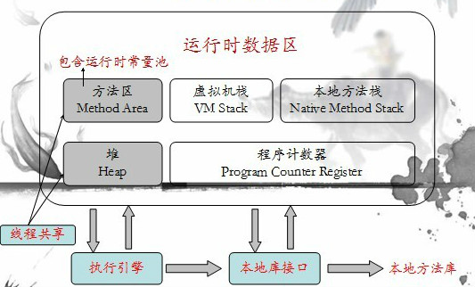
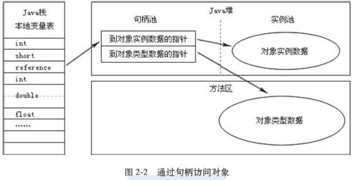
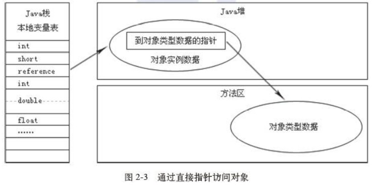
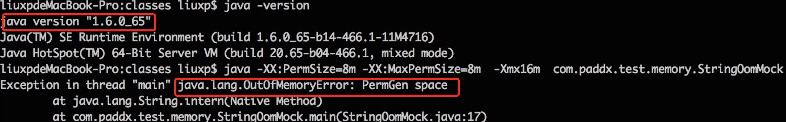
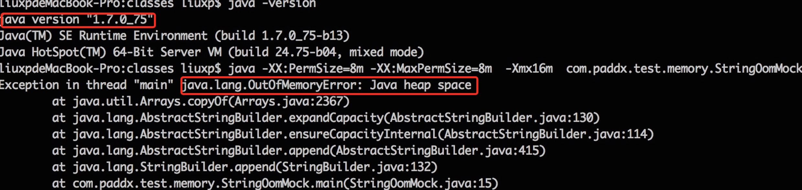
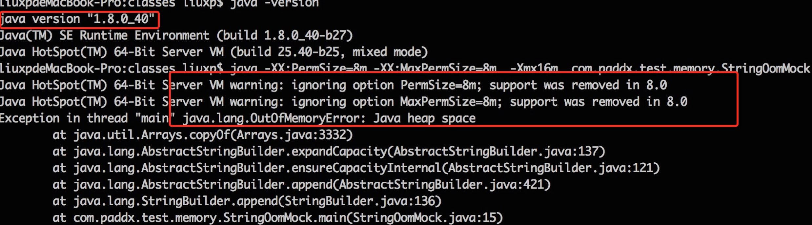
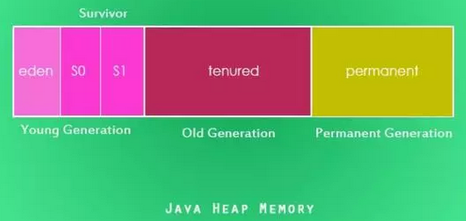

# 1.jvm
[TOC]
## 一. 概述
### 1.1 常见的jvm
常见的jvm有以下几种：
#### 1.1.1 Sun HotSpot
1. 网友说是C++编写的。
2. 虚拟机栈和本地方法栈合二为一
#### 1.1.2 BEA Jrockit
#### 1.1.3 IBM J9
#### 1.1.4 Dalvik(Android)
### 1.2 jvm的定义
JVM有自己完善的硬件架构，如处理器、堆栈（Stack）、寄存器等，还具有相应的指令系统（字节码就是一种指令格式）。JVM屏蔽了与具体操作系统平台相关的信息，使得Java程序只需要生成在Java虚拟机上运行的目标代码（字节码），就可以在多种平台上不加修改地运行。JVM是Java平台无关的基础。
### 1.3 jvm、java编译器、java解释器的关系
## 二. 基础
### 2.1 java运行时内存区(也叫运行时数据区runtime data area)
经常有人把Java内存区分为堆内存（Heap）和栈内存（Stack），这种分法比较粗糙，Java内存区域的划分实际上远比这复杂。
Java虚拟机在执行Java程序的过程中会把它所管理的内存划分为若干个不同的数据区域。这些区域都有各自的用途，以及创建和销毁的时间，有的区域随着虚拟机进程的启动而存在，有些区域则是依赖用户线程的启动和结束而建立和销毁。根据《Java虚拟机规范（第2版）》的规定，Java虚拟机所管理的内存将会包括以下几个运行时数据区域，如下图所示：



#### 2.1.1 程序计数器　　　　　
程序计数器（Program Counter Register）是一块较小的内存空间，它的作用可以看做是当前线程所执行的字节码的行号指示器。在虚拟机的概念模型里（仅是概念模型，各种虚拟机可能会通过一些更高效的方式去实现），字节码解释器工作时就是通过改变这个计数器的值来选取下一条需要执行的字节码指令，分支、循环、跳转、异常处理、线程恢复等基础功能都需要依赖这个计数器来完成。 由于Java虚拟机的多线程是通过线程轮流切换并分配处理器执行时间的方式来实现的，在任何一个确定的时刻，一个处理器（对于多核处理器来说是一个内核）只会执行一条线程中的指令。因此，为了线程切换后能恢复到正确的执行位置，**每条线程都需要有一个独立的程序计数器**，各条线程之间的计数器互不影响，独立存储，我们称这类内存区域为“线程私有”的内存。 如果线程正在执行的是一个Java方法，这个计数器记录的是**正在执行的虚拟机字节码指令的地址**；如果正在执行的是Natvie方法，这个**计数器值则为空（Undefined）**。**此内存区域是唯一一个在Java虚拟机规范中没有规定任何OutOfMemoryError情况的区域**。

#### 2.1.2 Java虚拟机栈
与程序计数器一样，Java虚拟机栈（Java Virtual Machine Stacks）也是线程私有的，它的生命周期与线程相同。虚拟机栈描述的是Java方法执行的内存模型：每个方法被执行的时候都会同时创建一个**栈帧**（Stack Frame）用于存储**局部变量表**、**操作栈**、**动态链接**、**方法出口**等信息。每一个方法被调用直至执行完成的过程，就对应着一个栈帧在虚拟机栈中从**入栈到出栈**的过程。
　　经常有人把Java内存区分为堆内存（Heap）和栈内存（Stack），这种分法比较粗糙，Java内存区域的划分实际上远比这复杂。这种划分方式的流行只能说明大多数程序员最关注的、与对象内存分配关系最密切的内存区域是这两块。其中所指的“堆”在后面会专门讲述，而所指的“栈”就是现在讲的虚拟机栈，或者说是虚拟机栈中的局部变量表部分。
##### 2.1.2.1 局部变量表
局部变量表存放了编译期可知的各种基本数据类型（boolean、byte、char、short、int、float、long、double）、对象引用（reference类型），它不等同于对象本身，根据不同的虚拟机实现，它可能是一个指向对象起始地址的引用指针，也可能指向一个代表对象的句柄或者其他与此对象相关的位置）和returnAddress类型（指向了一条字节码指令的地址）。
　　其中64位长度的long和double类型的数据会占用2个局部变量空间（Slot），其余的数据类型只占用1个。局部变量表所需的内存空间在编译期间完成分配，当进入一个方法时，这个方法需要在帧中分配多大的局部变量空间是完全确定的，在方法运行期间不会改变局部变量表的大小。 在Java虚拟机规范中，对这个区域规定了两种异常状况：如果线程请求的栈深度大于虚拟机所允许的深度，将抛出**StackOverflowError**异常(比如一个函数反复递归自己会出现这种异常)；如果虚拟机栈可以动态扩展（当前大部分的Java虚拟机都可动态扩展，只不过Java虚拟机规范中也允许固定长度的虚拟机栈），当扩展时无法申请到足够的内存时会抛出OutOfMemoryError异常。
#### 2.1.3 本地方法栈
　　本地方法栈（Native Method Stacks）与虚拟机栈所发挥的作用是非常相似的，其区别不过是**虚拟机栈为虚拟机执行Java方法（也就是字节码）服务，而本地方法栈则是为虚拟机使用到的Native方法服务**。虚拟机规范中对本地方法栈中的方法使用的语言、使用方式与数据结构并没有强制规定，因此具体的虚拟机可以自由实现它。甚至有的虚拟机（譬如Sun HotSpot虚拟机）直接就把本地方法栈和虚拟机栈合二为一。与虚拟机栈一样，本地方法栈区域也会抛出StackOverflowError和OutOfMemoryError异常。
#### 2.1.4 Java堆
对于大多数应用来说，Java堆（Java Heap）是Java虚拟机所管理的内存中**最大的一块**。Java堆是被**所有线程共享的一块内存区域，在虚拟机启动时创建**。此内存区域的唯一目的就是存放对象实例，**几乎所有的对象实例都在这里分配内存**。这一点在Java虚拟机规范中的描述是：所有的对象实例以及数组都要在堆上分配，但是随着JIT编译器的发展与逃逸分析技术的逐渐成熟，栈上分配、标量替换优化技术将会导致一些微妙的变化发生，所有的对象都分配在堆上也渐渐变得不是那么“绝对”了。
　　Java堆是**垃圾收集器管理**的主要区域，因此很多时候也被称做“GC堆”（Garbage Collected Heap，幸好国内没翻译成“垃圾堆”）。如果从内存回收的角度看，由于现在收集器基本都是采用的分代收集算法，所以Java堆中还可以细分为：**新生代和老年代**；再细致一点的有Eden空间、From Survivor空间、To Survivor空间等。如果从内存分配的角度看，线程共享的Java堆中可能划分出多个线程私有的分配缓冲区（Thread Local Allocation Buffer，TLAB）。不过，无论如何划分，都与存放内容无关，无论哪个区域，存储的都仍然是对象实例，进一步划分的目的是为了更好地回收内存，或者更快地分配内存。
　　根据Java虚拟机规范的规定，Java堆可以处于物理上不连续的内存空间中，只要逻辑上是连续的即可，就像我们的磁盘空间一样。在实现时，既可以实现成固定大小的，也可以是可扩展的，不过当前主流的虚拟机都是按照可扩展来实现的（通过-Xmx和-Xms控制）。如果在堆中没有内存完成实例分配，并且堆也无法再扩展时，将会抛出OutOfMemoryError异常。
#### 2.1.5 方法区
方法区（Method Area）与Java堆一样，是各个线程**共享的内存区域**，它用于存储已被虚拟机加载的**类信息**、**常量**、**静态变量**、**即时编译器编译后的代码等**数据。当程序中通过getName、isInterface等方法来获取信息时，这些数据来源于方法区。由于使用反射机制的原因，虚拟机**很难推测哪个类信息不再使用**，因此这块区域的**回收很难**！另外，对这块区域主要是针对**常量池**回收，值得注意的是**JDK1.7已经把常量池转移到堆**里面了。虽然Java虚拟机规范把方法区描述为堆的一个逻辑部分，但是它却有一个别名叫做Non-Heap（非堆），目的应该是与Java堆区分开来。
　　对于习惯在HotSpot虚拟机上开发和部署程序的开发者来说，很多人愿意把方法区称为“永久代”（Permanent Generation），本质上两者并不等价，仅仅是因为HotSpot虚拟机的设计团队选择把GC分代收集扩展至方法区，或者说使用永久代来实现方法区而已。对于其他虚拟机（如BEA JRockit、IBM J9等）来说是不存在永久代的概念的。即使是HotSpot虚拟机本身，根据官方发布的路线图信息，现在也有放弃永久代并“搬家”至Native Memory来实现方法区的规划了。
　　Java虚拟机规范对这个区域的限制非常宽松，除了和Java堆一样不需要连续的内存和可以选择固定大小或者可扩展外，还可以选择不实现垃圾收集。相对而言，垃圾收集行为在这个区域是比较少出现的，但并非数据进入了方法区就如永久代的名字一样“永久”存在了。这个区域的内存回收目标主要是针对常量池的回收和对类型的卸载，一般来说这个区域的回收“成绩”比较难以令人满意，尤其是类型的卸载，条件相当苛刻，但是这部分区域的回收确实是有必要的。在Sun公司的BUG列表中，
　　曾出现过的若干个严重的BUG就是由于低版本的HotSpot虚拟机对此区域未完全回收而导致内存泄漏。 根据Java虚拟机规范的规定，**当方法区无法满足内存分配需求时，将抛出OutOfMemoryError异常**。
##### 2.1.5.1 运行时常量池
运行时常量池（Runtime Constant Pool）是方法区的一部分。Class文件中除了有类的版本、字段、方法、接口等描述等信息外，还有一项信息是**常量池（Constant Pool Table）**，用于存放编译期生成的各种字面量和符号引用，这部分内容将在类加载后存放到方法区的运行时常量池中。 Java虚拟机对Class文件的每一部分（自然也包括常量池）的格式都有严格的规定，每一个字节用于存储哪种数据都必须符合规范上的要求，这样才会被虚拟机认可、装载和执行。但对于
　　运行时常量池，Java虚拟机规范没有做任何细节的要求，不同的提供商实现的虚拟机可以按照自己的需要来实现这个内存区域。不过，一般来说，除了保存Class文件中描述的符号引用外，还会把翻译出来的直接引用也存储在运行时常量池中。 运行时常量池相对于Class文件常量池的另外一个重要特征是具备动态性，Java语言并不要求常量一定只能在编译期产生，也就是并非预置入Class文件中常量池的内容才能进入方法区运行时常量池，运行期间也可能将新的常量放入池中，这种特性被开发人员利用得比较多的便是String类的intern()方法。 既然运行时常量池是方法区的一部分，自然会受到方法区内存的限制，当常量池无法再申请到内存时会抛出OutOfMemoryError异常。
#### 2.1.6 关于对象访问
　　介绍完Java虚拟机的运行时数据区之后，我们就可以来探讨一个问题：在Java语言中，对象访问是如何进行的？对象访问在Java语言中无处不在，是最普通的程序行为，但即使是最简单的访问，也会却涉及Java栈、Java堆、方法区这三个最重要内存区域之间的关联关系，如下面的这句代码：
```java
Object obj = new Object();
```
假设这句代码出现在方法体中，那“Object obj”这部分的语义将会反映到Java栈的本地变量表中，作为一个reference类型数据出现。而“new Object()”这部分的语义将会反映到Java堆中，形成一块存储了Object类型所有实例数据值（Instance Data，对象中各个实例字段的数据）的结构化内存，根据具体类型以及虚拟机实现的对象内存布局（Object Memory Layout）的不同，这块内存的长度是不固定的。另外，在Java堆中还必须包含能查找到此对象类型数据（如对象类型、父类、实现的接口、方法等）的地址信息，这些类型数据则存储在方法区中。
　　由于reference类型在Java虚拟机规范里面只规定了一个指向对象的引用，并没有定义这个引用应该通过哪种方式去定位，以及访问到Java堆中的对象的具体位置，因此不同虚拟机实现的对象访问方式会有所不同，主流的访问方式有两种：使用句柄和直接指针。 如果使用句柄访问方式，Java堆中将会划分出一块内存来作为句柄池，reference中存储的就是对象的句柄地址，而句柄中包含了对象实例数据和类型数据各自的具体地址信息，如下图所示：

　　如果使用的是直接指针访问方式，Java 堆对象的布局中就必须考虑如何放置访问类型数据的相关信息，reference中直接存储的就是对象地址，如下图所示：

　　这两种对象的访问方式各有优势，使用句柄访问方式的最大好处就是reference中存储的是稳定的句柄地址，在对象被移动（垃圾收集时移动对象是非常普遍的行为）时只会改变句柄中的实例数据指针，而reference本身不需要被修改。使用直接指针访问方式的最大好处就是速度更快，它节省了一次指针定位的时间开销，由于对象的访问在Java中非常频繁，因此这类开销积少成多后也是一项非常可观的执行成本。就本书讨论的主要虚拟机Sun HotSpot而言，它是使用第二种方式进行对象访问的，但从整个软件开发的范围来看，各种语言和框架使用句柄来访问的情况也十分常见。
#### 2.1.7 关于私有和共享
各个部分有一些是线程私有的，其他则是线程共享的。

1. 线程私有的如下：

    1. 程序计数器当前线程所执行的字节码的行号指示器
    2.  Java虚拟机栈Java方法执行的内存模型，每个方法被执行时都会创建一个栈帧，存储局部变量表、操作栈、动态链接、方法出口等信息。
        1. 每个线程都有自己独立的栈空间
        2. 线程栈只存基本类型和对象地址
        3. 方法中局部变量在线程空间中
    3. 本地方法栈Native方法服务。在HotSpot虚拟机中和Java虚拟机栈合二为一。
2. 线程共享的如下：
    1. Java堆存放对象实例，几乎所有的对象实例以及其属性都在这里分配内存。
    2. 方法区存储已经被虚拟机加载的类信息、常量、静态变量、JIT编译后的代码等数据。
    3. 运行时常量池方法区的一部分。用于存放编译期生成的各种字面量和符号引用。
    4. 直接内存NIO、Native函数直接分配的堆外内存。DirectBuffer引用也会使用此部分内存。
3. 注意：
    1. 此处的程序计数器并不是计算机CPU中的程序计数器，但是功能在逻辑上是等同的
    2. 由于程序计数器中存储的数据所占空间的大小不会随程序的执行而发生改变，因此，对于程序计数器是不会发生内存溢出现象(OutOfMemory)的。
#### 2.1.8 关于三个常量池
##### 2.1.8.1 全局字符串池（string pool也有叫做string literal pool）
全局字符串池里的内容是在类加载完成，经过验证，准备阶段之后在堆中生成字符串对象实例，然后将该字符串对象实例的引用值存到string pool中（记住：string pool中存的是引用值而不是具体的实例对象，具体的实例对象是在堆中开辟的一块空间存放的。）。
在HotSpot VM里实现的string pool功能的是一个StringTable类，它是一个哈希表，里面存的是驻留字符串(也就是我们常说的用双引号括起来的)的引用（而不是驻留字符串实例本身），也就是说在堆中的某些字符串实例被这个StringTable引用之后就等同被赋予了”驻留字符串”的身份。这个StringTable在每个HotSpot VM的实例只有一份，被所有的类共享。
（但是我觉得把这里当做存的字符串对象实例来理解更容易理解，待补充）
##### 2.1.8.2 class文件常量池（class constant pool）
class文件中除了包含类的版本、字段、方法、接口等描述信息外，还有一项信息就是常量池(constant pool table)，用于存放编译器生成的各种字面量(Literal)和符号引用(Symbolic References)。
字面量就是我们所说的常量概念，如文本字符串、被声明为final的常量值等。
符号引用是一组符号来描述所引用的目标，符号可以是任何形式的字面量，只要使用时能无歧义地定位到目标即可（它与直接引用区分一下，直接引用一般是指向方法区的本地指针，相对偏移量或是一个能间接定位到目标的句柄）。
##### 2.1.8.3 运行时常量池（runtime constant pool）
jvm在执行某个类的时候，必须经过加载、连接、初始化，而连接又包括验证、准备、解析三个阶段。而当类加载到内存中后，jvm就会将class常量池中的内容存放到运行时常量池中，由此可知，运行时常量池也是每个类都有一个。
##### 2.1.8.4 总结
1. 全局常量池在每个VM中只有一份，存放的是字符串常量的引用值。
2. class常量池是在编译的时候每个class都有的，在编译阶段，存放的是常量的符号引用。
3. 运行时常量池是在类加载完成之后，将每个class常量池中的符号引用值转存到运行时常量池中，也就是说，每个class都有一个运行时常量池（这句可能有问题），类在解析之后，将符号引用替换成直接引用，与全局常量池中的引用值保持一致。
4. 从网上资料来看，运行时常量池和字符串常量池都在方法区中，但是应该是分开的（待补充）
#### 2.1.9 关于永久代和元空间
##### 2.1.9.1 PermGen（永久代）
大部分 Java 程序员应该都见过 "java.lang.OutOfMemoryError: PermGen space "这个异常。这里的 “PermGen space”其实指的就是方法区。不过方法区和“PermGen space”又有着本质的区别。前者是 JVM 的规范，而后者则是 JVM 规范的一种实现，并且只有 HotSpot 才有 “PermGen space”，而对于其他类型的虚拟机，如 JRockit（Oracle）、J9（IBM） 并没有“PermGen space”。由于方法区主要存储类的相关信息，所以对于动态生成类的情况比较容易出现永久代的内存溢出。最典型的场景就是，在 jsp 页面比较多的情况，容易出现永久代内存溢出。
##### 2.1.9.2 Metaspace（元空间）
其实，移除永久代的工作从JDK1.7就开始了。JDK1.7中，存储在永久代的部分数据就已经转移到了Java Heap或者是 Native Heap。但永久代仍存在于JDK1.7中，并没完全移除，譬如符号引用(Symbols)转移到了native heap；字面量(interned strings)转移到了java heap；类的静态变量(class statics)转移到了java heap。我们可以通过一段程序来比较 JDK 1.6 与 JDK 1.7及 JDK 1.8 的区别，以字符串常量为例：
```java
    static String  base = "string";
    public static void main(String[] args) {
        List<String> list = new ArrayList<String>();
        for (int i=0;i< Integer.MAX_VALUE;i++){
            String str = base + base;
            base = str;
            list.add(str.intern());
        }
    }
```
这段程序以2的指数级不断的生成新的字符串，这样可以比较快速的消耗内存。我们通过 JDK 1.6、JDK 1.7 和 JDK 1.8 分别运行：
JDK 1.6 的运行结果：

JDK 1.7的运行结果：

JDK 1.8的运行结果：


从上述结果可以看出，JDK 1.6下，会出现“PermGen Space”的内存溢出，而在 JDK 1.7和 JDK 1.8 中，会出现堆内存溢出，并且 JDK 1.8中 PermSize 和 MaxPermGen 已经无效。因此，可以大致验证 JDK 1.7 和 1.8 将字符串常量由永久代转移到堆中，并且 JDK 1.8 中已经不存在永久代的结论。现在我们看看元空间到底是一个什么东西？

　　元空间的本质和永久代类似，都是对JVM规范中方法区的实现。不过元空间与永久代之间最大的区别在于：元空间并不在虚拟机中，而是使用本地内存。因此，默认情况下，元空间的大小仅受本地内存限制，但可以通过以下参数来指定元空间的大小：

　　-XX:MetaspaceSize，初始空间大小，达到该值就会触发垃圾收集进行类型卸载，同时GC会对该值进行调整：如果释放了大量的空间，就适当降低该值；如果释放了很少的空间，那么在不超过MaxMetaspaceSize时，适当提高该值。
　　-XX:MaxMetaspaceSize，最大空间，默认是没有限制的。

　　除了上面两个指定大小的选项以外，还有两个与 GC 相关的属性：
　　-XX:MinMetaspaceFreeRatio，在GC之后，最小的Metaspace剩余空间容量的百分比，减少为分配空间所导致的垃圾收集
　　-XX:MaxMetaspaceFreeRatio，在GC之后，最大的Metaspace剩余空间容量的百分比，减少为释放空间所导致的垃圾收集

现在我们在 JDK 8下重新运行一下代码段 4，不过这次不再指定 PermSize 和 MaxPermSize。而是指定 MetaSpaceSize 和 MaxMetaSpaceSize的大小。输出结果如下：

##### 2.1.9.3 总结：为什么要做这个转换？
1. 字符串存在永久代中，容易出现性能问题和内存溢出。
2. 类及方法的信息等比较难确定其大小，因此对于永久代的大小指定比较困难，太小容易出现永久代溢出，太大则容易导致老年代溢出。
3. 永久代会为 GC 带来不必要的复杂度，并且回收效率偏低。
4. Oracle 可能会将HotSpot 与 JRockit 合二为一。
### 2.2 垃圾回收
1. 垃圾回收只负责回收堆内存中的对象，不会回收任何物理资源（例如数据库连接、网络IO等资源）
2. 程序无法精确控制垃圾回收的运行
3. 在回收任何对象之前，总会调用它的finalize（）方法，该方法可能会让对象重新复活
#### 2.2.1 对象在内存中的状态
* 可达状态：有一个以上的引用指向它（如果根据对象的四种引用还可以继续细分为强可达(Strong Reachable)、软可达、弱可达、虚可达）
* 可恢复状态：没有引用指向它，finalize（）方法还未被调用
* 不可达状态：没有引用指向它，调用finalize（）方法后任然没有变为可达状态。
**只有当一个对象处于不可达状态时，系统才会真正回收该对象所占的资源**
##### 2.2.1.1 GC Roots
当一个对象到GC Roots没有任何引用链相连时，则证明这个对象为可回收的对象。
GC Roots的主要有以下几种：
1. 栈帧中的本地变量表所引用的对象。
2. 方法区中类静态属性和常量引用的对象。 
3. 本地方法栈中JNI（Native方法）引用的对象。

#### 2.2.2 强制垃圾回收（官方文档中是"suggests"，把"强制"翻译成"建议"更准确）
1. 建议jvm进行垃圾回收，jvm会尽最大努力进行垃圾回收，大部分情况下建议后总会有一些效果，但是否进行垃圾回收仍然是不确定的
```java
System.gc();
Runtime.getRuntime.gc();
```
2. 建议jvm调用可恢复对象的finalize（）方法，jvm会尽最大努力去做，大部分情况下总会有一些效果，但是否调用依然是不确定的
```java
System.runFinalization();
Runtime.getRuntime().runFinalization();
```
注意一般runFinalization()方法写在gc()后面才会有效，不加gc()的话jvm可能并没有进行垃圾回收，也就不会执行runFinalization()方法
#### 2.2.3 finalize()方法
java默认的清理对象资源的机制就是finalize()方法，有4个特点
1. 永远不要去主要调用该方法(),应该交给垃圾回收器去调用
2. 该方法何时被调用以及是否被调用都具有不确定性
3. jvm调用finalize（）方法时，可能让对象重新变成可达状态
4. 该方法出现异常时，不会报告异常，程序继续执行。可能造成对象处于破坏的状态，被破坏的对象又很可能导致部分资源无法被回收, 造成浪费
#### 2.2.4 对象的四种引用类型
1. 强引用（StrongReference） 
对象有强引用时一定不会被垃圾回收
2. 软引用（SoftReference） 
当内存空间不足时才可能回收它的对象，通常用于对内存敏感的程序
3. 弱引用（WeakReference） 
垃圾回收时一定会回收它的对象
```java
private static int count=0;
	public static void main(String[] args) {
		Map<String, String> list = new HashMap<String, String>();  
        long i = 1;  
        while (i < 100000000L) {  
            list.put(  
                    String.valueOf(i),  
                    "JDJJDJJJJJJJJJJ%%%%%%%%JJJJJJJJJJJJJJJKKKKKKKKKKKKKKKKKJJJJJJ"  
                            + "JJJKKKKKHDDDJDJDJDJDJDJDJDJJDJDJDJDJDJDJJDJDJDJDJJDJDJJJJJJJJJ"  
                            + "JJJJJJJJJJJJJJJJJJJJJJJJJJJJJJJJJJJJJJJJJJJJJJJJJJJJJJJJJJJJJJ"  
                            + "JJJJJJJJJJJJJJJJJJJJJJJJJJJJ");  
  
            // 测试第一个是否依然存活  
            if (i % 100000 == 0) {  
            	System.out.println("第"+i+"个");
                System.out.println(list.get(String.valueOf(1)));  
            }  
  
            i++;  
        }  
	}
```
上面这个例子，会抛出OOM异常，如果把HashMap换成WeakHashmap则不会。Java语言的数组、集合等容器，对里面的每一个对象都有一个引用，大数据的情况下要小心内存泄露。弱引用只适合cache等特殊场景，对于那些一定不能Java让垃圾回收器回收的对象，要使用强引用。
4. 虚引用（PhantomReference）
类似于没有引用，主要用于跟踪对象的垃圾回收状态，不能单独使用，必须和引用队列(ReferenceQueue)联合使用 
#### 2.2.5 典型的垃圾回收算法
##### 2.2.5.1 Mark-Sweep（标记-清除）算法
##### 2.2.5.2 Copying（复制）算法
Copying算法将可用内存按容量划分为大小相等的两块，每次只使用其中的一块。当这一块的内存用完了，就将还存活着的对象复制到另外一块上面，然后再把第一块内存上的空间一次清理掉，这样就不容易出现内存碎片的问题，并且运行高效。
##### 2.2.5.3 Mark-Compact（标记-整理）算法
为了解决Copying算法的缺陷，充分利用内存空间，提出了Mark-Compact算法。
该算法标记阶段标记出所有需要被回收的对象，但是在完成标记之后不是直接清理可回收对象，而是将存活的对象都移向一端，然后清理掉端边界以外的所有内存（只留下存活对象）。
##### 2.2.5.4 Generational Collection（分代收集）算法
分代收集算法是目前大部分JVM的垃圾收集器采用的算法。
它的核心思想是将堆区划分为**老年代（Tenured Generation）和新生代（Young Generation）**，老年代的特点是每次垃圾收集时只有少量对象需要被回收，而新生代的特点是每次垃圾回收时都有大量的对象需要被回收，那么就可以在不同代的采取不同的最适合的收集算法。
&emsp;&emsp;目前大部分垃圾收集器对于新生代都采取Copying算法，因为新生代中每次垃圾回收都要回收大部分对象，也就是说需要复制的操作次数较少，该算法效率在新生代也较高。但是实际中并不是按照1：1的比例来划分新生代的空间的，一般来说是将新生代划分为一块较大的Eden空间和两块较小的Survivor空间（比例8：1：1），每次使用Eden空间和其中的一块Survivor空间，当进行回收时，将还存活的对象复制到另一块Survivor空间中，然后清理掉Eden和A空间。在进行了第一次GC之后，使用的便是Eden space和B空间了，下次GC时会将存活对象复制到A空间，如此反复循环。
&emsp;&emsp;当对象在Survivor区躲过一次GC的话，其对象年龄便会加1，默认情况下，对象年龄达到15时，就会移动到老年代中。一般来说，大对象会被直接分配到老年代，所谓的大对象是指需要大量连续存储空间的对象，最常见的一种大对象就是大数组，比如：byte[] data = newbyte[4*1024*1024]。
当然分配的规则并不是百分之百固定的，这要取决于当前使用的是哪种垃圾收集器组合和JVM的相关参数。这些**搬运工作都是GC完成的**，GC不仅负责在Heap中搬运实例，同时负责回收存储空间。
&emsp;&emsp;最后，因为每次回收都只回收少量对象，所以老年代一般使用的是标记整理算法。
注意，在方法区中有一个永久代（Permanet Generation），它用来存储class文件、静态对象、方法描述等。对永久代的回收主要回收两部分内容：废弃常量和无用的类。

###### 2.2.5.4.1 Minor GC
Minor GC是新生代Copying算法。MinorGC触发条件：
1. 当Eden区满时，触发Minor GC。
###### 2.2.5.4.2 Full GC
Full GC的老年代，采取的Mark-Compact。Full GC触发条件：
1. 调用System.gc时，系统建议执行Full GC，但是不必然执行。
2. 老年代空间不足。
3. 方法区空间不足。
4. 通过Minor GC后进入老年代的平均大小大于老年代的可用内存。
#### 2.2.6 典型的垃圾回收器
##### 2.2.6.1  Serial&Serial Old
##### 2.2.6.2  ParNew
##### 2.2.6.3  Parallel Scavenge
##### 2.2.6.4  Parallel Old
##### 2.2.6.5  CMS
##### 2.2.6.6  G1