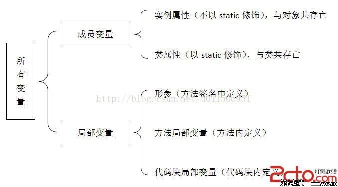
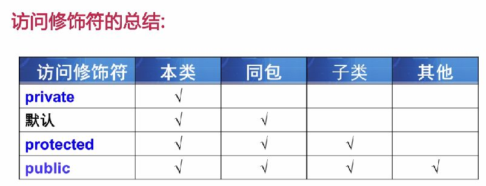
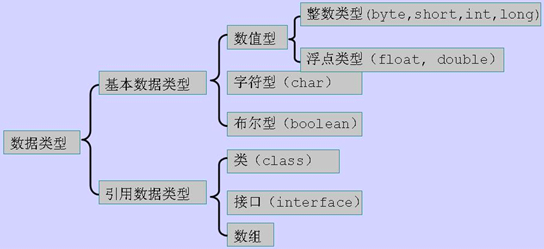
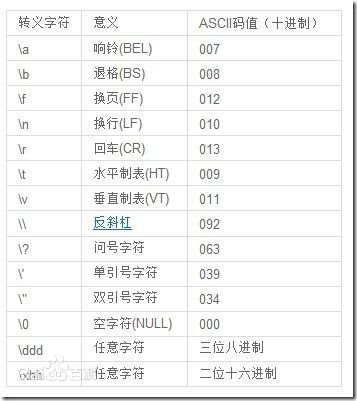
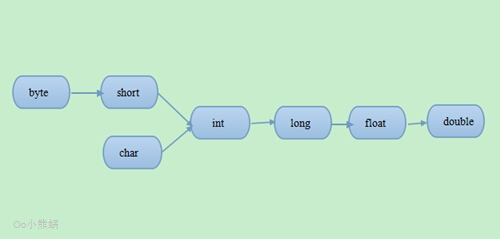

# java
[TOC]
# 一 概述

## 1 简介

## 2 历史
### 2.1 java1
1998年JDK 1.0（Java 1.0）发布

### 2.5 java5
新增了工业级 的构建模块，如线程池和并发集合

### 2.6 java6

### 2.7 java7
从jdk从7开始，出现了自由使用的公共版本（openjdk)，而原来的jdk（分为个人版（研究使用）和企业（商用））是有版权的。

新增了分支/合并（fork/join）框架，使得并行 变得更实用，但仍然很困难。

### 2.8 java8
2014年3月27日——甲骨文公司日前举办Java 8网络直播发布会，发布甲骨文迄今为止最重要的Java技术Java 8。甲骨文宣布推出了Java平台标准版8（Java SE 8）、Java平台微型版8（Java ME 8）以及Oracle Java Embedded产品（为中到高端嵌入式系统进行了优化）的有关版本。JDK 8是Java SE 8平台规范的生产就绪版本，不久前获得Java社区进程（Java Community Process,JCP）批准。JDK 8包括自该平台1996年推出以来最重大的Java编程模型升级。JDK 8经甲骨文与OpenJDK社区合作开发而成。

JDK 8的重要特性包括:
1. Project Lambda（JSR 335）:在Lambda之前，方法只能传一般意义的对象，此时依赖注入(DI)对Java很重要，用来注入对象。Java 8有了Lambda，很多时候方法参数传Lambda(单函数对象)就可以了，方便了很多
2. Nashorn JavaScript引擎
3. 一个新的日期与时间API（JSR 310）
4. 一套简洁的配置文件以及从HotSpot Jave虚拟机（JVM）中去除了“永久代（permanent generation）”。
5. 其他特性还有：
    1. Optional：官方介绍如下
        >A container object which may or may not contain a non-null value. If a value is present, isPresent() will return true and get() will return the value.(一个可能包含也可能不包含非null值的容器对象。 如果存在值，isPresent（）将返回true，get（）将返回该值)
        
        针对复杂的一长串判空，Optional有它的优势，但是对于简单的判空使用Optional也会增加代码的阅读成本、编码量以及团队新成员的学习成本。
        1. 所以Optional的优点如下
            1. 包装防御式编程代码
            2. 链式调用
            3. 有效避免程序代码中的空指针

### 2.9 java9
特性：
1. lombak的val/var(待整理)
2. 增加了实验性的jaotc：jaotc主要用来辅助JIT，在JIT编译器运行前避免直接解释没有预编译过的代码。
3. flow

### 2.10 java10
var

### 2.13 java13
switch

### 2.14 java14
instanceof 模式匹配

### jdk和openjdk的区别
授权协议的不同：OpenJDK采用GPL V2协议发布，而JDK则采用JRL协议发布。两个协议虽然都是开放源代码的，但是在使用上的不同在于GPL V2允许在商业上使用，而JRL只允许个人研究使用（个人使用和非商业使用）。 

OpenJDK只包含最精简的JDK：OpenJDK不包含其他的软件包，比如Rhino Java DB JAXP……，并且可以分离的软件包也都是尽量的分离，但是这大多数都是自由软件，你可以自己下载加入。 

OpenJDK源代码不完整：这个很容易想到，在采用GPL协议的OpenJDK中，SUN JDK的一部分源代码因为产权的问题无法开放OpenJDK使用，其中最主要的部分就是JMX中的可选元件SNMP部分的代码。
因此这些不能开放的源代码将它作成plug，以供OpenJDK编译时使用，你也可以选择不要使用plug。
而Icedtea则为这些不完整的部分开发了相同功能的源代码(OpenJDK6)，促使OpenJDK更加完整。 

部分源代码用开源代码替换：由于产权的问题，很多是SUN JDK的源代码被替换成一些功能相同的开源代码，比如说字体栅格化引擎，使用Free Type代替

## 3 常识
### 3.1 命令习惯
1. java为工具类命令的习惯是添加一个字母s
2. 关于clazz、Klass、JavaClass、ClassMirror等：RednaxelaFX大神的解释说是C++里class是关键字，所以要避开，就用这几个代替成习惯吧

### 3.2 迭代和遍历的异同
迭代按照某种顺序逐个访问集合或数组的每一项，遍历是按某种规则访问树形结构中的每个节点，两者都不能对执行代码进行迭代或遍历。个人觉得，比如访问数组中的每一项，这个叫迭代；访问数组中长度大于3的项，这个叫遍历。（待确认）

### 3.3 父类和子类的初始化顺序是什么？(待测试)
先父类，后子类，不管子类里有没有调用super(args);来初始化父类。

顺序如下:
1. 父类静态成员和静态初始化块，按在代码中出现的顺序依次执行（只发生在类加载时）。 
2. 子类静态成员和静态初始化块，按在代码中出现的顺序依次执行（只发生在类加载时）。 
3. 父类实例成员和实例初始化块，按在代码中出现的顺序依次执行（以下为对象初始化）。 
4. 执行父类的构造方法。 
5. 子类实例成员和实例初始化块，按在代码中出现的顺序依次执行。 
6. 执行子类的构造方法。

注意：
1. 如果B extend A，但是只是调用了A的静态域，那么也只会初始化A类，B类当做没看见。btw，这就是个坑。 
2. 如果实例初始化块在实例成员之前，并且都赋值了实例成员，那么实例最终的值是实例成员定义时赋的值。可以这么理解，实例成员先声明，然后将初始化块和声明时的赋值，按顺序执行。

### 3.4 什么是绑定？什么是前期绑定，什么是后期绑定？
将方法调用和方法主题关联起来。像C语言这种在编译时期即确定关联关系的叫做前期绑定；java等语言支持在运行时确定关联关系，叫做后期绑定、动态绑定、运行时绑定。

### 3.5 接口中可以嵌套接口吗？若可以，新接口可以是什么访问权限？
可以嵌套。由于接口内所有元素都是public的，所以新接口也是public的。注意，不需要特意加一个public关键字来修饰新接口。

# 二 安装配置
## 1 windows
1. 下载jdk并安装.路径中不能有中文，最好不要有空格

2. 配置JAVA_HOME、PATH和CLASSPATH（ClASSPATH在1.5之后可以不用配置）
- JAVA_HOME一般是:`C:\Program Files\Java\<jdk版本号>`，不包括bin目录
- PATH的目的是将`%JAVA_HOME%/bin`目录添加到执行路径中，
- CLASSPATH的作用是当用`java xxx(java类名)`运行java程序的时候告诉JRE，到哪里去搜索java类。jdk1.4前java不知道在当前目录下搜索，而且还需要dt.jar和tools.jar，所以应该设置CLASSPATH环境变量：`.;%JAVA_HOME%\lib\dt.jar;%JAVA_HOME%\lib\tools.jar`。但jdk1.5后，JRE会自动搜索和加载dt.jar和tools.jar，所以不用配置

3. 安装库源文件和文档:库源文件在是jdk目录中src.zip;文档去官网下载，一般是jdk-version-docs-all.zip

4. 命令行下的简单运行
```
javac xxx.java  //编译
java xxx        //运行
```

## 2 mac
mac上可以同时安装多个版本的jdk，但是现在的mac都没有自带jdk，有以下方式安装
1.  https://developer.apple.com/downloads/ 或者 Oracle 网站上下载:但是卸载和升级比较麻烦，JDK安装文件是 pkg 格式，卸载和.app不一样，且没有自动卸载方式。
2. brew
    1. 安装最新的java(两者的区别，待补充):
        1. `brew install java`:安装后还需要自己设置软链接等
        2. `brew cask install java`(推荐用这个)
    2. 安装老版本的java：需要先克隆这个仓库`brew tap caskroom/versions`，然后安装，比如jdk6`brew cask install java6`

配置：
1. mac通过`/usr/libexec/java_home`工具来管理安装的jdk
    1. 查看安装后的java路径：`/usr/libexec/java_home`，一般显示结果是：`/Library/Java/JavaVirtualMachines/jdkxxx.jdk/Contents/Home`
    2. 查看安装了哪几个版本的jdk：`/usr/libexec/java_home -V`
        ```bash 
        # /usr/libexec/java_home -V
        Matching Java Virtual Machines (3):
        1.8.0_121, x86_64:	"Java SE 8"	/Library/Java/JavaVirtualMachines/jdk1.8.0_121.jdk/Contents/Home
        1.7.0_80, x86_64:	"Java SE 7"	/Library/Java/JavaVirtualMachines/jdk1.7.0_80.jdk/Contents/Home
        1.7.0_71, x86_64:	"Java SE 7"	/Library/Java/JavaVirtualMachines/jdk1.7.0_71.jdk/Contents/Home

        /Library/Java/JavaVirtualMachines/jdk1.8.0_121.jdk/Contents/Home
        ```
2. 切换jdk版本:
    1. mac的`java`命令(也就是`/usr/bin/java`)，在默认情况下指向的是已经安装的最新版本，可以设置环境变量`JAVA_HOME`来更改其指向
        ```bash
        $ java -version
        java version "1.8.0_60"
        Java(TM) SE Runtime Environment (build 1.8.0_60-b27)
        Java HotSpot(TM) 64-Bit Server VM (build 25.60-b23, mixed mode)
        $ JAVA_HOME=/Library/Java/JavaVirtualMachines/1.6.0.jdk/Contents/Home java -version
        java version "1.6.0_65"
        Java(TM) SE Runtime Environment (build 1.6.0_65-b14-466.1-11M4716)
        Java HotSpot(TM) 64-Bit Server VM (build 20.65-b04-466.1, mixed mode)
        # 其中JAVA_HOME=/Library/Java/JavaVirtualMachines/1.6.0.jdk/Contents/Home可以用JAVA_HOME=/usr/libexec/java_home -v 1.6``这种更加通用的方式代替
        ```
    2. 民间使用的 Java 版本切换方法：添加以下脚本到当前shell配置文件`~/.zprofile`或者`~/.bash_profile`中
        ```bash
        function setjdk() {
            export JAVA_HOME=`/usr/libexec/java_home -v $@`
        }
        ```
        这样我们就可以通过输入一条命令进行版本切换了：`setjdk 1.8`
    3. jenv(https://www.jenv.be):通过当前目录下的`.java-version`来决定使用哪个JDK,jenv可以用brew安装，但是jenv有几个问题(待整理)：
        1. 需要手动把`eval "$(jenv init -)"`加入 profile，没有 Oh My Zsh 插件.
        2. 可以把`eval "$(jenv init -)"`加入~/.zlogin，这样可以避免修改~/.zshrc。
        3. 需要手动添加 JDK，不会自动采集系统 JDK。跟 Ruby 不同，OS X 已经提供`/usr/libexec/java_home`工具来管理安装的 JDK。
        4. 需要 jenv rehash。

## 3 linux
1. 如果是prm文件安装，则检查是否在`/usr/java/jdk1.8_version`下；但是推荐下载.tar.gz格式的文件安装，可以直接解压到任何地方

# 三 基础
## 1 面向对象
### 1.1 类和对象
定义类的主要作用就是定义变量、创建实例和作为父类被继承。

##### 对象的this引用
this关键字总是指向调用该方法的对象实例,所以static修饰的方法里不能使用this.

主要使用场景:
1. 访问本对象的域，防止与方法的局部变量重名(也就是更加灵活)
2. 初始化对象:构造方法只能在构造方法中调用，且必须开始就调用，且只能调用一次
3. 将本对象传递给其他方法

注意:在类的一个方法里调用另一个方法,如果不加this就需要在方法里再创建一个实例

##### super
1. 用于限定该对象调用的它从父类继承得到的实例变量或方法，super如this一样不能出现在static修饰的方法中

##### 不可变类
1. 不可变类指的的是...
2. java的八个包装类和String都是不可变类
3. 不可变类的实力状态不会改变，所以如果经常使用到的不可变类，可以考虑缓存，然后共享
比如
```java
Integer in1 = new Integer(6);//这种方式不会缓存
Integer in2 = Integer.valueOf(6);//用这种方式创建，会缓存(-128~127)之间的Integer对象
Integer in3 = Integer.valueOf(6);
System.out.println(in1 == in2);//输出false
System.out.println(in3 == in2);//输出true
```

##### 抽象类(abstract class)
在某些情况下，父类只是知道其子类应该包含怎样的方法，但无法准确的知道子类如何实现这些方法。这个时候就可以用抽象类。
>比如有个Shape类，这个类应该提供一个计算周长的方法callPerimeter()，但不同的子类对周长的计算不一样，即Shape也不知道子类会如何实现该方法。有人会问，不知道那就不管它不就行了。这不是一个好思路，这样的话Shape类就不能调用该方法了，必须强制转换成其子类才能调用，降低了程序的灵活性。
所以抽象类的作用是为子类提供模板，避免子类设计的随意性。

抽象类和抽象方法的规则如下：
1. 都必须用abstract修饰，而且定义抽象类只需要在普通类上增加abstract修饰符即可
2. 抽象类不能被实例化，所以抽象类的构造器主要用于被其子类调用（抽象类只能被继承），抽象方法必须由子类提供实现（即重写，所以抽象方法不能用private修饰）。而final修饰的类不能被继承，final修饰的方法不能被重写，所以final和abstract永远不能同时使用。
3. 抽象方法不能有方法体
4. 含有抽象方法的类（包括直接定义了一个抽象方法；或继承了一个抽象父类，但没有完全实现父类包含的抽象方法；或实现了一个接口，但没有完全实现接口包含的抽象方法这三种情况）只能被定义为抽象类
5. abstract只能修饰类和方法，不能修饰构造器等
6. static和abstract不能同时修饰某个方法，但是可以同时修饰内部类
7. 抽象类可以包含成员变量、方法(普通方法和抽象方法都可以)、构造器、初始化块、内部类（接口、枚举）5种成分。

抽象类的意义:大概就是防止不正确的new对象.(待补充)

##### 接口
接口可以看做是抽象类的更抽象，接口是多个相似类抽象出来的规范，接口不提供任何实现（接口里不能包含普通方法），接口里的所有方法都是抽象方法。java8对接口进行了改进，允许在接口中定义默认方法。
接口体现的是规范和实现分离的设计哲学。接口定义的是多个类共同的公共行为规范，意味着接口里通常是定义一组公用方法。
1. 接口的修饰符可以是public或省略，省略的话则默认采用包权限访问修饰符。
2. 一个接口可以有多个直接父接口（接口的继承和类继承不一样，接口支持多继承），但接口只能继承接口，不能继承类。接口也不能实现(implements)接口
3. 接口定义的是一种规范，所以接口里不能包含构造器和初始化块，可以包含成员变量（只能是静态常量）、方法（只能是抽象实例方法、类方法或默认方法）、内部类（包括内部接口、枚举）这3种，区别于抽象类中5种都有。接口里的所有成员都是public访问权限，如果省略也会默认加上public，而且，对于接口里的静态常量，还会自动加上static final;对于接口里的普通方法，还会自动加上abstract修饰符；对于接口里的默认方法(java8新增)，必须**自己加上default**修饰符，且默认方法只能用public default修饰；对于接口里的类方法，必须**自己加上static**修饰，且只能用public static修饰；对于接口里的内部类，还会自动加上static；
4. 一个类可以实现多个接口，也就是java提供的所谓的模拟多继承
5. 如果一个类实现接口后没有实现接口里的所有抽象方法，那这个类必须声明为抽象类

##### 抽象类和接口异同
1. 前者主要是用于模板设计，被子类继承；后者主要是体现一种规范，被其他类遵守、实现
2. 两者都不能实例化
3. 前者包含5种成员，后者只能有3种；而且前者可以包含普通方法，后者不能

##### 内部类(待补充)

#### 1.1.2  构造器
1. java语法规定：构造器返回类的实例，无需定义返回类型，不要显示调用return。
2. 在程序创建对象的时候，在调用构造器之前其实就已经创建了一个对象，只不过此时该对象不能被外部程序访问，只能在改构造器中用this来引用。
3. 构造器重载：类似方法的重载，但是，想在一个构造器中使用另一个构造器，则可以使用this（形参）的方式来调用，如果使用this来调用构造器，则this必须放在构造体的第一行。
4. 用super调用父类的构造器与this类似
5. 当子类初始化时，父类构造器总会在子类构造器之前执行，而且一直上溯其父类构造器，所以创建任何java对象，最先执行的总是java.lang.Object类的构造器

#### 1.1.3  方法
1. 方法声明中的参数为形参，调用时传进去的参数为实参
2. java方法参数的传递方式为**值传递**，即将实际参数值的副本（复制品）传入方法内，而参数本身不会受任何影响。(待补充)
3. 形参个数可变的方法：jdk1.5后允许，在最后一个形参的类型后加三个点表明该形参可以接受多个参数值。形参个数可变的参数的本质就是一个数组参数。
数组形式的形参可以处于参数列表的任意位置，但形参个数可变的形参只能处于形参列表的最后，也就是说一个方法中最多只能有一个形参个数可变的形参。
4. 递归方法：方法体重调用了方法自身就是递归方法，递归一定要向已知方向递归。常用于数学函数、遍历路径下所有的文件等。
5. 方法重载：同一个类中方法名下相同，参数列表不同（包括参数的顺序、个数和类型？）。至于其他部分，比如方法返回值类型、修饰符等，与方法重载没有关系。

#### 1.1.4  成员变量和局部变量


成员变量:无需显示初始化，系统会进行默认初始化，默认初始化规则和数组一样。

局部变量:包括形参、方法局部变量和代码块局部变量,前两者在方法内有效。除了形参之外，另外两个必须显示地初始化,否则编译会报错.

能用局部变量就尽量用局部变量，这样程序的性能会更好。

##### 1.1.4.1 访问修饰符



使用原则：
1. 有些方法只用于辅助实现该类的其他方法，这些方法被称为工具方法，应该用private修饰。
2. 如果某个类里的方法可能仅希望被其子类重写，而不想被外界直接调用，则应该使用protected修饰这些方法。
3. 希望暴露出来给其他类自由调用的方法应该用public修饰，因此，类的构造器通过使用public修饰允许在其他地方创建该类的实例。

注意：
1. 如果java源文件里定义的所有类都没有public修饰，则该源文件的文件名可以是任何一个合法的文件名。如果源文件里定义了一个public修饰的类，则源文件名必须和public修饰的类的类名相同。
2. 如果一个java类的所有实例变量都用private修饰，并为每个实例变量提供了public修饰的setter和getter方法，那么这个类就是一个符合JavaBean规范的类。


##### 1.1.4.2 其他修饰符分类
按类修饰符分：public、abstract、final、默认

按成员变量修饰符分：public、private、protected、默认、final、static、transient（过渡修饰符）、volatile（易失修饰符）

按方法修饰符分：public、private、protected、final、static、synchronize、native

具体:
1. static:所有static操作都发生在类加载时(即类初始化之前),所以静态初始化块比普通初始化块先执行.

    1. 主要的几个作用:
        1. 静态变量:该类所有对象共享该变量,所以可以通过`this.xxx`来访问
        2. 静态方法:即没有传入this引用的特殊方法，用户可以不经过new 对象就调用该方法
        3. 静态代码块:一般用于初始化,参考"初始化块"

    注意:静态成员不能访问非静态成员.

2. final
    1. final修饰的成员变量必须显式地赋初值，且只能赋一次
    2. final如果修饰引用类型，则只保证引用类型所引用的地址不变，即一直引用同一个对象，但这个对象完全可以改变
    ```java
    final int[] iArr = {1,3,99};
    iArr[2] = -8;//合法
    iArr = null;//对iArr重新赋值，非法
    ```
    3. final修饰的方法仅仅是不能被重写，并不是不能被重载

    4. 使用场景:
        1. 设计，即不允许其他人修改
        2. 效率，final和static修饰的方法不需要动态绑定过程，理论上可以提高效率（允许inline），但实际在现代jvm中inline的策略更激进，jvm如果判断该方法不存在多态，会自动inline，因此对于性能的提升微乎其微，可以忽略。

##### 1.1.4.3 package和import
1. import可以导入指定包层次下的某个或全部类，jdk1.5后增加了静态导入import static，可以导入指定类的某个静态成员变量、方法或全部的静态成员变量、方法。一句话归纳就是：import可以省略写包名，而使用import static则可以连类名都省略了。

### 1.2 面向对象的三大特性
#### 1.2.1 封装
#### 1.2.2 继承
子类继承（extends）了父类，也可以说成父类派生（derive）了子类。extends的意思是扩展，但是国内翻译成继承，更加形象。
1. java子类没有继承父类的构造器（待补充）
2. 不要在父类构造器中调用将要被子类重写的方法（可能会引发空指针异常等）
3. 如果父类的构造器都用private修饰，那么子类将无法调用父类的构造器，也就无法继承父类
4. 关于何时使用继承
    1. 子类需要额外增加的属性，而不仅仅是属性值的改变
    2. 子类需要增加自己独有的行为方式(包括增加新的方法或重写父类的方法)
    
问题：java 父类中私有变量能被子类继承吗？能被继承但是不能被访问。

##### 1.2.2.1 override（重写）
子类包含与父类同名方法的现象称为方法的重写（override）

1. 方法的重写遵循“两同两小一大”（待补充）的原则，而且覆盖方法和被覆盖的方法要么都是类方法，要么都是实例方法。
2. 子类中调用父类中被覆盖的方法：如果是实例方法，用**super**；如果是类方法，用**类名**
3. 如果子类定义了和父类同名的实例变量，则会发生子类实例变量隐藏父类实例变量的情形。注意不是完全覆盖，系统依然会为被隐藏的变量分配内存空间。
4. 对于父类中private(或final private)修饰的方法，子类可以定义与其具有相同方法名、相同形参列表和返回值的方法，但是这不是方法的重写，而是重新定义一个方法。
5. 如果父类中定义了非private修饰的某个方法，子类要定义同名的不同返回值的方法，是不允许的,似乎是默认被看做重写(待补充)

```java
//比如在BaseClass中定义返回值类型为int的方法
 int showNum() {
		return 4;
	}
//那么在子类SubClass定义不同返回值的同名方法，会报错
String showNum() {
		return "4";
	}
```
##### 1.2.2.2 overload（重载等）
注意：父类方法和子类方法之间也可能发生重载，只需要子类中定义一个与父类方法名相同但参数列表不同的方法。

##### 1.2.2.3 组合和聚合(聚集)
因为java的继承有个最大的缺点：破坏封装。所以有时候也可以考虑用组合，简单讲，组合就是把其他类当成另一个类的组合成分，最好用private修饰。组合和继承的开销是一样的。
1. 什么时候用继承或组合
要看两个类所代表的现实意义之间的关系：比如动物和猫、狗，如果用动物组合成猫狗就不合适，用继承更好；如果是人和手，用组合就好些。一个是is-a，一个是has-a
2. 组合与聚合（聚集）的区别
组合和聚合是有很大区别的，这个区别不是在形式上，而是在本质上：
比如A类中包含B类的一个引用b，当A类的一个对象消亡时，b这个引用所指向的对象也同时消亡（没有任何一个引用指向它，成了垃圾对象），这种情况叫做组合，反之b所指向的对象还会有另外的引用指向它，这种情况叫聚合。
在实际写代码时组合方式一般会这样写：
A类的构造方法里创建B类的对象，也就是说，当A类的一个对象产生时，B类的对象随之产生，当A类的这个对象消亡时，它所包含的B类的对象也随之消亡。
聚合方式则是这样：
A类的对象在创建时不会立即创建B类的对象，而是等待一个外界的对象传给它
传给它的这个对象不是A类创建的。
现实生活中：
人和手，脚是组合关系，因为当人死亡后人的手也就不复存在了。人和他的电脑是聚合关系。例子如下：
```java
class Hand{   
}   
class Computer{   
}   
//组合：   
class Person{   
private Hand hand;   
public Person(){   
hand = new Hand();  
}   
}   
//聚合：   
class Person{   
private Computer computer;   
public setComputer(){   
computer = new Computer();   
}   
}  
```

##### 1.2.2.4 初始化块,静态代码块和局部代码块
java的代码块形如`{...}`

局部代码块:如果代码块不加修饰的出现在方法中,则称为**局部代码块**,形如`{...}`.执行到方法的局部代码块时,会为局部代码块中的变量开辟新的内存,执行完局部代码后会立即释放.例子如,
```java
public void say(){
    
    {
        int a = 3;
        System.out.println(a);//3
    }
    System.out.println(a);//找不到a
}
```

初始化块:如果代码块不加修饰,且不在方法中,则称为**初始化块**,形如`{...}`.初始化块总在构造器之前执行，多个初始化块从上到下依次执行.初始化块其实是一个假象，在编译后，初始化块代码会消失，被"还原"到每个构造器中，且位于构造器所有代码的前面

静态代码块:也称为静态初始化块,初始化块前面加上static修饰符就变成静态代码块.静态初始化块只在类加载时执行，且只执行一次.多个静态代码块从上到下依次执行.

4. **java创建一个对象时，系统先为该对象的所有实例变量分配内存(前提是该类已经被加载过了)，然后对这些实例变量执行初始化，其初始化顺序是：先执行初始化块或声明实例变量时指定的初始值(根据这两者的源代码的排列顺序)**

#### 1.2.3 多态polymorphism
指程序中定义的引用变量所指向的具体类型和通过该引用变量发出的方法调用在编程时并不确定，而是在程序运行期间才确定，即一个引用变量倒底会指向哪个类的实例对象，该引用变量发出的方法调用到底是哪个类中实现的方法，必须在由程序运行期间才能决定。
例如
```java
BaseClass ploymophicBc = new SubClass();
```
编译时类型是BaseClass，运行时类型是SubClass，在编译阶段只能调用BaseClass中声明的方法和变量，但在运行时则执行它运行时类型所具有的方法。如果调用的方法被SubClass重写了，那么会调用被重写的方法；如果调用的是变量，那么会用BaseClass的变量(实例变量不具备多态性)；如果直接调用仅SubClass有的方法，编译时会报错(但是可以通过反射来执行该方法)。

总结就是：**相同类型的变量，调用同一个方法时呈现多种不同的行为特征，这就是多态。**

##### 1.2.3.1 引用类型的类型转换
1. 引用类型的自动类型转换
java允许把子类对象直接赋给父类引用对象，无须任何类型转换，或者被称为向上转型(Upcasting)，向上转型由系统自动完成。
2. 引用类型的强制类型转换
只能在具有继承关系的两个类型之间进行，因此可以在转换之前先通过**instanceOf**(用于判断前面的对象是否是后面的类、子类、实现接口的实例)运算符来判断，让程序更健壮。

### 2.2 标识符和关键字
#### 2.2.1 分隔符
包括分号、花括号、方括号、圆括号、空格、圆点
#### 2.2.2 标识符
1. 以字母、下划线、美元符开头，后门可以跟任意的字母、下划线、美元符和数字，这里的字母不局限于英文，也包括中文、日文等
2. java支持Unicode6.2.0字符集，所以标识符可以使用Unicode6.0.0所能表示的多种语言字符
3. 不能包含空格和特殊符号（@、#等）
#### 2.2.3 关键字（keyword）
1. java所有关键字都是小写的

## 2 数据类型、进制和运算符


java是一门强类型语言，强类型的包括两个含义：
1. 所有变量必须先声明、后使用
2. 指定类型的变量只能接受类型匹配的值

强类型语言可以在编译时发现代码错误，保证程序更加健壮。

### 2.1 基本数据类型
jdk7引入了新功能，可以在数值中使用下划线，可以更直观地分辨数值，不影响数值。(待补充)

初始化规则:0(int), 0.0(float), false(boolean)

#### 2.1.1 整型和位运算/移位运算
参考:https://docs.oracle.com/javase/specs/jls/se7/html/jls-4.html#jls-4.2

##### 整型
在Java中，负数是用补码来表示的，也就是**其绝对值取反加1得到的，并用首位作为符号位来标识正数负数**，首位1为负数，0为0或正数。整数的大小不会随操作系统改变，所以int在32位和64位系统上都是32位。

首先java的整形默认都是**有符号的**，如果想使用无符号的可以调用对应类型的静态方法`toUnsignedInt()`、`toUnsignedLong()`转换成`int`或`long`再使用，如果传入的值为零或正，则转换的int和long值将相同，如果是负数，则转换的数字将为`2的N次方 + numA`
```java
// byte类型负数，toUnsigned()结果是 2的8次方+numA
byte a = -4;
System.out.println(Byte.toUnsignedInt(a)); // 252

// short类型负数，toUnsigned()结果是 2的16次方+numA，其他数值类型以此类推
```

整形包含：byte、short、int、long
1. `byte`:在内存里占8位，即1个字节，值的范围是-128(负2的7次方)到127(2的7次方-1)
2. `short`16位，2个字节
3. `int`和`Integer`:32位，4个字节
4. `long`

查看数值的最大最小值:使用类型对应的静态常量，比如int可以`Integer.MAX_VALUE`和`Integer.MIN_VALUE`
1. 额外的，针对32位整形int的，还可以这样：最大值是`~0 >>> 1`，最小值`~(~0 >>> 1)`。本来除了int的其他几个类型应该也是可以的，但是java的`>>>`默认将移位结果按int来处理，所以只有int能这样计算(已实测)

##### 位运算/移位运算
计算机指令中的左移就是补0，但是右移分为两种：
1. 算术右移：移动后补的是最高位的值
    
    ```java
    // 一个byte数字99 的二进制是 0110 0011
    // 右移4位后 补的是0 ------0000 0110
    
    // byte数字-107 二进制是1001 0100 这是1开头的
    // 右移4位后补的确是最高位1 -------1111 1001
    ```
2. 逻辑右移:补0
    
    ```java
    // todo
    ```

位运算有：
1. 移位运算符：共三种
    1. `<<`: 左移运算符
    2. `>>`: 右移运算符
    3. `>>>`: 无符号右移，忽略符号位，空位都以0补齐
1. `~`：按位取反(和C语言一样)
    ```java
    System.out.println(~4); // -5
    ```
2. `^`：异或

#### 字符型
通常用于表示单个的字符，必须用单引号包裹，java语言使用16位的Unicode字符集作为编码方式。而Unicode被设计成支持世界上所有书面语言的字符。char类型的值可以直接作为整型值来使用。
字符型有三种表示方式：
1. 直接的单个字符，如：'a'
2. 通过转义字符表示特殊的字符型值：'\n'、'\t'

3. 直接用Unicode值来表示，格式是'\uXXXX'，XXXX代表一个十六进制的整数，范围是'\u0000'到'\uFFFF'，一共可以表示65536个，其中前256个（'\0000'到'\00FF'）和ASCII码中的字符完全重合

方法：
1. `"xxx".getBytes("decodeA")`:根据指定的decode编码返回某字符串在该编码下的byte数组
    
    ```java
    byte[] b_gbk = "深".getBytes("GBK");  // 结果长度为2
    byte[] b_utf8 = "深".getBytes("UTF-8");   // 结果长度为3
    byte[] b_iso88591 = "深".getBytes("ISO8859-1");   // 结果长度为1
    byte[] b_unicode = "深".getBytes("unicode");  // 结果长度为4
    ```

#### 浮点型
java默认的浮点数类型是double，如果要用float，应该在尾部加上F或者f。double比float精确，两者都可能不能精确表示一个浮点数，如果需要精确保存一个浮点数，可以用BigDecimal类。
java表示浮点数的两种形式：
1. 十进制
2. 科学计数法形式：如5.12e2（即5.12*10^2^）（而且只有java中只有浮点数才可以用科学计数法表示）
java有三个特殊的浮点数值用来表示溢出和出错：
1. 正无穷大：POSITIVE_INFINITY
2. 负无穷大:NEGATIVE_INFINITY
3. 非数：NaN

关于正负无穷大的细节：
1. 所有的正无穷大都是相等的，负无穷也是，而NaN不和任何数相等，包括自身
2. 只有浮点数除以0才可以得到正负无穷大，因为java会自动把浮点数运算的0当作0.0处理，而整数值除以0会抛出ArithmeticException：/by zero异常

#### 布尔型
`false`和`Boolean.FALSE`区别:
1. 前者是原始值，后者是对象。
2. `if else`打断点的时候，前者不会停留，后者会

    ```java
    // false
    if (false) { // 此处打断点不会停留
        ...
    } 
    
    // 
     if (Boolean.FALSE) { // 此处打断点会停留
        ...
    } 
    ```
3. 唯一只能使用Boolean而不能用boolean就是从列表或者哈希表获取值的时候(待验证)
    
    ```java
    boolean b = false;
    Map map = new HashMap();
    map.put("b", b);
    // 取的时候只能用Boolean
    Boolean b1 = (Boolean) map.get("t");
    ```

#### 类型转换
有两种:自动类型转换和强制类型转换.



自动类型转换:
1. 特别的：当把基本类型的值和字符串进行连接运算时，基本类型的值会自动转换为字符串类型。如
```java
int a=9527；
String str=a+""; // str="9527"
System.out.println(3+4+"hello"); // 7hello
System.out.println("Hello"+'a'+7); // Helloa7
System.out.println('a'+7+"Hello"); // 104Hello
```

2. 表达式类型的自动提升，当一个算术表达式中包括多个基本类型的值时（不管这些基本类型是不是同一类型）：
    1. 所有byte、short、char都将提升到int,典例：
    ```java
    short a = 5;
    a = a-5;//右边的a-5已经被提升到int类型了，但左边还是short类型，从而引起错误
    ```
    2. 整个算术表达式的数据类型自动提升到表达式中最高等级操作数同样的类型
    >第二条是严格遵守的，比如两个整数相除除不尽，也会把结果转成整数
    

强制类型转换:
1. 把浮点整数强制转换成整数时，java将直接截断浮点数的小数部分。
还有下面这个例子容易出错：
```java
float a = 5.6//5.6是double型，应该用强转
```
2. 字符串转基本类型可以通过基本类型对应的包装类实现：
```java
String a = "45";
int iValue = Integer.parseInt(a);
```

### 2.2 引用数据类型
引用数据类型:包括类、接口和数组。还有一个null类型，可以被忽略，实际开发的时候可以看做是所有引用类型的实例。

初始化规则:都是null.注意String, Integer这种基础类型的包装类,因为也是引用,所以初始化也是null.
#### 2.2.1 数组
是在内存中划分一串连续的固定长度的区域存放一组相同的基本数据类型的值。这里面涉及到了几个重要的概念：
1. 连续：连续空间是数组的特点，区分于链表类型的数据结构，这使得它的空间可以只用来存放值，而不需要像链表一样划分空间来存储指针。随机遍历的速度快。
2. 固定长度
3. 相同类型
4. 基本数据类型

### 2.3 java中的进制
java中整型有四种表示方式：二、八、十、十六进制
1. 二进制：jdk7新增了对二进制整数的支持，以0B、0b开头
2. 八进制：以0开头
3. 十六进制：以0x、0X开头，10到15用以a~f表示（不分大小写）

### 2.4 关于原码、补码、反码
所有数字在计算机底层都是以二进制的形式存的，原码是直接将一个数值换算成二进制数。计算机以补码的形式保存所有的整数。正数的补码和原码相同，负数的补码是其反码+1。反码是对原码按位取反，只是最高位（符号位）保持不变。

### 2.5 运算符
java中运算符分为：算术运算符、赋值运算符、比较运算符、逻辑运算符、位运算符、类型相关运算符
#### 2.5.1 算术运算符
java的7个基本算术运算符：加减乘除、求余、自加自减
1. 求余：求余的结果不一定总是整数
```java
double a = 5.2;
double b = 3.1;
System.out.println(a%b);//2.1
```
2. 自加自减;不能操作常量或表达式
#### 2.5.2 位运算符（难点，待补充）
#### 2.5.3 扩展后的赋值运算符
1. 只要能使用就使用，因为扩展后的赋值运算符性能更好，而且程序会更加健壮
```java
byte a = 5;
//a = a +2;
a += 2;//用上面那个就会报错，但是这个就不会
```
#### 2.5.4 比较运算符
1. ==：如果比较的是数值类型，即使他们的数据类型不同，只要值相同就会返回true；
```java
97=='a';
5.0==5;
//以上两个都返回true
```
如果比较的是引用类型，那么只有当两个引用变量的类型具有父子关系时才可以比较（不然会报Incompatible operand types错误），而且两个引用指向同一个对象才会返回true。也支持两个boolean类型的比较。
#### 运算符的结合性和优先级

## 3 流程控制
### 3.1 分支结构
java有两种：if和switch
#### 3.1.1 if
```java
int a=4;
if(a>3)
    a--;
    System.out.println("a大于3");//这里会报错，因为下面的else和上面的if并没有匹配上
else
    System.out.println("a不大于3");
```

#### 3.1.2 switch
switch的控制表达式的数据类型只能是byte、short、int、char四种，jdk7开始才支持java.lang.String(注意不是StringBuffer或StringBuilder)

### 3.2 循环结构
#### 3.2.1 while
#### 3.2.2 do while
#### 3.2.3 for循环
1. 在循环体中加上continue的时候，和上面两个while循环的处理是不一样的：上面两个循环会直接停掉；而for循环因为迭代语句不在循环体中，所以只是会停止本次循环体的剩余部分，然后继续下一次的迭代。
2. 建议不要在循环体内修改循环变量（也叫循环计数器）
3. 选择循环变量时，习惯上用i、j、k

### 3.3 控制循环结构
java提供了continue、break来控制循环结构，还有return可以结束整个方法。

#### 3.3.1 break
1. 直接使用，可以完全结束其所在的循环
2. 后面跟标签的时候，可以结束标签所在的外层循环
```java
public static void main(String[] args) {
		outer:
		for (int i = 0; i < 5; i++) {
			for (int j = 0; j <6; j++) {
				System.out.println(j);//输出：0    1
				if(j==1){
					break outer;
				}
			}
		}
	}
```
#### 3.3.2 continue
用法跟break类似，只不过continue是跳过本次循环剩下的语句，也可以在后面加标签

#### 3.3.3 return
return直接结束整个方法，不管在多少层循环之内

## 4 数组
1. 定义数组的时候不能指定数组的长度，因为定义时只是定义了一个引用变量，并未指向任何有效的内存。动态初始化的时候可以指定长度。
2. 初始化分为两种：静态初始化和动态初始化，如下
```java
int[] intArr = new Int[]{1,4,88};//静态初始化，不指定长度，直接给出里面的元素
int[] intArr = {1,4,88};         //静态初始化语法简化，只有在定义数组的同时执行初始化才可这样写
int[] intArr = new Int[10];      //动态初始化，指定长度，不给出里面的元素
```
注意：不能同时使用静态和动态初始化，也就是说不能指定长度同时还给元素的值。
只指定数组的长度，由系统为每个数组元素指定初始值。
* 整数类型：初始值为0
* 浮点类型：初始值为0.0
* 字符类型：初始值为'\u0000'
* 布尔类型：初始值为false
* 引用类型：初始值是null
3. 关于多维数组
比如一个int型的二维数组，相当于除了最后的那维是int，其他都是引用

### 4.2 foreach循环
jdk5之后又了foreach循环。使用foreach循环无需获取数组长度和索引，迭代的时候将每次访问的数组元素的值赋给临时变量，改变这个临时变量并不能改变数组元素的值。
1. 关于foreach循环时的顺序：对于数组，foreach按顺序从数组的第一个元素遍历到最后一个元素；对于Iterable容器，则依照迭代器的遍历顺序。

2. 关于foreach的性能，网上很多说的是比for差（待补充）
### 4.3 java8增强工具类：Arrays
java.util.Arrays里包含了一些static方法，可以直接操作数组（待补充）:
1. int binarySearch(type[] a,type key)：用二分法查询元素key在数组a中的索引，如果没有则返回负数，要求a已经按升序排列。
还提供了利用多cpu的工具方法（待补充）：

## 5 函数
### 5.1 Lambda表达式(lambda expression)
它是带有参数变量的表达式，是没有函数名的函数(这样说可能不准确，它不是真正的函数，只是单函数对象)，是一段可以传递的代码，可以被一次或多次执行，是一种精简的字面写法，通俗地讲就是把匿名内部类中“一定”要做的工作省略掉，然后由JVM通过推导把简化的表达式还原。

原理：lambda底层是invokedynamic，基于方法句柄去做的，和反射都是间接调用，比不上invokevirtual调用实例方法，但是正确使用差距是非常小的

缺点：一定程度上减少了可读性

什么时候使用 Lambda表达式：
1. 需要显示创建函数式接口对象的地方，都可以使用
2. 用于替换以前广泛使用的内部匿名类，各种回调
    1. Lambda 表达式与匿名类的区别使用匿名类与 Lambda 表达式的一大区别在于关键词的使用。对于匿名类，关键词 this 解读为匿名类，而对于 Lambda 表达式，关键词 this 解读为写就 Lambda 的外部类。


语法格式如下：
```java
(parameters) -> expression  
或  
(parameters) -> { statements; }
```

```java
// 代替匿名的内部类，比如线程创建
// 使用普通的方式创建
Runnable r1 = new Runnable() {
    @Override
    public void run() {
        System.out.println("普通方式创建!");
    }
};

// 使用拉姆达方式创建
Runnable r2 = () -> System.out.println("拉姆达方式创建!");
```

## 6 字符串
String对象是不可变的，这里的不可变指的字符串对象本身，比如
```java
String str="hello";
str="world";
```
字符串"hello"被创建后不可变，但是str作为引用可以指向别的字符串

### 6.1 string interning
string interning，即字符串驻留，可以理解为一个常量池，在新建string的时候会查找有没有相同的unicode，有就把指针指过去。在java中interning是一个默认的模式。

### 6.1 字符串的创建
#### 字面量创建
```java
String str1="aaaa";
```
JVM首先会对这个字面量进行检查，如果字符串常量池中存在相同内容（用equels()比较）的字符串对象的引用，则将这个引用返回，否则新的字符串对象被创建，然后将这个引用放入字符串常量池，并返回该引用

#### 使用new创建
```java
String str1=new String("aaaa");
```
使用new来构造字符串对象的时候，JVM首先会去常量池对这个字面量进行检查，如果没有，就创建字面量，然后放入常量池。然后调用String类的构造器来创建一个新的String对象，保存在堆内存中。对于非"宏替换"生成的字符串，不会去常量池中生成字面量，此时想将这个对象的引用(字面量？)加入到字符串常量池，可以使用intern方法。调用intern后，首先检查字符串常量池中是否有该对象的引用（字面量？），如果存在，则将这个引用返回给变量，否则将引用加入并返回给变量。

关于new创建了几个对象：注意这里的new指的直接new，和用"+"连接的new表达式是不一样的。答案是创建了一个或两个：在类加载时，如果常量池有该字符串，则不创建，如果没有，则在常量池中创建一个该字符串；然后在类执行时，会从常量池复制一个对象到堆中(还有另外一种说法：在执行的时候先在常量池中中创建"aaaa"字面量，然后创建new String（"aaaa"）对象。两种说法的区别只是创建字面量和对象的时间描述不一致)

#### 6.1.3 使用+创建(难点)
1. 只有使用引号包含文本的方式或者加上final的变量创建的String对象之间使用“+”连接产生的新对象才会被加入字符串池中。（涉及到"宏替换"，待补充）
2. 对于所有包含new方式新建对象（包括null）的“+”连接表达式，它所产生的新对象都不会被加入字符串池中。（根本原因在于它的值在编译期无法确定，只有在程序运行期调用方法后才能知道，类似的还有通过函数获取的字符串值）
    典型的例子是
```java
        String str2 = new String("str")+new String("01");
        str2.intern();
        String str1 = "str01";
        System.out.println(str2==str1);
        System.out.println(str2==str2.intern());
        System.out.println(str1==str2.intern());
```
在jdk1.6下输出的结果是：false false true
在jdk1.7及以上输出的结果是：true true true
这个原因主要是从JDK 1.7后，HotSpot 将常量池从永久代移到了元空间，正因为如此，JDK 1.7 后的intern方法在实现上发生了比较大的改变，JDK 1.7后，intern方法还是会先去查询常量池中是否有已经存在，如果存在，则返回常量池中的引用，这一点与之前没有区别，区别在于，如果在常量池找不到对应的字符串，则不会再将字符串（字面量）拷贝到常量池，而只是在常量池中生成一个对原字符串的引用。

### 6.2 字符串常量池
也叫字符串驻留池
#### 6.2.1 常量池存的是字符串对象引用还是对象
字符串是字面量，网友的观点也是各不相同，两种说法都有道理，我个人觉得可以把字面量(本质是char数组)看作jvm特殊处理过的对象，可以存在常量池中，这样就两种都有，很多地方就可以更好地解释。
#### 6.2.2 字符串的垃圾回收
字符串常量池中持有了共享的字符串对象的引用，这就是说是不是会导致这些对象无法回收？
>在早期的版本中确实存在这样的问题，但是随着弱引用的引入，目前这个问题应该没有了。
（待补充）
#### 6.2.3 优缺点
* 优点：节省内存空间，
* 缺点：牺牲了CPU计算时间来换空间，不过内部实现为HashTable，所以计算成本较低。（也有大神做实验发现常量池中String多了之后常量池的速度会降下来。）
### 6.3 String、StringBuffer和StringBuilder
String类是不可变类，而StringBuffer和StringBuilder则代表字符序列可变的字符串。区别在于StringBuffer是线程安全的，而StringBuilder(jdk1.5新增)是非线程安全的，后者性能略高。
### 6.4 正则表达式
### 6.5 国际化
### 6.6 格式化

## 7 集合
集合类主要负责保存、盛装其他数据，因此集合类也被称为容器类。所有集合类都位于java.util包下，jdk1.5在java.util.concurrent包下还提供了多线程支持的集合类。通常可以用Collections工具类的synchronizedXxx方法来保证集合的同步,如下(待补充)

java集合有个缺点：对象进入集合后，集合就会忘记对象的数据类型，再次取出来就变成了Object类型。

### 7.1 Collection接口
Collection接口是Set、Queue、List的父接口，所有的Collection实现类都重写了toString()方法，使得可以一次性输出集合中的所有元素。
java8新增了removeIf(Predicate filter)方法，可以批量删除符合filter条件的所有元素，Predicate是函数是接口,例子如下:
```java
Collection books = new HashSet();
books.add(new String("nginx"));
...
books.removeIf(ele -> ((String)ele).length() <10);//删除所有字符串长度小于10的元素
```
Predicate还有一个test()方法，用来判断对象是否满足Predicate中的条件

#### Stream
java8新增了Stream等流式API，支持串行(`stream()`)和并行(`parallelStream()`)地操作的元素。

stream的创建方法大概是:Stream.builder().xxx().xxx()....build();
stream的有大量的方法提供聚集操作，这些方法有的是"中间的"(intermediate，表示执行了该方法后还可以继续执行流的其他方法)，有的是“末端的”(表示执行了之后该流就被"消耗"且不再可用)
1. 中间方法：
    1. filter(Predicate filter)
    2. mapToXxx(ToXxxFunction mapper)：调用ToXXXFunction对流中的元素执行一对一的转换，返回的新流包含所有转换后的对象
    3. forEach(Comsumer action)
    4. ...
2. 终端方法：sum()、count()、average()等
Collection接口提供了一个stream()默认方法，例子如下：
```java
//创建books集合
//统计书名包含"疯狂"子串的数量
books.stream().filter(ele -> ((String)ele).contains("疯狂")).count();
//将集合中元素转换成书名字符串的长度后输出长度
books.stream().mapToInt(ele -> ((String)ele).length()).forEach(System.out::println);
```
### 7.2 Iterator接口
Iterator接口是Collection接口的父接口，java8为Iterator接口新增了forEach(Comsumer action)的默认方法，而且Comsumer是函数式接口，所以可以用lambda表达式来遍历集合，如下
```java
Collection books = new HashSet();
books.forEach(obj -> System.out.println("xxx"))；
```
Iterator接口只要用于遍历Collection中的元素，Iterator本身并不提供盛装对象的能力，Iterator对象也被称为迭代器。Iterator对象依附于集合而存在。
Iterator中的几个主要方法:
1. boolean hasNext()
2. Object next():返回集合里的下一个元素，注意返回类型是Object
3. void remove()：删除集合里上一次next方法返回的元素。注意如果在用Iterator遍历集合的时候用其他方法(通常是其他线程)改变了集合的元素，那么会引发异常。（Iterator是快速失败(fail-fast)机制，检测到集合被其他方法修改了的话会立即引发ConcurrentModificationException）
4. void forEachRemaining(Comsumer action)：java8新增的默认方法，可用lambda表达式遍历集合元素

### 7.3 Set集合
类似"罐子"，无须且不重复，当想把两个相同元素放入Set时，会放入失败。Set最常用的是HashSet和TreeSet。Set下的HashSet、TreeSet、EnumSet都是线程不安全的。
1. Set实现类的效率比较：EnumSet性能最好，但

#### 7.3.1 HashSet
1. HashSet按Hash算法(hash算法，它能保证快速查找被检索的对象)来存储集合中的元素，因此具有很好的存取(插入)和查找性能。同时具有以下特点：
    1. 无序
    2. 不是同步的，所以在多线程中使用应当用代码保证同步
    3. 元素值可以是null

2. HashSet集合判断两个元素是否相等时通过equals()和hashCode()两个方法来判断，只有两者都相等才算相等。如果两个对象通过equals返回true但hashCode不同，会导致两个对象添加成功(从逻辑上来讲是不应该的),这和Set集合的规则冲突了；如果两个对象的hashCode相同但equals返回false会更麻烦，HashSet将试图把他们放在一个位置，用链式结构来保存多个对象，会导致HashSet的性能下降。所以在重写HashSet方法时，应该尽量保证两个对象equals()返回true时，他们的hashCode返回值也相等。
3. HashSet中每个能存储元素的"槽位"(slot)通常称为"桶"(bucket)。
4. 向hashSet中添加可变对象时必须十分小心，因为修改某个对象后可能导致和另外一个对象相等，从而使HashSet无法准确访问该对象。

##### LindkedHashSet
是HashSet的子类，也是根据元素的hashCode值来决定元素的存储位置，但它同时用链表维护元素的次序(和添加顺序一致），所以性能略低于HashSet，但在迭代访问Set里的全部元素时有很好的性能。

#### 7.3.2 TreeSet
是SortedSet的实现类，如名所示，TreeSet可以确保集合元素处理排序状态(本质是红黑树？)。默认情况下是自然排序(按元素的实际值大小排序，不是插入顺序)，也支持定制排序。
#### 7.3.3 EnumSet

### 7.4 List集合
List就是一个线性表接口，其最常用的是ArrayList和LinkedList；

#### 7.4.1 ArrayList和Vector集合
1. 这两个都是基于数组实现的List类(似乎带Array的都是基于数组实现的？)，前者线程不安全，后者线程安全(而且实现机制不太好)，性能较低，而且后者是jdk1.0开始就存在的很老的类了，不推荐使用后者。
2. Vector还有个子类Stack，同样很老了，线程安全且性能较差，不推荐使用。如果要用到"栈"这种数据结构，可以考虑使用ArrayDeque，也是基于数组实现，因此性能也很好。
3. 底层采用一个动态的、可分配的Object[]数组。他们用initialCapacity参数设置数组的长度，默认是10，不够的时候回自动增加，在添加大量元素的时候可以指定，减少重分配的次数，来提高性能。
3. 用Arrays工具类的asList方法生成的List集合既不是ArrayList实现类的实例，也不是Vector实现类的实例，而是Arrays的内部类ArrayList的实例，该实例是一个固定长度的List集合，只能遍历里面的元素，不能增删。
4. 如果需要遍历List，对于ArrayList、Vector，应该用随机访问(get)来遍历；对于LinkedList，则应该用迭代器(Iterator)来遍历。
#### 7.4.2 LinkedList实现类
是List集合，同时实现了Queue接口，所以除了能双端队列来使用外，还可以根据索引来随机访问元素。
### 7.5 Queue集合
1. 用于模拟队列这种数据结构，通常是指"先进先出"(FIFO)，通常，队列不允许随机访问队列中的元素。
2. 有一个PriorityQueue实现类，还有一个Deque接口。
3. LinkedList与ArrayList、ArrayDeque的实现机制不同，后两者是基于数组，所以随机访问元素时性能较好(因为数组以一块连续的区域保存所有的元素)；LinkedList内部是链表形式，因此随机访问元素性能较差，但是插入、删除时性能出色(只需改变指针地址即可，但如果是后两者的话则可能需要重分配内部数组的大小)。但总体来讲ArrayList性能比LinkedList性能要好。
#### 7.5.1 PriorityQueue实现类
#### 7.5.2 Deque接口
代表"双端队列"，即可当队列使用，也可当栈使用。
##### ArrayDeque实现类
基于数组实现，创建时可以指定一个numElements参数来指定数组的大小，默认16
### 7.6 Map
1. Map和Set的关系非常密切，从java源码来看，java显示显示了Map，然后包装一个所有value为null的Map就实现了Set。而且Map的实现类的命名方式跟Set也很类似。
2. 把Map的所有value放在一起来看，又非常类似于一个LIst；如果需要从Map中取出元素，则需要提供该元素key的索引，所以Map也被称为字典，或关联数组。
3. 所有Map实现类都重写了`toString()`方法
4. key和value之间是单向一对一关系，key不允许重复，key和valiue都可以是任何引用类型数据。

#### 7.6.1 Hashtable和java8改进的HashMap
1. 前者jdk1.0开始就已经存在了，连名字中的T都没大写，此时java还没提供Map接口，线程安全，不能使用null作为key或者value(否则出现NullPointException)，性能比后者低一点，总之不推荐再使用了；后者可以最多有一个key为null和无数个value为null。
2. 类似于HashSet，这两个判断key相等也是要equals和HashCode；但判断value相等只需要equals。
3. HashMap底层也是用的数组来存储key-value对

##### 7.6.1.1 Properties
是Hashtable的子类，在处理属性文件时特别方便(比如windows的ini)，由于属性名和值都是字符串，所以Properties的key和value都是字符串类型。也可以操作xml文件。
主要方法有：
1. getProperty()
2. setProperty()
3. load(InputStream inStream)：从属性文件(以输入流表示)中加载key-value对，追加到Properties里。
4. store(OutputStream out,String comments)：将Properties的key-value对输出到指定的属性文件中(以输出流表示),comments相当于顶部注释的文字

#### 7.6.2 LinkedHashMap
类似LinkedHashSet，可以保持键值对的插入顺序

#### 7.6.3 SortedMap接口和TreeMap实现类
SortedMap可以按key排序

#### 7.6.4 WeakHashMap
和HashMap用法基本类似，区别在于HashMap的key保留了强引用，但WeakHashMap保留的是弱引用。

#### 7.6.5 IdentityHashMap
与HashMap基本类似，区别在于处理key的相等：当且仅当两个key严格相等时，key才相等。在这一点上它有意违反了Map的通常规范。

#### 7.6.6 EnumMap

## 8 泛型
为什么需要泛型：jdk1.5增加泛型支持很大程度上都是为了让集合能记住其元素的数据类型（另外的目的用于增强枚举类、反射等），可以在编译时检查集合中元素的类型，让代码更简洁(取出来使用的时候就不需要强制类型转换了)，程序更健壮。

泛型的本质：允许在定义接口、类时声明类型形参，类型形参在整个接口、类体内可当成类型使用，几乎所有可以使用普通类型的地方都可以使用这种类型参数。

通过传入的类型不同，可以动态地生成无数个多个逻辑上的子类，但这种子类在物理上不存在，比如，
```java
Apple<String> a1 = new Apple<>("苹果");
Apple<Integer> a2 = new Apple<>(234);
...
```

系统并不存在真正的泛型类，所以不管传入哪一种类型的类型实参，它们在运行时还是用的同一个Apple类，即生成的都是Apple类而不是泛型类(`Apple<T>`类)，如下。所以在静态方法、静态初始化块、静态变量的声明和初始化中不允许使用泛型；`instanceOf()`后也不能使用泛型类。

```java
System.out.println(a1.getClass() == a2.getClass());//返回true
```

而且定义的时候用泛型，但在使用的时候：如果是为接口创建实现类、从父类派生子类，则可以传入具体的类型参数或者不带类型参数（如果不带类型参数，则系统会把父类的泛型看成Object类型）；如果是调用方法，则必须带具体的类型参数；比如
```java
public class A extends Apple<T>{} //这样就是错的
public class A extends Apple{} //这样是对的
public class A extends Apple<String>{} //这样也是对的
```

java泛型的设计原则是：编译时没提出“[unchecked]未经检查的转换”警告，就不会遇到运行时ClassCastException异常。

与习惯认知不同的是，如果Foo是Bar的一个子类型(子类或者子接口)，而G是具有泛型声明的类或接口，那么G<Foo>并不是G<Bar>的子类型；但是数组却不一样，如果Foo是Bar的一个子类型(子类或者子接口)，那么`Foo[]`是`Bar[]`的子类型

### 8.1 泛型语法
1. 定义变量demo:
```java
List<String> strList = new ArrList<String>();
//jdk7开始，允许构造器后不需要带完整的泛型信息，只要给出一对尖括号即可，java可以推断尖括号里是什么泛型类型,这种语法被称为"菱形语法"，如下
List<String> strList = new ArrList<>();
```
### 8.2 常见泛型字母含义
- E - Element (在集合中使用，因为集合中存放的是元素)、entry （实体）、enum(枚举)
- T - Type（Java 类）
- K - Key（键）
- V - Value（值）
- N - Number（数值类型）
- ？-  表示不确定的java类型
- S、U、V  - 2nd、3rd、4th types

不是固定的写法，jdk这样写主要是为了可读性。

### 8.3 类型通配符？
### 8.4 泛型方法
### 8.5 泛型构造器
### 8.6 泛型擦除
为了与老java代码保持一致，java允许在使用带泛型声明的类时不指定实际的类型参数（此时该类型参数被称为raw type(原始类型)），也允许将带泛型声明的对象赋给不带泛型声明的对象，这两种方式，会导致该类型参数默认是声明该类型参数时指定的第一个上限类型（如果是T extends Number这种，那么会变成Number；如果是不带或者指明了String等，会变成Object（待补充））。
对泛型而言，可以直接把一个List对象赋给一个List<String>对象,从逻辑上讲应该会引起编译错误，但编译器仅仅提示"未经检查的转换".
```java
List<String> list1 = new ArrayList<>();
list1.add("hi");
List list2 = list1;
list2.add(32);
System.out.println(list2.get(0).getClass());
System.out.println(list2.get(1).getClass());
List<Integer> list3 = list2;
System.out.println(list3.get(0).getClass());//编译时不报错，仅仅提示"未经检查的转换"，但使用list3.get(0)就会报ClassCastException
```
### 8.7 泛型和数组
java不支持创建泛型数组，除非是无上限的类型通配符(即？)

## 9 反射

```java
// 如果要使用反射，可以创建一个类，并从类中获取所需的信息
Class cls = obj.getClass(); 
Constructor constructor = cls.getConstructor(); 
Method[] methods = cls.getDeclaredFields();
```

## 13 错误/异常处理
java把所有的非正常情况分为两种,两种都继承了Throwable类:
2. 错误(Error)：一般是虚拟机相关的问题，比如系统崩溃、虚拟机错误、动态链接失败、语法错误(代码少了一个分号等)等，这种错误是程序无法处理的错误，无法恢复或不能捕捉，将导致app中断，因此不应该用catch捕捉error，也无须抛出error。
1. 异常(Exception)：程序本身可以捕获并且可以处理的异常

java将异常分为两种:
1. 受检异常：Checked异常(IOException)，在编译阶段可以被处理的异常，它强制程序处理所有的Checked异常(要么要么显式抛出，要么显式捕获并处理)。java的这种异处理方式属于可靠性驱动(reliability-driven)。它可以很好地提醒我们，但是也带来一些繁琐之处，所以Checked异常是java领域备受争议的话题。
    1. 优缺点：好处是，显式抛出让代码显得更具安全性与可控性，坏处是，需要写大量异常处理的代码逻辑，降低了开发的生产率和代码的执行效率。而且实际情况是大部分的方法总是不能明确知道如何处理异常，因此只能声明抛出异常，这种情况很普遍。
2. 不受检异常:Runtime异常(RuntimeException)，无需处理

异常处理语法：
1. try块和catch块后的花括号不可以省略；try块里声明的变量时代码块内局部变量，也就是说catch块块中不能访问该变量；多个catch块无须使用if、switch判断异常类型，系统会自动去判断，但依然可以在在块中提供细致的处理。
2. 如果try块被执行一次，那么try块后只有一个catch块会被执行，除非用了continue导致进入了下一次的try块。所以应该先处理小异常(子类)再处理大异常(父类)，如下

    ```java
    try{
        statements...
        
        return;
    } catch(RuntimeException e){
    System.out.println("运行时异常");
    } catch(NullPointerException ne){// 编译会报错，因为因为RuntimeException包含NullPointException，所以此处的代码永远不会获得执行机会
        System.out.println("空指针异常");
    } finally {
        
    }
    return;
    ```
3. 通过throws抛出异常：定义一个方法的时候可以使用throws关键字声明。使用throws关键字声明的方法表示此方法不处理异常，而交给方法调用处进行处理。
4. throw关键字抛出异常：throw关键字作用是抛出一个异常，抛出的时候是抛出的是一个异常类的实例化对象，在异常处理中，try语句要捕获的是一个异常对象，那么此异常对象也可以自己抛出。


### 13.1 自定义异常
除了JDK定义好的异常类外，在开发过程中根据业务的异常情况自定义异常类。

### 13.2 常见的异常
- ArithmeticException除0异常：用0做了除数就会出现，比如`System.out.println(100/0)`
- NullPointerException：空指针异常，有人简称为NPE
- ClassCastException：类型强制转换异常
- SQLException：操作数据库异常
- FileNotFoundException：文件未找到
- IndexOutOfBoundsException数组越界异常
- ArrayIndexOutOfBoundsException等
- NumberFormatException数字格式异常:字符串转换为数字异常
- EOFException：文件已结束异常
- UnsupportedOperationException

### 13.3 他人关于对异常处理
1. 异常处理是一种哲学，当碰到的异常导致程序无法往下运行的时候推荐抛出runtimeexception

## 15 注释
为什么需要注释：
1. 不要过于相信自己的理解力，不加注释过段时间可能就看不懂了
2. 可读性第一，效率第二

    > Programs must be written for people to read, and only incidentally for machines to execute.(程序写出来是给人看的,附带能在机器上运行) -- 《计算机程序的构造和解释》
3. 代码即文档

三种注释类型:
1. 单行注释
    ```java
    //XXX
    ```
    
2. 多行注释

    ```java
    /*
    XXX
    */
    ```
    
3. 文档注释:通过jdk的javadoc工具可以将文档注释提取成一份系统的api文档

    ```java
    /**
    XXX
    */
    ```
    
## 11 输入/输出
## 12 JDBC
1. 可以认为JDBC模仿了ODBC，前者安全性更高、更易部署，后者更复杂。

# 四 高级
## 1 工具链
### jar（Java Archive File）
意思是java档案文件，与zip兼容，与zip的区别是jar文件中默认包含了META-INF/MANIFEST.MF的清单文件，该文件在生成jar文件时自动创建。

### jusched
jusched.exe是与Java有关的一个进程，每当Java检测到更新时，此进程就会出现在任务栏管理器的进程列表中，不过好在一般一个月才会检测一次，但问题是这个进程会占用极大的CPU和内存，往往会造成机器很卡。 

### javac
为什么需要预编译、为什么不把预编译和解释执行合在一起、为什么需要class文件(字节码文件)，这几个问题都可以从class文件的作用中找到答案。class文件是作为jvm的可执行文件，它的作用如下
1. 对源代码文件进行语法检查、语义分析，这一步骤消耗了大量的时间和资源，所以对jvm来说就要轻松多了。
2. 解耦
    1. 字节码文件是描述性的，与平台无关，一次编译到处执行
    2. 其它语言(比如Scala)只要编译生成的class代码符合jvm的规范，就可以在jvm上运行。同样的道理，假如有第三方更好用的编译工具，也可以代替javac。
3. 字节码文件可以看作是对源代码文件的精炼，去掉了注释等，占用更少的存储空间
4. 如果不预编译生成class文件，每次执行都需要重新编译，可能很耗时
5. java是面向对象语言，涉及到大量的复用(待整理)

注意：参数-d后面跟目录名，代表编译后的class文件的根目录(相当于src目录)。如果java文件在src/demo下,然后我在src/demo下运行.如`javac -d . xxx.java`,那么class文件的目录会变成src/demo/demo/xxx.class，这样就有问题 ，所以最好把-d的参数设置为src目录

### java
### javap
jdk自带工具。它是Java class文件(包括其他语言比如Scala编译出来的class文件)分解器，可以反编译，也可以查看java编译器生成的字节码。

# 五 经验
## 2 java基础类库

### lang
#### lang.Boolean
此类提供了许多用于将布尔值转换为String以及将String转换为布尔值的方法，以及其他在处理布尔值时有用的常量和方法

参考：http://docs.oracle.com/javase/7/docs/api/java/lang/Boolean.html。

1. The Boolean class wraps a value of the primitive type boolean in an object. An object of type Boolean contains a single field whose type is boolean.(布尔类将原始类型boolean的值包装在对象中。 布尔类型的对象包含一个布尔类型的字段。)

#### java.lang.Calendar
#### java.lang.Date
Date类从jdk1.0开始就存在，java官方已经不推荐使用了。
#### java.lang.Math

常用方法:
1. `random()`
2. `pow(a,b)`:a的b次方

#### java.lang.Object
jdk7新增了Objects工具类，里面的方法大多是空指针安全的。

常用方法：
1. `clone()`:该方法用protected native修饰，属于浅复制(会对对象里的成员变量进行"简单复制"，如果成员变量是基本类型和String则会真的复制，如果成员变量是数组和引用类型则只生成一个新的引用)，会生成完全隔离的新对象。该方法非常高效，比数组的静态copy方法快2倍。如果想实现深克隆，则需要开发者自己去"递归"克隆。

    ```java
    // 如何使用该方法
    // 1. 自定义类必须实现Cloneable接口，这是标记性的接口，接口里没有定义任何方法，否则会报CloneNotSupportedException
    // 2. 重写clone()方法通过super.clone()调用Object类的clone方法，不重写也可
    ```
2. `equals()`:判断指定对象与该对象是否相等，如果两个对象是同一个对象则相等，因此该方法通常没有太大价值。

#### java.lang.time
java8新增的日期、时间包。在JDK1.8之前，Java处理日期、日历和时间的方式一直为社区所诟病，将 java.util.Date设定为可变类型，以及SimpleDateFormat的非线程安全使其应用非常受限。因此推出了java.time包，该包下的所有类都是不可变类型而且线程安全。

不要使用`new`关键字来创建，而是使用静态工厂方法，比如

使用：
1. `ldt.plusDays()`
2. `ldt.minusDays()`

#### java.lang.util
##### concurrent
JUC就是java.util .concurrent工具包的简称，它是处理线程的工具包，JDK 1.5开始出现的。

##### stream
Stream 使用一种类似用 SQL 语句从数据库查询数据的直观方式来提供一种对 Java 集合运算和表达的高阶抽象。Stream API可以极大提高Java程序员的生产力，让程序员写出高效率、干净、简洁的代码。这种风格将要处理的元素集合看作一种流， 流在管道中传输， 并且可以在管道的节点上进行处理， 比如筛选， 排序，聚合等。

```java
// 构造Stream流的方式
Stream stream = Stream.of("a", "b", "c");
String[] strArray = new String[] { "a", "b", "c" };
stream = Stream.of(strArray);
stream = Arrays.stream(strArray);
List<String> list = Arrays.asList(strArray);
stream = list.stream();

// Stream流的之间的转换
Stream<String> stream2 = Stream.of("a", "b", "c");
// 转换成 Array
String[] strArray1 = stream2.toArray(String[]::new);
// 转换成 Collection
List<String> list1 = stream2.collect(Collectors.toList());
List<String> list2 = stream2.collect(Collectors.toCollection(ArrayList::new));   
Set set1 = stream2.collect(Collectors.toSet());
Stack stack1 = stream2.collect(Collectors.toCollection(Stack::new));
// 转换成 String
String str = stream.collect(Collectors.joining()).toString();
```

使用：
1. `map()`:用于映射每个元素到对应的结果，一对一
    
    ```java
    // 转换大写
    List<String> list4 = list3.stream().map(String::toUpperCase).collect(Collectors.toList());
    System.out.println("转换之后的数据:" + list4); 
    ```
2. `filter()`方法用于通过设置的条件过滤出元素
3. `flatMap()`方法用于映射每个元素到对应的结果，一对多。
4. `limit()` 方法用于获取指定数量的流。
5. `sorted()`方法用于对流进行升序排序。
6. Match使用
    1. allMatch：Stream 中全部元素符合则返回 true ;
    2. anyMatch：Stream 中只要有一个元素符合则返回 true;
    3. noneMatch：Stream 中没有一个元素符合则返回 true
7. `reduce()` 主要作用是把 Stream 元素组合起来进行操作。
    
    ```java
    // 例一：字符串连接
    String concat = Stream.of("A", "B", "C", "D").reduce("", String::concat);
    System.out.println("字符串拼接:" + concat);
    
    // 例二：得到最小值
    double minValue = Stream.of(-4.0, 1.0, 3.0, -2.0).reduce(Double.MAX_VALUE, Double::min);
    System.out.println("最小值:" + minValue); //最小值:-4.0
    
    // 求和, 无起始值
    int sumValue = Stream.of(1, 2, 3, 4).reduce(Integer::sum).get();
    System.out.println("有无起始值求和:" + sumValue);
    // 求和, 有起始值
    sumValue = Stream.of(1, 2, 3, 4).reduce(1, Integer::sum);
    System.out.println("有起始值求和:" + sumValue);
    // 有无起始值求和:10
    // 有起始值求和:11
    
    // 例四：过滤拼接
    concat = Stream.of("a", "B", "c", "D", "e", "F").filter(x -> x.compareTo("Z") > 0).reduce("", String::concat);
    System.out.println("过滤和字符串连接:" + concat); //过滤和字符串连接:ace
    ```
##### UUID
使用：
1. 静态方法`randomUUID()`:生成一个版本 4 的 UUID
2. `nameUUIDFromBytes()`: 会生成一个版本 3 的 UUID，需要传递一个名称的字节数组作为参数。
    
    ```java
    UUID uuid3 = UUID.nameUUIDFromBytes("test".getBytes());
    int version3 = uuid3.version();
    System.out.println("UUID:"+ uuid3+" 版本 " + version3);
    ```
3. `fromString()`方法会生成一个基于指定 UUID 字符串的 UUID 对象，如果指定的 UUID 字符串不符合 UUID 的格式，将抛出 IllegalArgumentException 异常。
    
    ```java
    UUID uuid = UUID.fromString("38400000-8cf0-11bd-b23e-10b96e4ef00d");
    int version = uuid.version();
    System.out.println("UUID:"+ uuid+" 版本 " + version);
    ```

# 六 问题
## 1 已解决
### 1.1 运行的时候发现java或者javac其中某个不能正确运行（错误提示如：找不到或无法加载主类）
如果java的配置都正确,那么可能是
1. java能运行但javac不行（似乎跟C:\Windows\System32里的三个java执行程序有关，待补充）
2. javac能运行但java不行：
我当时出现这个情况是因为我的java文件是在eclipse下写的，文件头声明了自己建的包，此时有两种解决办法，一种是去掉声明的包运行，第二种是不去掉包的声明直接去包所在的目录运行java文件，比如我的包名是study，那么我应该去study所在的目录执行
```java
javac study/XXX.java    //注：此处study后的斜杠可以用反斜杠或斜杠；javac命令在study目录下可以运行：javac XXX.java
java study/XXX          //注：此处study后的斜杠必须用斜杠
```

### 1.2 main写成Main
把main方法写成Main时，编译不会出现问题，但是运行会报错

### 1.3 什么时候才相等
对于基本类型:值相等则相等.

对于对象:
- 非自定义对象(比如Integer):`==`是比较的是引用地址,`equals()`比较的是值
- 自定义对象(继承自Object):`equals()`比较的是引用地址,因为比较的时候还是使用的Object类的equals方法,而该方法使用对象的”引用”.要想让自定义对象的`equals()`比较值,需要

### 1.4 override,overload和overwrite
override(重写):子类可以根据需要，定义特定于自己的行为。 也就是说子类能够根据需要实现父类的方法.java的多态就是基于此.

overload(重载):是在一个类里面，方法名字相同，而参数不同。返回类型可以相同也可以不同。

overwrite:是C++中的概念,在java中可以不讨论.

### 1.5 main方法为什么要加static修饰字？
不然谁去new它.(待补充)

### 1.6 编码GBK的不可映射字符
因为javac.exe会用操作系统默认的编码格式(比如中文版windows为GBK)将.java文件以JAVA内部默认的UNICODE格式读到内存中,然后编译为UNICODE格式的.class文件.

解决方法是:使用`-encoding`参数指明编码方式,如`javac -encoding UTF-8 xxx.java`

### 1.7 包访问权限类的main方法，内部类的main方法，可以作为程序的main入口吗？
可以。由于都是public static的，可以认为是全局方法。

### 1.8 判断变量的类型
(待整理)

### 1.9 mac上IDEA运行java程序报错:Class JavaLaunchHelper is implemented in both xxx and xxx. One of the two will be used. Which one is undefined.
参考stackoverflow:https://stackoverflow.com/questions/43003012/class-javalaunchhelper-is-implemented-in-two-places

大意是：使用了java Agent的IDE上运行应用时会触发，但这个Error对程序其实没影响，可以无视。在Java 1.8.152+版本里已经修复。

解决方案:点击IJ最上面菜单的`Help` -> `Edit Custom Properties`，没有这个properties文件的话，IJ会提示创建，然后在里面加上`idea.no.launcher=true`，重启IDEA生效。

### 1.10 Package name 'xxx' does not correspond to the file path 'xxx' 
参考：https://stackoverflow.com/questions/26440623/package-name-does-not-correspond-to-the-file-path-intellij

## 2 未解决
1. 公有和私有jre的区别，什么时候用到？
2. 如果继承树里的某一个类需要被初始化，则系统会同时初始化该类的所有父类。
3. hashset和数组的效率比较
4. jdk1.5新增的Concurrent，并发的lock

# 七 待整理
1. 标签就是用来替换java脚本的
2. jnlp和jar

3. 笔记：关于垃圾回收;一般都是system.gc()和system.runFinalization()一起使用才有效(待测试)
4. javac命令详解 -X等
5. instanceof的正确用法，书中5.7节内容
6. rpc
java nio
Launch4j

异常链

install4j

7. 缓冲区不要使用int，而是使用byte
8. 多线程冲突问题
9. 虚拟机调优
10. 不知道网友总结得对不对:String类的基本特点:https://blog.csdn.net/zwn1999/article/details/76710050
    
## 2 网友的面试
1. 如何用aop是想对接口性能实现监控
2. 数据库有10个字段均作为频繁查询条件，如何设计索引
3. 10个不同线程，分别操作10个不同数据，且保证其中1个线程超时1分钟停止，如何设计？并取得结果？
4. 你以前开有设计文档吗，有接口文档吗

