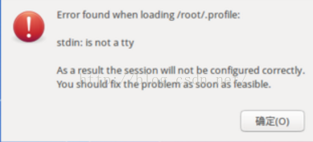

# ubuntu
[TOC]
## 一. 概述
### 1 简介
1. 该笔记主要记录linux相关知识,其中命令部分主要记录有别于linux的命令,比如`apt-get`等
### 2 历史
### 3 常识
#### 3.1 关于代号
1. Ubuntu16.04LTS的代号是Xenial Xerus(好客的非洲地松鼠)
#### 3.2 关于默认没有root
以前的linux依赖su来获取超级用户权限,所有用户会企图以root用户帐号来操纵系统,会导致linux的安全性变低.于是在引进Ubuntu的时候，它的创作者们采取了不同的策略。默认情况下，Ubuntu 不允许用户登录 到 root 帐号（因为不能为 root 帐号设置密码），而是使用 sudo 命令授予普通用户超级用户权限。

## 二. 安装配置
### 1 虚拟机安装配置
1. 以16.04LTS为例，安装后第一步设置语言为中文(可不用)：
2. 设置软件源为[阿里云](http://mirrors.aliyun.com/)，设置之后更新可用软件列表(等同于命令`sudo apt-get update`)：
    1. 选项设置
    2. 手动设置
    3. 查看源：似乎是在`/etc/apt/sources.list`中
4. 更新ubuntu系统和已安装软件(时间较久，可最后再进行)
    ```bash
    #两个命令二选一
    #第一个是如果发现某个软件对应的依赖也需要更新则不会更新这个软件
    sudo apt-get upgrade
    #第二个是会把依赖也更新，有风险
    sudo apt-get dist-upgrade
    ```
4. 工具和软件的安装
    1. 安装搜狗输入法：
        1. 如果双击deb包安装进度条一闪而过没有安装，那应该是缺少依赖
        2. 用命令`sudo dpkg -i xxx.deb`安装时会发现缺少依赖，**然后**可以`sudo apt-get -f install`安装xxx(?)和对应的依赖（其他软件同理）
        2. 然后在语言支持中设置键盘输入法系统为`fcitx`（即`Free Chinese Input Toy for X`），注销重登即可
    2. 安装google chrome
    3. 安装vscode
    4. 安装git：`sudo apt install git`
    5. 安装npm并配置源：`sudo apt install npm`
    6. 安装node:网上推荐的是用n或者nvm(更推荐？)模块来安装
        1. 先`sudo npm install n -g`
        2. 然后`sudo n stable`（此步一般很慢）
5. 设置root用户，因为虚拟机默认是没有root用户的
    >ubuntu系统下，为了安全起见，在安装过程中，系统屏蔽了用户设置root用户
    1. 给root用户设置一个密码：`sudo passwd root`
    2. 此时只可以从终端登录，想从界面（`ctrl+alt+f7`）以root用户登录需在`/usr/share/lightdm/lightdm.conf.d/50-ubuntu.conf`中添加`greeter-show-manual-login=true`
    3. 关闭guest用户（可以不用）:在`/usr/share/lightdm/lightdm.conf.d/50-ubuntu.conf`中添加`allow-guest=false`
    3. 本人以root进去后报错：
        
        1. 方法一：修改` /root/.profile`中`mesg n`为`tty -s && mesg n`，然后重启
        2. 方法二：将非root账户目录中的`.profile`复制到/root/：例如：`cp /home/username/.profile /root/`(待验证)

6. 设置时区(可不用)
    
    默认好像是PDT时区.
7. 开启ssh服务

    ubuntu本身自带有ssh客户端,但是不带ssh服务端,可以通过`sudo apt install openssh-serve`下载openssh-server,安装完后会自动启动.

    注意linux的ssh服务默认使用22端口,但有安全问题,可换成其他端口.

## 三 基础
### 1 权限相关命令
#### root权限
1. sudo  

    一般我们都是用普通账户登录的，权限不是很高，当需要系统级操作（比如安装软件）时就需要加上这个命令

### 2 包管理相关命令
1. apt(Advanced Packaging Tool）

    Linux下的一款安装包管理工具，是一个客户/服务器系统。`apt-get`是老版的命令，`apt`是新版的命令
    2. 工作原理：
    3. 常用命令：
        1. `apt-cache search xxx`：在源软件列表中查找相应的软件包.

### 3 服务相关命令
#### 服务的启动、停止、重启和状态查看
以下总结于stackexchange,实测`service <服务名称> <动作名称>`显示的是执行了,但是似乎没有生效.待验证.

systemctl命令是系统服务管理器指令，它实际上将 service 和 chkconfig 这两个命令组合到一起。
- 15.04以前:`sudo <动作名称> <服务名称>`
- 15.04及之后:`sudo systemctl <动作名称> <服务名称>`,比如重启ssh:`sudo systemctl restart ssh`,查看ssh服务状态`sudo systemctl status ssh`

##  五 经验
1. 忘记密码(待补充)：

    1. 重新启动，按ESC键进入Boot Menu，选择recovery mode（一般是第二个选项,但是我这儿是先进高级模式，然后再进recovery mode）。 
    2. 在#号提示符下用cat /etc/shadow，看看用户名。(我这儿几乎全是乱码，似乎$6前面的字符就能找到名字) 
    3. 输入passwd “用户名”（引号要有的哦）(要确认两次密码) 
    4. 输入新的密码。 
    5. 重新启动，用新密码登录。
## 六 问题
1. linux的cc是什么东西
2. 关于reboot和init6，本质应该是几种关机的区别
3. ctrl+Alt+f1~f6通过多用户登录都是终端登录 Ctrl+alt+f7图形化打开
4. apt-get的原理，不会被qiang吗
5. 如何查看已安装或刚安装的软件
6. Ubuntu Linux Restart Network Service
:[https://www.cyberciti.biz/faq/ubuntu-restart-start-stop-networking-service-howto/](https://www.cyberciti.biz/faq/ubuntu-restart-start-stop-networking-service-howto/)


7. iptable防火墙相关知识