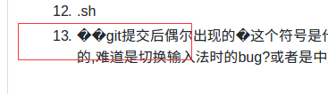

# mac
[TOC]
## 一. 概述
### 1 一些常识
1. ipad读作...,ipod读作...（总是混淆）
2. mac上的command键也被称为苹果键，和windows中的Ctrl键功能一样
## 二. 安装配置
## 三. 基础
### 1 快捷键
### 2 命令行工具
1. open命令打开
    1. 对于文件,会使用关联程序打开;对于目录是finder打开,比如`open .`打开当前目录
    2. `-a`指定用什么打开,`-e`强制用textedit编辑
    3. 把文件拖入终端,等于把文件的路径复制到终端
2. pbcopy和pbpaste
    前者允许将stdin或者文件复制到剪切板中,后者用于将剪切板的内容输出,如,
    1. `ls ~ | pbcopy`:将home目录文件列表复制到剪切板
    2. 将任意文件内容读入剪切板,如`pbcopy < hello.txt`
    3. 重定向剪切板的内容到文件:`pbpaste >> a.file`
    4. 其他:tee
        如果想重定向到文件同时又想看到输出,可以用`tee`工具,如,`echo hello | tee a.file`
3. mdfind
## 四. mac上好用工具介绍
### 1 mac自带的
1. spotlight
    mac上的搜索神器,快捷键`cmd+space`,ios上也有
### 2 白噪音
让工作效率更高:[https://zhuanlan.zhihu.com/p/20508353](https://zhuanlan.zhihu.com/p/20508353)
### 3 解压缩
1. The Unarchiver:免费好用
2. Dr.Unarchiver:免费而且比上面的多预览、指定解压路径等功能
### 4 快捷键打开dock
1. snap：因为默认的cmd键和浏览器有冲突，所以我改成option键了。而且windows和ubuntu上不需要按插件，直接就可以win键快捷打开dock
### 5 视频播放
[IINA](https://lhc70000.github.io/iina/zh-cn/)，开源免费

## 五. 经验
1. 如何将qq截图或者excel复制粘贴为图片？  
qq截图之后或者command+c复制了自己想要的excel之后，打开预览app，选择`文件`，`从剪贴板新建`即可生成相应的png图片，然后重命名保存。
## 六. 问题
### 1 已解决
#### 1.1 重启后某些应用图标变成问号  
网友的回答是：“因为你的程序图标指向的是你的那些dmg文件，重启肯定没啦，你要把dmg文件里的程序拖到应用程序文件夹里，再从应用程序里把它们拖到dock上”
>我是把vscode解压到其他文件夹然后直接打开的，应该把解压的文件放到mac“应用程序”文件夹里
#### 1.2 打开文件时提示文本编码 unicode (utf-8) 不适用
在应用程序中找到“文本编辑”，在偏好设置中->打开和存储->纯文本文件编码里的打开文件和储存文件都改为中文(GB18030)
#### 1.3 关于mac的vscode里写markdown出现的�字符
在mac版的vscode中看不出来，但是在win班vscode中会显示成,在linux版vscode中会显示成,在github中直接预览会显示成，如果开启vscode的`"editor.renderControlCharacters": true(控制编辑器是否应呈现控制字符)`选项，则在win和linux中都会显示成bs(退格)字符，推测是mac中输入法引起的，待验证
### 2 未解决
### 3. xcode的使用
### 4. .bash_profile和.bashrc和linux是反过来的？
### 5. m2_home
### 6. 终端和finder
[http://blog.csdn.net/wang010366/article/details/51873026](http://blog.csdn.net/wang010366/article/details/51873026)