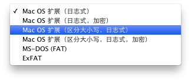
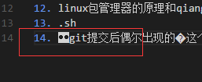

# mac
[TOC]
## 一. 概述
### 1 一些常识
#### 1.1 ipad读作...,ipod读作...（总是混淆）
#### 1.2 mac上的command键
也被称为苹果键，和windows中的Ctrl键大部分情况下功能一样
#### 1.3 关于mac的文件系统
如图,

默认是用的第一个,所以一般的mac是不分大小写的,比如当前目录有`a.file`,输入`cat A.file`也可以打印`a.file`的内容.这种文件格式在开发的时候可能会导致文件重名等问题,所以要注意,而对于服务器,最好用区分大小写日志式.
#### 1.4 如何输入⌘、⌥、⇧、⌃、⎋等特殊字符
进入输入法设置,点击`显示表情与符号`,点击左上角的齿轮,选择`自定义列表`,勾选`箭头`和`技术符号`,就在里面,其他类同
## 二. 安装配置
## 三. 基础
### 1 快捷键
mac的介质推出建,在某些电脑上有(有网友说是较老的mac上),位于右上角,用来弹出光驱,现在没有光驱了所以也就不需要了.现在的MBA和RMBP都没有该键.
1. 关闭屏幕(仅将显示器置入睡眠):`ctrl+shift+power`,
2. 关机、睡眠和重启:长按`power`1.5秒
3. win键盘的`delete`键(mac键盘的`delete`键相当于win的`backspace`键):`fn+delete`
4. 修改文件名:选中文件后回车(待测试)
### 2 命令行工具
1. open命令打开
    1. 对于文件,会使用关联程序打开;对于目录是finder打开,比如`open .`打开当前目录
    2. `-a`指定用什么打开,`-e`强制用textedit编辑
    3. 把文件拖入终端,等于把文件的路径复制到终端
2. pbcopy和pbpaste
    前者允许将stdin或者文件复制到剪切板中,后者用于将剪切板的内容输出,如,
    1. `ls ~ | pbcopy`:将home目录文件列表复制到剪切板
    2. 将任意文件内容读入剪切板,如`pbcopy < hello.txt`
    3. 重定向剪切板的内容到文件:`pbpaste >> a.file`
3. 文本转语音（TTS）的工具:`say`
4. Homebrew

    mac下的包管理工具.Homebrew最棒的一点是：所有的文件都被约束在/usr/local/一个位置之下。也就是说可以通过Homebrew安装新版软件的同时，保持系统内置的依赖库或其他软件不变。同时如果想彻底删除Homebrew，也变得非常简单。
## 四. mac上好用工具介绍
### mac自带的
1. spotlight

    mac上的搜索神器,快捷键`cmd+space`,ios上也有
2. Bootcamp

    用于在mac上安装windows系统,简单方便.安装之后,还会将win的按键映射到mac键盘上,具体参考苹果支持
### 第三方
2. 白噪音
    
    让工作效率更高:[https://zhuanlan.zhihu.com/p/20508353](https://zhuanlan.zhihu.com/p/20508353)
3. 解压缩
    1. The Unarchiver:免费好用
    2. Dr.Unarchiver:免费而且比上面的多预览、指定解压路径等功能
4. snap：快捷键打开dock

    默认的cmd键和浏览器有冲突，所以我改成option键了。而且windows和ubuntu上不需要按插件，直接就可以win键快捷打开dock
5. 视频播放

    [IINA](https://lhc70000.github.io/iina/zh-cn/)，开源免费
#### Homebrew (待补充)
#### 搜狗输入法
## 五. 经验
#### 如何将qq截图或者excel复制粘贴为图片？  
qq截图之后或者command+c复制了自己想要的excel之后，打开预览app，选择`文件`，`从剪贴板新建`即可生成相应的png图片，然后重命名保存。
#### 如何设置默认播放器
随便选中一个`.mp4`等文件,然后显示简介,然后就可以设置默认打开程序.
#### 如何把第三方输入法设为默认
1. (推荐方式)勾选输入法设置里的`自动切换到文稿的输入法`,这样经过几次切换之后就会一直使用某个输入法
2. (不推荐方式)可以将系统自带的输入法取消掉,这样就只能用第三方的了.但是会导致有些安装输入框无法输入,以及可能的崩溃.
## 六. 问题
### 1 已解决
#### 重启后某些应用图标变成问号  
网友的回答是：“因为你的程序图标指向的是你的那些dmg文件，重启肯定没啦，你要把dmg文件里的程序拖到应用程序文件夹里，再从应用程序里把它们拖到dock上”
>我是把vscode解压到其他文件夹然后直接打开的，应该把解压的文件放到mac“应用程序”文件夹里
#### 打开文件时提示文本编码 unicode (utf-8) 不适用
在应用程序中找到“文本编辑”，在偏好设置中->打开和存储->纯文本文件编码里的打开文件和储存文件都改为中文(GB18030)
#### 关于mac的vscode里写markdown出现的�字符
在mac版的vscode中看不出来，但是在win版vscode中会显示成:
,
在linux版vscode中会显示成:
,
在github中直接预览会显示成:
，
如果开启vscode的`"editor.renderControlCharacters": true(控制编辑器是否应呈现控制字符)`选项，则在win,linux和mac中都会显示成bs(退格)字符:
，
经过我用简体拼音和搜狗拼音的简单测试，发现在mac版vscode的中文输入法下：按下任意字母，出现中文候选后删除，删除完刚才输入的字母再按删除就会出现这个控制字符，如果没有打开控制字符是否呈现的开关则看不到，所以目前的解决办法是打开开关。
### 2 未解决
3. xcode的使用
4. .bash_profile和.bashrc和linux是反过来的？
5. m2_home
6. 终端和finder:[http://blog.csdn.net/wang010366/article/details/51873026](http://blog.csdn.net/wang010366/article/details/51873026)
7. 网友说的：强大的第三方神级软件：Homebrew / Alfred / iTerm2 ...
