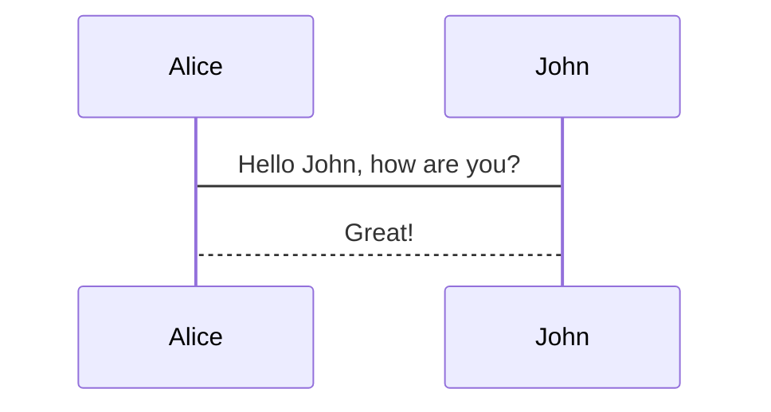

# markdown
[TOC]
# 一 概述
## 1 简介
Markdown一种轻量级的「标记语言」，开发者是约翰·格鲁伯（John Gruber），他创建了Daring Fireball([https://daringfireball.net/](https://daringfireball.net/ "daring fireball官网"))——一个每年可以赚取 50 万美元的博客。

常见的标准有CommonMark和GFM (GitHub Flavored Markdown) 

### 优点
- 轻量：不像Word或Pages有大量的排版、字体设置,它使我们专心于码字.常用的标记符号也不超过十个,
- 简单：学习成本低
- 通用：熟悉后一劳永逸
- 支持基本的HTMl语法
- 纯文本内容，兼容所有的文本编辑器与字处理软件
- 导出多种格式：pdf,html等

## 3 常识
### 3.1 Daring Fireball 
Daring Fireball是一个由苹果公司的狂热粉丝 John Gruber 创立的博客，内容主要是对苹果的产品和策略等任何细节作出评论，并且不设读者评论功能。博客上还提供下载一些由 Gruber 自己开发的软件。最初 Gruber 只是利用空闲时间打理，但从 2006 年 4 月开始，运作这个博客成了 Gruber 的全职工作，并通过收取会费、投放广告、售卖 T 恤等方式获得收入。(from百度知道)

## 4 文档
## 5 网址
1. 不过我看daringfireball上面的markdown文档似乎一直没有更新。比较推荐的是segmentfault上的文档:[https://segmentfault.com/markdown](https://segmentfault.com/markdown)
2. 图灵社区的markdown简易指南:[怎样使用Markdown](http://www.ituring.com.cn/article/23)

# 二 安装配置
# 三 基础
## 1 常用标记符号
### [TOC]
Table Of Contents (index file)，内容列表、索引，vscode自带的预览目前还不支持

### 标题
一个#表示一级标题，一直到六级标题，个人经验是#后面最好跟上空格

### 强调
*This text will be italic*
_This will also be italic_

**This text will be bold**
__This will also be bold__

~~This text will be crossed~~

_You **can** combine ~~them~~_

### 链接
前面是显示的链接，后面是实际链接，引号里是鼠标移上去的tips
[https://github.com](https://github.com "github官网")

### 图片
可以使用相对路径和绝对路径，语法和链接类似.如果想图片所在的行没有文字,需要在前后都换行.


### 引用
引用中再嵌套引用只需要多加一个>,如下
> We're living the future so
>> the present is our past.

### 列表
分为有序和无序，有序的时候数字随便填，会自动计算的

#### 有序
写法是`1. `

#### 无序
写法是`-`or`*`

### 表格
First Header | Second Header
------------ | -------------
Content from cell 1 | Content from cell 2
Content in the first column | Content in the second column

### 图表
需要插件支持，比如mermaid，github和gitlab已经集成了该插件：https://mermaidjs.github.io



### 转义
对于Markdown标记，想直接显示有下面三种方法：
1. 在markdown符号前面加上反斜杠
2. 使用html里转义字符。比如将两个尖括号转义，写成`&lt;br&gt;`
3. 或者用``包裹

```
\\ 反斜杠
\` 反引号
\* 星号
\_ 下划线
\{\} 大括号
\[\] 中括号
\(\) 小括号
\# 井号
\+ 加号
\- 减号
\. 英文句号
\! 感叹号
*This text will be bold*
\*This text will be bold\*
```

### 上标和下标
19^th^
H~2~O
###  代码块
比如下面这个，```后面跟的java就是代码所属的语言,markdown支持很多种，包括bash、kotlin、python等    
```java
System.out.println("hello world!");
```
###  行内代码
就是用``包裹，使用场景很模糊，本人觉得只要不混淆就随便用

###  注释(comment out)
有两种

#### `[xxx]:xxxxxx`
这种方式注释不是所有markdown编辑器都支持，优点是注释的内容不会生成到最终的产品里去，相当于草稿来用。例子如下：
[^_^这里的内容不会显示出来]:这里的内容也不会显示出来

#### html注释`<!-- xxx -->`：大部分markdown编辑器都支持，缺点是注释的内容会生成到最终的产品里去，只不过被隐藏了。例子如下：
<!-- 这里的内容不会显示出来 -->

### 表格
markdown原生不支持,但支持html的table标签.gfm支持该表格写法,注意**表格语法前必须空出一行**,否则github中不会生效.
1. 主要用法就是下面这样,注意中间的冒号决定所在列的对齐方向

    |标题1|标题2|标题3|标题4|标题5|
    |-|-|:-|-:|:-:|
    |内容1|内容2|内容3,哈哈哈哈哈哈啊哈哈|内容4,哈哈哈哈哈哈哈|内容5,哈哈哈哈哈哈哈啊|

### 分割线
分割线的语法只需要另起一行，连续输入三个星号 *** 即可。

### 换行
想主动换行有两种方法：
1. 两次回车（缺点是会有空行）
2. 两个空格后回车（没有空行）

### 其他
#### 缩进
1. 半角状态下，在标题下缩进了制表符之后的文字会被识别为普通文字
2. 如果想实现中文里段落开头的缩进，有两种方法（但是我尝试之后发现这个缩进对标题下的第一行无效，后面的行才有效）
    1. 输入法切换到全角，双击空格键
    2. 
        * `半方大的空白&ensp;或&#8194;`
        * `全方大的空白&emsp;或&#8195;`
        * `不断行的空白格&nbsp;或&#160;`

# 四 高级
## 1 markdown解析器
1. github高星,代码量少,适合个人开发研究:https://github.com/markedjs/marked

# 五 经验
## 1 GFM(Github Flavored Markdown)(待补充)
官方参考:[https://github.github.com/gfm/](https://github.github.com/gfm/),Github用的GFM，风格很漂亮，简洁美观大方。 GFM对标准Markdown做了少量修改,所以我写这个笔记的时候也会尽量考虑兼容两者.

# 六 问题
## 1 已解决
### 1.1 `1.`,`-`和直接写文字的优先级?
文字的优先级最高,然后有序和无序平级

### 1.2 markdown转