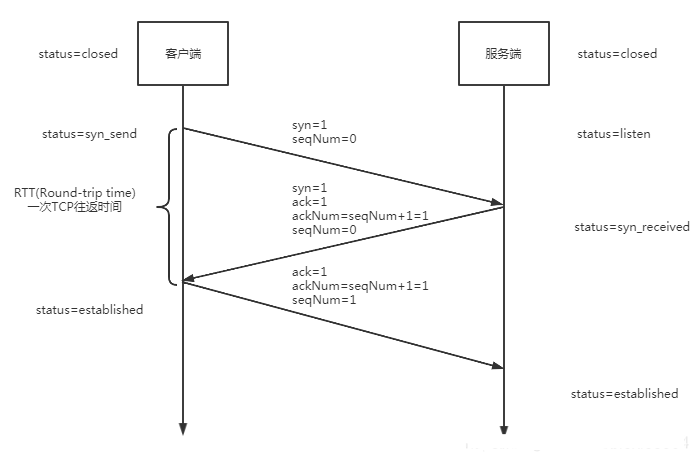
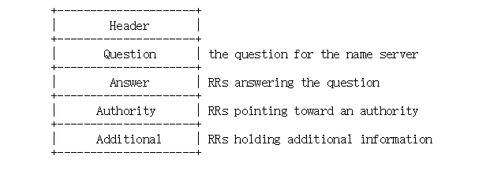

# protocol
[TOC]

# 一 概述
用于放各种协议的目录，比如RPC

## 1 简介

## 3 常识
### 3.1 RFC(Request for Comments,意见征求、意见请求、请求评论)
由互联网工程任务组（IETF）发布的一系列备忘录。文件收集了有关互联网相关信息，以及UNIX和互联网社区的软件文件，以编号排定。目前RFC文件是由互联网协会（ISOC）赞助发行

去哪里找rfc呢？以下三个地方都可以
1. 官方网站：https://www.rfc-editor.org/
2. 互联网档案馆，这里存有备份：https://web.archive.org/web/20090202124230/http://www.ietf.org/rfc.html
3. IETF仓库：http://www.ietf.org/rfc/rfcNNNN.txt

### 3.2 常见协议的默认端口
20和21端口是 FTP 服务器，25端口是 SMTP 服务，HTTP默认端口号为80

# 三 基础
## NCP(Network control protocol,网络控制协议)

## IPS(Internet Protocol Suite,互联网协议套件)
互联网协议套件是网络通信模型，为互联网的基础通信架构/基石。它常通称为TCP/IP协议族或TCP/IP协议簇（TCP/IP Protocol Suite，或TCP/IP Protocols），简称TCP/IP。因为该协议家族的两个核心协议：TCP（传输控制协议）和IP（网际协议），为该家族中最早通过的标准。由于在网络通讯协议普遍采用分层的结构，当多个层次的协议共同工作时，类似计算机科学中的堆栈，因此又称为TCP/IP协议栈（英语：TCP/IP Protocol Stack） 。这些协议最早发源于美国国防部（缩写为DoD）的ARPA网项目，因此也称作DoD模型（DoD Model），前身是NCP

其中比较重要的有SLIP协议、PPP协议、IP协议、ICMP协议、ARP协议、TCP协议、UDP协议、FTP协议、DNS协议、SMTP协议等

### IP(Internet Protocol,互联网协议)
互联网协议,又称互联网通信协议、网际协议。它将多个网络连成一个互联网，可以把高层的数据以多个数据包的形式通过互联网分发出去。IP的基本任务是**通过互联网传送数据包，主要解决网络路由和寻址问题**，各个IP数据包之间是相互独立的。

互联网协议提供了“不可靠的”数据包传输机制（也称“尽力而为”或“尽最大努力交付”）；也就是说，它不保证数据能准确的传输。数据包在到达的时候可能已经损坏，顺序错乱（与其它一起传送的报文相比），产生冗余包，或者全部丢失。如果应用需要保证可靠性，一般需要采取其他的方法，例如利用IP的上层协议控制(比如TCP)。

各版本概述：
1. 版本0至3不是保留就是没有使用
2. IPv4使用地址解析协议（ARP）
3. 版本5用于实验流传输协议。
4. IPv6采用邻居发现协议（NDP）。
5. 其他的版本也已经分配了，通常是用于实验的协议，而没有广泛应用。

#### IPv4
最致命的两个缺陷：
1. 地址只有32位，IP地址空间有限
2. 不支持服务质量（Quality of Service，QoS）的想法，无法管理带宽和优先级，故而不能很好的支持现今越来越多实时的语音和视频应用。因此IPv6（网际协议版本六）浮出水面，用以取代IPv4

#### IPv6
1. 拥有128位的地址空间，可以提供比前者多很多的地址。

### ICMP

### ARP(Address Resolution Protocol,地址解析协议)
是一个通过解析网络层地址来找寻数据链路层地址的网络传输协议，它在IPv4中极其重要。

ARP Proxy(委托ARP、ARP代理)：当发送主机和目的主机不在同一个局域网中时，即便知道对方的MAC地址，两者也不能直接通信，必须经过路由转发才可以。所以此时，发送主机通过ARP协议获得的将不是目的主机的真实MAC地址，而是一台可以通往局域网外的路由器的MAC地址。于是此后发送主机发往目的主机的所有帧，都将发往该路由器，通过它向外发送。

### NDP/ND(Neighbor Discovery Protocol,邻居发现协议)
工作在数据链路层,负责在链路上发现其他节点和相应的IP地址，并确定可用路由和维护关于可用路径和其他活动节点的信息可达性

### TCP(Transmission Control Protocol,传输控制协议)
是为了在不可靠的互联网络上提供可靠的端到端字节流而专门设计的一个传输协议。主要解决如何在IP层之上可靠的传递数据包，使在网络上的另一端收到发端发出的所有包，并且顺序与发出顺序一致。TCP有可靠，面向连接的特点。

TCP连接：需要通过三次连接，包括：请求，确认，建立连接。即通常说的"三次握手"



1. TCP数据包：发送的时候，TCP 协议为每个包编号（sequence number，简称 SEQ），以便接收的一方按照顺序还原。万一发生丢包，也可以知道丢失的是哪一个包。第一个包的编号是一个随机数ISN(由操作系统动态随机选取一个32位长的序列号（Initial Sequence Number）)，假设是100，那么可以推算出下一个包的编号应该是101。这就是说，每个数据包都可以得到两个编号：自身的编号，以及下一个包的编号。接收方由此知道，应该按照什么顺序将它们还原成原始文件。
    1. tcp标志位：有6种标示，用大写表示，其值要么是1，要么是0
        - SYN(synchronous) :建立连接
        - FIN(finish) :终止连接
        - ACK(acknowledgement)：确认接收到的数据
        - PSH(push传送)
        - RST(reset重置) 
        - URG(urgent紧急)
        - Sequence number(顺序号码) ：
    2. 涉及到的名词
        1. MTU(最大传输单元)
        2. RTO(Retransmission TimeOut,重传超时)
        3. ack(Acknowledge number,确认号码):和ACK一起使用，但意义不同，ACK表示的是标志位，是对接收到的数据的最高序列号的确认，而ack表示的是下次接收时期望的TCP数据包的序列号（ACK Number）。例如，主机A发送的当前数据序号是400，数据长度是100，则接收端收到后会返回一个ack是501的确认号给主机A，如果A发送的前数据序号是400，发送多条数据，多条数据长度一共是5000字节，则接收方只需发一个确认号为5401的报文。(具体由接收方的window来决定)
        1. syn(Synchronize Sequence Numbers,请求连接的同步序列编号）
        2. SEQ：TCP 协议为每个包编号（sequence number，简称 SEQ或seq）,用来做可靠重传或接收
        3. MSL(Maximum Segment Lifetime,最大分段寿命、最大报文段存活时间):2MSL就是一个发送和一个回复所需的最大时间。
        2. ISN(由操作系统动态随机选取一个32位长的序列号（Initial Sequence Number）)：有一个专门的生成器来生成，生成器会用一个32位长的时钟，差不多4µs 增长一次，因此 ISN 会在大约 4.55 小时循环一次。而一个段在网络中并不会比MSL长，MSL比4.55小时要短，所以我们可以认为 ISN 会是唯一的。
2. 三次握手（Three-way Handshake）:最开始的时候，C处于closed状态，S处于listen状态
    1. 第一次：C发送一个带SYN标记的数据包(通常称为SYN包)给S，表示向S申请建立连接，C的状态变为`syn_send`
        1. 该包的SYN=1，seq=isn=j
        2. 如果丢失了会怎么样？周期性超时重传，直到收到S的确认
    2. 第二次:S收到了这个SYN包，同意建立连接，于是把一个包含收到的SYN和确认码 ACK（j+1）的包(通常称为SYN/ACK包)发给C，S的状态由listen变为`syn_received`，此时的连接称为半连接(half-open connect)。
        1. 该包的SYN=1，ACK=1，seq=isn=k,ack=j+1
        2. 如果丢失了会怎么样？周期性超时重传，直到收到C的确认
        3. SYN攻击：SYN攻击属于DDoS攻击的一种，它利用TCP协议缺陷，在短时间内伪造大量不存在的IP地址(IP欺骗)，向服务器不断地发送syn包，服务器回复确认包，并等待客户的确认，由于源地址是不存在的，服务器需要不断的重发直至超时，这些伪造的SYN包将长时间占用未连接队列，正常的SYN请求被丢弃，消耗主机的CPU和内存资源。SYN攻击除了能影响主机外，还可以危害路由器、防火墙等网络系统。
            1. 防范：主要有两大类，虽然都不能完全防范SYN攻击
                1. 一类是通过防火墙、路由器等过滤网关防护
                2. 另一类是加固TCP/IP协议栈：SynAttackProtect保护机制、SYN cookies技术、增加最大半连接和缩短SYN超时时间等
    3. 第三次：C收到确认码ACK和SYN之后，会和之前发送的SYN一比较，如果对上了，就发送了一个带ack（SEQ+2）的ACK包给S，C的状态变成`established`(完成连接)。该包可以带上数据
        1. 该包的ACK=1，seq=j+1,ack=k+1
        2. 如果第三次的这个确认包发丢了
            1. 会超时重传吗？不会，因为**TCP不会为没有数据的ACK超时重传**。
            2. 包丢了之后有两种情况
                1. C和S没有数据传输：S没有收到C的ACK，S会超时重传自己的SYN/ACK包，一直到收到C的ACK为止。
                2. C有数据传输到S: S收到C的数据加上ACK，自然会切换为established 状态，并接受A的数据。
    4. 最后：S收到C的确认报文，S的状态变为`established`。至此，TCP连接建立完成。
        1. 连接建立以后，TCP连接的每个包都会设置ACK
        2. 如果没有收到会怎么样？
3. 关闭TCP连接：由于TCP连接是全双工的，收到一个FIN只意味着这一方向上没有数据流动，另外一个方向仍能发送数据，因此每个方向都必须单独进行关闭。前两次挥手用于断开一个方向的连接，后两次挥手用于断开另一方向的连接。关闭可以是C先发起也可以是S先发起(所以这里用A和B来表示)
    1. 四次挥手(Four-way Handshake)
        1. (A) --> FIN包 --> (B),A发起中断连接请求，A的状态由established变为`fin-wait-1`
            1. 该包的FIN=1,seq=u(u=A传输的最后一个seq+1)
            1. ACK/FIN 包(ACK 和FIN 标记设为1)通常被认为是FIN(终结)包.由于连接还没有关闭, FIN包总是打上ACK标记. 没有ACK标记而仅有FIN标记的包不是合法的包，并且通常被认为是恶意的(?)
            3. TCP规定，FIN报文段即使不携带数据，也要消耗一个序号
        2. (A) <-- ACK <-- (B)，B收到中断连接请求后，TCP协议会立马先返回一个ACK包告诉A自己收到FIN包了，B的状态由established变为`close-wait`,B此时还可以继续传输数据(是否继续传输由应用层决定)。A收到ack报文后，状态由`fin-wait-1`变为`fin-wait-2`，A此时还能接收B发来的数据。
            1. 该包的ACK=1，seq=v（v是多少呢）,ack=u+1
        3. (A) <-- ACK/FIN <-- (B),B的数据发送完后，会发送FIN到A，B的状态变为`last-ack`
            1. 该包的FIN=1，ACK=1，seq=w，ack=u+1(在B发送FIN之前B可能又发送了一些数据，所以seq可能由v变成了w)
            1. 如果该包丢失了，会重传
        4. (A) --> ACK --> (B),A的状态由`fin-wait-2`变为`time-wait`,B收到ack报文后，直接关闭连接，状态由`last-ack`变为`closed`
            1. 该包的ACK=1，seq=u+1,ack=w+1
            2. `time-wait`状态的A会等待两次最大的报文存活时间(2MSL)，如果在这段时间内再次收到B发来的FIN，那么A会重发ACK并再次等待2MSL，不断重复。如果直到2MSL，A都没有再次收到FIN，那么A推断ACK已经被成功接收，则结束TCP连接。状态由`time-wait`变为`closed`
                1. 为什么需要等待2MSL：有两个目的
                    1. 确保最后一个ACK到达B：网络是不可靠的，如果A发送完ACK后就直接关闭了，那这个ACK丢失之后，B会一直重发FIN/ACK包，B就永远无法正常关闭。
                    2. 防止“已失效的连接请求报文段”出现在本连接中:经过2MSL，就可以使本连接持续的时间内所产生的所有报文段都从网络中消失，使下一个新的连接中不会出现这种旧的连接请求报文段。
    2. 连接复位Resetting a connection：有时,如果主机需要尽快关闭连接(或连接超时,端口或主机不可达),RST (Reset)包将被发送. 注意在，由于RST包不是TCP连接中的必须部分, 可以只发送RST包(即不带ACK标记). 但在正常的TCP连接中RST包可以带ACK确认标记
        1. RST包是可以不要收到方确认的?
        
状态说明：
1. `FIN_WAIT`：有两个状态，都是表示等待对方的FIN报文，但有以下不同
    1. `FIN_WAIT_1`: 当SOCKET在ESTABLISHED状态时，它想主动关闭连接，向对方发送了FIN报文，此时该SOCKET即进入到FIN_WAIT_1状态。而当对方回应ACK报文后，则进入到`FIN_WAIT_2`状态。在实际的正常情况下，无论对方何种情况下，都应该马上回应ACK报文，所以`FIN_WAIT_1`状态一般是比较难见到的，而`FIN_WAIT_2`状态还有时常常可以用netstat看到。
    2. `FIN_WAIT_2`：该状态下的SOCKET，表示半连接，也即有一方要求close连接，但另外还告诉对方，我暂时还有点数据需要传送给你，稍后再关闭连接。
2. `TIME_WAIT`: 表示收到了对方的FIN报文，并发送出了ACK报文，就等2MSL后即可回到CLOSED可用状态了。如果`FIN_WAIT_1`状态下，收到了对方同时带FIN标志和ACK标志的报文时，可以直接进入到TIME_WAIT状态，而无须经过`FIN_WAIT_2`状态。
2. `LAST_ACK`:被动关闭一方在发送FIN报文后，最后等待对方的ACK报文。当收到ACK报文后，就可以进入到CLOSED状态了。


TCP如何保证可靠：乱序重排、应答确认、报文重传和流量控制四种机制
1. 报文重传：有两种独立的办法
    1. 超时重传：TCP会根据报文的往返时间（RTT）自动调整超时重传时间（RTO）。发送方每发一个报文段都会开始计时，如果时间超过RTO还没收到这个报文段的确认，就重传该报文段。
    2. 快速重传：发送的数据在路上丢失的时候用。接收方收到序号1后，回复确认号2，希望下次收到序号2的报文段，但却乱序收到比序号2大的3、4、5报文段，于是连续发出确认号为2的报文段。如果发送方连续三次收到重复的确认号，立即重发该报文段，而不管是否超时。
4. 流量控制：TCP在三次握手建立连接时，会协商双方缓冲区window大小。如果因为接收方处理速度较慢，接收方会通过window告知发送方，实现动态调整，避免“溢出”。发送方会根据接收方确认报文中的window值来调整每次发出多少报文，这叫“滑动窗口”。

保活机制：保活机制并不是RFC规定的TCP协议的内容，因此有时候在不支持保活机制的机器上，往往我们也需要先看一下内核层面是否支持，如果不支持需要在应用层自己去实现这个功能。
1. 如果一个给定的连接在两个小时之内没有任何动作，则服务器就向客户发送一个探查报文段，客户机可能有以下4种情况
    1. 客户机正常且可达
    1. 客户主机已经崩溃，并且关闭或者正在重新启动。在任何一种情况下，客户的TCP都没有响应。服务器将不能够收到对探查的响应，并在75秒后超时。服务器总共发送10个这样的探查，每个间隔75秒。如果服务器没有收到一个响应，它就认为客户主机已经关闭并终止连接。
    2. 客户主机崩溃并已经重新启动。这时服务器将收到一个对其保活探查的响应，但是这个响应是一个复位，使得服务器终止这个连接。
    3. 客户主机正常运行，但是从服务器不可达。这与第二种情况相同，因为TCP不能够区分第二种情况和第四种情况之间的区别，它所能发现的就是没有收到探查的响应。

问题：
1. 创建连接的三次握手
    1. 为什么需要握手：IP协议在网络层，是不可靠的，TCP协议的目的是在不可靠的互联网络上提供可靠的端到端字节流，握手就是实现可靠的手段之一。
    1. 为什么不是两次：因为互联网链路是非常复杂的，发送的报文可能会被互联中的网络设备阻塞，经过了一段时间才到达服务器，时间大于了RTO(Retransmission TimeOut,重传超时)时间，导致客户端重发SYN报文(重新创建新的连接，并丢失超时的连接)。如果只有两次握手，那么服务器每接收到SYN报文(包括重发的SYN报文)，就会创建多余的连接，造成服务器的资源浪费。如果有第三次握手，那么客户端就能够识别出服务端发出的SYN和ack报文对应的请求连接在客户端是否存活，如果存活则发送第三次握手ack报文，确认建立连接。
    2. 为什么不是四次：客户端一次请求携带的seq num必须得到服务端的ack num才会完成。如果没有返回确认报文段，由于重发机制，定时器经过了一次RTO(Retransmission TimeOut，重传时间间隔)，客户端就会重发报文。那为什么客户端最后一次发送之后，没有等待服务端发回ack报文段？ 这是因为服务端第二次发送的报文段里 包含ack以及请求SYN报文，相当于把确认报文和请求报文合并了，所以最后客户端回复一个ack报文即可。
    4. 三次握手过程中可以携带数据吗？第一次、第二次握手不可以携带数据，第三次握手可以。第一次、第二次握手不可以携带数据是防止有人恶意攻击服务器，因为重复发带大量数据的SYN报文的话，这会让服务器花费很多时间、内存空间来接收这些报文。第三次可以是因为此时客户端已经处于 ESTABLISHED 状态，对于客户端来说，他已经建立起连接，知道服务器可以正常的接收和发送。
2. 关闭连接的四次挥手：
    1. 为什么不是三次挥手：因为挥手的时候每个方向都必须单独进行关闭，对比三次握手，多了第二步之后的继续传输数据过程--当收到对方的FIN报文通知时，它仅仅表示对方没有数据发送给你了，但你所有的数据不一定都全部发送给对方了，所以你可以未必会马上会关闭SOCKET,可能还需要发送一些数据给对方
3. 如果已经建立了连接，但是客户端突然出现故障了怎么办？TCP设有保活机制，有一个保活计时器，客户端如果出现故障，服务器不能一直等下去，白白浪费资源。服务器每收到一次客户端的请求后都会重新复位这个计时器，时间通常是设置为2小时，若两小时还没有收到客户端的任何数据，服务器就会发送一个探测报文段，以后每隔75秒钟发送一次。若一连发送10个探测报文仍然没反应，服务器就认为客户端出了故障，接着就关闭连接。
4. open too many files：开启的连接太多了

### UDP
### FTP(File Transfer Protocol，文件传输协议)
参考：
1. https://datatracker.ietf.org/doc/html/rfc959
1. http://www.nsftools.com/tips/RawFTP.htm#
3. https://en.wikipedia.org/wiki/List_of_FTP_commands

FTP, the File Transfer Protocol, is probably the oldest network protocol that curl supports—it was created in the early 1970s. The official spec that still is the go-to documentation is RFC 959, from 1985, published well over a decade before the first curl release.

它是一个8位的客户端-服务器协议，它使用户可以在本地机与远程机之间进行有关文件的操作。FTP工作时建立两条TCP链接，分别用于用于传送控制和传送文件。

优缺点：
1. 缺点：
    1. 它不是安全的协议

概述
1. FTP URL:在RFC 1738指定，格式为：`ftp://[user[:password]@]host[:port]/url-path`（方括号内为可选参数）。
1. transfer mode(传输模式)：有两种，`ASCII`(文本)和`BINARY`(二进制)。默认使用文本模式。通常文本文件的传输采用ASCII方式，而图象、声音文件、加密和压缩文件等非文本文件采用二进制方式传输，使用二进制数据类型传输文件通常是最安全和最有效的。某些FTP命令(例如目录列表)需要将其设置为ASCII,因此请确保始终在传输之前进行设置.
2. 流模式最常用,但块模式支持恢复中断传输,压缩模式不太重要
3. 两个连接：FTP会使用两个TCP连接
    1. "control connection"(控制信道/控制连接):它是第一个连接，用来处理身份验证并更改到远程服务器上的正确目录等。对应的ftp服务器端口是21.
    2. 数据通道/数据连接：当客户端准备传输数据(传输文件，列出目录等)时，第一个连接会发出指令来建立第二个TCP连接，第二个连接用于传输数据。默认情况下，数据通道不会被复用，每次传输都会用一个新的端口来建立连接。主动模式下对应的ftp服务器端口是20.

常见命令：
1. `LIST`和`NLST`
    1. 概述
        1. 因为ftp标准没有规定返回的目录格式，所以不同的FTP服务器对`LIST`和`NLST`的响应文件信息列表的内容和格式不一样，客户端在对返回的文件信息列表进行处理时，一般需要先判断格式。此不一致使`LIST`和`NLST`实用性大大降低
    2. 详细
        1. `LIST`：用于列出指定目录中的子目录和文件信息，如果没有指定目录的名字就默认列出当前目录下的所有子目录和文件信息并返回给客户端。
            1. 如果路径名指定的是一个目录名，大学多服务器会发送一份指定目录中的子目录和文件列表信息，而不是关于目录的信息
            2. 如果路径名指定的是一个文件，服务器会发送该文件的相关信息
        2. `NLST`：不同服务器对该命令响应不一样，一些FTP服务器在对NLST的响应中只列出实际的文件，不包括目录和符号链接
3. 连接模式:最开始ftp只针对IPv4，只有`PORT`和`PASV`,默认是`PORT`模式，当IPv6出现后，原来的FTP扩展可能会失败，于是出现了`EPRT/Extended Pasv`和`EPSV/Extended Pasv`
    1. `PORT`：主动模式。客户端打开一个1024以上的端口C，来连接FTP Server的21端口，此时是control connection；当要传输数据时，客户端打开C+1端口，通过control connection发送一个`PORT C+1`给服务器，服务器收到指令后会用20端口来连接本地的C+1端口
    2. `PASV`(Passive Mode)：被动模式。在该模式中，控制连接和数据连接都由客户端发起，这样就可以解决从服务器到客户端的数据端口的入方向连接被防火墙过滤掉的问题。
        1. 客户端打开任意两个大于1024的本地端口C和C+1，然后用C端口连接服务器的21端口，向服务器发起`PASV`命令，服务器接收到命令后会任意打开一个大于1024的S端口，向客户端发起`POST S`命令，然后客户端用C+1连接服务端的S端口，随后通过该端口传输数据
        2. 被动方式的FTP解决了客户端的许多问题，但同时给服务器端带来了更多的问题。最大的问题是需要允许从任意远程终端到服务器高位端口的连接。
    3. `EPRT/Extended Pasv`
    4. `EPSV/Extended Pasv`
6. `RETR remote-filename`：从远程主机传输文件
    
    ```ftp
    RETR one/two/three/file.txt
    ```
    
7. `STOR remote-filename`：传输文件到远程主机


### FTPS
是FTP标准的扩展，添加了安全套接层（SSL）以及其继任者传输层安全性协议（TLS）的支持

### DNS
DNS走的是UDP协议？

DNS协议帧如图：其中question是域名，answer是IP


### SMTP
## SSH
Secure Shell（安全外壳协议，简称SSH）是一种加密的网络传输协议，可在不安全的网络中为网络服务提供安全的传输环境。SSH通过在网络中创建安全隧道来实现SSH客户端与服务器之间的连接。SSH最常见的用途是远程登录系统，人们通常利用SSH来传输命令行界面和远程执行命令。SSH使用频率最高的场合是类Unix系统，但是Windows操作系统也能有限度地使用SSH。2015年，微软宣布将在未来的操作系统中提供原生SSH协议支持，Windows 10 1803版本已提供OpenSSH工具。

SSH不使用任何类型的证书，而是使用公钥和私钥。如果正确使用，SSH和TLS都提供了强大的加密和安全传输。

### SFTP、Secure FTP(SSH File Transfer Protocol、Secret File Transfer Protocol，SSH文件传输协议)

### SCP
它不可移植，只能在Unix systems上工作

## TLS

## PPP(Point-to-Point Protocol,点对点协议)

## 邮件相关
### SMTP
### POP
POP算是一个“只读”权限的邮件协议

#### POP3

### IMAP(Internet Message Access Protocol,互联网邮件访问协议)
比POP更新一点，是“读写”权限的邮件协议

### WebSocket
为什么需要 WebSocket：已经有了 HTTP 协议，为什么还需要另一个协议？因为 HTTP 协议有一个缺陷：通信只能由客户端发起。如果服务器有连续的状态变化，客户端想要获知就非常麻烦，只能使用"轮询"的方式，轮询的效率低，非常浪费资源（因为必须不停连接，或者 HTTP 连接始终打开）

特点：它的最大特点就是，服务器可以主动向客户端推送信息，客户端也可以主动向服务器发送信息，是真正的双向平等对话，属于服务器推送技术的一种。
1. 基于TCP协议
2. 没有同源限制，客户端可以与任意服务器通信
3. 协议标识符是ws（如果加密，则为wss），服务器网址就是 URL。比如`ws://example.com:80/some/path`

历史：WebSocket 协议在2008年诞生，2011年成为国际标准。所有浏览器都已经支持了。

具体使用见websocket部分笔记

## IoT相关
### lora
### modbus

# 七 待整理