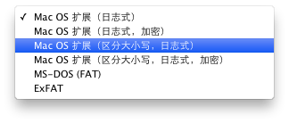
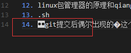
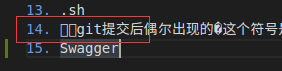
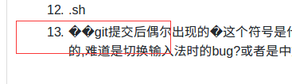
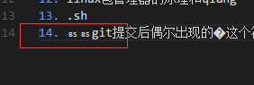

# mac
[TOC]
# 一. 概述
## 3 常识
### 3.1 ipad读作...,ipod读作...（总是混淆）

### 3.2 mac上的command键
也被称为苹果键，和windows中的Ctrl键大部分情况下功能一样.

### 3.3 mac的文件系统


也称为：...

默认是用的第一个或第二个,所以一般的mac是不分大小写的,比如当前目录有`a.file`,输入`cat A.file`也可以打印`a.file`的内容.这种文件格式在开发的时候可能会导致文件重名等问题,所以要注意,而对于服务器,最好用区分大小写日志式.

如何查看当前用的哪种?

mac的目录名是可以包含空格的，在终端进入带空格的目录有三种方式，比如目录`Application Support`：
1. `cd Application\ Support`
2. `cd Application' 'Support`
3. `cd Application" "Support`

### 3.4 如何输入⌘、⌥、⇧、⌃、⎋等特殊字符
进入输入法设置,点击`显示表情与符号`,点击左上角的齿轮,选择`自定义列表`,勾选`箭头`和`技术符号`,就在里面,其他类同

### 3.5 苹果公司的开源
苹果开源过的有:darwin操作系统(Mac OS X Kernel),WebKit(web browser engine),LLVM,Swift等

### 3.6 .app和.dmg
.app直接点开就可以运行，类似于win上面的exe，而.dmg需要安装

### 3.7 login shell 和 non-login shell，.bash_profile和.bashrc
为什么会有login shell和non-login shell：会读取不同的配置文件。但mac的shell和linux不同，mac是每个新的bash shell（默认shell）都默认为login shell，而且只加载`.bash_profile`。如果是zsh shell，则只加载`.zshrc`

### 3.8 mac目录使用说明
通常MacOS下文件存放遵循这个规则(待确认)：
1. `/usr/local`下一般是你安装软件的目录，这个目录就相当于在windows下的programefiles这个目录
2. `/usr/local/opt`这个目录是一些大型软件的安装目录，或者是一些服务程序的安装目录;

### 3.9 查看应用程序是32位还是64
关于本机 -> 系统报告 -> 应用程序

# 二 安装配置
1. 参考：https://juejin.im/entry/58ca60d461ff4b006018aa2f#%E5%85%B6%E4%BB%96%E5%BF%AB%E6%8D%B7%E9%94%AE

# 三 基础
## 1 快捷键
mac的介质推出建,在某些电脑上有(有网友说是较老的mac上),位于右上角,用来弹出光驱,现在没有光驱了所以也就不需要了.现在的MBA和RMBP都没有该键.

1. 关闭屏幕(仅将显示器置入睡眠):`ctrl+shift+power`,
2. 关机、睡眠和重启:长按`power`1.5秒
3. win键盘的`delete`键(mac键盘的`delete`键相当于win的`backspace`键):`fn+delete`
4. 修改文件名:选中文件后回车(待测试)
5. 快速查看文件：选中某个文件然后按`space`
6. 是否显示隐藏目录:`shift+cmd+.`

## 2 命令行工具
1. open命令打开
    1. 对于文件,会使用关联程序打开;对于目录是finder打开,比如`open .`打开当前目录
    2. `-a`指定用什么打开,`-e`强制用textedit编辑
    3. 把文件拖入终端,等于把文件的路径复制到终端

2. pbcopy和pbpaste
    前者允许将stdin或者文件复制到剪切板中,后者用于将剪切板的内容输出,如,
    1. `ls ~ | pbcopy`:将home目录文件列表复制到剪切板
    2. 将任意文件内容读入剪切板,如`pbcopy < hello.txt`
    3. 重定向剪切板的内容到文件:`pbpaste >> a.file`

3. 文本转语音（TTS）的工具:`say`

## 2 mac上好用的软件
### 2.1 spotlight
mac上自带的搜索神器,快捷键`cmd+space`,ios上也有。

操作：
1. 查看文件位置：`cmd`
2. 查看文件信息：`cmd+i`
2. 打开文件所在文件夹：`cmd+r`or`cmd+return`
3. 使用浏览器联网搜索：`cmd+b`
4. 搜索结果中按分类跳转：`cmd+up/down arrow`

### 2.2 Bootcamp
用于在mac上安装windows系统,简单方便.安装之后,还会将win的按键映射到mac键盘上,具体参考苹果支持

### 2.3 白噪音
让工作效率更高,[https://zhuanlan.zhihu.com/p/20508353](https://zhuanlan.zhihu.com/p/20508353)

### 2.4 解压缩
2. The Unarchiver:免费好用
2. Dr.Unarchiver:免费而且比上面的多预览、指定解压路径等功能

### 2.5 snap
快捷键打开dock.默认的cmd键和浏览器有冲突，所以我改成option键了。

注意:windows和ubuntu上不需要按插件，直接就可以win键快捷打开dock

### 2.6 视频播放
[IINA](https://lhc70000.github.io/iina/zh-cn/)，开源免费

### 2.7 Homebrew
mac下的包管理工具(如其官网所说:macOS缺失的软件包管理器)，相当于apt-get于ubuntu，rpm于centos.Homebrew最棒的一点是：所有的文件在`/usr/local/`（`brew config`里的`HOMEBREW_PREFIX`）一个位置之下。也就是说可以通过Homebrew安装新版软件的同时，保持系统内置的依赖库或其他软件不变。同时如果想彻底删除Homebrew，也变得非常简单。而且它还会自动安装依赖和设置好环境变量。

安装:官网脚本进行安装,我安装时卡在`     HEAD is now at b1a92ba1 ...`这步很久(大概1个小时).

配置代理的几种方法:
1. 如果网速较慢,可考虑使用代理。brew用curl下载，所以给curl挂上socks5的代理即可。在`~/.curlrc`文件中输入代理地址即可。(待测试)
2. 因为brew走的http协议，所以可以直接设置终端代理，比如`export ALL_PROXY=socks5://127.0.0.1:1080`，取消输入`unset ALL_PROXY`。
    1. 实测发现使用代理确实快很多，而且不使用代理很容易断开。

如果不想设置代理，可以替换源，比如清华、中科大、阿里云...，以清华为例（简单试了下清华比中科大快些）：
1. 清华：https://mirrors.tuna.tsinghua.edu.cn/help/homebrew/
2. 中科大：
    1. git remote set-url origin git://mirrors.ustc.edu.cn/brew.git
    2. ...
    
听说换本地源后更新可能不及时，暂时还没遇到这个问题，遇到了再说吧。


特性：
1. 支持断点续传（因为使用curl下载）

常用命令:
1. 模糊搜索(search)、查看（info）使用形如`brew search <软件名>`
    1. 使用`info`时，没安装的会提示`not installed`。如果安装了多个版本，比如`brew info go`，多个都会列出来：
        
        ```
        /usr/local/Cellar/go/1.10.4 (8,188 files, 336.9MB)
            Poured from bottle on 2018-09-17 at 20:35:32
        /usr/local/Cellar/go/1.12.9 (9,819 files, 452.8MB) *
            Poured from bottle on 2019-09-19 at 12:05:48
        ```
2. 安装`install`：安装新版本的时候，默认不会删除旧版本。
    1. 安装指定版本
        1. 方法一：对于brew里面同时存在多版本的，直接可以`brew install formula@version`安装对应的版本，比如`berw install go@1.10`。
        2. 方法二：对于那种只有最新版本的，如果想安装之前的版本，可以去`https://github.com/Homebrew/homebrew-core`库里，找到对应版本的`.rb`文件，使用`brew install xxx.rb`（这里.rb文件可以是网络上的文件也可以是本地的文件）来安装。安装前可能还需要关掉自动更新的配置`export HOMEBREW_NO_AUTO_UPDATE=true`
3. 切换版本`brew switch formula version`：使用Symlink的方式切换版本，需要先把对应的版本下载下来。比如实现golang多版本切换（参考golang笔记）。
3. 卸载`remove`
    1. 显示已安装的包的依赖`brew deps formula`：然后判断哪些包是可以安全删除的，比如`brew deps --installed --tree`:
    
        ```
        git
        ├── gettext
        └── pcre2
        ...
        ```
2. 更新brew自身：`brew update`，会同时更新brew cask。brew cask没有单独更新自己的命令，只有更新软件包的命令，比如`brew cask upgrade xxx`，在更新软件包之前会更新brew和brew cask。
    1. 参数`-v`：显示进度
3. 更新软件包:`brew upgrade name`，不加name则是更新所有可以更新的软件。
    1. 显示所有有新版本的软件`brew outdated`
    2. 锁定包`brew pin formula`：不想更新某个包的时候使用，比如不想更新postgresql。解锁是`unpin`
4. `brew cleanup`：清理旧版本，下载缓存、各种连接信息等。默认每30天会自动运行一次。
5. 显示安装的服务：`brew services list`
6. 安装服务的启动、停止、重启：`brew services start/stop/restart serverName`

关于brew cask和brew：brew主要装命令行工具，偏开发，而brew cask主要装带GUI的工具和驱动，偏应用。而且brew cask是brew的一个官方源。两者应该是相辅相成的关系。

关于安装jdk：官网上的jdk是pkg格式的，和.app不一样，且没有自动卸载方式。可以用brew cask安装，似乎管理更加方便。

目录说明：
1. brew下载的文件缓存的位置(download cache):`brew --cache`，我的是`$HOME/Library/Caches/Homebrew`
2. 非cask包的安装位置:`/usr/local/Cellar`，同时会被软链接到`/usr/local/opt`，命令会被软链接到`/usr/local/bin`
3. cask包安装在`/usr/local/Caskroom`，然后软链接到`~/Applications`

词语说明：
1. `formula`的意思：应该是指一个完整的软件的名称，可以直译为包。
2. `keg-only`：参考：https://stackoverflow.com/questions/17015285/understand-homebrew-and-keg-only-dependencies。个人翻译如下
    1. 会被安装在`usr/local/Cellar`，不会被链接到其他地方（实际好像会，比如go@1.10）
    2. 当其他软件依赖它时，其他软件在编译时必须指定依赖路径到它
    3. 系统库不会依赖它。假如系统依赖了软件A@1，我又安装了一个版本不同的A@2，我的A@2不会对系统造成影响。

问题：
1. 为什么取名homebrew：似乎是作者比较关心酒，而且没想到这个软件会这么火，而且文件夹名称也是用的Cella（地窖），预编译的二进制软件包叫bottles(瓶子)
2. 在更新软件包时，`updating homebrew`总是卡住，这个时候按ctrl+c可以终止更新brew自生，直接跳到更新软件包的部分。

### 2.8 iterm2和on-my-zsh
两者结合食用，效果不错。
参考：
1. wiki
2. https://www.cnblogs.com/xishuai/p/mac-iterm2.html

`zsh_stats`：可以看到你的使用频率前 20 的命令是什么

#### iterm2
设置：
1. 新开标签页时切换到当前目录（默认是HOME目录）
2. 修改option+左右箭头为移动一个单词（默认是输入字符）
3. 设置代理。。。
4. 关于末尾追加的百分号：命令行打印时如果末尾没有换行，zsh会在最后加上百分号，然后换行，而不是其他shell那样直接就在末尾显示信息。想关闭设置`unsetopt prompt_cr prompt_sp`（未测试）

操作：
1. 块选中:`option+cmd`

#### on-my-zsh
主题颜色不错，很多自定义配置，自带git支持（命令提示，分支高亮）
配置：
1. 下载主题
2. 配置Meslo字体
2. 设置命令高亮
3. 设置自动补全。注意颜色可能和背景颜色相似，可以设置为“586e75”
5. 隐藏用户名和主机名

### 2.9 网络实用工具（Network Utility）
新版本的 macOS 中已经将它从应用程序隐藏了，不能从 Finder 中直接找到，位于`/System/Library/CoreServices/Applications/`

功能有：端口扫描

端口扫描：会非常方便标注扫描出来的常用端口的服务名。

# 四 高级
## 1 FSEvents
首先需要了解文件更改监视器(File Alteration Monitor):它是一个子系统,允许应用程序watch特定的文件，并在修改后得到通知。而FSEvents API就是mac系统提供给应用程序的基于FAM的接口.

然后NPM中有个fsevents包,就是用于mac的相关的包.

# 五 经验

## 1 远程桌面控制
### 1.1 teamview
### 1.2 mac自带的屏幕共享
使用跨平台的vnc协议

使用imessage可以实现广域网环境下的屏幕共享，不适用imessage的话似乎只能局域网共享

# 六 问题
## 1 已解决
### 1.1 重启后某些应用图标变成问号  
网友的回答是：“因为你的程序图标指向的是你的那些dmg文件，重启肯定没啦，你要把dmg文件里的程序拖到应用程序文件夹里，再从应用程序里把它们拖到dock上”
>我是把vscode解压到其他文件夹然后直接打开的，应该把解压的文件放到mac“应用程序”文件夹里

### 1.2 打开文件时提示文本编码 unicode (utf-8) 不适用
在应用程序中找到“文本编辑”，在偏好设置中->打开和存储->纯文本文件编码里的打开文件和储存文件都改为中文(GB18030)

### 1.3 关于mac的vscode里写markdown出现的�字符
在mac版的vscode中看不出来，但是在win版vscode中会显示成:

,

在linux版vscode中会显示成:

,

在github中直接预览会显示成:

，

如果开启vscode的`"editor.renderControlCharacters": true(控制编辑器是否应呈现控制字符)`选项，则在win,linux和mac中都会显示成bs(退格)字符:

，

经过我用简体拼音和搜狗拼音的简单测试，发现在mac版vscode的中文输入法下：按下任意字母，出现中文候选后删除，删除完刚才输入的字母再按删除就会出现这个控制字符，如果没有打开控制字符是否呈现的开关则看不到，所以目前的解决办法是打开开关。

### 1.4 如何将qq截图或者excel复制粘贴为图片？  
qq截图之后或者command+c复制了自己想要的excel之后，打开预览app，选择`文件`，`从剪贴板新建`即可生成相应的png图片，然后重命名保存。

### 1.5 如何设置默认播放器
随便选中一个`.mp4`等文件,然后显示简介,然后就可以设置默认打开程序.

### 1.6 如何把第三方输入法设为默认
1. (推荐方式)勾选输入法设置里的`自动切换到文稿的输入法`,这样经过几次切换之后就会一直使用某个输入法
2. (不推荐方式)可以将系统自带的输入法取消掉,这样就只能用第三方的了.但是会导致有些安装输入框无法输入,以及可能的崩溃.

### 1.7 应用全屏之后一般会默认放在一个新开的桌面中
为什么需要该设置:咱们可以这么想，20岁的你经常使用电脑，难道70岁后的你就不使用了？中间的五十年，一天操作下来省下几分钟，50年的每天几分钟，加起来就是一个很大很大的数目了。

这样可以非常高效的在不同应用之间切换,比如放PPT时,浏览器全屏阅读时等.

### 1.8 强行新开一个应用实例
比如WeChat，点击图标的话是不会打开两个的，可以用命令`open -n /Applications/WeChat.app/Contents/MacOS/WeChat`

### 1.9 提示xxx软件已损坏
升级到macOS Sierra系统之后任何来源按钮消失了，苹果为了系统的安全禁用了任何来源的按钮。打开`sudo spctl --master-disable`，关闭``。

似乎右键选择打开也行：显示打包内容 > Contents > MacOS 点击 xxx

### 1.10 xcrun: error: invalid active developer path (/Library/Developer/CommandLineTools), missing xcrun at: /Library/Developer/CommandLineTools/usr/bin/xcrun
似乎是mac升级后出现

解决办法：重装xcode command line`xcode-select --install`，如果还不行则执行`sudo xcode-select -switch /`

### 1.11 vim修改文件时出现： Can't open file for writing
权限不够，`sudo su`切换成超级用户

### 1.12 清理图标缓存
mac会对图标进行缓存，图标缓存包括finder和dock，一次执行下面的命令：

`sudo find /private/var/folders/ \( -name com.apple.dock.iconcache -or -name com.apple.iconservices \) -exec rm -rfv {} \;`

`sudo rm -rf /Library/Caches/com.apple.iconservices.store;`

`killall Dock`

`killall Finder`

## 2 未解决
1. 装了oh-my-zsh的iterm2，在psql中粘贴超过一千五百多字符时会出现错位，但在bash中就没问题，目前还未找到原因
      1. 因为没将tab换成space？
2. 终端和finder:[http://blog.csdn.net/wang010366/article/details/51873026](http://blog.csdn.net/wang010366/article/details/51873026)
3. 网友说的：强大的第三方神级软件：Homebrew / Alfred / iTerm2 ...
4. 合上盖子是什么状态?每隔一段时间就会自动联网?
5. sbin