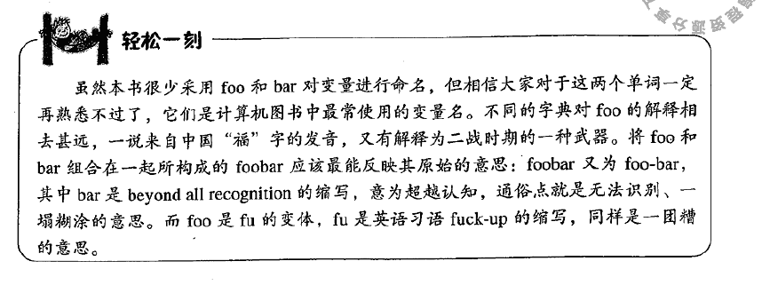

# word
[TOC]
# 一 概述
# 三 基础
## 1 一些名词
### 1.1 网络延迟(Network latency):  
在传输介质中传输所用的时间，即从报文开始进入网络到它开始离开网络之间的时间。
如何定义网络延迟程度：（网络延迟PING值越低速度越快)  
1~30ms：极快，几乎察觉不出有延迟，玩任何游戏速度都特别顺畅    
31~50ms：良好，可以正常游戏，没有明显的延迟情况  
51~100ms：普通，对抗类游戏能感觉出明显延迟，稍有停顿  
大于100ms：差，无法正常游戏，有卡顿，丢包并掉线现象  
计算方法：1秒=1000毫秒（例：30ms为0.03秒）  

### 1.2 系统服务  
与业务无关的服务，比如所进销存里，不管进还是出，都需要记录日志，记录日志就可以看做系统服务

### 1.3 编程里常见的foobar是什么

### 1.4 ANSI：美国国家标准化组织
### 1.5 各种公司的区别(有限公司、集团、股份等)（待补充）
### 1.6 金砖五国
金砖国家（BRICs）最初指中国、俄罗斯、印度、巴西、南非五个成长前景看好的新兴市场国家.
“金砖五国”（BRICS）引用了俄罗斯（Russia）、中国（China）、巴西（Brazil）、印度（India）和南非（South Africa）的英文首字母。由于该词与英语单词的砖（Brick）类似，因此被称为“金砖五国”。

### 1.7 肉身翻墙
(百度知道)指出国,在国外生活工作.

### 1.8 面条式代码（Spaghetti code）
是软件工程中反面模式的一种，是指一个源代码的控制流程复杂、混乱而难以理解，尤其是用了很多GOTO、例外、线程、或其他无组织的分支。

### 1.9 中国和大中华区
来自百度:
- 中国区，其实目前单纯指代中国中央政府管辖范围，换言之就是单纯指代中国大陆。
- 而大中华区是泛指华人占大多数的地区，这就包含大陆、香港、台湾、澳门，甚至新加坡、马来西亚等

### 1.10 全栈工程师(Full Stack  developer)
需要用到后端开发、前端开发、界面设  计、产品设计、数据库、各种移动客户端等方面的知识

### 1.11 盖面菜
在物质匮乏的年代，家中来客人时，四川人会以好菜招待他们。但是一些家庭由于条件有限，拿不出太多像样的菜来待客，主人便会把一道菜最精华的部分放在最上面，这样既显示了对客人的尊重，也遮掩了主人的尴尬。

后来，“盖面菜”延伸出指人或事物精华部分的含义。